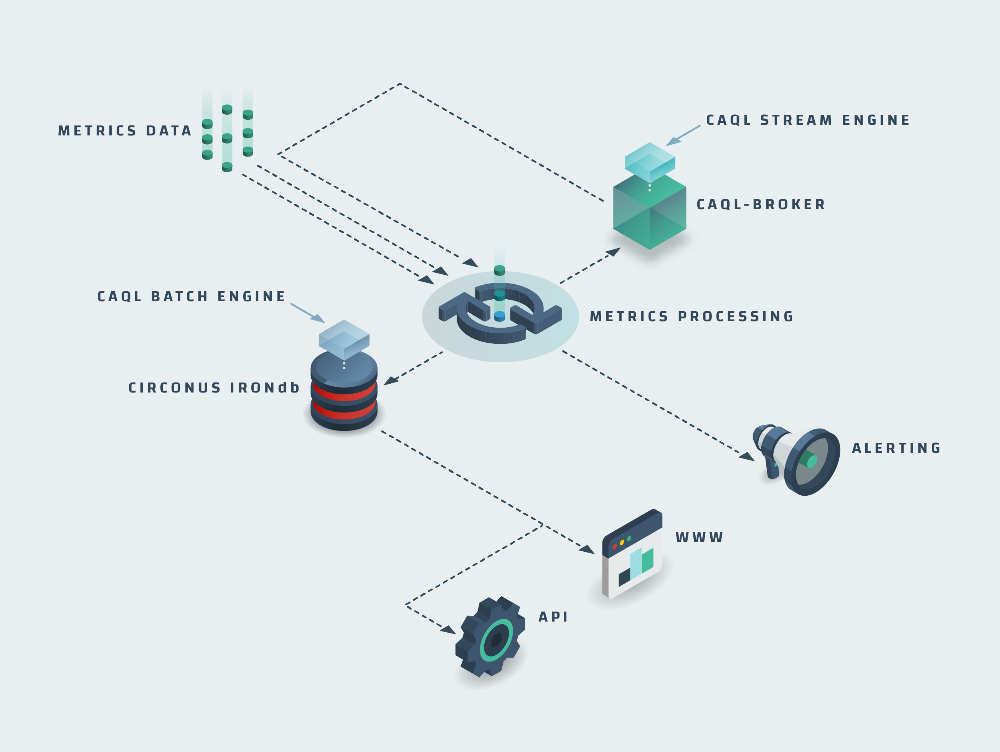

# CAQL Design and Architecture

When creating CAQL we had the following goals in mind:

- Facilitate aggregation of thousands of metrics in interactive graphs

- Allow deep, customized analysis on individual streams

- Use syntax that is intuitive for beginners, yet expressive and concise

- Drive analytics alerting rules from CAQL statements

This document describes some of the engineering decisions and technology choices we made to realize
these goals.

## Architecture Overview

Here is how CAQL fit's into the overall Circonus architecture:

There are two separate components, IRONdb and caql-broker, that are capable of executing CAQL queries.
Those components operate quite differently.

1. IRONdb / Batch mode -- supports request/reply processing on stored historical data

2. caql-broker / Stream mode -- performs on-line processing on live data streaming into the system

Batch mode is the typical execution mode supported by most query languages.

In Stream mode, standing CAQL queries are registered as CAQL checks and executed over the stream of incoming data.
CAQL checks typically stay active indefinitely.
Outputs for each registered check are produced every minute and emitted to the system as CAQL metrics.
CAQL metrics, in turn, can be used to drive threshold based alerting rules.

The advantage of this dual design is that CAQL alerting rules do not depend on regular database queries.
In other systems, analytics alerting rules are implemented by scheduling database queries to run every few seconds and checking the outputs against a threshold.
This puts a constant load on the database that can be quite significant.

In stream mode, the CAQL query keeps state in memory which is updated as new data arrives.
The state update operation is typically executed within a few micro-seconds.
Hence, by comparison, very little CPU resources are consumed.
On the flip-side, we have to allocate a certain amount of memory for a long time and keep that state consistent across crashes and updates.

## Stream-/Batch-Mode Are Almost Compatible

CAQL batch mode and CAQL stream mode strive to be compatible in the following sense:

- Create a CAQL check for a given query

- Add the same CAQL query to a graph

Both cases should result in the same data for the recent time period where the CAQL check holds data.

This ideal is not fully reached for the following two reasons:

1. Some functions don't make sense in Stream mode, e.g. `top()`, `groupby:sum()` and thus, are not supported.

2. Approximations in Batch mode. When requesting large time slices, a number of optimizations are applied that
   return approximate results which are not guaranteed to be fully compatible with Stream mode.

We have found that strictly emulating Stream mode is prohibitively slow since it requires processing data in the
granularity of the stream (1m). This is a problem when requesting large time windows, like 1 year, where ~500K values
would have to be processed per metric. To make CAQL usable on larger time slices, we have to resort to approximate
results by operating pre-aggregated data.

In cases where full compatibility is required, CAQL supports a Stream-emulation mode, that is enabled by adding the
`#serial` directive to the CAQL query. With `#serial` enabled queries will be a lot slower but fully consistent with
CAQL metrics generated in Stream mode.

## CAQL Is Written in Lua and C

The main CAQL logic is implemented in lua, with I/O related and performance critical logic implemented in C. Apart from
performance considerations, re-use of existing code, tooling and know-how within the Circonus organization were the main
factors influencing the language choice.

Like many Circonus components,
CAQL leverages [libmtev](http://circonus-labs.github.io/libmtev/) as the execution environment.
It comes with an advanced lua-runtime that supports:

- Multiple OS-threads (shared nothing)
- Multiple coroutines per thread (shared lua-state)
- Async/Await-style coroutine coordination
- HTTP(s) 1/2 request handling
- Highly flexible logging and configuration logic
- Built-in instrumentation around lua scheduling and request handling

The lua interpreter itself is [Luajit](https://luajit.org/), which brings high-performance code execution.

In IRONdb, data fetching logic is performed with asynchronous C functions that directly expose C-level arrays into lua,
by leveraging [Luajit/FFI](http://luajit.org/ext_ffi.html).
In this way, lua table allocations and manual copying of individual values is entirely avoided.

There are a number of occasions where we leverage C-level functions for manipulating data in CAQL.
This includes, the rollup logic and histogram operations (e.g. percentiles). At this point, this is mainly for consistency.
The mathematical operations are implemented in pure lua, which has proved sufficiently fast for our use-cases.

## Efficient Data Fetching In Batch Mode

In Batch mode, a CAQL query is compiled into a tree of objects called processing units.
Each processing unit requests data from it's child nodes.
The results are then merged, processed, and passed along.

The data fetching methods support a `period` parameter that enable one to control the granularity of the fetched data.
Each processing node requests data of the maximal granularity that is needed to fullfuill the request.

For data sources like `find()` or `metric()` statments, higher granularity data is read directly from pre-computed
rollups that are available in the database.

Intermediate results are stored as C-level float (or histogram) arrays for maximal memory efficiency and processing speed.
It also allows buffers allocated by the data-fetching layer to be processed in CAQL without additional copy operations.

We have found that memory efficient data structures with managed granularity are essential for interactive
manipulation of data on time spans longer than a few days.

## Batch Mode Queries Are Federated

CAQL on IRONdb uses a map-reduce style data fetching framework that allows federation of certain computations out to the cluster.
This framework is directly exposed as [/fetch](https://docs.circonus.com/irondb/api/data-retrieval#retrieving-and-transforming-data)-endpoint in IRONdb.
Prime examples include the following processing patterns:

- `find() | stats:sum()` -- select metrics based on a search query and sum the resutlts

- `find:histogram() | histogram:merge()` -- select histogram metrics and merge the results

- `find() | top(10)` -- select the top-10 metrics that match a given search query.

Each of those query patterns is suitable for query federation.
Partial results can be calculated on cluster nodes and merged on the node that initiated the request.

CAQL leverages query federation with a query optimization pass.
After the query is parsed, the AST is searched for suitable sub-trees that allow to be federated.
Those sub-trees are then replaced by an equivalent federated fetching operation.

The main advantage of this approach is the reduction in network bandwith and encoding/parsing overhead.
With this approach, we have seen query execution times dropping from minutes to under 5 seconds.

At the time of this writing, working interactively with queries aggregating ~3000 individual metric is
feasible on a 10 node IRONdb cluster.

## Query Execution in Stream Mode Is State Machine Based

In Stream mode CAQL queries are executed as state machines that are driven by incoming metric data.

Like in Batch mode, CAQL queries are compiled into a tree of processing units.
Instead of data fetching operations, processing units in stream mode use a state update operation
that fetches single values of data from all child processing units and updates internal state accordingly.
State updates are triggered in regular time intervals (1m) and generate output which is emitted as metric data.

With this design, the CPU and I/O costs for evaluating CAQL queries are minimal.
There is a modest amount of memory that needs to be allocated while each CAQL query is active.

The main difficulty with this design is maintaining the state for long time periods across faults, restarts, and updates.

## State Is Re-Created by Replaying Data

There are two strategies for restoring state that has been lost by faults, restarts or updates.

1. **State Persistence** - Write the state to a persistent medium after each update.

2. **Data Replay** - Re-apply the state updates starting from the beginning of time.

Both strategies can be mixed, so that state is persisted at only certain check-points
and data replay starts at only certain checkpoints.
In our particular situation, we have access to a persisted version of the data stored in IRONdb,
so the replay solution is a natural path forward.

When a CAQL Stream query is re-initialized, a suitable amount of data is fetched from IRONdb
and replayed to the state machine.
This will perfectly re-create the state for bounded-time queries like `window:sum(1d)` or `delay(1h)`,
and approximate the state for unbounded queries like `integrate()` or `anomaly_detection()`.

If restart time or state approximation becomes an issue in the future,
we plan to add state-persistence and check-pointing logic to CAQL.
So far this has not been necessary.

## Clustering Is Essential for Reliable Stream Processing

After a restart of the caql-broker service, it can take a couple of minutes until the state of all active CAQL checks has been restored.
During this time, no data for any CAQL metric will be emitted,
no analytics alerting rules can be triggered,
and graphs showing CAQL metrics will have gaps for these time periods.

While these minor interruptions are already highly problematic, the situation is worse if bugs surface with a version update.

In order to avoid service interruptions in situations like these, caql-broker is run in a high-availability cluster configuration.
Multiple caql-broker nodes are executing each active CAQL query.
The caql-broker node with the longest uptime, is the only node that publishes metric data into the system.
Nodes that see other active nodes with longer uptimes mute themselves and do not publish any data.
In this way, failover is completely automatic.

With clustering in place, service interruptions have become exceedingly rare.
Also we have gained a lot of headroom to inspect and debug issues that surface with version updates on a single node.
