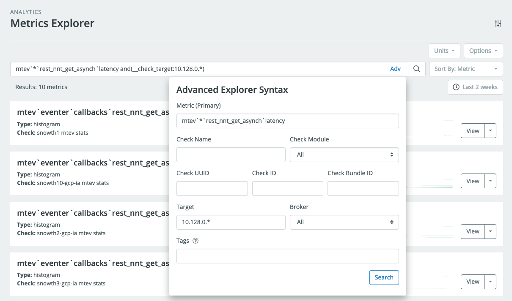
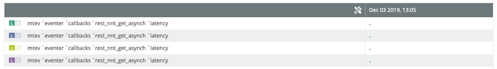
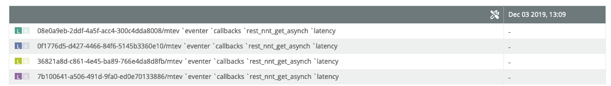
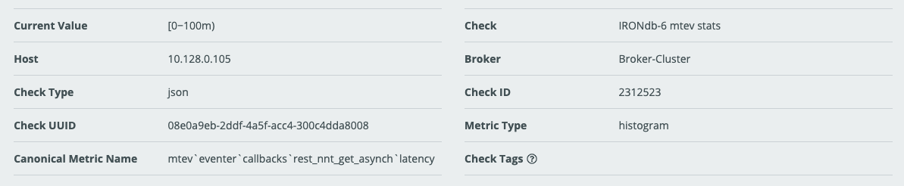
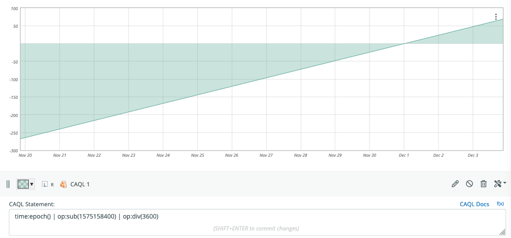
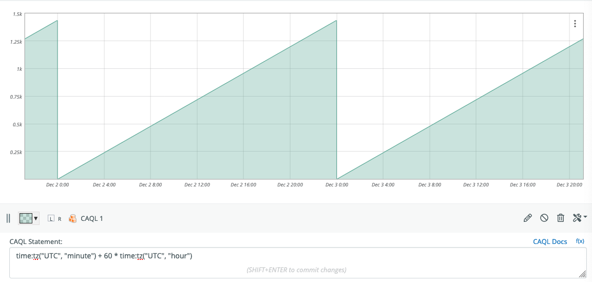

# Debugging CAQL Queries

In this note, we explain a few methods that can be helpful when debugging CAQL queries.
In the future, we aim to provide further language tooling, like auto completion,
that will help with the creation of CAQL queries.

## Ask For Help

If you get stuck, don't hesitate to reach out to us via the
[Circonus-Labs Slack](http://slack.s.circonus.com/) on the `#CAQL`-channel, or via
email at [support@circonus.com](mailto:support@circonus.com). We are typically available
during business hours in the US/East timezone.

## Take One Step At a Time

Here is a typical CAQL query that consist of multiple steps:

```caql
find("duration", "and(dc:us-east)") | stats:max() | window:max(1h)
```

The first one is typically a data fetching operation (`find`).
This is followed by an aggregation (`stats:max`)
and data transformation (`window:max`).

When such a query is not working as expected, it's best to debug the individual
steps one at a time.

Start with isolating the `find()` query, by commenting out the subsequent parts:

```caql
find("duration", "and(dc:us-east)")
// | stats:max()
// | window:max()
```

Is this returning the expected metrics?

If so, move on to the next line:

```caql
find("duration", "and(dc:us-east)")
| stats:max()
// | window:max()
```

Does this look plausible?
If not, do we need to change parameters or use a different functions?

Finally re-run the full query:

```caql
find("duration", "and(dc:us-east)")
| stats:max()
| window:max()
```

Is the behavior explainable now?

## Debugging `find()` Statements

In case a `find()` query does not return the expected results, there are a number
of things to try.

1. Go to the Metrics Explorer and repeat the query.
   Here, you have a query builder and a result list available for debugging:

   

2. Translate the Metrics Explorer Query into a CAQL find() statement.

   - Start by copy-pasting the query into the CAQL input box.
   - Enclose it in a `find("...")` statement
   - If the query uses tag search, separate the name pattern and the tag query
     into separate string literals.

   In our example the find() query looks like so:

   ```caql
   find("mtev`*`rest_nnt_get_asynch`latency", "and(__check_target:10.128.0.*)")
        +------ quoted name pattern -------+  +------ quoted tag query ------+
   ```

   In case the search query uses special characters, you might need to
   percent-encode (i.e. url-encode) the string literals.

   In case you are looking for histogram data, replace `find()` by
   `find:histogram()` function, to select histogram data.

3. Flip the graph into view mode and inspect the legend.
   The entries should contain the metric names of the matching metrics.

   

   To get more precise information about the metric matches we can use the label
   function like so:

   ```caql
   find("mtev`*`rest_nnt_get_asynch`latency", "and(__check_target:10.128.0.*)")
   | label("%tv{__check_uuid}/%cn")
   ```

   This will output the check uuid and the canonical metric name (including Stream
   Tags) in the legend:

   

4. If the data does not look like expected, check the selected data kind, e.g.
   - To convert counts into rates, you can select the "counter" data kind using `find:counter()`

## Selecting a Specific Metric

In debugging situations, it's sometimes useful to select data from a single
specific metric. CAQL provides the [`metric()`](/caql/reference/#package-metric)
functions for this purpose which follow the pattern:

```caql
metric:$kind( "$check_uuid", "$canonical_metric_name" )
```

The most reliable way to fill this template is to copy this information from the
Metrics page. Here is an example:



The displayed information includes the "Check UUID", "Canonical Metric Name", and
"Metric Type". For this metric, the CAQL statement looks like this:

```caql
metric:histogram(
    "08e0a9eb-2ddf-4a5f-acc4-300c4dda8008",
    "mtev`eventer`callbacks`rest_nnt_get_asynch`latency"
)
```

Note that we replaced `$kind` with `histogram` since the Metric Type is histogram.
If Metric Type is numeric, replace `$kind` with `average` or use the short form
`metric( "$check_uuid", "$canonical_metric_name" )`.

> **Note:** Some people have experienced problems with extra space characters
> being inserted when copying canonical metric name, from the checks page.
> Check that no extra space characters have crept in.

If the canonical metric name contains special characters like quotation marks,
it's best to percent encode (url encode) the metric name.

In our case this would look like this:

```caql
metric:histogram(
    "08e0a9eb-2ddf-4a5f-acc4-300c4dda8008",
    p"mtev%60eventer%60callbacks%60rest_nnt_get_asynch%60latency"
   // ^ percent encoded metric name
)
```

## Generating Synthetic Data

In some cases, you might have appropriate metric data in your account to test
certain CAQL functions. Here are a few ways to generate interesting data artificially.

### Generating Constant Metrics

- Number literals give rise to constant metrics:

  ```caql
  123 // constant metric with value 123
  ```

- Use the `pass()` function to create multiple output values:

  ```caql
  pass{ 1, 2, 3 }  // three metrics with values 1, 2 and 3
  ```

- Use the `histogram()` function to create constant histograms:

  ```caql
  histogram{ 1, 2, 3 } // single, constant histogram with inserted values 1,2,3
  ```

- Combine `pass()` and `histogram()` to create multiple histogram streams:

  ```caql
  pass{
    histogram{1},  // constant histogram with value 1
    histogram{2},  // constant histogram with value 2
    histogram{3}   // constant histogram with value 3
  }
  ```

### Generating Monotonic Data

If constant data is not enough, the `time:epoch()` function provides a reliable
way to generate linear monotonic data.

```caql
time:epoch() // current UNIX epoch timestamp in seconds as numeric metric
```

One drawback of this function is that the values are very large, and the slope
is fixed to +1/sec.

To adjust the absolute value, subtract a recent UNIX timestamp:

```caql
time:epoch() - 1575158400 // seconds since 2020-12-01 00:00 UTC
```

To adjust the slope divide by an appropriate value:

```caql
(time:epoch() - 1575158400) / (60 * 60) // hours since 2020-12-01 00:00 UTC
```

Here is an equivalent version, that is arguably more elegant:

```caql
time:epoch() | op:sub(1575158400) | op:div(3600)
```

Here is how that looks like:



As above, this can be used to create multiple outputs or histogram versions.

### Generating Periodic Data

The [`time:tz`](/caql/reference/#package-time) function can be used to generate
periodic data of different periods.

```caql
pass{
  time:tz("UTC", "minute") // minute within each hour as numeric metric [0 .. 59]
  time:tz("UTC", "hour"),  // hour within each UTC day as numeric metric [0 .. 23]
}
```

The following time-fields are available: `hour`, `monthday`, `month`, `weekday`,
`yearday`, `year`. Here is an example of how to combine those functions to
generate a daily periodic signal:

```caql
time:tz("UTC", "minute") + 60 * time:tz("UTC", "hour") // minute within each day
```



As above, this can be used to create multiple outputs, or histogram versions.

## Debugging CAQL Checks and CAQL Metrics

If a CAQL check is not working as intended it's generally worth copying the query
from the checks page and pasting it into a CAQL Datapoint on a graph.

If the data on the graph is not working as intended, this is usually a problem
with the query itself and the general debugging methods in this document apply.

If the data on the graph is working, but the CAQL check is not outputting any
data, then open a support ticket with us.

If the CAQL check is outputting data which is different from the data on the CAQL
data-point on the graph, try zooming-in to a time-window of a few hours.
CAQL on Graphs makes use of approximations to accelerate retrieval of data over
long time periods. Viewing the CAQL query for short time windows disables most
of these optimizations.

If the data still looks different, then open a support ticket with us.
