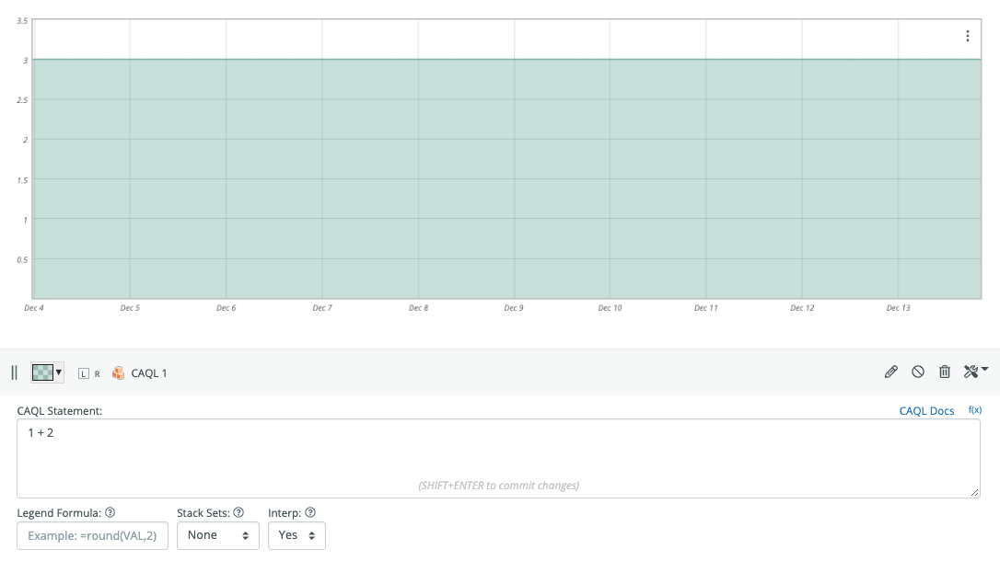
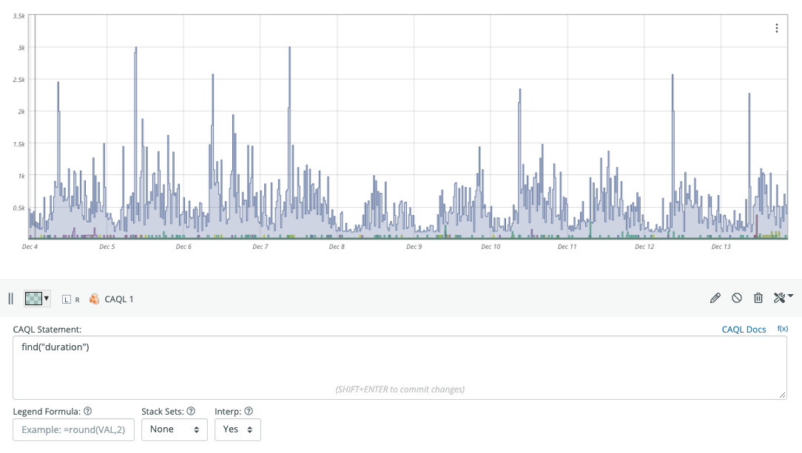
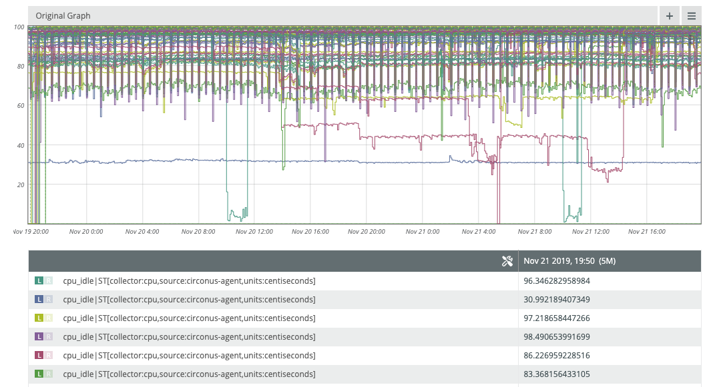
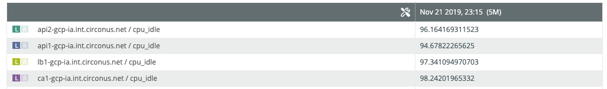
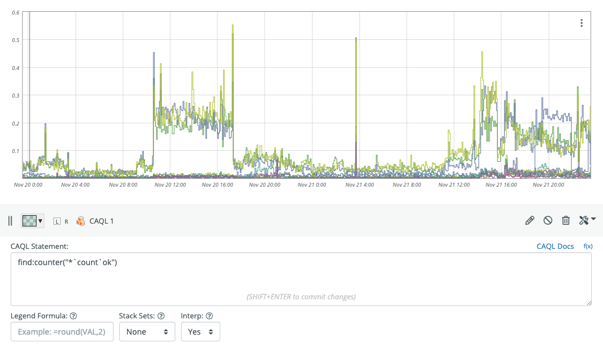
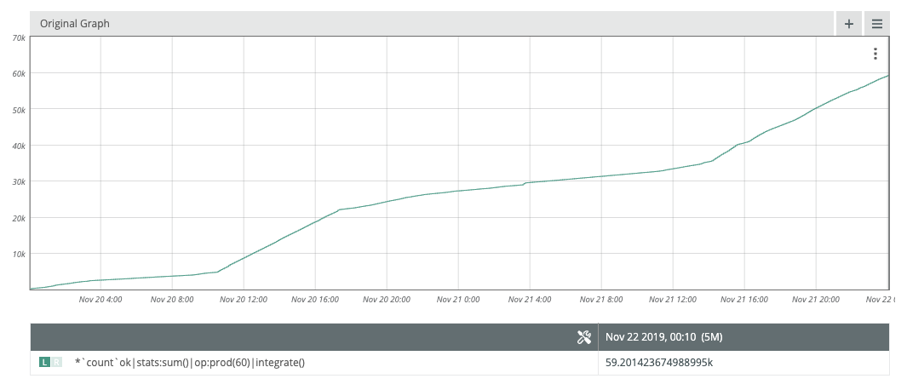
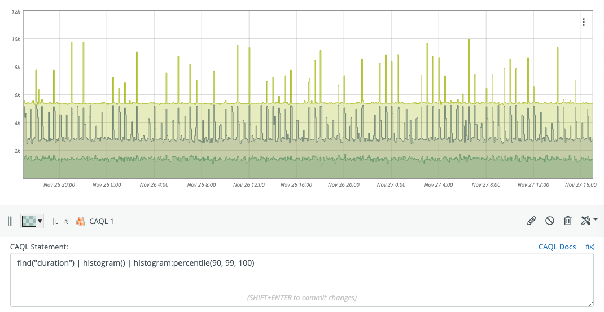
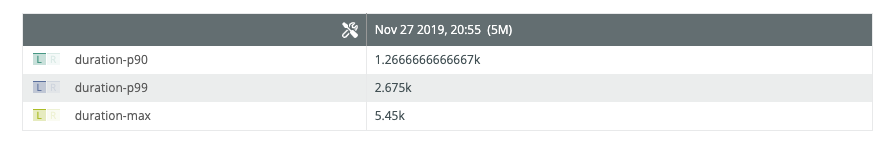
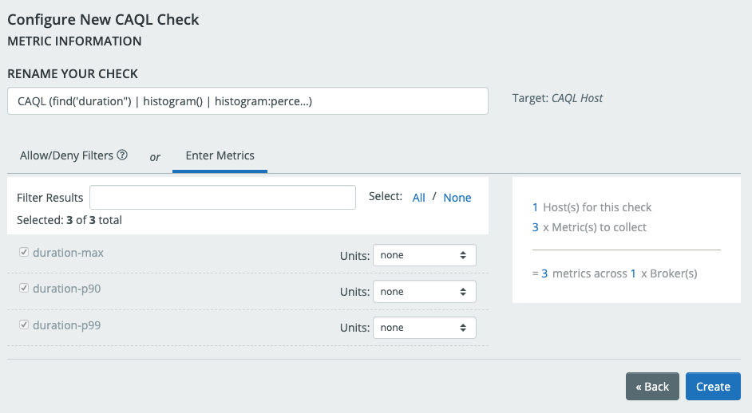
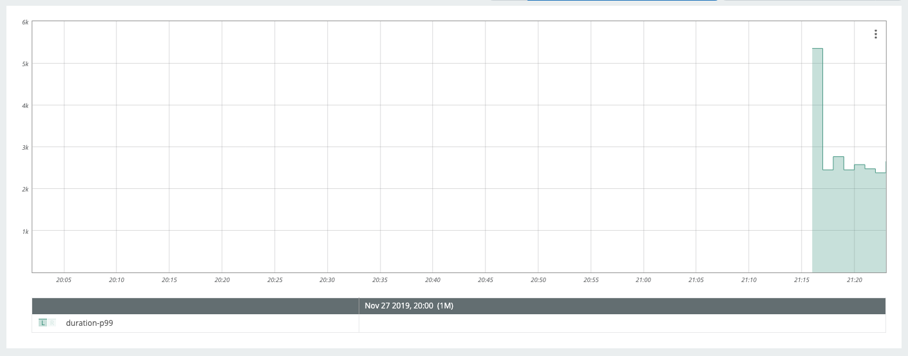

# Getting Started

Welcome to the Circonus Analytics Query Language (CAQL).
We are glad you are making an effort to learn yet another DSL for data analysis.

Learning CAQL will enable you to efficiently fetch and aggregate data across thousands of metrics.
It also allows you to compose complex data transformations to satisfy custom information needs.
CAQL can be used to visualize data on graphs, and for driving alerting rules ([see CAQL check documentation](/circonus/integrations/library/caql/)).

Here are a few examples to get a rough idea of what to expect:

**Metric Selection:**

```caql
find("requests_total", "and(service:www)") | top(5)
```

**Data Aggregation:**

```caql
find("requests_total", "and(service:www)") | stats:sum()
```

**Complex Data Transformations:**

```caql
find("queue_size", "and(service:rabbit)")
| rolling:max(1h)
| top(5)
```

By the end of this text, you should understand what those queries do and how to create queries like this yourself.

**Note:** If you run into any problems with using CAQL, please don't hesitate to reach out to us.
We are available on the [Circonus-Labs Slack](http://slack.s.circonus.com/) in the `#CAQL` channel, or via email at [support@circonus.com](mailto:support@circonus.com).

## Creating Your First CAQL Query

To create your first CAQL query, create a new graph, click on "Add Datapoint" and select "CAQL" from the pop-up menu.
Expand the legend bar to see the CAQL input field.
Type `1 + 2` into the input filed, and hit `[Shift]+[Return]` to evaluate the query.

You should see a graph like this:



Congratulations! You have just evaluated your first CAQL query.

## Selecting Metrics

Now let's try to get some metric data into CAQL.

The account we are using in this guide has some HTTP checks setup against various hosts.
We will use data from those checks here with following query:

```caql
find("duration")
```

This will select all metrics from your account that have the name "duration".
In our case, this looks like this:



The `find()` function let's you run general [searches](/circonus/search/) from within CAQL.
For example you can select metrics that start with the string "cpu" as follows:

```caql
find("cpu*")
```

If you have a large number of hosts, you will probably get back a lot of cpu metrics.
We will need a way to filter down that data to the set with the tags we are looking for.
This can be done using a [tag expression](/circonus/search/) submitted as a second parameter:

```caql
find("cpu*", "and(source:circonus-agent)")
```

This will select all metrics which have the "source" tag set to "circonus-agent".
The general find() syntax is explained in the [reference manual](/caql/reference/#package-find).

To see which metrics you selected, hit "Menu" > "View Graph".
In view mode, the graph will have a legend populated with the canonical metric names of the selected metrics:



## Changing Labels

The legend entries in the graph for CAQL outputs can be controlled with the `label()` function.
To change the legend entry of our first example to "three", you would use:

```caql
1 + 2 | label("three")
```

The label function supports formats that get interpolated based on meta-data attached to the metric inputs.
The `%n` specifier expands to the metric name.
The `%tv{...}` specifier expands to the tag value of the provided category argument.
We can use this to show the hostnames in the legend. These are available via the auto-generated `__check_target` tag.

```caql
find("cpu*", "and(source:circonus-agent)") | label("%tv{__check_target} / %n")
```

Depending on which metrics you have in your account, the legend should look something like this:



More details about the `label()` function can be found in the [reference manual](/caql/reference/#labels).

## Aggregating Data

For the next example, we are going to aggregate request rate metrics across a cluster of web nodes.
The request rate metrics in our example follow the pattern `` "<endpoint>`count`ok" ``.
Let's start by selecting some metrics:

```caql
find:counter("*`count`ok")
```

We use the "counter"-variant of find retrieve request rates, instead of total request counts.
The output looks like this:



To select only the top-5 metrics with the highest request rates, we can use

```caql
find:counter("*`count`ok") | top(5)
```

> **Tip:** While in view mode, holding down the `s` key will cause the legend to only show the entry of the
> line you are currently hovering over.

To produce the total request rate across all nodes and endpoints, we pipe the `find()` output to the `stats:sum()`
function:

```caql
find:counter("*`count`ok") | stats:sum()
```

Let's take it one step further, and calculate the total number of requests served within the selected time window.
We can use the `integrate()` function to convert rates into total counts.

```caql
find:counter("*`count`ok") | stats:sum() | op:prod(60) | integrate()
```

The `op:prod(60)` function we snuck into the last statement will convert the per-second request rates into
per-minute request rates (multiplying by 60), which `integrate()` expects as input.

Flipping this graph into view mode and hovering over the last value, we can read the total request count off the legend.



In this example, we have served 59.2K requests over the last two days.

Note how the default label displayed in the legend resembles the CAQL query used to create the output.

## Creating Checks

Once a CAQL query is defined, it is generally fine to put it directly into a graph to get evaluated on demand. Sometimes however, CAQL queries can be very expensive to generate, or there is a desire to alert on the result of a CAQL query. In these cases, a CAQL check can be created to run this query against the realtime ingestion, and expose that value as a new metric. Here are the steps to creating a CAQL check.

### Step 1: Create a New Graph and Edit the CAQL Query

Before creating a CAQL Check, it's usually a good idea to preview the CAQL statement on a graph
This way, you can preview the results and edit the query until the results match the expectations.

- Create a new Graph: Analytics > Graph > New
- Add a CAQL Datapoint
- Expand the query editor

... and start editing the query.

In our example, we will compute a few percentile values from a `find()` query.



### Step 2: Label the Output Streams

By default, CAQL metrics are named `output[$i]`, where `$i=1,2,...` is the index of the output stream.

CAQL checks use labels for the metric name outputs.
The default labels are not suitable for this since they are not guaranteed to stay consistent in the future.

Instead, we need to explicitly set a label using the `label()` function in order to change the metric name.

```caql
find("duration") | histogram()
| histogram:percentile(90, 99, 100)
| label("duration-p90", "duration-p99", "duration-max")
```

The attached labels can be inspected in view mode:



> **Note:** At the time of this writing, there is no way to attach tags to CAQL metrics.

### Step 3: Create the CAQL Check

Once we are happy with the data and labels on the graph, it's time to create the CAQL check.
To do so:

1. Copy the query from the CAQL input field on the graph

2. Visit: Integrations > Checks > CAQL > Add New

3. Select the default broker.

4. Paste the query into the input box. Click: Test

5. The next page should look similar to this:

   

   - Check that the metric names are as expected.
   - Rename the check and attach units as desired
   - Click: Create

6. You should see a Pop-up window, with a link to the Check page for the newly created CAQL Check.
   Click on the link.

In the next few minutes you should see data appearing on the metrics within the CAQL check.



You can now use the newly created CAQL metrics for graphing and alerting.

## Further Reading

A complete set of built-in CAQL functions can be found in the [CAQL Reference Manual](/caql/reference/#function-tables).
