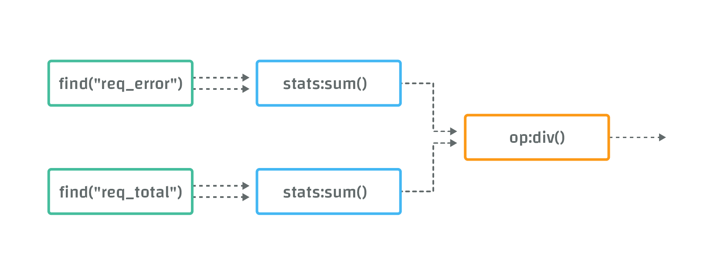
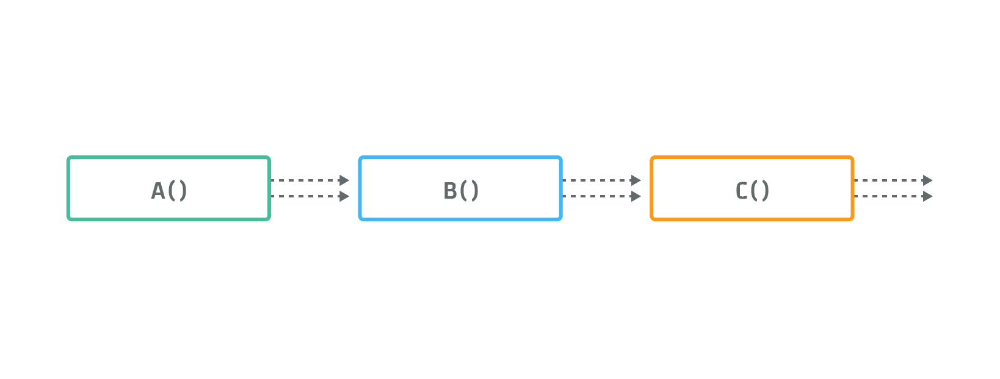
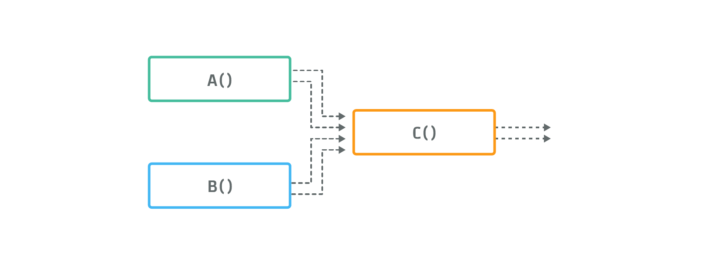

# CAQL Reference Manual

This manual contains formal descriptions of the CAQL syntax and semantics.
For a tutorial, please refer to the [CAQL Getting Started](/caql/getting-started/) page.

## CAQL Data Flow and Data Structures

CAQL is a stream processing language that allows the user to create complex transformations of metric data.

A CAQL _stream_ is time-indexed list of _values_, that can have one of the following types:

- _numeric values_, double precision floating point numbers
- _histogram values_, consisting of [histograms](/circonus/visualizations/graphs/histograms/).

Streams are _synchronous_, in the sense that for each sampling period of 1m, there is precisely one value.
If no data was collected for a given period, then a _NULL value_ representing missing data is inserted.

Streams carry meta-data, including:

- A _label_, which is used for the graph legend
- A set of _tags_, that is used by functions like [group_by](#package-group_by)

Each Circonus metric gives rise to a stream of values.
Unlike metrics, CAQL streams are not persisted and have a simplified data model.
[CAQL checks](/circonus/integrations/library/caql/) can be used to create a metric from a CAQL stream.

A CAQL statement consists of one or more functions that can be composed in different ways.
Functions can have multiple input and output streams.
The precise semantics of CAQL functions and streams are will be explained in the following paragraphs.

**Example:**

To get an idea of the syntax, consider the following CAQL statement:

```
( find("req_error") | stats:sum() ) /
( find("req_total") | stats:sum() )
```

This statement gives rise to the following data-flow graph:



In the first row, the `find("req_error")` function selects data from all metrics with name "req_error". The resulting streams are "piped" into the `stats:sum()` function, which sums data from all input streams.
Similarly, the second row computes the sum of all metrics with name "req_total".
Finally the "/" operator, represented by the function "op:div2()", divides the first sum by the second sum to get ratio of failed requests.

## Syntax

CAQL supports the following syntactical constructs:

### Function Invocations

CAQL functions take two different kinds of parameters as input:

1.  _arguments_, that specify parameters of function itself, e.g. the window size.
2.  _sources_, that specify the plumbing of input streams

The function call sytax is:

```
function <- name '(' args ',' kwargs ')'  '{' sources '}'
```

Where

- `name` is the function name, including package separator (`:`), e.g. `math:exp`.
- `args` is a comma separated list of literals.
- `kwargs` is a comma separated list of key value pairs, like `period=60s, method="sum"`, where key is a name, and value is a literal.
- `sources` is a comma separated list of CAQL expressions.

One of the blocks `(args, kwargs)` and `{ sources }` can be omitted, but not both.

**Examples:**

- `A(1)` -- Function invocation with a single argument.
- `A(1,2,3, key=4, key2="val2")` -- Function invocation with multiple arguments.
- `package:A()` -- Function invocation from a package.
- `C(){ A(), B() }` -- Function invocation with source functions.
- `C{ A(), B() }` -- Equivalent, with `()` omitted.

The semantics of the source parameters are explained in the section [input sources](#composition-with-input-sources) below.

> **Note:** Most CAQL statements occurring in practice do not use source parameters, only arguments.
> Hence a typical function call looks like `A()`.

### String Literals

String literals are delimited by a matching pair of single quotes (`'`) or double quotes (`"`).

```
'this is  a string literal!'
"this is another one."
```

Strings in CAQL hold sequences of ASCII characters.

> **Note:** Allowed characters within a (plain) string include alphanumeric characters `[A-Za-z0-9]`, as well as the special characters `[ _]`.
> If you want to represent other ASCII characters in a string, you should percent encode the string, as explained in the next section.

- [Percent Encoding](https://tools.ietf.org/html/rfc3986#section-2.1) (i.e., "url encoding") can be used to input arbitrary ASCII strings. Percent encoded string literals look like plain string literals prefixed by a "p" character.

```
p'This%20is%20a%20percent encoded string!'
```

The formal syntax of string literals reads as follows:

```
string             <- encoding_specifier? ( sq-string / dq-string )
sq-string          <- "'" chars* "'"
dq-string          <- '"' chars* '"'
encoding_specifier <- [p]
```

### Number Literals

All numbers are internally represented as double precision floating point numbers.

Number literals have the form:

```
number <- [+-]? [0-9]+ ('.' [0-9]+)?
```

Examples inclide `2` and `+0.312`.

### Duration Literals

CAQL supports a special literal type that descibes time durations.
Internally these duration literals are represented as numbers which express the duration in minutes.

> **Warning:** The numeric value of a duration literal is considered an implementation detail and might change in future releases.
> If a parameter is specified as duration, provide a duration literal rather than a raw number, e.g. use `delay(1h)` and not `delay(60)`.

Duration literals follow the syntax:

```
duration <- (number unit)+
```

Where `unit` is one of:

- `s` / `sec` / `second` / `seconds` -- second (limitations apply, see below)
- `m` / `M` / `min` / `minute` / `minutes` -- minute
- `h` / `hr` / `hour` / `hours` -- hour
- `d` / `day` / `days` -- day
- `w` / `wk` / `week` / `weeks`-- week

There is no whitespace allowed between the number and the unit.
Whitespace between duration literal elements is allowed but not required.

Valid examples include:

- `5m` -- 5 minutes,
- `1d 6h` -- one day and 6 hours.

If no time unit is specified the value will be interpreted as minutes.

> **Note:** The minimal duration supported by CAQL is 1m unless the [#min_period directive](#directives) is used.
> Smaller durations are rounded to the next lower minute, e.g., `90s` is rounded to `1m`.

### Boolean Values

There are no special boolean literals in CAQL. True is represented by `1` and false is represented by `0`.

The boolean operators `and` and `or` treat all non-zero number values as true.

### Operators

CAQL supports the following operators, ordered in descending precedence:

| Operator | Type        | Definition                                                                            |
| -------- | ----------- | ------------------------------------------------------------------------------------- | --------------------------------------------------- |
| `        | `           | associative                                                                           | Pipe operator. Linear comosition of CAQL functions. |
| `not`    | unary       | Logical `not`. Returns 1 if the operand is 0 or false.                                |
| `or`     | associative | Logical `or`. Returns 1 if at least one operand is 1, else 0.                         |
| `and`    | associative | Logical `and`. Returns 1 if both operands are 1, else 0.                              |
| `==`     | binary      | Numerical comparison. Returns 1 if both operands are equal as floating point numbers. |
| `>=`     | binary      | Numerical greater than or equals.                                                     |
| `<=`     | binary      | Numerical less than or equals.                                                        |
| `>`      | binary      | Numerical greater than                                                                |
| `<`      | binary      | Numerical less than                                                                   |
| `+`      | associative | Infix operator for addition                                                           |
| `-`      | associative | Infix operator for subtraction                                                        |
| `%`      | associative | Infix operator for modulo                                                             |
| `*`      | associative | Infix operator for multiplication                                                     |
| `/`      | associative | Infix operator for division                                                           |
| `^`      | associative | Infix operator for exponentiation                                                     |
| `!`      | unary       | Like `not` but with high precedence.                                                  |

Binary operators require precisely two arguments, e.g. `A <= B`, whereas associative operators can be used in chains, e.g. `A * B * C`.

Parenthesis can be used to override the natural order of operations.
For example, `A+B/10` is equivalent to `A+(B/10)`.
To achieve a right to left precedence in this example, one would use `(A+B)/10`.

Each operator has a corresponding function in the [`op` package](#package-op).

### The Pipe Operator

The pipe operator composes CAQL functions in linear order. The syntax is inspired from the UNIX shell.
The CAQL statement

```
A() | B() | C()
```

gives rise to a data-flow graph, where all outputs of function `A`, are used as input for function `B`,
and all outputs of function `B`, are used as inputs of function `C`:



More general composition patterns can be realized using source arguments, as explained in the next section.

### Composition with Input Sources

To build up more complicated structures, you can define multiple sources within a CAQL function.
The input sources of a CAQL function `A` are defined with curly brackets, like so: `A(){ ... }`.
The CAQL statement

```
C(){ A(), B() }
```

gives rise to a data-flow graph, where the input of function `C()` is a flat, concatenated list consisting of
all outputs of function A() and then those of function B(), as illustrated in the following figure:



> **Note:** The pipe operator, can always be replaced by first-source insertion.
> The statement, `A | X(){B,C,...}` is equivalent to `X(){A,B,C,...}`.

## Constants

CAQL defines the following constants, which can be used as function arguments (`op:sum(VIEW_PERIOD)`) and sources
(`op:sum{A, B, VIEW_PERIOD}`)

- `VIEW_RANGE` - The duration of the currently active view range of a graph, e.g. if you are looking at two weeks of data, `VIEW_RANGE` will have a numeric value equal to the `2w` duration literal.
  When used in CAQL checks, the value will be equal to `1m`.
- `VIEW_PERIOD` - The "period duration" of the current active view of a graph.
  This is the minimal duration that is visually represented in a graph.
  E.g. if you are looking at one year of data, `VIEW_PERIOD` will be equal to `12h`.
  When used in CAQL checks, the value will be equal to `1m`.

## Directives

CAQL directives allow the user to change the behavior of the CAQL processor.
Directives have to be placed on separate lines at the very beginning of the CAQL query.
The following directives are supported:

- `#preview` - Activates "preview mode".
  In preview mode, the CAQL processor applies additional short-cuts that speed up processing for long range queries but sactifice accuracy of the result.
  Results are still guaranteed to be accurate on view ranges smaller than one day where `VIEW_PERIOD` equals `1m` or lower.
  This directive applies to graphs only.

- `#serial` - Activates "serial" processing.
  When this directive is set, the CAQL processor emulates CAQL checks and processes data serially, one sample at a time.
  No optimizations or approximations are applied.
  Only functions that are supported for serial processing in CAQL checks are allowed.
  This directive applies to graphs only.

- `#min_period` - Define minimum periods to be considered by CAQL for the processing. Especially important when doing large look-back functions (such as the last 30 days) so that CAQL will not use smaller rollups if used in smaller period context. e.g. `#min_period=3600 find("thing") | rolling:percentile(30d,95)` - By setting the min_window to 1hr, CAQL knows it can use the largest appropriate rollup data for faster performance despite the local time context being requested. This directive can also be used to allow CAQL to use smaller than normally allowable periods as well. For example `#min_period=10` to support cases where data is collected at higher frequency than is typical.

- `#lang` - Informs the query engine to auto-convert a different language into CAQL for execution. At this time, the only supported option is [`#lang="promql"`](/promql-conversion).

## Function Tables

The following sections give a full list of all available functions in CAQL. All functions are specified with their full
signature. Optional arguments are enclosed in `[]`. Keyword arguments (e.g. `model = 'linear'`) are always optional,
and their default value is listed in the signature.

### Global Functions

This package contains all globally accessible functions.

- **`anomaly_detection([sensitivity], [model="constant"], [model_period="1440M"], [prefill_period="auto"])`** - Detects anomalies in each input stream with the specified sensitivity. This method operates on 5m rollups.

* `sensitivity` - (optional, default:`50`) Valid range: 0 .. 100
* `model = "constant"` - underlying time-series model. Valid values: constant/trending/periodic/periodic daily/periodic weekly
* `model_period = 1440M` - If model=periodic, set the period interval, as duration literal (e.g. 1d)
* `prefill_period = "auto"` - Duration literal or the string "auto". The amount of training data to take into consideration before detecting anomalies.

- **`coalesce()`** - Coalesces the input streams into a single output stream using the first non-NULL value from the input streams.

- **`count()`** - Counts the number of streams with non-missing values in the window. It is recommended users utilize the `/find/tags` IRONdb endpoint using the `count_only=1` option to get counts of this type instead, which will utilize activity windows, rather than pulling all of the data from disk.

- **`counter()`** - Differentiate an assumed monotonically increasing metric to a per second rate.

- **`delay(t1, t2, ...)`** - Delays the stream by the specified time-duration.

  - `t1, t2, ...` - times to delay stream

- **`derivative()`** - Differentiate a metric to a per second rate.

- **`diff()`** - Returns the difference of each consecutive numeric value within a stream. This results in the derivative with respect to time over the input streams.

- **`if()`** - The `if` operator takes three source parameters: `if{cond-stream, then-stream, else-stream}`
  For each point in time, if the value of `cond-stream` is truthy (nonzero), then return a value from the `then-stream`; else return a value from the `else-stream`.
  This operator only supports numeric inputs.

- **`is_missing()`** - Returns a value of 1 if the current value is missing or 0 if it is not missing on each input
  stream.

- **`metriccluster(id)`** (_Deprecated_. Use find() instead.) - Add metrics in a metric cluster.

  - `id` - id of metric cluster as integer.

- **`normalize([scale=1], [default=0.5])`** - Normalize the values over the requested time period using a linear mapping from their minimum and maximum to values between 0 and `scale`. Missing values should be treated as `default`.

- **`pass()`** - Identity transformation. Does not perform any processing.

- **`randomwalk([max], [min], [change], [seed=-1])`** - Returns a random walk of numbers.

  - `max` - (optional, default:`100`) upper bound for walk
  - `min` - (optional, default:`0`) lower bound for walk
  - `change` - (optional, default:`0`) max absolute change per step (default 1/20th max-min)
  - `seed = -1` - random seed (default random)

- **`wait(t)`** _(Experimental)_ - Returns 1 if the value has been 1 for a given time duration. Can be used to test alerting rules that specify a 'wait' duration.
  - `t` - time to wait.

#### top-k and bottom-k

- **`top(k, [method="mean"])`** - Returns top-k streams over the current VIEW_RANGE.
  Not supported in #serial mode / CAQL checks.

  - `k` - The number of streams to return
  - `method = "mean"` - The way how streams are compared to each other. Valid values: 'max', 'mean', 'min'

- **`bottom(k, [method="mean"])`** - Returns bottom-k streams over the current VIEW_RANGE.
  Not supported in #serial mode / CAQL checks.
  - `k` - The number of streams to return
  - `method = "mean"` - The way how streams are compared to each other. Valid values: 'max', 'mean', 'min'

**Examples:**

- Show the 10 web nodes with the highest CPU utilization:

  ```
  find("cpu_util", "and(service:web)") | top(10)
  ```

- Show the 10 accounts with the highest request counts:

  ```
  find("request_count") | top(10)
  ```

- Show the 5 accounts with lowest request rates.

  ```
  find:counter('request_total') | bottom(5, method="min")
  ```

  > This is assuming we have per-account request_count metrics available.

#### Labels

All output streams of CAQL statements carry a label.
Labels will be shown in graph legends and can be used to name metrics in caql-checks.
By default, CAQL tries to attach sensible labels that convey information about the computation leading to the particular output.
You can manually control the label by using the `label()` function.

- **`label(format[, format2, format3, ...])`** - Labels output streams according to the provided format strings.
  Labels are applied to the input streams in the given order.
  Any remaining input streams, past the number of available labels, will be formatted using the last label.
  In particular, if only a single format argument is provided, it is applied to all streams.
  - `format` - Format string. The syntax is explained in the next section.
- **`label:name(format[, format2, format3, ...])`** - Changes the canonical name (`%cn`, and thus `%n`) of the underlying metric stream.

**Format Syntax:**

Format strings are interpolated similarly to printf().
Supported parameters are:

- `%d` - stream number
- `%n` - metric name without tags, e.g. `duration`
- `%cn` - canonical metric name (with tags), e.g. `duration|ST[dc:us/east]`
- `%t{$tagcat}` - tagcat:tagvalue, e.g. `%t{dc}` -> `dc:us/east`
- `%tv{$tagcat}` - tagvalue, e.g. `%tv{dc}` -> `us/east`

* Variants:
  - With `$tagcat` = `*`, this function will return output for all tags that do not lead with `__` (double underscore).
  - `%t-`, `%tv-` will act like `%t`, `%tv`, but only return output for fields that have vary among all output streams. e.g. `label('%t-{*}')`
    This will suppress tags that are the same for all return streams so that tag differences clearly stand-out the to the viewer.

**Examples:**

- Relabel a single metric:

  ```
  metric(<uuid>,<name>) | label("Some static name")
  ```

- Annotate histogram percentiles:

  ```
  histogram:percentile(50,95,99) | label("Median", "95th Percentile", "99th Percentile")
  ```

- Enumerate output streams:

  ```
  find("...") | label("This is output stream %d")
  ```

- Label with name and comma separated list of tags in brackets:

  ```
  find("...") | label("%n [%t{*}]")
  ```

- Label with name and all tags that vary among the search results:

  ```
  find("...") | label("%n %t-{*}")
  ```

### Package `find`

The `find` package contains the main functions to retrieve data.
It enables searching for metrics based on metric names and tags.
The full search query syntax is documented in the section [Metric Search](/circonus/search/).

The main function in this package is:

- **`find(name_pattern, [tag_query], [limit=1000], [start_time_override=?], [start_time_offset=?])`** - Searches for metrics matching the provided search queries.
  - `name_pattern` - Searches for metrics whose name matches the provided pattern.
  - `tag_query` - (optional) Provides an additional search query expression that has to be matched.
  - `start_time_override` - (optional) Provides a method to override the fetch start time for the metric data, by using this option with a timestamp in seconds from UNIX epoch. This option can be useful to allow metric data to be compared or processed in time or to a baseline.
  - `start_time_offset` - (optional) Provides a method to specify a duration offset (e.g. 1w) that will be subtracted from the fetch start time. A positive duration will move the start time backwards in time, and a negative duration will move it forward in time. This option can be useful to allow metric data to be compared or processed in time or to offseted times (such as comparing current data with that of last week).
  - `limit = 1000` - Maximal number of search results to return. The maximal allowable limit setting is 3000.

> **Note**: The numer of search results returned by `find()` is limited by default to 1000 results.
> If that limit is reached, a warning message will be shown on graphs.
> You can increase the limit to 3000 by providing a limit parameter.
> Please contact support if you need to process more search results at a time.

> **Note**:
> The name of a metric can be referred to inside of a tag search query as `__name` tag.
> This is useful for excluding a sub-pattern of the name that might normally be matched.

**Examples:**

- Search for metrics whose name is "foo":

  ```
  find("foo")
  ```

- Globing: Search for metrics whose name starts with "foo":

  ```
  find("foo*")
  ```

- Search for metrics whose name matches a regular expression:

  ```
  find("/^foo/")
  ```

- Search for metrics that match a complex boolean tag search expressions:

  ```
  find("foo","and(tag:value,or(thing:that,not(i:want)))")
  ```

This package contains the following functions which allow `find()` to select different [DataTypes](/circonus/data-model/#data-types), like "counters" or "histograms":

- **`find(name_pattern, [tag_query])`** - This is an alias for find:average().
- **`find:count(name_pattern, [tag_query])`** - Returns data kind "count" for the matching metrics.
- **`find:average(name_pattern, [tag_query])`** - Returns data kind "average" for the matching metrics.
- **`find:stddev(name_pattern, [tag_query])`** - Returns data kind "stddev" for the matching metrics.
- **`find:counter(name_pattern, [tag_query])`** - Returns data kind "counter" for the matching metrics.
- **`find:counter_stddev(name_pattern, [tag_query])`** - Returns data kind "counter_stddev" for the matching metrics.
- **`find:sum(name_pattern, [tag_query])`** - Returns approximate sum of all samples in a given period.
- **`find:derivative(name_pattern, [tag_query])`** - Returns data kind "derivative" for the matching metrics.
- **`find:derivative_stddev(name_pattern, [tag_query])`** - Returns data kind "derivative_stddev" for the matching
  metrics.
- **`find:histogram(name_pattern, [tag_query])`** - Returns matching metrics of type histogram.

All of the above `find` functions also support a single-argument version that consists only of a tag-query. e.g. `find:average('and(__name:foo,bar:baz)')`

### Package `metric`

The metric package allows for the retrieval of data from a specific metric identified by uuid and canonical metric name.

> **Note:** Generally `find()` is the preferred way to get data into CAQL.
> Use this function only if you want to bypass metric search, e.g., for debugging purposes.

The main function in this package is:

- **`metric(check_uuid, metric_name)`** - This is an alias for `metric:average()`.
  - `check_uuid` - The uuid of the check the metric belongs to, e.g. `AC853FCC-5C29-4F9E-867C-69BC699C5DBF`
  - `metric_name` - The canonical metric name, including tag information, e.g. `"duration|ST[service:www]"`

The following variants are supported and enable selection of different [DataTypes](/circonus/data-model/#data-types) for the given metric:

- **`metric:count(check_uuid, metric_name)`** - Returns data kind count for the specified metric, i.e., the number of samples recorded within
  the rollup period.
- **`metric:average(check_uuid, metric_name)`** - Returns data kind average.
- **`metric:stddev(check_uuid, metric_name)`** Returns data kind stddev.
- **`metric:counter(check_uuid, metric_name)`** - Returns data kind counter.
- **`metric:counter_stddev(check_uuid, metric_name)`** - Returns data kind counter_stddev.
- **`metric:derivative(check_uuid, metric_name)`** - Returns data kind derivative.
- **`metric:derivative_stddev(check_uuid, metric_name)`** - Returns data kind derivative_stddev.
- **`metric:histogram(check_uuid, metric_name)`** - Returns histogram data.

> **Note:** A histogram metric will return NULL values for the numeric types: average, stddev, counter, counter_stddev, deriative, derivative_stddev.
> A numeric metric will return NULL values for the histogram types: histogram

### Package `vector`

The `vector` package provides a path for label-based vectorization of multiple streams to enable pairs operations upon them. An example of this would be calculating a set of ratios where one needs to divide a set of successes by a set of totals. In such a division operation, it is important that the numerator and divisor are "paired" correctly representing the same thing.

- **`vector(format,sloppy=0,meta=1)`** - An alias for `vector:pack(...)`
- **`vector:pack(format,sloppy=0,meta=1)`** - Returns a vector containing the set of input streams by applying the [label format](#labels) `format` to each to determine the index of the stream within the vector.
- **`vector:unpack()`** - Returns the set of individual streams within a vector.
- **`vector:drop(index1, index2, ...)`** - drop indexed streams from a vector.
  - `index1, index2, ...` - the names of the indices to drop

1. By default, `vector:pack` will have a run-time error if multiple streams map to the same key so help users identify query errors. This can be allowed by setting `sloppy=1`.
1. By default, `vector:pack` will pass input stream metadata through the analytics pipeline for use later. This can be disabled by setting `meta=0`.

Most operations within the system accept vector input and produce vector output. For example, `op:div` which will divide one input stream by another, can be used to divide one input vector from another. The divisions in this scenario are done for each pair of matching indices.

**Examples:**

- Determine the error rate across a set of web servers (by their `host` tag):

  ```
  op:div{find:counter("errors") | vector("%tv{host}"),
         find:counter("requests") | vector("%tv{host}")}
    | vector:unpack()
    | label("errors on %tv{host}")
  ```

### Package `stats`

The `stats` package contains functions that aggregate data from multiple input streams.

Missing data is ignored by all functions unless otherwise stated.

**Examples:**

- Find all `count` metrics with tags `service:www` and `code:200` and aggregate them by summing each time-slice:

  ```
  find("count", "and(service:www,code:200)") | stats:sum()
  ```

- Get the maximal CPU utilization across all `www` servers:

  ```
  find("cpu_util", "and(service:www,code:200)") | stats:max()
  ```

- Cap a metric at value 100. This is done by calculating the minimum of the metric value and 100 at each time-slice:

  ```
  metric($uuid, $name) | stats:min(100)
  ```

Most functions in this package take an optional numeric argument `x`.
If present, this value will be included in the calculation.

The package contains the following functions:

- **`stats:sum( [x] )`** - Returns the sum of all input streams. Missing values are treated as 0.
- **`stats:sub( [x] )`** - Returns the value of the first stream minus the sum of all remaining streams. Missing values are treated as 0.
- **`stats:mean()`** - Return the mean of all input values.
- **`stats:max( [x] )`** - Returns the maximum of all input values.
- **`stats:min( [x] )`** - Returns the minimum of all input values.
- **`stats:prod( [x] )`** - Returns the product of all input streams. Missing values are treated as 1.
- **`stats:div( [x] )`** - Returns the quotient of the first stream divided by the product of all remaining streams. Missing values are treated as 1.
- **`stats:percentile(p1, p2, ...)`** - Calculates an approximation of the given percentile across all.
- **`stats:ratio([partition_fmt=nil],[partition=nil],[of=1])`** - Takes in multiple streams and computes their relative ratios partitioned by either partition_fmt or partition (tag value).
- **`stats:clamp(min, max)`** - Clamp input values to a specified minimum and/or maximum.
  - `min` - minimum to clamp values to
  - `max` - maximum to clamp values to
- **`stats:stddev()`** - Return the standard deviation of all input values.
- **`stats:var()`** - Return the sample variance of all input values.
- **`stats:popvar()`** - Return the population variance of all input values.
- **`stats:alwaysone()`** - Returns 1 for all values.
- **`stats:count()`** - Returns the count of all values.
- **`stats:trim(n)`** (_Experimental_) - Discard samples at high and low end.
  - `n` - number of samples to discard.
- **`stats:select(n)`** (_Experimental_) - Select a specific input stream.
  - `n` - index of stream to select

### Package `window`

The `window` package provides functions that allow you to aggregate data over time windows.

**Examples:**

- Count users over days in US/Pacific timezone:

  ```
  find("users") | window:sum(1d, offset="US/Pacific")
  ```

- Determine maximal request duration over the last 24 hours, advanced every hour:

  ```
  find("duration") | window:max(1d, skip=1h)
  ```

- Calculate aggregated percentiles over 1h windows using histogram metrics:

  ```
  find:histogram(...) | window:merge(1h) | histogram:percentile(99)
  ```

Each function in the window package, supports the following parameters:

- `window_duration` - Duration of the time window.
- `skip = window_duration` - Duration after which to advance windows. Default is `window_duration`.
- `offset = 0` - Align windows with given offset to UTC time. Either a duration literal (e.g. '2h') or a timezone string (e.g. 'US/Eastern').
  All timezone strings in the IANA tz-database are supported.
  A list can be found on [Wikipedia](https://en.wikipedia.org/wiki/List_of_tz_database_time_zones).
- `align = "start"` - Emit data at the start or end of the window.
  In serial mode, align is always set to "end".
- `period = VIEW_PERIOD` - Period on which to base computation. Default is `VIEW_PERIOD`.

Aggregations are applied to all input streams independently.

> **Note:** By default, `window:*` functions will operate on pre-aggregated data returned by the upstream CAQL
> functions, e.g., when viewing the CAQL statement `find(...) | window:max(1h)` over 1 week on a graph, it will return a
> maximum computed over `VIEW_PERIOD=10m` averages. If you want to compute aggregates over 1m data, you have to specify
> `period=1m` as a parameter.

> **Note:** The behavior of `window:*` in caql-broker / `#serial`-mode differs slightly from that in graphs. In serial mode, at time `t`,
> CAQL > only has data that arrived before `t` at its disposal. Hence, it can't compute the aggregates over a time window before that
> window has completed. For this reason serial mode always uses the `align="end"` setting. When used in graphs, CAQL defaults to showing
> aggregates aligned with the start of the window.

This package contains the following functions:

- **`window:sum(window_duration, ...)`** - The sum of all values in the specified time window.
- **`window:count(window_duration, ...)`** - The number of non-missing values over the specified time window.
- **`window:mean(window_duration, ...)`** - The arithmetic mean of the values over the specified time window.
- **`window:stddev(window_duration, ...)`** - The (uncorrected) standard deviation of the values over the specified
  time window.
- **`window:popvar(window_duration, ...)`** - The population variance of the values over the specified time window.
- **`window:delta(window_duration, ...)`** - The delta of first to last value over the specified time window.
- **`window:changes(window_duration, ...)`** - The number of changes to the value over the specified time window.
- **`window:absent(window_duration, ...)`** - The absence of values over the specified time window.
- **`window:resets(window_duration, ...)`** - The number of detected counter resets over the specified time window.
- **`window:increase(window_duration, ...)`** - The increase of first to last counter value over the specified time window, taking resets into account.
- **`window:last(window_duration, ...)`** - The most recent value of the specified time window.
- **`window:present(window_duration, ...)`** - The presence of values over the specified time window.
- **`window:max(window_duration, ...)`** - The maximum of the values over the specified time window.
- **`window:min(window_duration, ...)`** - The minimum of the values over the specified time window.
- **`window:first(window_duration, ...)`** - Repeats the first datapoint in a window.
- **`window:percentile(window_duration, percentile, ...)`** - Calculates a percentile of values over the specified
  time window.
  - `percentile` - The percentile to calculate. Valid range: 0 .. 100.
- **`window:inverse_percentile(window_duration, threshold, ...)`** - Calculates the inverse percentile over the
  specified time window.
  - `threshold` - Threshold for values (exclusive). Percentage of values below the threshold is calculated.
- **`window:histogram(window_duration, ...)`** - Returns a histogram of all the values contained in the specified time
  window.
- **`window:merge(window_duration, ...)`** - Merges all histogram values contained in the specified time window.

### Package `rolling`

The rolling package includes functions that operate on rolling time windows which are advanced every minute.

**Examples:**

- Count users over the last rolling hour:

  ```
  find("users") | rolling:sum(1h)
  ```

- Maximal request duration over the last rolling 24 hours:

  ```
  find("duration") | rolling:max(1d)
  ```

These provided functions are identical to those in the `window` package,
but have the `skip` parameter set to `1m` by default.  
See the [window section](#package-window) for a full list of supported parameters.

This package contains the following functions:

- **`rolling:sum(window_duration, ...)`** - The sum of all values in the specified time window.
- **`rolling:count(window_duration, ...)`** - The number of non-missing values over the specified time window.
- **`rolling:mean(window_duration, ...)`** - The arithmetic mean of the values over the specified time window.
- **`rolling:stddev(window_duration, ...)`** - The (uncorrected) standard deviation of the values over the specified time window.
- **`rolling:popvar(window_duration, ...)`** - The population variance of the values over the specified time window.
- **`rolling:delta(window_duration, ...)`** - The delta of first to last value over the specified time window.
- **`rolling:changes(window_duration, ...)`** - The number of changes to the value over the specified time window.
- **`rolling:absent(window_duration, ...)`** - The absence of values over the specified time window.
- **`rolling:resets(window_duration, ...)`** - The number of detected counter resets over the specified time window.
- **`rolling:increase(window_duration, ...)`** - The increase of first to last counter value over the specified time window, taking resets into account.
- **`rolling:last(window_duration, ...)`** - The most recent value of the specified time window.
- **`rolling:present(window_duration, ...)`** - The presence of values over the specified time window.
- **`rolling:max(window_duration, ...)`** - The maximum of the values over the specified time window.
- **`rolling:min(window_duration, ...)`** - The minimum of the values over the specified time window.
- **`rolling:first(window_duration, ...)`** - Repeats the first datapoint in a window
- **`rolling:percentile(window_duration, percentile, ...)`** - Calculates a percentile of values over the specified time window
  - `percentile` - the percentile to calculate. Valid range: 0 .. 100.
- **`rolling:inverse_percentile(window_duration, threshold, ...)`** - Calculates the inverse percentile over the specified time window.
  - `threshold` - threshold for values (exclusive). Percentage of values below the threshold is calculated.
- **`rolling:histogram(window_duration, ...)`** - Returns a histogram of all the values contained in the specified time window.
- **`rolling:merge(window_duration, ...)`** - Merges all histogram values contained in the specified time window.

### Package `aggregate`

The aggregate package allows for fine-grained control over the data aggregation in graphing applications.

> **Context:** When viewing graphs over large time windows (>1day), the presented data will always be aggregated. This is
> for the simple reason that there are not enough pixels on the screen to show values for 10K values recorded over
> a week. By default, CAQL will return an approximation of the mean value for data within the aggregation window.
> This behaviour can be altered with the `aggregate` package.

By default, functions in this package will request 1m data and aggregate data to the requested period (`VIEW_PERIOD`) of
the graph. The period of the requested parameter can be changed with the `period` parameter.
All functions in this package take `period` as the first argument (optional).

**Examples:**

- Aggregate search results with max instead of taking the mean:

  ```
  find(...) | aggregate:max()
  ```

- Return search results, with a minimum granularity of 1h:

  ```
  find(...) | aggregate:mean(1h)
  ```

> **Warning:** Using `aggregate:*()` functions can increase the latency of the query substantially.

This package includes the following functions:

- **`aggregate:count([period=1m])`** - The number of non-missing values over the aggregation window.
- **`aggregate:histogram([period=1m])`** - Returns a histogram of all the values contained in the specified time window.
- **`aggregate:max([period=1m])`** - The maximum of the values in the aggregation window.
- **`aggregate:mean([period=1m])`** - The arithmetic mean of the values in the aggregation window.
- **`aggregate:min([period=1m])`** - The minimum of the values over the specified time window.
- **`aggregate:sum([period=1m])`** - The sum of the values in the aggregation window.

### Package `op`

This package contains function-versions of CAQL operators. The operator naming is inspired by the Unix `test(1)` command.
Operators in this package expect two input streams to be passed as source parameters.
Optionally, the second input stream can be replaced by a constant that is passed as a function argument (e.g. `op:leq(5)` will return 1 whenever the input stream is less than 5).
See the `each` package, for versions of these operations that apply to multiple streams.

All operators will return NULL if one of the input streams is NULL.
Use the `stats:*` functions if you want to ignore missing data.

Most of the functions, take an optional argument `x` that , if present, will replace the second input stream.

**Examples:**

- Determine if queue size is greater than 50:

  ```
  metric("$uuid", "queue_length") | op:gt(50)
  ```

The following functions are supported:

#### Arithmetic Operators

- **`op:neg()`** - Operator `-`. Unary negation. Returns current value times -1.
- **`op:sum( [x] )`** - Operator `+`. Returns sum of all input streams.
- **`op:sub( [x] )`** - Operator `-`. Returns the value of the first input stream minus the sum of all remaining streams.
- **`op:mod( [x] )`** - Operator `%`. Returns the value of the integer remainder of the first stream divided by the second stream.
- **`op:prod( [x] )`** - Operator `*`. Returns the product of all input streams.
- **`op:div( [x] )`** - Returns the quotient of the first input stream divided by the product of all remaining streams (e.g a/b/c/d/e).
- **`op:div2( [x] )`** - Operator `/`. Returns the quotient of the first input stream divided by the second. Returns a runtime error if exactly 2 streams are not provided. `find()` calls can return 0 or more streams, so often the pattern of `find() | stats:sum()` is used to aggregate streams and/or guarantee a datastream if no metrics match the find.
- **`op:exp( [x] )`** - Operator `^`. Returns stream one raised the power of stream two.

#### Comparison Operators

- **`op:eq( [x] )`** - Operator `==`. Test if input stream one is equal to input stream two.
- **`op:geq( [x] )`** - Operator `>=`. Test if input stream one is greater than or equal to input stream two.
- **`op:gt( [x] )`** - Operator `>`. Test if input stream one is less than or equal to input stream two.
- **`op:leq( [x] )`** - Operator `<=`. Test if input stream one is less than or equal to input stream two.
- **`op:lt( [x] )`** - Operator `<`. Test if input stream one is less than or equal to input stream two.

See `each` package, for versions supporting multiple streams.

#### Boolean Operators

- **`op:or()`** - Operator `or`. Returns 1 if one input stream is a non-zero number, else 0.
- **`op:and()`** - Operator `and`. Returns 0 if one input stream is 0; else 1.
- **`op:not()`** - Operator `!` and `not`. Returns the boolean negation of the current value.

### Package `each`

The `each` package is similar to the `op:*` package but provides functions that operate on multiple input streams.

**Example:**

- Convert bytes/sec to bits/sec:  
  `find("ingress_bytes_per_sec") | each:mul(8)`

This package contains the following functions:

- **`each:add(x)`** - Adds a given amount to all input streams.
- **`each:coalesce(x)`** - Replaces NULLs each each input stream with the given value.
- **`each:div(x)`** - Divides all input streams by a given number.
- **`each:eq(x)`** - Tests if each input stream is equal to a given number.
- **`each:exp(x)`** - Raises all input streams to the power of a given number.
- **`each:geq(x)`** - Tests if each input stream is greater than or equal to a given number.
- **`each:gt(x)`** - Tests if each input stream is greater than a given number.
- **`each:leq(x)`** - Tests if each input stream is less than or equal to a given number.
- **`each:lt(x)`** - Tests if each input stream is less than a given number.
- **`each:mod(x)`** - Determines the integer remainder found when dividing each input stream by a given number.
- **`each:mul(x)`** - Multiplies all input streams by a given number.
- **`each:sub(x)`** - Subtracts a given amount from all input streams.

### Package `exclude`

Fuctions for excluding streams based on metadata.

**Examples:**

- exclude("and(env:dev)")
- exclude:tags("and(env:dev)")
- exclude:label("2[0-9][0-9]")

* **`exclude(expression)`** - Remove streams by features of metadata.
  - `expression` - The metadata search expression to suppress
* **`exclude:label(expression)`** - Remove streams by regular expression against label.
  - `expression` - The metadata search expression to suppress
* **`exclude:tags(expression)`** - Remove streams by features of metadata.
  - `expression` - The metadata search expression to suppress

### Package `filter`

The `filter` package provides functions that allow the user to select streams based on numeric criteria.

**Examples:**

- Remove streams that consist entirely of missing values:

  ```
  find("...") | filter:any:not:missing()
  ```

- Only show streams with all values greater than 100:

  ```
  find("...") | filter:all:gt(100)
  ```

- Only show streams that have at least one value greater than 100:

  ```
  find("...") | filter:any:gt(100)
  ```

- Only show only values greater than 100. This means, replace all values less than or equal to 100 with NULL:
  ```
  find("...") | filter:values:gt(100)
  ```

Filter functions follow the general pattern: `filter:<mode>:<condition>`, where `<mode>` is either `all`, `any` or `values` and `<condition>` is one of `missing/lt/leq/eq/neq/geq/gt`. All conditions can be prefixed with `:not`, negating the condition.

Missing data is ignored in the numerical comparison functions `lt/leq/eq/neq/geq/gt`.

The package contains the following functions:

- **`filter:<mode>:gt(x)`** - Filters streams where values are greater than a given number.
- **`filter:<mode>:geq(x)`** - Filters streams where values are greater than or equal to a given number.
- **`filter:<mode>:eq(x)`** - Filters streams where values are equal to a given number.
- **`filter:<mode>:leq(x)`** - Filters streams where values are less than or equal to a given number.
- **`filter:<mode>:lt(x)`** - Filters streams where values are less than a given number.

For `<mode>` equal to `any` and `all` there is also:

- **`filter:<mode>:missing(x)`** - Filters streams where all/any values are missing.

For compatibility with some other languages, `filter:sum` is available, which sums all of the view windows in the stream. Sums in a timerange can vary wildly, and it is unstable in respect to the view port. A sum of period 60, could be twice that of a period 120 for the same window due to this. This behavior is to be compliant with other analytical langauges usage. `Circonus does not recommend usage of this function.`

- **`filter:sum:<condition>`** - Filters streams where the sum of values in the window meets the condition.

Quantile/Percentile-based filtering is available for `filter:values` operations:

- **`filter:values:percentile:gt(x)`** - Filters values from streams where the value is greater than the xth percentile [0-100] of values in that stream in the query's time range.
- **`filter:values:percentile:geq(x)`** - Filters values from streams where the value is greater than or equal to the xth percentile [0-100] of values in that stream in the query's time range.
- **`filter:values:percentile:eq(x)`** - Filters values from streams where the value is equal to the xth percentile [0-100] of values in that stream in the query's time range.
- **`filter:values:percentile:lt(x)`** - Filters values from streams where the value is less than the xth percentile [0-100] of values in that stream in the query's time range.
- **`filter:values:percentile:leq(x)`** - Filters values from streams where the value is less than or equal to the xth percentile [0-100] of values in that stream in the query's time range.
- **`filter:values:quantile:gt(x)`** - Filters values from streams where the value is greater than the x quantile [0-1] of values in that stream in the query's time range.
- **`filter:values:quantile:geq(x)`** - Filters values from streams where the value is greater than or equal to the x quantile [0-1] of values in that stream in the query's time range.
- **`filter:values:quantile:eq(x)`** - Filters values from streams where the value is equal to the x quantile [0-1] of values in that stream in the query's time range.
- **`filter:values:quantile:lt(x)`** - Filters values from streams where the value is less than the x quantile [0-1] of values in that stream in the query's time range.
- **`filter:values:quantile:leq(x)`** - Filters values from streams where the value is less than or equal to the x quantile [0-1] of values in that stream in the query's time range.

All `filter:values:percentile:<op>` and `filter:values:quantile:<op>` have negations at `filter:values:not:percentile:<op>` and `filter:values:not:quantile:<op>`, respectively.

Only non quantile/percentile `filter:values:*` functions are supported in CAQL checks.

### Package `histogram`

The `histogram` package provides functions that operate on histogram data.

#### Histogram Construction Functions

- **`histogram()`** - This is an alias for histogram:create().
- **`histogram:create()`** - Creates histograms from numeric input streams e.g. `histogram:create{A,B}`.

**Example:**

- Create a histogram of all CPU utilization metrics in a cluster:

  ```
  find("cpu_used", "and(service:www)") | histogram()
  ```

  or

  ```
  histogram{ find("cpu_used", "and(service:www)") }
  ```

#### Histogram Aggregation Functions

- **`histogram:merge()`** - Merges all input histogram streams into a single output histogram stream.
- **`histogram:subtract()`** - Takes the first input stream, and subtracts all subsequent input streams. Inverse of `histogram:merge()`.
- **`histogram:rolling(window_duration)`** (_Deprecated_. Use `rolling:merge()`) - Aggregate a stream of histograms across a rolling window of given size
  - `window_duration` - duration of the time window.
- **`histogram:window(window_duration)`** (_Deprecated_. Use `window:merge()`) - Aggregates a stream of histograms to a new histogram of given window size
  - `window_duration` - duration of the time window.

**Example:**

- Aggregate duration histograms across different nodes, and calculate percentiles:  
  `find:histogram("duration", "and(service:www)") | histogram:merge() | histogram:percentile(99)`

#### Histogram Counting Functions

- **`histogram:count()`** - Calculates the total number of samples within a histogram. NOTE: count() will increase as the requested period increases (e.g. when you zoom out in a graph). `histogram:rate()` is often the correct function to use rather than count().
- **`histogram:count_above(t1, t2, ...)`** - Calculates the number of samples in bins above the given threshold values.
  - `t1, t2, ...` - threshold values, inclusive (x >= t)
- **`histogram:count_below(t1, t2, ...)`** - Calculates the number of samples in bins below the given threshold values.
  - `t1, t2, ...` - threshold values, inclusive (x <= t)
- **`histogram:count_between(t_lower, t_upper)`** - Calculates the number of samples in bins between the specified threshold values.
  - `t_lower` - lower threshold value, exclusive (x > t_lower)
  - `t_upper` - upper threshold value, inclusive (x <= t_upper)
- **`histogram:count_bin(t1, t2, ...)`** - Calculates the number of samples that are located in the same bin as the provided values.
  - `t1, t2, ...` - bin values
- **`histogram:inverse_percentile(t1, t2, ...)`** - Calculates the inverse percentile over the specified time window.
  - `threshold` - threshold for values (exclusive). Percentage of values below the threshold is calculated.
- **`histogram:rate([period=1s])`** - Calculates the number of samples represented by the histogram for a period of time.
  - `period` - (optional, default:`1s`) Specify rate period, i.e. `1s` returns a per-second rate, `60s` returns a per-minute rate, etc. Equivalent to `histogram:count() / period`
- **`histogram:rate_above(t1, t2, ..., [period=1s])`** - Calculates the number of samples per second in bins entirely above the given threshold values.
  t1, t2, ... - threshold values, inclusive (x >= t)
  - `period = "1s"` - The denominator of the rate
- **`histogram:rate_below(t1, t2, ..., [period=1s])`** - Calculates the number of samples per second in bins entirely below the given threshold values.
  t1, t2, ... - threshold values, inclusive (x <= t)
  - `period = "1s"` - The denominator of the rate
- **`histogram:rate_bin(t1, t2, ...)`** - Calculates the rate of samples that are located in the same bin as the provided values.
  - `t1, t2, ...` - bin values
- **`histogram:ratio_above(t1, t2, ...)`** - Calculates the ratio of samples in bins entirely above the given threshold values.
  - `t1, t2, ...` - threshold values, inclusive (x >= t)
- **`histogram:ratio_below(t1, t2, ...)`** - Calculates the ratio of samples in bins entirely below the given threshold values.
  - `t1, t2, ...` - threshold values, inclusive (x <= t)
- **`histogram:ratio_between(t_lower, t_upper)`** - Calculates the ratio of samples in bins between the specified threshold values.
  - `t_lower` - lower threshold value, exclusive (x > t_lower)
  - `t_upper` - upper threshold value, inclusive (x <= t_upper)

#### Histogram Statistics

- **`histogram:min()`** - Calculates the minimum of all samples contained in the histogram.
- **`histogram:max()`** - Calculates the maximum of all samples contained in the histogram.
- **`histogram:mean()`** - Calculates the arithmetic mean of the histogram.
- **`histogram:median()`** - Calculates the median of the histogram, i.e., the 50th percentile.
- **`histogram:stddev()`** - Calculates the standard deviation of the histogram.
- **`histogram:sum()`** - Calculates the sum of all samples in the histogram.
- **`histogram:IQR([range])`** - Calculates the Interquartile Range (i.e., 75-percentile - 25-percentile) of the histogram.
  - `range` - (optional, default:`50`) Distance between quantiles to compute, i.e., `IQR(x)` contains x% of all samples. Valid range 0..100
- **`histogram:percentile(p1, p2, ...)`** - Calculates the given percentiles over a stream of histograms.
  - `p1, p2, ...` - percentiles to compute. Valid range: 0 .. 100
- **`histogram:random([max=?], [seed=-1], [p=?], [rate=?], [xnonc=?], [df=?], [min=?], [beta=?], [n=?], [method="normal"], [mean=?], [alpha=?], [samples=1], [sd=?], [dfd=?], [dfn=?])`** - Creates histogram using a X distribution from a single input slot describing sample count `histogram:create_tf{A}`.
  - `max = ?` - maximum parameter if applicable
  - `seed = -1` - random seed
  - `p = ?` - probability for the CDF if applicable
  - `rate = ?` - the beta parameter if applicable
  - `xnonc = ?` - non-centrality parameter if applicable
  - `df = ?` - the degrees of freedom if applicable
  - `min = ?` - minimum parameter if applicable
  - `beta = ?` - the beta parameter if applicable
  - `n = ?` - sample size for the CDF if applicable
  - `method = "normal"` - the PDF function to use
  - `mean = ?` - the mean if applicable
  - `alpha = ?` - the alpha parameter if applicable
  - `samples = 1` - the sample count
  - `sd = ?` - the standard deviation if applicable
  - `dfd = ?` - the degrees of freedom (d) if applicable
  - `dfn = ?` - the degrees of freedom (n) if applicable

### Package `math`

The `math` package provides basic mathematical functions.

- **`math:abs()`** - Calculate absolute value of the current value. Missing values are passed through.
- **`math:acos()`** - Calculate the arc cosine of input values. Missing values are passed through.
- **`math:asin()`** - Calculate the arc sine of input values. Missing values are passed through.
- **`math:atan()`** - Calculate the arc tangent of input values. Missing values are passed through.
- **`math:acosh()`** - Calculate the inverse hyperbolic cosine of input values. Missing values are passed through.
- **`math:asinh()`** - Calculate the inverse hyperbolic sine of input values. Missing values are passed through.
- **`math:atanh()`** - Calculate the inverse hyperbolic tangent of input values. Missing values are passed through.
- **`math:ceil()`** - Round a numeric value up to the next integer. Missing values are passed through.
- **`math:cos()`** - Calculate the cosine of input values. Missing values are passed through.
- **`math:sin()`** - Calculate the sine of input values. Missing values are passed through.
- **`math:tan()`** - Calculate the tangent of input values. Missing values are passed through.
- **`math:cosh()`** - Calculate the hyperbolic cosine of input values. Missing values are passed through.
- **`math:sinh()`** - Calculate the hyperbolic sine of input values. Missing values are passed through.
- **`math:tanh()`** - Calculate the hyperbolic tangent of input values. Missing values are passed through.

* **`math:deg()`** - Converts radians to degrees. Missing values are passed through.

- **`math:e()`** - Produces the value `e` (Euler's constant)
- **`math:exp()`** - Raises E to the power of the preceding value. Missing values are passed through.
- **`math:floor()`** - Round a numeric value to the next lower integer. Missing values are passed through.
- **`math:ln()`** - Calculate the logarithm to the basis `e` (Euler's constant).
- **`math:log([base])`** - Calculates the natural logarithm of the preceding with respect to the given base. Missing values are passed through.
  - `base` - (optional, default:`10`) basis of logarithm
- **`math:log2()`** - Calculate the logarithm to base 2.
- **`math:log10()`** - Calculate the logarithm to base 10.
- **`math:logit()`** - Calculates the logit function of input values. Missing values are passed through.
- **`math:pi()`** - Produces the value Pi (the ratio of the circumference of a circle to its diameter).
- **`math:pow(exponent)`** - Raises the current value to the power of exponent. Missing values are passed through.
  - `exponent` - of power function.
- **`math:rad()`** - Converts degrees to radians. Missing values are passed through.
- **`math:round()`** - Round a numeric value up to the next integer. Missing values are passed through.
- **`math:roundx(step)`** - Round a numeric value up to the next step of the indicated size (default=1). Missing values are passed through.
  - `step` - the specified step size to round to
- **`math:sgn()`** - Returns the sign of the numeric input values as -1, 0, or 1. Missing values are passed through.
- **`math:sigmoid()`** - Calculates the sigmoid function of input values. Missing values are passed through.
- **`math:sqrt()`** - Calculate the square root of the current value. Missing values are passed through.

### Package `tag`

The output streams of CAQL statements carry tag information.
By default CAQL will forward and merge tag information that is returned by metric selectors `find:*()` and `metric:*`.
More fine-grained control is provided by the following functions.

- **`tag(t1, t2, ...)`** - Alias for `tag:add()`.
  - `t1, t2, ...` - tags to append in the form 'tag:value'
- **`tag:add(t1, t2, ...)`** - Attach tags to all output streams.
  - `t1, t2, ...` - tags to append in the form 'tag:value'
- **`tag:remove(category, [value])`** - Remove tags from all output streams.
  - `category` - tag category to remove
  - `value` - (optional) tag value to remove. If not provided, all tags of the given category will be removed.
- **`tag:synth(format, regex, cat, val)`** - Synthesize a new tag via regex extraction from a formatted label.
  - `format` a [label format](#labels) that is applied to the metric stream. This becomes the input for the `regex` argument.
  - `regex` a regular expression, with one or more capture groups, to extract the desired bits from the resulting `format` string
  - `cat` the tag category string to be added to the metric stream. $1, $2, etc. can can be used to inject matches from the regular expression evaluation.
  - `val` a tag value string to be added to the metric stream. $1, $2, etc. can can be used to inject matches from the regular expression evaluation.

**Examples:**

- Add a tag `find()` results to improve the labels/legend entries:

  ```
  find("duration") | tag("service:www") | label("%cn")
  ```

- Tag results of two different find queries before merging them for further processing:

  ```
  pass{ find("...") | tag("group:A"), find("...") | tag("group:B") } | top(5)
  ```

- Take a graphite-style metric like `prod.nodea.cpu.idle` and dynamically identify `nodea` as value to add the tag `host:nodea` and then add tag `env:prod` to the stream as well.
  ```
  find("prod.*.cpu.idle") | tag:synth("%n", "^prod\.([^\.]+)\.", "host", "$1") | tag:add("env:prod")
  ```

### Package `group_by`

The `group_by` package allows you to aggregate metrics by tags.

**Examples:**

- Sum requests by account:
  ```
  find("request_count") | group_by:sum("account")
  ```
  This will aggregate `request_count` metrics for each `account` tag value.
  Metrics without `account`-tag will be grouped together.
- Mean cpu utilization by service name, and datacenter:
  ```
  find("cpu_used") | group_by:mean("service", "dc")
  ```
- Calculate latency percentiles per http code across a cluster:
  ```
  find:histogram("latency", "and(service:www)") | group_by:merge("code") | histogram:percentile(90,99,99.9)
  ```

This package provides the following functions:

- **`group_by:count(tag1 [, tag2, ...])`** - Count metrics by tag
- **`group_by:sum(tag1 [, tag2, ...])`** - Sum metrics by tag
- **`group_by:mean(tag1 [, tag2, ...])`** - Average metrics by tag
- **`group_by:max(tag1 [, tag2, ...])`** - Compute maximal metric values by tag
- **`group_by:min(tag1 [, tag2, ...])`** - Compute minimal metric values by tag
- **`group_by:stddev(tag1 [, tag2, ...])`** - Compute standard deviation by tag
- **`group_by:popvar(tag1 [, tag2, ...])`** - Compute population variance by tag
- **`group_by:alwaysone(tag1 [, tag2, ...])`** - Always one by tag
- **`group_by:merge(tag1 [, tag2, ...])`** - Merge histogram metrics by tag

### Package `integrate`

The `integrate` package allows the user to sum streams over time.

- **`integrate()`** - Computes a cumulative sum over all input streams.
  The starting point of the summation is unspecified and may vary between invocations, of the same statement.

- **`integrate:while(condition)`** - While a condition on the first input is met, integrate the remaining inputs.
  - `condition` - optional. One of "constant" (default), "rising", "falling".

**Example:**

The typical use-case for `integrate:while()` is SLO computations involving longer time spans.
To sum all requests issued in the same month, one can use the following query pattern:

```
integrate:while{ time:tz("US/Eastern", "month"), find("<request metric query>") }
```

### Package `time`

Functions that tell the time.

- **`time:epoch()`** - Returns the current UNIX epoch in seconds
- **`time:tz(timezone, field)`** - Timezone calculations
  - `timezone` - E.g. "UTC", "US/Eastern", "Europe/Berlin"
    All timezone strings in the IANA tz-database are supported. A list can be found on [Wikipedia](https://en.wikipedia.org/wiki/List_of_tz_database_time_zones).
  - `field` - Field to compute. Valid fields are: second, minute, hour, monthday, month, weekday, yearday, year

**Example:**

- Set metric to zero during US/Eastern noon hours:  
  `if{ 12.00 < time:tz("US/Eastern", "hour") and time:tz("US/Eastern", "hour") < 14.00, 0, metric(....)}`

### Package `fill`

Functions for replacing missing data in streams:

- **`fill(value)`** - Replace missing values with a given number.
  - `value` - for replacement
- **`fill:forward([limit=n])`** - Replace missing value with the last non-missing value in the stream.
  - `limit` - specify the maximum duration to look backward for the last
    non-missing value in the stream.

### Package `forecasting`

This package provides functions that allow projections of time series into the future.

- **`forecasting:auto(forecast_duration)`** - Forecast all input streams by a given amount into the future,
  This function performs a zero-configuration best-effort forecast.
  At the time of this writing, the function implements a regression model that should be good-enough for
  simple forecasts for disk-space or memory. Expect improvements/changes of this method in the future.

- **`forecasting:regression(forecast_duration, [model_duration], [step=?], [model="linear"])`** - Forecast values by fitting a regression line.
  - `forecast_duration` - target duration to forecast into the future
  - `model_duration` - (optional, default:`10`) duration of time to base the model on
  - `step = 1` - specify interval, to recompute regression.
  - `model = "linear"` - linear/exp
- **`forecasting:slope(forecast_duration, [model_duration], [step=1], [model="linear"])`** - Forecast values by fitting a line through two points.

  - `forecast_duration` - target duration to forecast into the future.
  - `model_duration` - (optional, default:`10`) duration of time to base model on.
  - `step = 1` - specify interval to recompute fitting-line.
  - `model = "linear"` - linear/exp

- **`forecasting:ewma(alpha, [fill=1])`** - Exponentially weighted moving average.
  - `alpha` - decay parameter, in `[0,1]`.
  - `fill = 1` - fill in missing values with forecast (fill=1). If fill=2, then only missing values will be replaced by the forecast. Non-missing values will be passed through.
- **`forecasting:dewma(alpha, beta, [fill=1], [forecast_duration=0])`** - Double exponentially weighted moving average.
  - `alpha` - decay parameter, in `[0,1]`.
  - `beta` - decay parameter slope, in `[0,1]`.
  - `fill = 1` - fill in missing values with forecast (fill=1). If fill=2, then only missing values will be replaced by the forecast. Non-missing values will be passed through.
  - `forecast_duration = 0` - return values forecasted by this duration to the future.
- **`forecasting:holt_winters(alpha, beta, gamma, [forecast_duration=0], [fill=1], [period=1440M])`** - Holt-Winters triple exponential weighted moving average.
  - `alpha` - decay parameter, in `[0,1]`.
  - `beta` - decay parameter for slope, in `[0,1]`.
  - `gamma` - decay parameter for period, in `[0,1]`.
  - `forecast_duration = 0` - return values forecasted by this duration to the future.
  - `fill = 1` - fill in missing values with forecast (fill=1). If fill=2, then only missing values will be replaced by the forecast. Non-missing values will be passed through.
  - `period = 1440` - duration of period. Default 1d

### Package `outlier`

Functions for identifying outlying metrics.

- **`outlier:cluster_score([normalize=0])`** - Takes in multiple streams and computes an outlier score for each of the input metrics.
  Example: `` find("db`*`request_rate") | outlier:cluster_score() ``. This statement takes in the request rates of several nodes in a db cluster and outputs the outlier score for all of those nodes.
  - `normalize = 0` - normalize output as a deviation measure (1) or a mean measure (2).
- **`outlier:count([sensitivity=50])`** - Counts the number of outliers as displayed in the Outlier Report for a given point in time
  - `sensitivity = 50` - Sensitivity to outliers. Valid values (less outliers) 0 .. 100 (more outliers)
- **`outlier:normal_range([sensitivity=50])`** - Normal range as displayed in the Outlier Report.
  - `sensitivity = 50` - Sensitivity to outliers. Valid values (large ranges) 0 .. 100 (small ranges)
- **`outlier:std_score([trim=0], [show_model=0], [normalize=0])`** - Compute the standard-score of the first input stream, within context of all remaining streams. The standard-score is defined by the normalized distance of current value to the mean value in the normalized context: $ std_score(y,c_1,...,c_N) = \frac{y - mean(c_1,...,c_N)}{ NORM } $ The parameter `normalize` allows several choices for the normalization.
  - `trim = 0` - remove the N lowest and N highest values from the context values.
  - `show_model = 0` - output the mean value of the context instead of the outlier score model. 0/1
  - `normalize = 0` - normalize output by a deviation measure (1) or a mean measure (2). Setting normalized=0 disables normalization.

### Package `graphite` (Beta)

Functions to expose Graphite-like functionality through CAQL for those ingesting Graphite data.

- **`graphite:find`** - A Graphite-specific find with special acceleration for those use-cases, including `**`. This is otherwise identical to the [package find](#package-find) version.
- **`graphite:find::<type>`** - A Graphite- and type-specific find with special acceleration for those use-cases. This is otherwise identical to the [package find](#package-find) versions.
- **`graphite:aliasbynode`** - A CAQL version of Graphite's `aliasByNode(seriesList, *nodes)`. Negative node ids count from the back of the seriesList.
- **`graphite:aliassub`** - A CAQL version of Graphite's `aliasSub(seriesList, search, replace)` - CAQL `aliassub` supports `$1` and `$2` as alternatives to the confusing syntax of Graphite's `\1` and `\2` when doing PCRE replacements.
- **`graphite:removenode`** - Removes specified elements from a graphite path. Negative node ids count from the back of the seriesList.
- **`graphite:tagbynode(<key-name>, nodeid)`** - Tags a graphite metric stream with the provided key, and a value of the desired node. Negative node ids count from the back of the seriesList.

example: `pass(){graphite:find('prod.node.stats.hosts.*.mean') | graphite:aliasbynode(4) | graphite:aliasSub('thingy-(\d+)','\1'),true,false}`

### Package `search` (Deprecated)

> **Warning:** This package is deprecated and will be removed by 2020-01-31.
> Use functions in find:\* instead.

The `search` package allows you to use [Circonus metric search v2 facilities](/circonus/search/) from within CAQL.

- **`search:metric(pattern)`** - (deprecated) Shorthand for search:metric:average().
- **`search:metric:average(pattern)`** - (deprecated) Search for metrics matching pattern of type 'average'.
- **`search:metric:count(pattern)`** - (deprecated) Search for metrics matching pattern of type 'count'.
- **`search:metric:counter(pattern)`** - (deprecated) Search for metrics matching pattern of type 'counter'.
- **`search:metric:counter_stddev(pattern)`** - (deprecated) Search for metrics matching pattern of type 'counter_stddev'.
- **`search:metric:derivative(pattern)`** - (deprecated) Search for metrics matching pattern of type 'derivative'.
- **`search:metric:derivative_stddev(pattern)`** - (deprecated) Search for metrics matching pattern of type 'derivative_stddev'.
- **`search:metric:histogram(pattern)`** - (deprecated) Search for metrics matching pattern of type 'histogram'.
- **`search:metric:stddev(pattern)`** - (deprecated) Search for metrics matching pattern of type 'stddev'.
