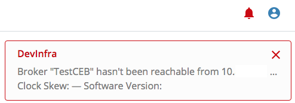

# Account Alerts

Account Alerts are automated messages from Circonus about the status of your Circonus account. New account alerts will appear as a red bell icon next to the user menu icon at the top right of the page, and will show any active alerts from any of your Circonus accounts, not just the one you are currently viewing.

There are a variety of Account Alerts. For example, if the account has been stopped for nonpayment, users would receive an Account Alert to warn them about this upon login. Most Account Alerts are related to issues with a broker. Broker issues are visible only to users in the admin role.

**Warning:**

> Any alert for a broker can lead to data loss and should be investigated immediately.

In general, users should be aware of Account Alerts from Circonus and heed any instructions provided by the alert. They can contact their company's Circonus administrator or contact Circonus Support (support@circonus.com) for assistance.
