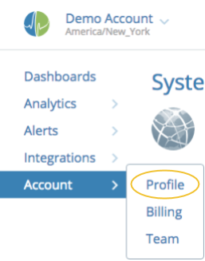
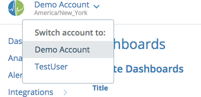
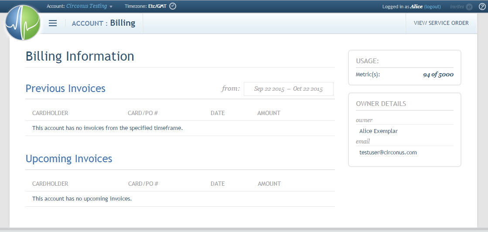

# Account Management

## Accessing Account Settings

The "Settings" link under the "Account" section of the main menu will navigate to the "Settings" page. This section will not appear when viewing the main menu in an account for which you are not an Admin.

## Switching Accounts

Throughout the site, in the upper left corner (next to the Circonus logo), there is an Account navigation link, labeled with the name of the account you are currently viewing.

Clicking on this link will present you with the option to switch the account you are currently viewing.

When switching accounts, the "User" section of the main menu will remain available and access the same personal profile management information as long as you are logged in as the same user.

If you are an Admin for the current account, the "Admin" section of the main menu will appear and allow you to access account management information for the current account.

## Billing

The "Billing" page allows you to review and update billing information in order to add Circonus Enterprise Brokers and additional metrics or hosts to your account.

Brokers can be provisioned, decommissioned, and otherwise managed.
