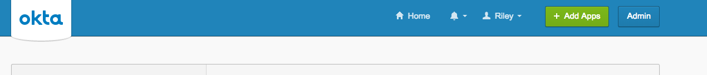
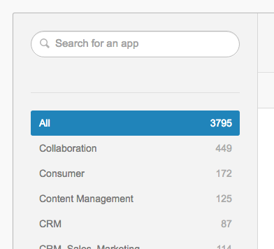
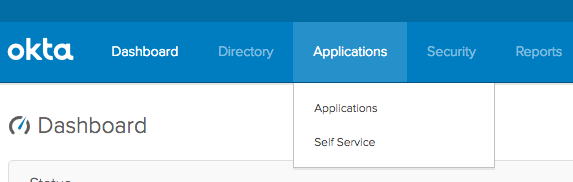
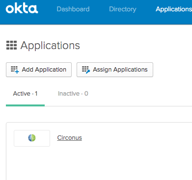
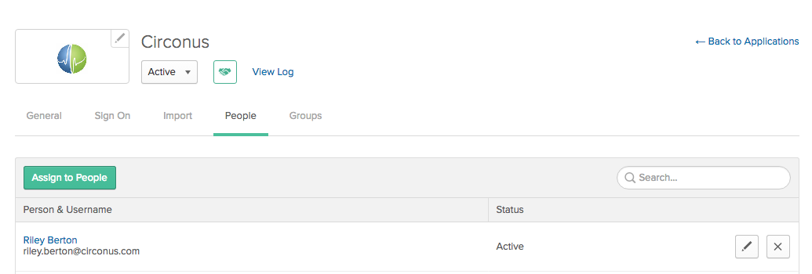
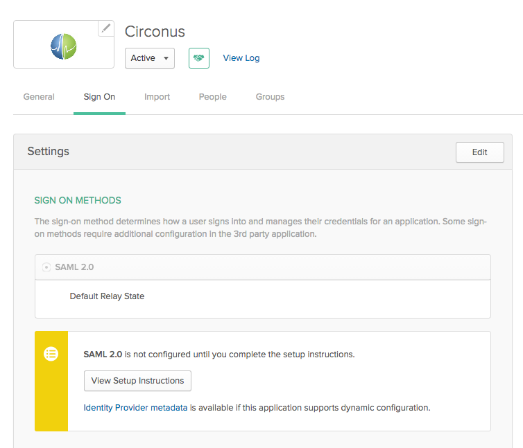
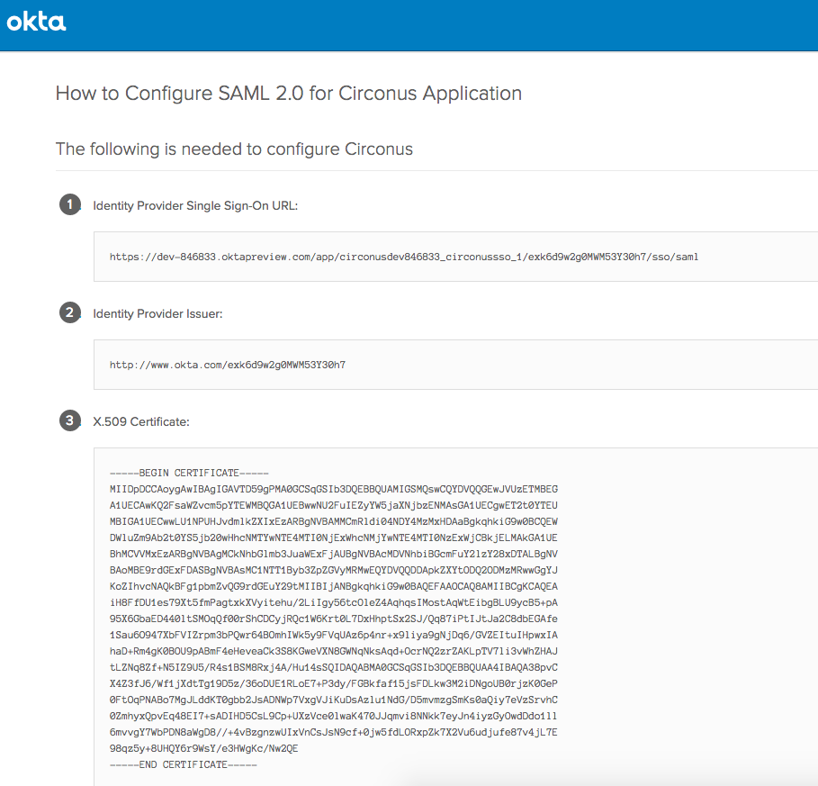
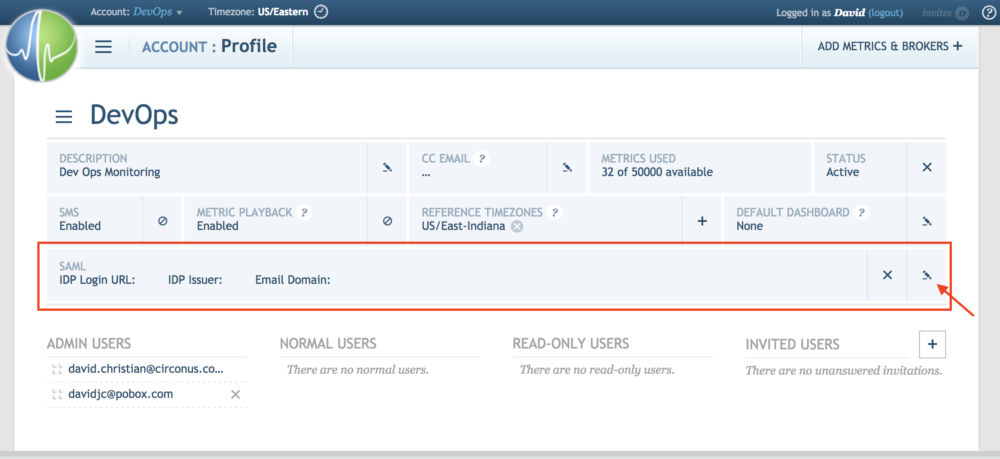
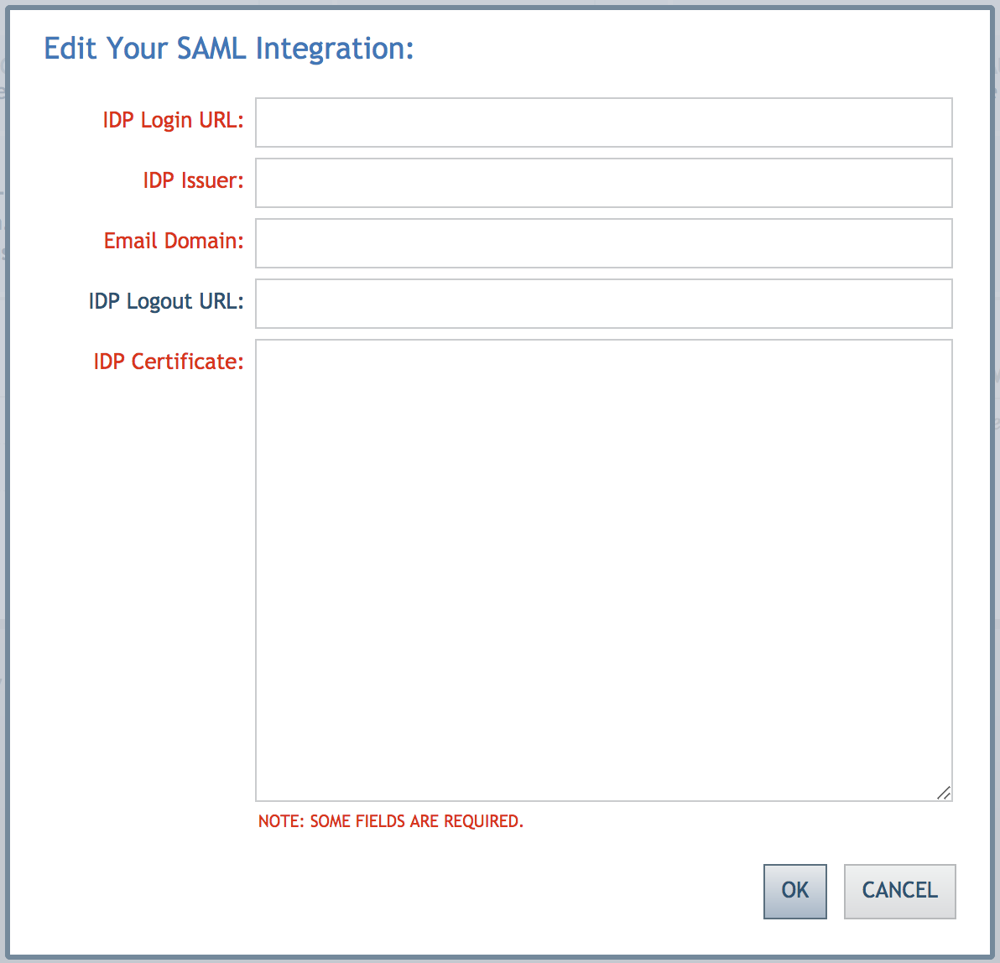

# SAML 2.0 Integration

## Overview

Circonus allows you to link a SAML Identity Provider for Single Sign On to your Circonus account. For example, if you use Okta in your organization for identity management, you can configure Circonus to authenticate your users against Okta to allow access to Circonus.

Circonus SSO can be configured to work with any SAML Identity Provider. The
following links contain the necessary metadata for integration:

- Entity ID: https://login.circonus.com/saml_sp_metadata
- ACS URL: https://login.circonus.com/login/saml
- SP CA issuing certificate: https://login.circonus.com/pki/ca.crt

The following instructions are specific to configuring Okta for your organization. Circonus will add instructions for other identity providers as needed. If you require help configuring another identity provider, please contact Customer Support ([support@circonus.com](mailto:support@circonus.com)).

### Okta

To configure Okta, start by adding Circonus as an application to your organization:

1.  Press the "Add Apps" button in the Okta console.
    

2.  Search for "Circonus" in the selection page that appears.
    

3.  Once you have added the "Circonus" app, click on the "Admin" button to configure it.
    

4.  Then click the "Applications" tab.
    

5.  Click on the "Circonus" app to configure it for your organization.
    

6.  Here, under the "People" tab, you can control which of the people in your organization can use the Circonus app.
    

7.  Click the "Sign On" tab to see the setup instructions that Circonus needs in order to allow logins from your account within Circonus.
    

8.  Click the "View Setup Instructions" button, located under the yellow section. A new window or tab will open with some info. You need to copy and paste this information into the SAML fields on the Account:Profile page in Circonus, as described below.
    

Now take that information you copied in step 8 and go back to Circonus:

1.  Go to your Account:Profile page and click the "Edit SAML Integration" button.
    

2.  Copy the "Identity Provider Single Sign-On URL" information (field 1 from the setup instructions in Okta) into the "IDP Login URL" field in Circonus.
    

3.  Copy the information from "Identity Provider Issuer" (field 2 from Okta) into the "IDP Issuer" field in Circonus.
4.  Copy the information from "X.509 Certificate" (field 3 from Okta) into the "IDP Certificate" field in Circonus.
5.  In the "Email Domain" field, enter the domain portion of the email addresses of users in your domain. For example: alice.exemplar@circonus.com would be "circonus.com". We use this mapping during sign-in to look up the proper SAML integration to execute when someone visits the Circonus login page.
6.  If you have configured your provider for Single Logout, copy the SLO URL into the "IDP Logout URL" field in Circonus. NOTE: SAML Single Logout is currently a "BETA" feature in Circonus, subject to the Identity Provider's implementation, and may change in the future.
7.  Click the "Save" button.

You are now ready to start using SAML 2.0 Single Sign On via Okta.

Documentation on this process is also available from Okta here:

- http://saml-doc.okta.com/SAML_Docs/How-to-Configure-SAML-2.0-for-Circonus.html
