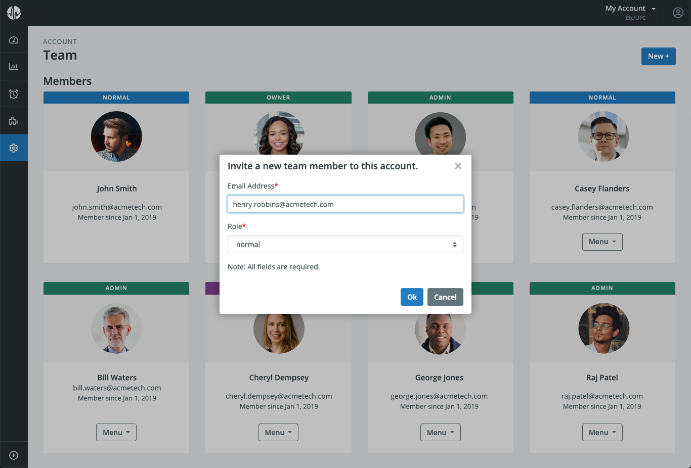
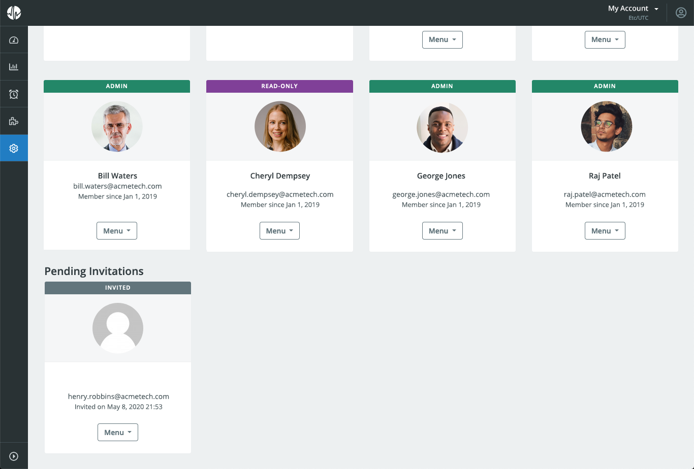
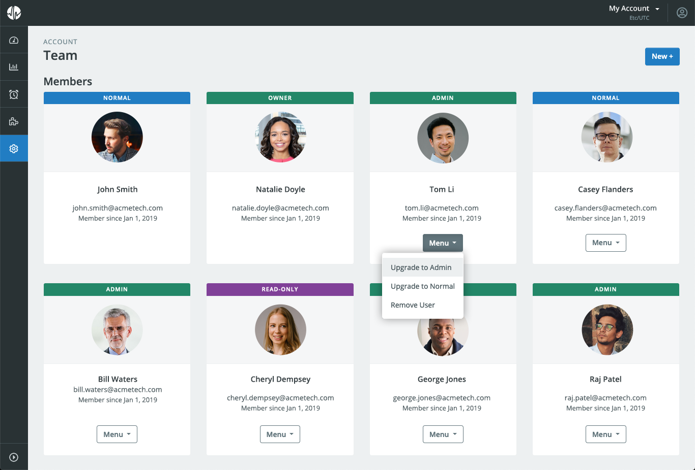
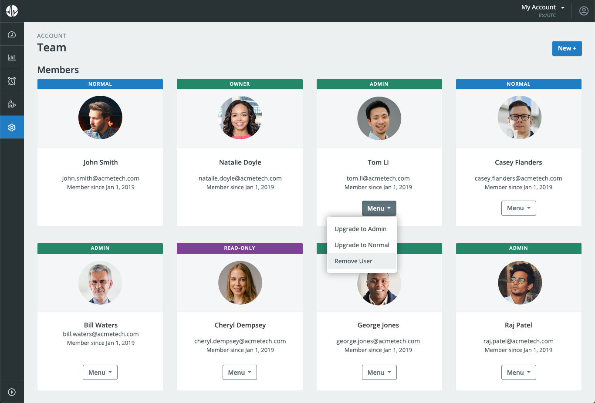

# User Management

## Adding Users

_Please note that only Admins can add users._ First go to Account > Team. Then, click the "New +" button. A dialog will appear allowing you to input the new user's email address and desired [role](/circonus/administration/user-management/#user-roles). An invitation will be sent via email to that user.

Until the invitation is accepted or ignored by the recipient, it will be listed in the "Pending Invitations" section. You may withdraw an unanswered invitation at any time using the dropdown menu for that invitation.

If the user does not have a Circonus account, they will need to sign up for one and confirm their email address before accepting an invitation.

## Changing User Privileges

An Admin may change a user's role via the dropdown menu for that user.

### User Roles

For Circonus Inside Accounts, user privileges are based on the role assigned to the user. Users with roles have access to options as appropriate to their role, but do not have access to options assigned to other roles.

The following roles can be assigned to users:

- **Admin** - Users with this role can add, remove, or modify other users and their roles, perform account management, and all Normal role abilities.
- **Normal** - Users with this role can add/remove metrics, graphs, alerts, and control most of the system other than Admin-only roles.
- **Read-Only** - Users with this role can browse, search, and view non-admin items, but cannot change things.

## Removing Users

An Admin may use the dropdown menu for a given user to remove them from the account.

