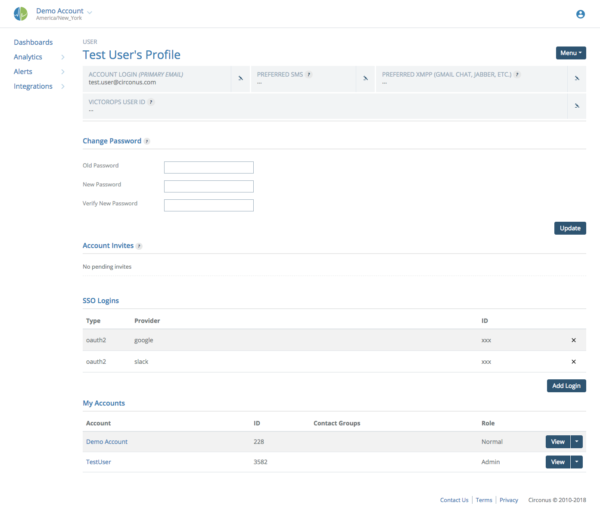
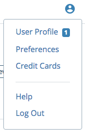
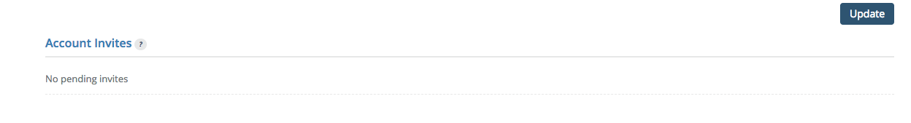
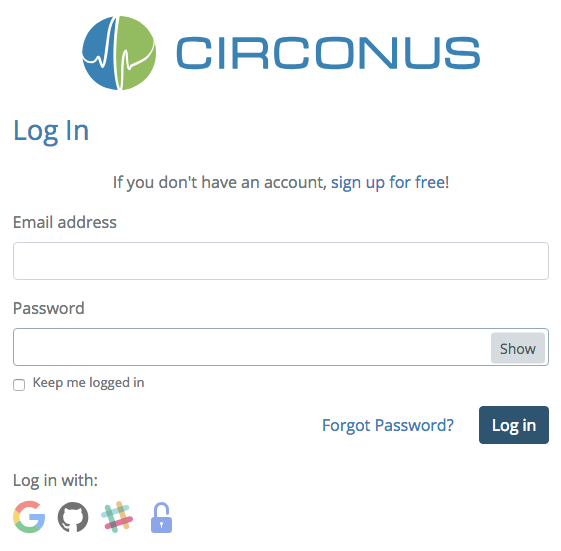
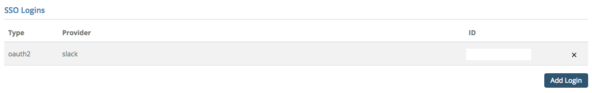
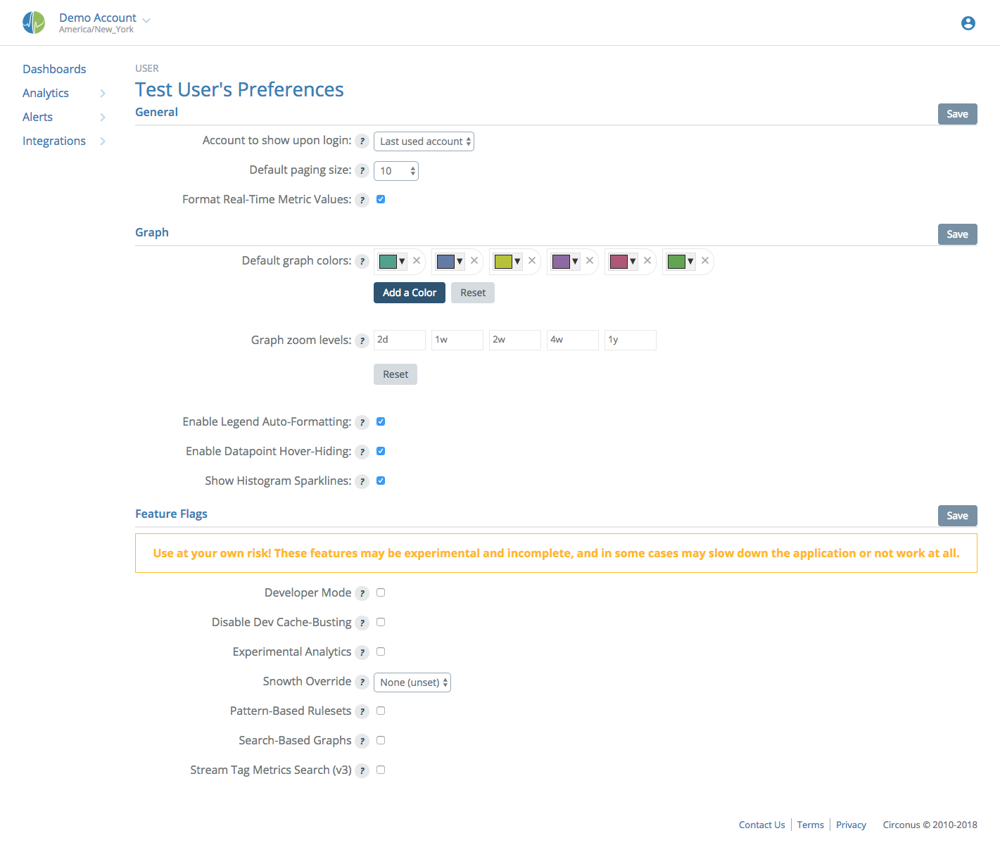
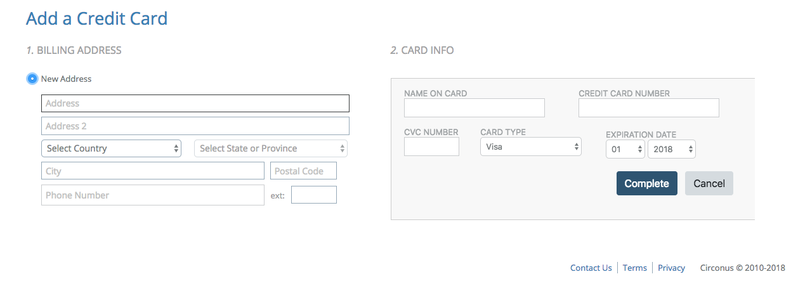

# User Profile

## Profile

The User Profile page allows users to manage their contact information and password, and view their account access and invites.

### Contact Information and Access

Circonus may attempt to send you notifications on a variety of occasions. Setting up contact information provides good flexibility and control over the method of contact used under each of these various circumstances.

As new contact methods become available, they will be configurable via this page.

### My Accounts

The "My Accounts" section will list all accounts to which you have access along with your role level. If you are an Admin, a "Manage" link will appear in the drop-down menu for that account, allowing you to jump directly the management console for the corresponding account. The "Leave" menu option allows you to leave an account. **Be careful**, as you will need to be invited back by an administrator to regain access.

The "Create Account" option from the top-right Menu will allow you to add a new account. The owner of an account is the user who created it.

### Account Invites

In the event that you have been invited to a new account, an indicator will appear next to your User Profile link in the User Menu.

Clicking the User Profile option will bring you to the personal profile management interface where you can act on the invitation. Account invitations appear in the "Account Invites" box from where you can elect to accept or ignore the invitation.

### Change Password

The "Change Password" section allows you to alter your password to a new value.

### SSO Logins

Users have the option to sign in using their Circonus username and password, or sign in using external providers, such as Google, Github, Slack, or any other SAML 2.0 provider.

Clicking on any of the "Log in with:" icons will redirect the user to those respective sites to validate access for the Circonus application.

These buttons will work even if you do not have an account yet. **Circonus will automatically create an account if one does not exist that matches the email on the validated login.** If a login already exists that matches the email, then Circonus will log the user into the account matching the email account.

After logging in, you can associate an external login on the User Profile page, by clicking the "Add Login" button.

the "Add Login" button redirects the user to validate at the external site, but then returns the user to the User Profile page with the new login listed under the "SSO Logins" section.

**Associating an account in this way allows the email address on the Circonus account and the email address on the external account to differ.** The next time the user clicks the "Log in with:" icon on the Login screen, Circonus will first lookup any saved external login associations and use that to choose the account. If there are none, Circonus will fall back to using the email address. If there are no email addresses, Circonus will create a new account.

Clicking the X button at the right end of the row for an external login under the "SSO Logins" section will remove the association, but will not log you out. This allows users to correct mistaken associations.

### Preferences

The "Preferences" link can be found under the User Menu.

Personal preferences allow you to customize small aspects of how the Circonus user interface behaves. Pagination settings and various aspects of data visualization are customizable through this section. As new features are introduced to the Circonus product, any additional personal configuration settings will be located here.

### Credit Cards

The "Credit Cards" link can be found under the User Menu.

The "New +" button will allow you to save credit card information associated with your user profile so that the card can be used to make payments for an account.

