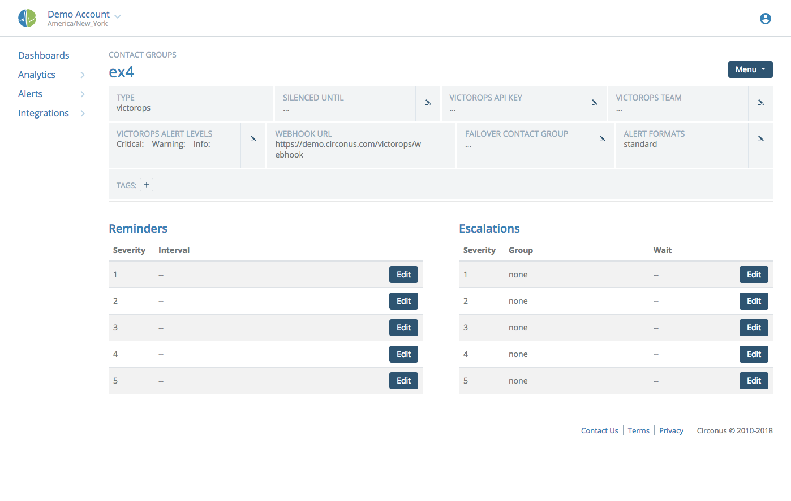

# Contact Groups

Contact Groups are managed on the Contacts page under the Alerts section, and are used to select groups of people (users & non-users) and to specify how they are to be contacted. You may then assign the contact groups arbitrarily across the site for alerting purposes.

## Creating Contact Groups

To create a new contact group, click the "New +" button in the upper right corner of the page.


Fill in the name of your new contact group. Optionally, if you wish to send alerts to a third-party service, you can select one of the services supported by Circonus in the dropdown. See later in this document for instructions on setting up the various third-party alerting services.

When you click "OK" your new contact group will be created with no members.


## Adding Members

You may add existing account users as members of a contact group, or you may add contact information for non-users. To add members, use the Menu at top right and choose the "Add Member" option; the new member dialog will appear.


To add existing users, use the scrolling list at the top of the dialog. Click users to select them; when selected, a user will appear at the bottom of the dialog under "New Members to be Added". If you have many users, the "Filter Users" field above the scrolling list is available to search through the names and contact info of all account users and narrow down the list to only those that match the search terms. (You may use Regular Expressions to search, if you wish.)

To add contact info for non-users, you may enter the info in the field under "Or Add a New Contact." Using this method, you may even enter a URL where you would like to have alert data submitted when using this contact group. After entering your info, hit ENTER to add it to the list of "New Members to be Added."

After choosing or entering your new members, you may use the checkboxes or radio buttons to select the contact methods for each member. For existing users, the available checkboxes represent the contact info that user has entered into their Circonus User Profile; you may select as many of them as you wish for each user. For new contact info, we make our best guess as to the contact method that should be used; use the radio buttons to change this as necessary.

## Configuring Contact Groups

To rename a contact group, select "Edit Name" from the Menu at top right. Enter the new name, and click OK.


After a group is created, you have various configuration options available. The first option, which covers all alerts sent to the contact group, is the "Alert Aggregation Window." This is the period of time for which alerts of equal or lesser severity than the one last received will be aggregated and sent in a single notification. An alert will be sent immediately if it's of higher severity than what was last sent.


For each of the alert severities (1 through 5) you also can set the following options:

- _Alert Reminders_: instruct Circonus to perpetually re-notify the contact group at the specified interval if the cause is not corrected or the alert is not acknowledged.
- _Alert Escalations_: instruct Circonus to escalate the alert to a different contact group after the specified period of time if the cause is not corrected or if the alert is not acknowledged. You must first choose the contact group which will be the target of the escalation, then you may choose the escalation interval.

## Custom Alert Formats

For most contact group types and member types, you are able to customize the format of the alerts to suit your team's needs. (Note that outgoing webhooks currently do not utilize custom alert formats.) To get started, click the edit icon for "Alert Formats" as shown here:


This will open a section with options to modify the long and short alerts. Tick
the "Use Custom Formats" box to enable editing. Long alerts are used when
message length is not limited. Examples are email and PagerDuty. Short formats
are used with SMS.

Note:

> PagerDuty currently supports a single message format being sent to it, so we use the long format for PagerDuty. If you receive an SMS via PagerDuty it will take the first X characters of this message to send you, so it is recommended you make a concise summary for your alerts.

Each format type has 2 fields; a summary and an alert format. Summaries are generated once per notification, regardless of the number of alerts in that notification, and appear at the beginning of the message. Because of this, only non-alert specific macros can be used in summaries.

The "formats" are then used on each alert in the notification to give more details. You can choose to use both summary and alert formats or just one format, but if you leave both blank you will get an empty notification.

Long formats have an additional subject field used for email subjects. It is required that you modify this field if you are editing the long formats (unless you want an empty subject). The subject is built from the first alert in the notification so has access to its data (and its macro substitutions).

Customization is done by the use of macros. These take the form {item} where item is the name of the value you want replaced.

The following macros are currently supported for summary, subjects, and alert formats:

- `{account}` the account name from which the alert was triggered
- `{total}` the total count of items in the message
- `{(alert|recovery)_count}` the total counts of alerts or recoveries in the message
- `{sev_[/1-5](/1-5)_count}` the total counts of all sev X items in the message
- `{sev_[/1-5](/1-5)_(alert|recovery)_count}` the total of all sev X alerts or recoveries in the message
- `{summary_small}` a minimal summary similar to the default SMS format. Ex. A1:1 A2:1 R1:3

The following macros are currently supported only for subjects and alert formats:

- `{alert_id}` the ID of the alert
- `{broker_name}` the name of the broker associated with the triggering metric
- `{check_name}` the name of the check containing the triggering metric
- `{cleared}` if a RECOVERY alert, the date on which the metric resumed normalcy
- `{clear_value}` if a RECOVERY alert, the new value which cleared the alert
- `{check_id}` the ID of the check containing the triggering metric
- `{check_bundle_id}` the ID of the check bundle containing the triggering metric
- `{host}` the target host of the check containing the triggering metric
- `{link}` the URL to view this alert in Circonus
- `{metric_link}` (deprecated) see `{ruleset_link}`
- `{metric_name}` the name of the metric triggering the alert
- `{metric_notes}` (deprecated) see `{ruleset_notes}`
- `{name}` combined name string in the form check_name: metric_name
- `{new_severity}` if a TRANSITION alert, the new severity after the transition
- `{occurred}` the date and time on which the alert occurred
- `{ruleset_link}` URL from the notes for the triggered ruleset
- `{ruleset_notes}` notes associated with the triggered ruleset
- `{status}` the type of alert, one of three types: ALERT, RECOVERY, or TRANSITION
- `{status_small}` the same as {status}` except using single letters: (A, R, or T)
- `{severity}` the severity of the alert
- `{tags}` a human-readable (base64 decoded) rendering of the metric's streamtags
- `{tag:cat}` decoded streamtag value for the category e.g. given `metric|ST[foo:bar]`, `{tag:foo}` = bar
- `{value}` the metric value which is triggering the alert

- `{rule}` and `{rule_desc}` the type of rule that triggered this alert and its english description, values are:
  - `minimum` - is less than
  - `maximum` - is greater than
  - `match` - matches regex
  - `not_match` - does not match regex
  - `exact_match` - equals
  - `not_exact_match` - does not equal
  - `onchange` - changed
  - `absent` - is absent
  - `threshold` - reached threshold
  - `expression` - matched expression
- `{criteria}` the value of the rule, i.e. what the minimum was set to, or what the regex is to match against. For absent rule this is the number of seconds that the value must be absent before alerting

- `{windowing_function}` and `{windowing_function_desc}` the function used to calculate derivatives, etc. values are:
  - `average` - average
  - `derive` - derivative
  - `counter` - counter
- `{windowing_duration}` the length of the window over which the windowing_function operates, default: 300

Conditionals are also supported; these are useful in places where you only want to see the value if it exists—for instance, the time the alert cleared. The format of a conditional is: %(condition) content% , so an example of this would be: `%(cleared != null) Cleared: {cleared}%`

Supported operators are ==, !=, >, and <. The format for conditional statements is very strict; you must have a single space between operands and operators, and between the closing parenthesis and the subsequent text.

**Note:**

> You may put macros inside conditionals, but you cannot nest macros inside macros or conditionals inside conditionals. E.g. you cannot do this: `{alert_id {link}}` or this: `%(cleared_on != null) %(status != resolved) foo% bar%`

Below is an example of customized alerts:


## Webhook Notifications

A webhook is an HTTP POST with all the information about an alert you would normally get via email or SMS. Webhooks can be added to any contact group. Unlike other contact methods, you cannot add a webhook to an individual user, and then add that user to a group.

To set up webhook notifications, navigate to the existing contact group to which you would like to add the webhook, and choose the "Add Member" option from the Menu at top right. Under "Add a New Contact", enter the URL you would like Circonus to contact. The contact type will then display as your URL with the method of "Web Hook".

**Notes:**

> URL hooks must begin with either `http://` or `https://`. If the URL hook contains the query param `?format=json` then it will receive data formatted with JSON instead of query strings.

> Webhook notifications currently do not use the custom alert formats described earlier in this document, but a standard format described next.

Here is an example of a json body posted for one or more alerts:

```
{
    "alerts": [
        {
            "check_name": "My Check",
            "leaving_maintenance": "false",
            "check_bundle_id": "101348",
            "alert_url": "http://circonus.com/account/my_account/fault-detection?alert_id=2119091",
            "windowing_function_desc": "",
            "rule": "maximum",
            "rule_type": "metric",
            "rule_desc": "is greater than",
            "broker_name": "My Broker",
            "ruleset_notes": null,
            "ruleset_user_json": {"example":true},
            "metric_name": "A",
            "windowing_function": "null",
            "severity": "1",
            "criteria": "1",
            "occurred_epoch": "1463930502",
            "check_id": "651012",
            "alert_value": "23.0",
            "value": "23.0",
            "rule_id": "165357",
            "occurred": "Tue, 22 May 2016 11:21:42",
            "host": "www.myhost.com",
            "windowing_duration": "",
            "alert_time": "Tue, 22 May 2016 11:21:42",
            "rule_api_id": "651012_A",
            "clear_value": "",
            "alert_id": "2119091"
        },
        .
        .
        .
    ],
    "account_name": "My Account"
}
```

The `ruleset_user_json` field may be populated by defining the `user_json` field on the triggering ruleset via the ruleset API.

Recoveries get the additional parameters of `clear_value` and `clear_time`.

Webhook notifications are a useful tool for handling a complicated paging schedule, or for users who prefer a contact method that is not yet natively supported by Circonus. Using webhook notifications, Circonus simply posts the data to you so that you can integrate it as you choose. Webhooks notifications can also be used to graph alerts, by setting up a webhook and feeding the data back to Circonus via Resmon XML, to provide data for the graph.

## OpsGenie

Using OpsGenie, users can receive notifications for critical problems detected by Circonus, acknowledge alerts, take or assign ownership of the alerts, comment on them, and perform other functions. OpsGenie seamlessly tracks all alert activity, including when the alert was created, who was notified, when and how they were notified, whether or not recipients have seen the alert and when they saw it, when they acknowledged it, and who executed which action. OpsGenie can also automatically close alerts when the host and/or service is restored.

OpsGenie provides more information than an SMS notification, so it can better enable the recipients to assess the problem and determine a response. OpsGenie alerts can include long text messages, many fields, tags, and attached files. Recipients can see the alert message and all the supporting information, charts, and other relevant information. You can attach any information that you think is relevant to the alert and make it available to the recipients, either via the API or the web UI.

Start by creating a new Contact Group, giving it a name, and selecting OpsGenie from the Third Party dropdown:


Log in to your OpsGenie account and follow the directions to add a [Circonus Integration](http://www.opsgenie.com/docs/integrations/circonus-integration).

Once you have added the integration, copy the OpsGenie URL with API Key you are given into the OpsGenie API URL box in the Circonus contact group:


Choose your other desired settings and click SAVE.

### Sending Acks from OpsGenie to Circonus

When acknowledging a Circonus alert from within OpsGenie, you have the option to have that ack transmitted back to Circonus so that the alert is acknowledged at Circonus as well. A webhook URL is provided for you on your OpsGenie contact group:


To set up the 2-way acknowledging, go to your Circonus Integration Settings page at OpsGenie and click the option to Send Alert Actions to Circonus:


Paste in your webhook URL and make your selections to the other options.

When acknowledging alerts via OpsGenie, the alert at Circonus is acknowledged for 30 minutes by default. You can change this by adding the following option to the Webhook URL query string:

```
?acknowledge_minutes=X
```

**Important**: The OpsGenie user who acks the alert must have a Circonus user account that has write access (Normal or Admin) to the account whose metric is alerting.

## PagerDuty

PagerDuty webhooks provide a way for acknowledgements, unacknowledgements and resolutions from users on PagerDuty to transfer back to Circonus.

The Webhook URL can be found in your PagerDuty contact group details. This URL can then be entered into the PagerDuty interface on the service for which you wish to enable webhooks.

By default, acknowledgements are set for 30 minutes. This interval can be adjusted by adding the following option to the query string:

```
?acknowledge_minutes=X
```

Note that resolving an alert in PagerDuty will clear all acknowledgments in Circonus, which would allow the alert to be triggered again.

Also note that you can select options for Reminders and Escalations in PagerDuty Contact Groups.

Reminders will resend alerts to PagerDuty, so that if the alert is resolved in PagerDuty, the reminder will retrigger it.

If Escalations are already configured in PagerDuty, it is not necessary to configure Escalations in Circonus for a PagerDuty Contact Group and it is recommended that Escalations be configured in one place.

## Slack

Circonus integrates with Slack to receive rich alert notifications that allow you, from within Slack, to acknowledge alerts and create maintenance windows.

Start by creating a Slack Contact Group:


If you haven't already, you will be prompted to sign in with Slack:


Then, if your team administrator hasn't already, you will be prompted to install the Circonus Slack App.

Once you are logged in with Slack and have the Circonus Slack App installed, you can choose the Slack channel you want alerts to be put into for this Contact Group, and the username you want the Slack Bot to use when posting. The username can be anything you like.


Set the **Action Buttons in Slack** option to "showing" to be able to Acknowledge alerts and create Maintenance windows from within Slack.

When alerts come in to your Slack channel, with **Action Buttons in Slack** showing, they will look like something like this:


Click the buttons and follow the prompts to manage alerts from within Slack.

Note that the Slack user who clicks the action button(s) must have a Slack sign-on for their Circonus user account, and must have adequate privileges to perform the action on the account the alert originates from. Any Circonus user can add a Slack sign-on by visiting the User Profile page and clicking ADD LOGIN under SSO Logins.

### Using a Custom Alert Format

You can use Slack message formatting to further enhance the appearance of your Slack alerts. To do this, simply click the edit icon for **Alert Formats** in your Slack Contact Group and begin your long alert format with the line `slackformat:`. After the colon, you can add arguments which will be used to format the message.

A pre-filled format with basic information is pre-defined for you:


The above format will result in your Slack alerts looking something like this:


With that alert format enabled, your recovery messages will look like something like this:


Each line after `slackformat:` is assumed to be a field to be displayed and should be in the form of "title:value" as documented [here](https://api.slack.com/docs/attachments#fields). You may also prefix the line with either `long=` or `short=` to specify the length of the field (short is the default if neither is specified). You can then use normal Circonus macros in each line to place the appropriate values in that line.

## VictorOps

Circonus can send acknowledgements, alerts and recoveries to [VictorOps](http://victorops.com/?utm_source=Partners&utm_medium=Circonus&utm_campaign=Circonus).



Click the edit icon for "VictorOps API Key" and paste your VictorOps API key into the dialog. This key can be found by viewing your VictorOps integrations to check your REST Endpoint settings.

The "Team" field displays the routing key used when contacting VictorOps. Alerts will be routed to members of this team.

The "Alert Levels" settings allow you to map Circonus severities to VictorOps alert levels. If the severity of the alert is of an equal or worse severity, Circonus will use that level. For example, a critical setting of 2 would set severity 1 and 2 alerts to critical. Higher levels take precedence; Circonus will first check if the alert is critical, then a check if it is a warning, then check if it is info. If they are not configured, all alerts are treated as critical.

Optionally, you can forward alert acknowledgements from VictorOps back to Circonus by creating an Outgoing Webhook in your VictorOps settings and pasting in the Webhook URL there. See the next section for details.

The same "Alert Formats" and "Alert Options" are available for VictorOps as for other Contact Group options.

Since VictorOps is an external service, the option to set a "Failover Contact Group" is available. If Circonus can not contact VictorOps to send out an alert or receive an error, this contact group will be contacted instead.

### Sending Acks from VictorOps to Circonus

When acknowledging a Circonus alert from within VictorOps, you have the option to have that ack transmitted back to Circonus so that the alert is acknowledged at Circonus as well. To do this, go to your VictorOps Account Settings and click the Alert Behavior dropdown:


From the list of choices, click Outgoing Webhooks:


And then click Add Webhook:


Fill in the fields as shown, pasting the Webhook URL from your VictorOps Contact Group into the **To:** field.


Copy and paste this into the **Payload** field:

```
{
  "ALERT.alert_type": "${{ALERT.alert_type}}",
  "ALERT.circonus_alert_id": "${{ALERT.circonus_alert_id}}",
  "ALERT.ack_author": "${{ALERT.ack_author}}"
}
```

Note: If you want alerts that are "Resolved" via VictorOps to clear the acknowledgment at Circonus (allowing the alert to be triggered again) set the **Event** field to "Any-Incident". Otherwise, set it to "Incident-Acknowledged" and the acknowledgement at Circonus will expire normally (if the alert condition doesn't clear first).

When acknowledging alerts via VictorOps, the alert at Circonus is acknowledged for 30 minutes by default. You can change this by adding the following option to the Webhook URL query string:

```
?acknowledge_minutes=X
```

**Important**: The VictorOps team member who acks the alert must have a Circonus account that has write (Normal or Admin) access to the account whose metric is alerting. To link the VictorOps user to the Circonus user, go to the [User Profile](http://login.circonus.com/user/profile) page at Circonus and type in the VictorOps username:


## Suspending Notifications

While the system allows the silencing of specific alerts (see [Acknowledging Alerts](/circonus/alerts/introduction/#acknowledging-alerts)), sometimes it can be useful to set a "silence period" and suspend all notifications going to a specific contact group. To do this, click the edit icon for "Silenced Until" and then click on the date to display a date picker. Choose the day and time to set an end date upon which notifications to this group will no longer to be silenced.


The "silenced until" date will appear in the contact group title bar. To end the silence period before it expires, simply click the "X" button.


