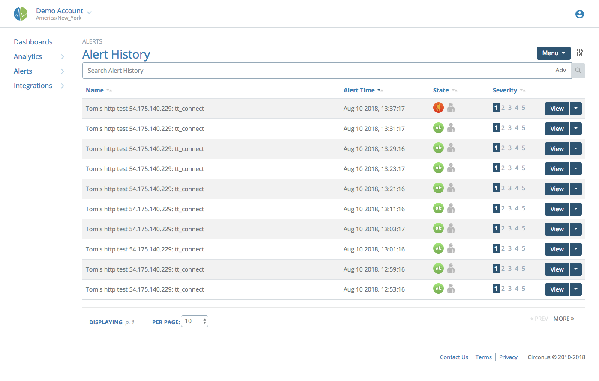

# Alerts

## Reviewing Alerts

You can review alerts in Circonus via two different pages: Alerts and Alert History. The Alerts page will show you any alert currently in an alarm state along with any alert that has cleared within the last 5 minutes.

Alert History will let you review any alert that has ever triggered.

You can click on any alert on the page to view the details about it.

From this detailed view you can see a graph showing changes to the metric value over time, details about the check that contains the metric, as well as any notes provided as part of the ruleset.

The Menu at top right gives you various options to work with the alert. They are from top to bottom:

- **View Check:** Go to the check page for the alerting metric.
- **Verify State:** If you feel that the system is not seeing that the alert should be clear, this will send a message to the backend asking it to check the current state. Additionally, if you have removed the check or metric this alert is on, or all the rulesets, this button can be used to "force" the backend to clear the alert.
- **Acknowledge:** This gives you an acknowledgement dialog that is used to let others know you are working on the problem.
- **Maintenance:** This takes you to the maintenance page where you can set the metric, check, or host into maintenance. Learn more about [maintenance windows](/circonus/alerts/maintenance-windows/).
- **Edit Rules:** This takes you to the ruleset editor to allow you to make adjustments to what triggers your alerts.
- **Quick Graph:** This opens the "new graph" page with this metric already added. This is useful if you want to do some in-depth correlations.
- **Uptime Report:** Provides accounting of the total time that this metric was in alert. The default view is one row per year, which can be expanded to drill down to months, and further to days.
- **API Object:** Shows the JSON representation of the [API alert object](https://login.circonus.com/resources/api/calls/alert).

## Acknowledging Alerts

Acknowledging an alert lets others know you are working on the issue. Acknowledgments also prevent any reminders or escalations from triggering. You may only acknowledge alerts that are currently in an alarm state.

When you are working on an alert, choose "Acknowledge" in the Menu at top right. You can also find this option from the drop-down menu next to an alert's "View" button when viewing the list of alerts.

Next, you will be presented with a dialog with two options:

First, choose for how long you want to acknowledge the alert. You can use either choose one of a few preset timeframes, or choose "+ Custom Date" to enter a date and time for the acknowledgement, to expire.

Next, you can enter in any notes about the acknowledgement. These can be viewed from the UI by anyone that might also be looking at the alert.

Click "Ok" and you are done.
