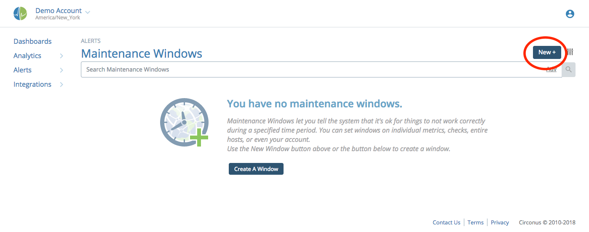
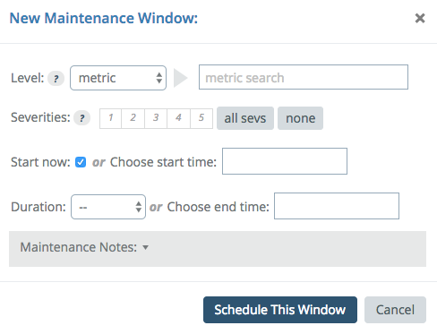

# Maintenance Windows

Maintenance windows are used to silence alerting while performing work on an application/server/etc. Typically these are scheduled in advance and everyone involved knows maintenance is being performed.

To create a scheduled maintenance window, navigate to the Alerts -> Maintenance page. Click the "New +" button to begin.

This opens a dialog to create your window.

Choose a level for the window; this level is how high or low in the "Circonus stack" the maintenance window will be. At the lowest level, you can set the window on an individual metric. Going up the stack from there, you can set it on a check, check bundle, host, or on the entire account. Note that setting maintenance on a check bundle is a convenience feature that actually creates individual windows on each check in the bundle.

Next, select the target for that level. For a metric, this will be the metric name. For a check, this would be the check name. For a host, this is hostname. For an account, this will disable the field and put your account name in its place.

You can select which severities this maintenance will cover. For example, if you are performing minimal changes, perhaps you only want alerts of sev 2 through 5 to be ignored during the maintenance window, but allow sev 1, so you will still receive an alert if the system goes down.

Next, enter the start and end times for the window. You can begin maintenance immediately, or schedule the window for some point in the future.

Last, if you want, you can make notes about this window to provide some context about why you are scheduling it.

When you are done, click "Schedule This Window".
