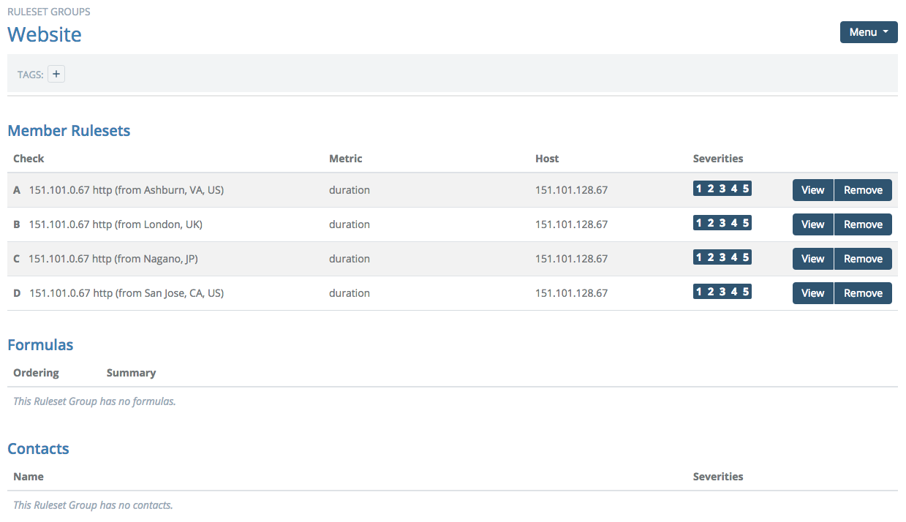

# Ruleset Groups

Rule groups take the concept of alerting on individual outages one step further by letting you work with farms of servers or any related rules. To begin, navigate to the Alerts -> Ruleset Groups page and click "New +".

Choose a name for your group; this is the name that will appear in the alerts. For this example, we'll be alerting on a website, so we'll call our example, "Website".

Next, you will search for Rulesets that should be in the new group. Start typing the name of a metric from an existing Ruleset, and a list of choices will appear. Here, we are looking for rules on the `duration` metric from an HTTP check.

Groups operate on rules you have already defined in the Rules section, see [Configuring Rulesets](/circonus/alerts/rulesets/) for more details. In the example, we're going to add the rule for the HTTP duration metric from 4 brokers: Ashburn, London, Nagano, and San Jose.

Once all rulesets are added, you will notice that each metric gets a label; A, B, C, etc.

Next, we need to define what we want to alert on, so choose "Add Formula" from the Menu at top right.

Here we have two options: you can set a threshold or an expression. Thresholds let you say "alert me when a minimum fraction of these rulesets have gone bad". Expressions let you be more precise and allow you specify "alert me when this particular combination of rulesets has gone bad".

We'll start with an example of a threshold. Here we will ask to be alerted when 3 of the 4 brokers have noticed an issue with the duration.

Let's assume that most of our customers are in the US, and we want to make sure that page load durations are acceptable at all times from the east and west coast. For that, we'll add an expression that will alert us if one of the US brokers sees the duration in violation.

Expressions can be used for more than just making sure your site is available from around the world. Perhaps you want to be alerted only when both CPU and memory are high, but not when a particular process is running, or only when service A and service B are both down at the same time. Here are some sample expressions:

- `A and B and C`
- `(A and B) or (B and C) or (A and C)`
- `(A and B) and (not C and not D)`

Finally, we add in the group we want contacted. Choose "Add Contact" from the Menu at top right, then select the contact group and choose which severities will trigger a notification to this group.

Now our group is finished. The UI will still show all the individual failures so you can act on them, but only page us when our group is in alert.

