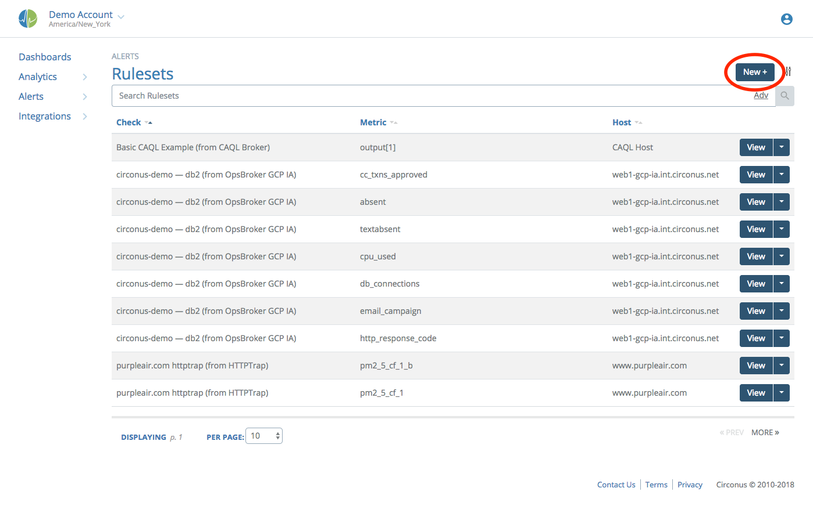
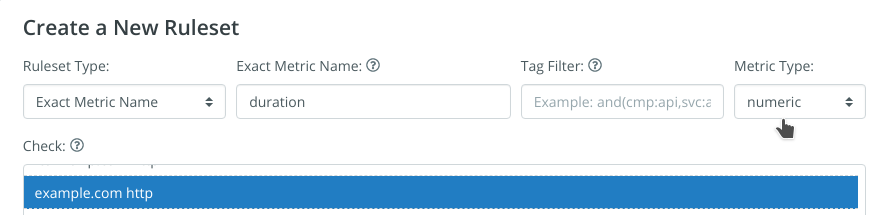
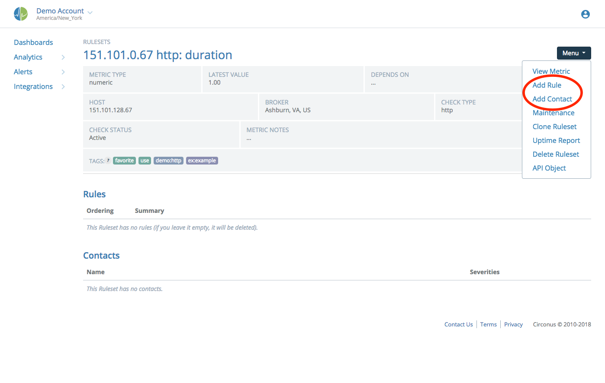
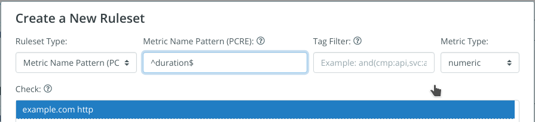
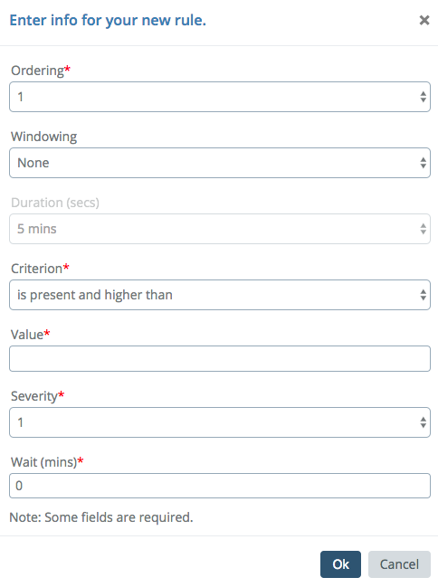
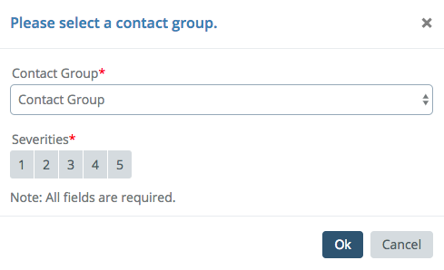
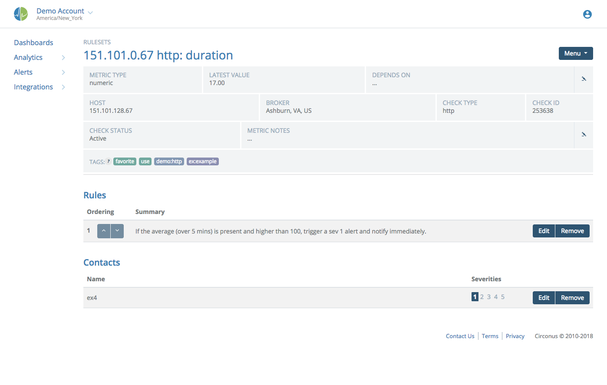
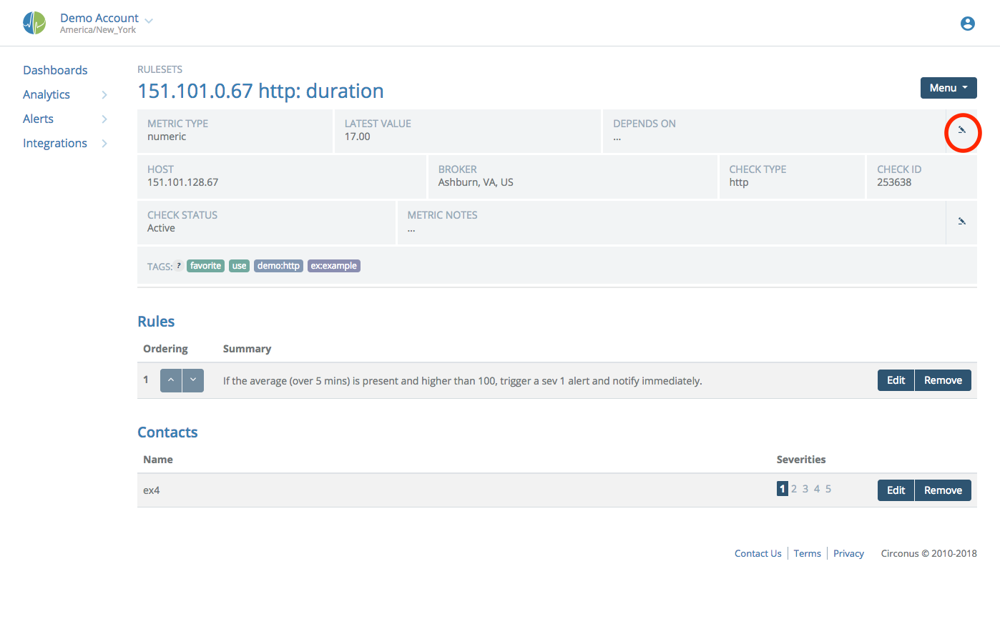
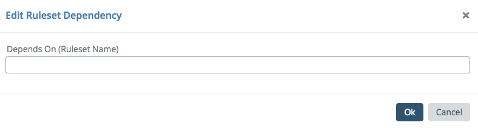

# Configuring Rulesets

Alerts are triggered when metric values violate a rule configured in the system. These rules are created from the Rulesets item, under "Alerts" in the main menu.

To begin, click the "New +" button.

Rules can be created on individual metrics or they can be created on groups of metrics via Regular Expression pattern matching of metric names. You may configure multiple rules in each ruleset. Rules are processed in order, and the first one to be found in violation triggers the alert and rule processing stops.

Step one to configure a ruleset is either selecting the check and metric for which to create the rules, or entering the Regular Expression pattern. First we'll show the selection of an individual metric.

Here we typed the name 'duration' and selected a website check for the total duration metric. This is the total time from establishing the connection to receiving the entire document body.

Clicking the 'Create' button will take you to the ruleset details page. This is also the same page you will use when editing an existing ruleset.

From the Menu at top right, the "Add Rule" and "Add Contact" menu options are what you will use to configure your ruleset. Other items on this page include:

- **Latest Value:** The value we last saw flow into the system for this metric.
- **Depends On:** Dependencies let us create parent-child relationships with metrics. See [Establishing dependencies](#establishing-dependencies).
- **Ruleset Notes:** You can create notes to give details on why this ruleset might trigger an alert. You might also provide a link to additional documentation detailing remediation actions. This is highly recommended.

Now we'll show the creation of a pattern-based ruleset. In the New Ruleset modal, select the "Metric Name Pattern" type.

Here we've entered our pattern ("^duration$") and verified that the numeric type was set properly. You must then select a specific check to target. Note: you may only create one ruleset for any particular Regular Expression pattern per check.

Clicking the Create button will take you to the ruleset details page. This is also the same page you will use when editing an existing ruleset.

## Adding a Rule

Use the "Add Rule" option from the Menu at top right to create a new rule.

The following aspects of your new rule are available to be edited:

- **Ordering:** If there are multiple rules in this ruleset, this is the position this rule should occupy. Rules are evaluated starting at position 1. The first violation triggers an alert, after which rule processing stops. You may also reorder rules using the up and down arrow buttons on each rule in the ruleset info page.
- **Windowing:** Consider more than one measurement over the specified duration, applying the chosen function, the output of which is evaluated against the rule criterion and value. Windowing is only available for numeric and histogram metric types.
- **Duration:** This option is only available when a Windowing function other than "None" is chosen, and sets the length of the window for evaluation, in seconds. You may choose from some predefined options or enter your own value.
- **Criterion:** The operator for comparing the incoming measurement with the threshold value. The available options differ depending on the type of metric chosen for the rule. Numeric and histogram metrics have higher/lower than, while text metrics have matching options. All metric types also have an option for absence over a chosen duration. If no measurements arrive within the absence period, an alert is triggered.
- **Value:** The threshold value to which you want to compare the incoming measurement.
- **Severity:** The severity level this rule will trigger. Circonus has 5 severity levels, 1 through 5, with 1 being the most severe.
- **Wait:** Circonus will create the alert in the UI immediately when a rule is violated, but it will wait the specified number of minutes before notifying any contact groups about the problem. This allows time for the issue to resolve on its own.

Once you have a rule configured, click "Ok".

### Timers and Timer Reset Conditions

A Rule will wait a set period of time before sending an alert notification.

Timers are configured to handle an alert changing between states. Once a timer is started, if the severity level changes and new timer is less than the time remaining in for the current timer, Circonus will use the new timer. Otherwise, it will keep using the current timer. This prevents a scenario in which timer resets could post-pone an alert indefinitely.

These timers are reset each time data is collected. Rules based on the Absence of a metric will not alert if data has not been collected for that metric since the alert was created. Once data is flowing the rule will alert if data is absent for the specified time.

## Adding a Contact Group

This option attaches a contact group to be notified when an alert fires. Choose "Add Contact" from the Menu at top right to begin.

Simply select the name of the contact group you want to notify, and then select which severity levels they will be alerted about. You can have any number of groups attached to a ruleset, being notified about any number of severities. If you do not want to attach a group, the alert will still be created for you to see in the UI.

Once we have our rules and contact groups added, our interface will look something like this:

## Establishing Dependencies

Metric dependencies allow you to say "If the parent metric is in alert, don't tell me the child is also in alert." This prevents you from receiving redundant alerts.

Circonus assumes a severity 1 alert to mean that the host is "down". So you can only create dependencies on metrics that have at least one severity 1 rule configured. These dependencies are set via the "Depends On" select box in the ruleset editor.

Start typing the name of a metric that should be the parent.

For example, you might set an HTTP `duration` metric to depend on the HTTP `code` because if it isn't serving a 200, then the duration value is probably not worth alerting on.
