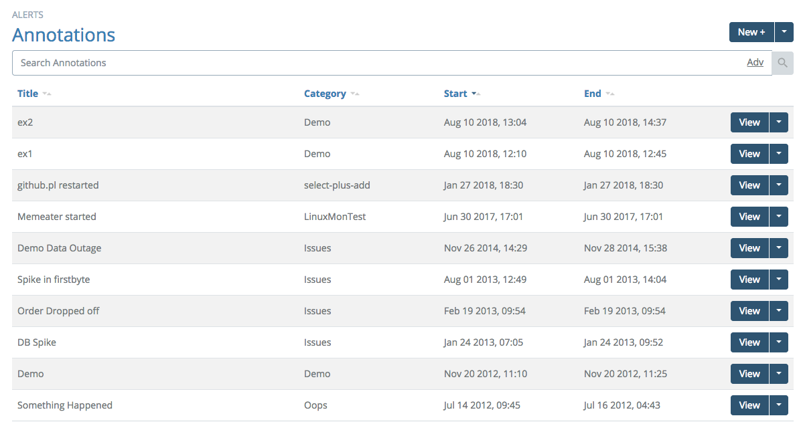
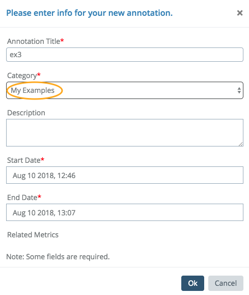
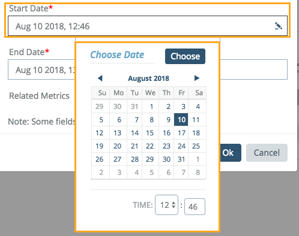
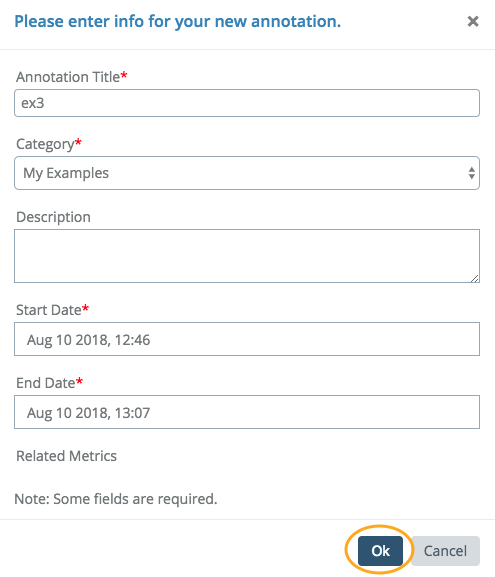
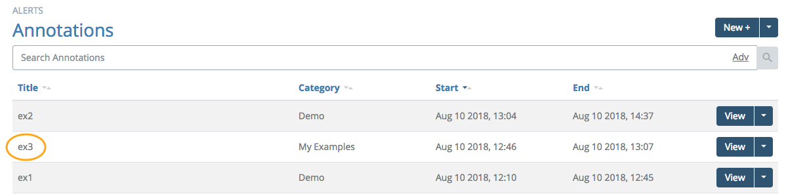
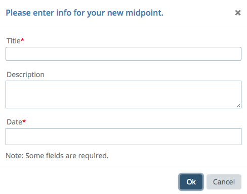
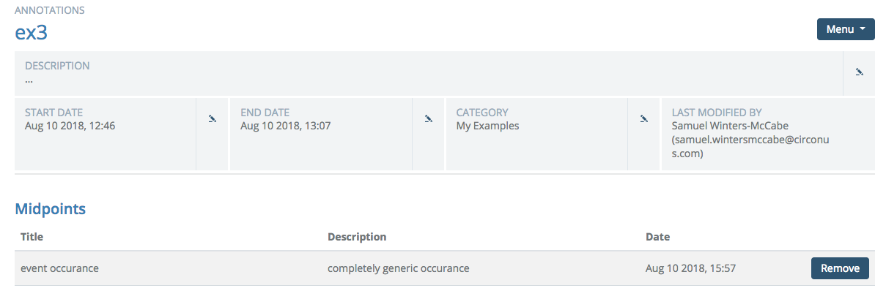
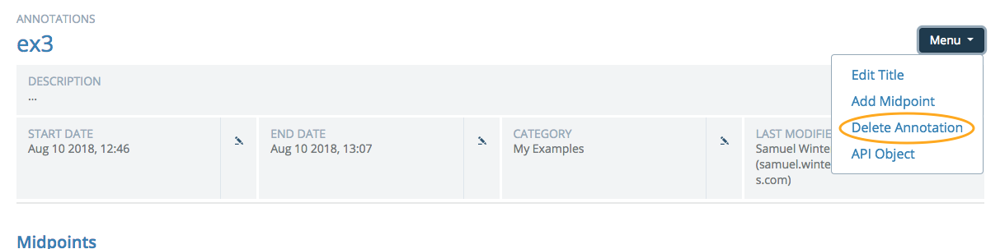

# Annotations: Managing Events

Circonus Annotations allow correlation of business events (that are not strictly telemetry driven) with all of the powerful telemetry visualization tools provided by the platform. Business events are anything important to the organization that can be put on a timeline: facilities maintenance, marketing events, HR information like sick days and employment dates, renegotiation of contracts, signing new clients, etc.

If you click on the "New +" button, a dialog will open, allowing you to enter a new Annotation for an event into the system. Annotations can also be added interactively from the [view graph page](/circonus/analytics/graphs/view/).

The first step is to provide a short, clear name for the Annotation. These do not need to be completely unique, but it should be clear and concise. Second, you must select a category for the Annotation. If no suitable category exists, you may select "ADD Category" and the drop down menu will be replaced with a text entry field.

In the example above, we are entering an Annotation for an example event categorized as "My Examples". You have the option to complete a more robust description of the event.

You just select a minute-accurate start time for the event in the Annotation. Here, someone noticed this as the beginning of the business date on the 10th of August. The time was auto-selected based on the current time, but can be manually updated using the time selector.

Click "OK" and your new Annotation will be available in the Annotation list.

From here you can click the "View" button to go to the Annotations detail view, where you can edit the Annotation name, category, and start and end times.

## Adding Midpoints

Some events are complex and have various stages. Imagine a physical security incident that looks as follows: (1) alarm goes off, (2) alarm acknowledged, (3) police arrive, (4) event resolved.

This is a single event (and therefore a single Annotation) with multiple important points in time. In Circonus, these are called Annotation midpoints.

Click the "View" button on an Annotation and select "Add Midpoint" from the Menu at top right to add a new midpoint to any Annotation.

Continuing our original example, at some point, something else happens.

We'll also click and edit the end-date to denote that this event is now over.

These events appear in the graph Annotations so that other telemetry can be correlated.

Clicking the "Remove" button to the right of any midpoint will delete that midpoint.

## Deleting Annotations

Deleting Annotations requires clicking on the top-right Menu and selecting "Delete Annotation".
