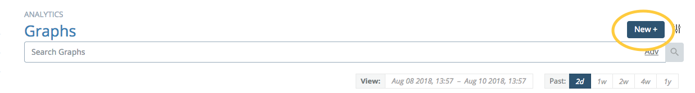
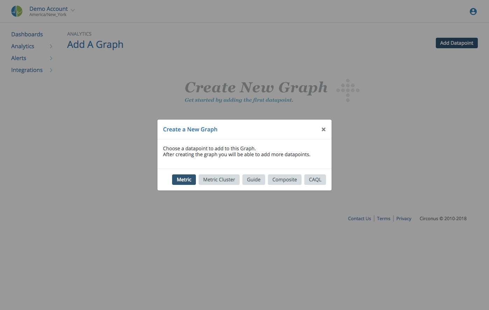
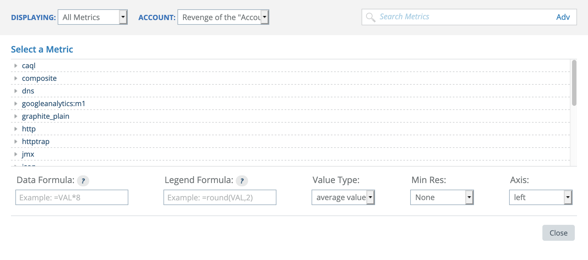
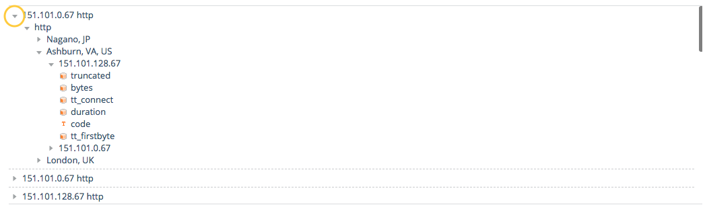
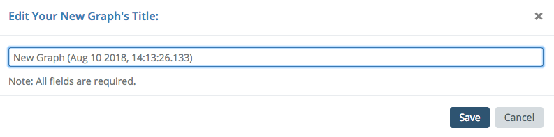
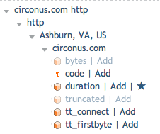
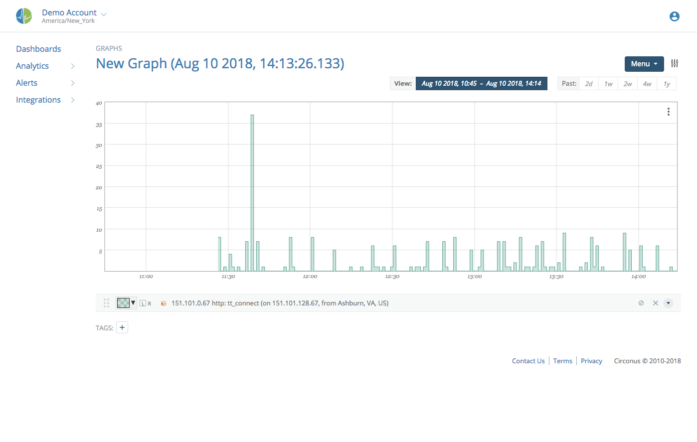
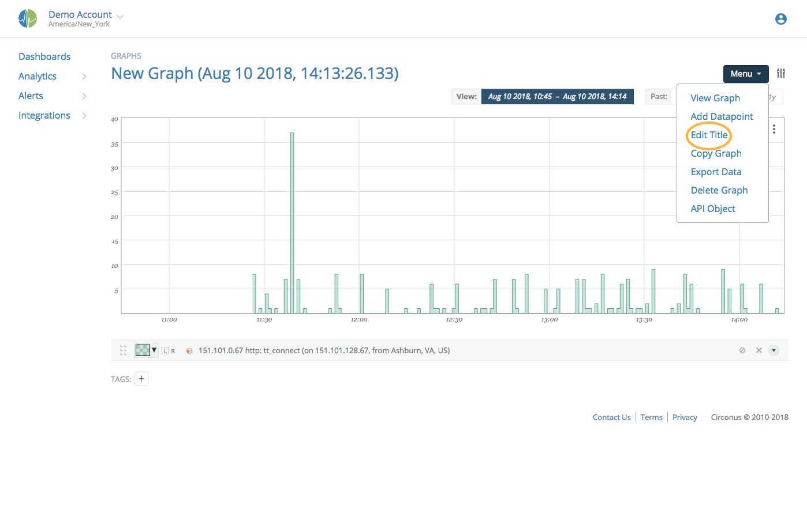
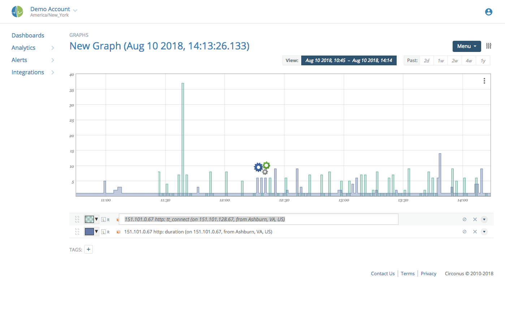
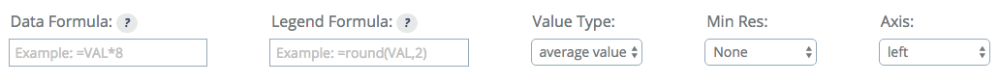

# Creating Graphs

Circonus graphs are created and managed under the "Analytics" section.

Clicking on the "New +" button will create a new graph.

## Finding Metrics

The first step of graph creation is to find and select a piece of data to visualize. As such, for new graphs, the data exploration tool is opened:

You can create a new graph by adding a datapoint for a Metric, [Metric Cluster](/circonus/metrics/metric-clusters/), Guide, Composite, or [CAQL Statement](/caql). This section will cover finding Metrics.

After clicking "Metric" in the Add Datapoint dialog, you can unfold the tree of metrics by clicking on the rightward facing triangles next to the check names.

If there is only one child in the tree, it will auto-expand to the next level for your convenience.

Clicking the name of the metric will add that metric to the current graph. The first datapoint added to a new graph will prompt you to choose a title for the new graph:

After setting the graph title, you will be returned to the edit screen where you can add more datapoints if you wish.

Once added, the metric will appear in the list with a star next to it:

Scrolling down will show the graph that you are currently constructing:

**Note:**

> To prevent accidental duplication, users are prevented from creating graphs with the same name as existing graphs.

If you wish to change the title of the graph after initial creation, open the Menu and choose "Edit Title".

## Renaming Datapoints

Once a datapoint is added, you can click on the name to edit how it is presented in the legend.

This does not rename anything about the datapoint or underlying data, just how it is presented in the legend.

## Advanced Adding

When adding numeric data to a graph, you can use the numeric settings at the bottom of the metrics tree panel to set properties on the datapoint you're adding.

The meaning of each of these options is discussed in the [numeric data section](/circonus/visualizations/graphs/numeric/). Using this feature can turn the "add then modify" steps into a single step for most common datapoint manipulation needs.
