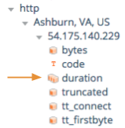
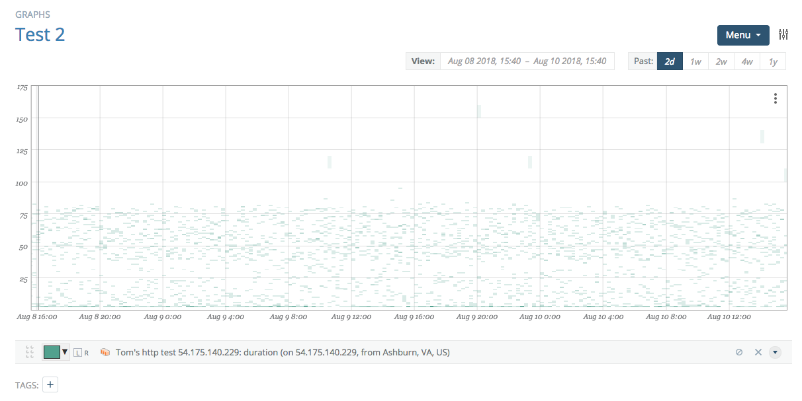
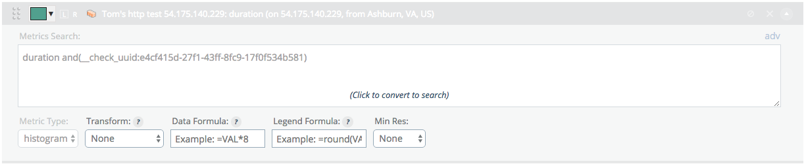

# Histogram Visualizations

In addition to simple numeric data, Circonus can ingest data and retain histograms.

Histograms in Circonus maintain two digits of precision in base 10.

## Enabling Histogram Collection

In order to visualize data in histogram form, you must enable histogram collection for the numeric metric in which you are interested.

Navigate to the appropriate check, and from the Menu at top right, choose the "[Change Brokers & Metrics](/circonus/checks/edit/#changing-metric-collection)" item. The stacked boxes (if available) allow you to enable collection of data in histogram form. Textual data cannot be collected in histogram form.

## Adding a Histogram to a Graph

In the metric tree, histograms are denoted by a multi-bar icon. Clicking "Add" will place a star on the metric and add it to the graph in a fashion similar to numeric data.

Once the histogram is added, the graph will appear just as it does with numeric graph creation.

The advanced section contains both formula and minimum resolution options identical to those for numeric data.

