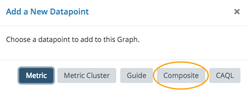

# Working with Numeric Data in Graphs

## General Numeric Options

### Graph Type: Area

An area graph provides a graph whose area "under" the curve is shaded slightly lighter than the color of the line representing the data. Note that you can set the opacity of the area using the color picker next to each data point in the edit legend. If you set the opacity to 0, the data point will be rendered as a simple line.

### Graph Type: Line

As a convenience, you can have all data points in the graph treated as lines by setting the graph type to "Line." If this option is set, any specific opacity for data points are ignored and all numeric data is rendered in line form.

### Line Style: Interpolated

Each data point in Circonus represents some time window. The value presented is some statistical aggregate (by default: the mean) of samples over that time period. If the line style is "interpolated," Circonus will draw a point at the beginning of each time window and directly connect the dots. Most people understand this type of graph more intuitively despite the values along the path of the line being for visual purposes only. (e.g. If we witness a value of 8 during one measurement and then a value of 10 during the next measurement, this style will draw a line from 8 to 10 passing through 9, despite 9 never being witnessed.)

### Line Style: Stepped

Alternatively, Circonus can be configured to draw a stepped line. When sampling 8 and then 10, as in the previous example, Circonus would draw a flat line value of 8 and then discretely step to a value of 10. This is more genuine to the underlying data, but can be confusing to some users.

### Axis

The minimum and maximum fixed values can be set for both Y1 (the left axis) and Y2 (the right axis). This is commonly useful if you always want the axis to start at zero, or if you are graphing something with a known maximum value and always want the same perspective. If min and max values are not set for the axes, the values are auto-calculated based on the data to be visualized and can change as new data arrives or leaves the viewing window.

By default, graphs are displayed using a linear vertical axis. Log-base axis representation is available be selecting the "Log" option and specifying a base (default 10).

## Data Manipulation

### Axis

Each numeric datapoint can be graphed relative to a Y1 (left) or Y2 (right) axis. Clicking on "L" and "R" will alter on which axis the datapoint is graphed.

### Value Manipulation

For numeric data, Circonus retains 6 types of numeric representations over visualized time windows. As you zoom in and out on a graph, the granularity of data (5 minute, 30 minute, 1 day, etc.) will change in order to present data that closely resembles the number of pixels horizontally present in the graph itself.

- **gauge**: This is the raw value of the metric (or the mean, if multiple values are available over the specified time window).
- **stddev (σ)**: This is the standard deviation of the raw values within the time window.
- **derive**: This is the rate of change (per second) of the data points. As each sample arrives, Circonus will calculate the difference in measurements divided by the elapsed time of measurements. If multiple such calculations are available in a given time window, the mean will be presented.
- **derive stddev (σ)**: This is the standard deviation of derive samples.
- **counter**: This calculation is just like the **derive** calculation, except that any negative rates are ignored. This is specifically useful for measurements that are always increasing, but that have a tendency to reset or "roll" (exceed the maximum bit representation of an underlying data type).
- **counter stddev (σ)**: This is the standard deviation of counter samples.

In addition to selecting the type of value you'd like to visualize, you can also apply rudimentary math to the data itself and the display of that data in the legend. Both reverse polish notation (RPN) and infix notation are supported in formulae.

The data formula will alter data before it is displayed. For example, if you are measuring the number of bytes (octets) sent out of a network interface card and would like to graph "bits/second", you would select "counter" as the 'Value Type' and enter `=VAL*8` in the 'Data' Formula to convert bytes to bits.

A common use for legend formula is to limit precision. `=round(VAL,2)` will limit the value shown to two digits past the decimal place.

### Controlling Resolution

By default (and by design), data is collected quickly in Circonus and at high frequency. This is critical to being able to see real-time trends and alert on emerging conditions. Sometimes, data simply isn't available in real-time. (e.g. A third party payment service may only update their available reports once per hour or once per day). Looking at data that updates in a latent fashion as if it were updated with high frequency can result in visualizations that are either useless or misleading.

By setting the minimum resolution, you instruct the visualization system to never display data in windows smaller than the selection. If you have data that is only updated daily, looking at 5 minute samples has little benefit. If you a using derive or counter, the graphs will represent rapid change over a tiny amount of time which will appear as enormous spikes. By setting the minimum resolution to '1 day', you will only ever see daily averages of these values which will better reconcile with the underlying service being monitored.

### Stacking

At times, it makes sense to stack one datapoint atop another. A simple example of this is measurements that all add up to a fixed value. To explain numeric stacking, we'll use CPU utilization as an example. We have a JSON(nad) check that is reporting total timer-ticks used in each of four CPU states (idle, kernel, user, and wait). There are a fixed number of time-ticks per second.

Adding each of these values in 'counter' form to a graph produces this result:

We can see the portion of time spent in each state. However, as they are not stacked, the visualization is not intuitive at all.

Open the advanced section and click '+ New Set' in 'Stack Sets', then select the newly added 'set 0'. Open each of the other three data points' advanced sections and select 'set 0'. The graph will now have each of the data points stacked together in a single set.

Graphs can have multiple stack sets for stacking different sets of data together.

### Graphing Composite Numerics

There are times when the element to visualize is actually a manipulation of several other data points. A simple example is showing free disk space when you are only collecting total disk size and used disk space (i.e. you need to graph the difference).

As an example, we will attempt to graph the total time between the first byte received of an HTTP document retrieval and the time to receive the complete document. This would be the "duration" minus the "tt_firstbyte" (or time-to-first-byte).

Adding these two metrics to the graph will result in their presence in the legend.

In the Menu at the top right of the graph is an 'Add Datapoint' item. Select the 'Composite' datapoint type.

This adds a datapoint to the legend named 'Composite 1' with an equation editor available under 'advanced'. Once the 'Data' field has focus, previous numeric datapoints in the graph will be assigned a letter for use in your equation. Here we wish to subtract tt_firstbyte (B) from duration (A).

We update the formula to reflect our desired equation and change the name of the data point from 'Composite 1' to 'payload time' (using click-to-edit on the 'Composite 1' name).

This completes the configuration of the composite, but we no longer wish to see the original data points in the graph. By clicking on the disable (crossed-circle) icon next to each data point in the legend, they will be visually removed from the graph (yet remain available for the composite). Completely removing them will result in the composite no longer working.

Once you've clicked on the disable icon, the icon will change to a check mark, providing a path to add the metrics back into the visualization if you desire.
