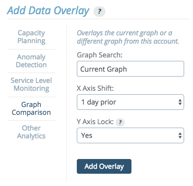
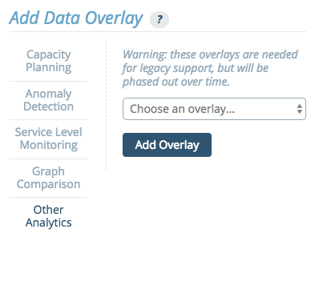

# Overlays

Graph overlays allow you to view data related to a graph atop the graph itself. One of the questions constantly faced by data analysts is "what did this look like last week?" When answering that question in most tools, the approach is to rewind the time window by 7 days and "take a guess" or draw both graphs (current view and current view minus seven days) side-by-side. Graph overlays allow you to view both graphs in the same viewport and directly compare the data visually and numerically via the legend.

## Adding Graph Overlays


Graph overlays are accessed in the standalone graph view of every graph via the plus button above the upper right corner of the graph viewport.


Adding an overlay requires selecting the type of overlay and completing any selection requirements. Here, we'll select a 'Comparison' type and add a time overlay with a '1 week prior' offset.


Once an overlay has been added to a graph, tabs (A, B, C, etc.) will appear directly above the viewport indicating each of the overlays added. If you do not like the ordering, you can drag-and-drop the tabs to reorder them.

## Removing Graph Overlays

There is an 'x' on the right side of every overlay tab (except the reference graph itself). Clicking this 'x' removes the tab.

## Reading Graph Overlays

The legend has titles that include both the date (useful for understanding time comparisons) and the tab letter indicator (A, B, C, etc.). This helps keep the frame of reference so we know which column is which.

As you hover, the legend auto-updates with the current values with an additional indicator describing the variance between the two graphs for each corresponding data point. An icon pointing up or down indicates if the value is above or below the reference value. A percentage difference is available below the icon. Additionally, the intensity of the arrow will change (becoming darker or lighter) as the difference increases or decreases.

The graphs are overlaid from left to right (B "on top of" A and so on). This means that the right-most tab will be the clearest graph and each subsequent graph "underneath" it will be faded. This can lead to difficulty determining which graph is which. To help pull graph data to the front, you can hover over a tab and it will intensify only that graph overlay.


## Saving Graph Overlay Sets

Once a graph overlay set (one or many) have been configured, you can save the configuration for quick recall.


Click on the menu button next to the plus button to manage your overlay sets. Name the overlay and click save.


Later, upon returning to the graph, you can click the same menu button and your named overlay will be available for view (or removal).

**Note**:

> Overlay sets modify the URL in a way that can be bookmarked in your browser. This makes it possible to use traditional browser bookmarks to jump directly to graphs of interest with the overlay sets already in place.

## Analytic Overlays

Up to four overlays at a time may be added to any graph. For planning and prediction overlays, use the "." (period) and "," (comma) keys to widen the date range being viewed and project the graph data into the future.

### Capacity Planning

Capacity planning has a number of possible applications, and is commonly used for forecasting. Capacity planning uses time series forecasting to predict future values of your data.


There are four models that can be used for forecasting different types of data:

- **Automatic** - This option automatically selects one of the other models as the best fit. This is the recommended default option.
- **Exponential** - This model forecasts exponential growth.
- **Linear** - This model forecasts linear growth using a [linear regression](https://en.wikipedia.org/wiki/Simple_linear_regression).
- **Periodic** - This model forecasts values using a seasonal predictive model with Holt-Winters exponential smoothing. The data can then be modeled in either weekly or daily periods.

This graph shows an example output for an exponential regression.


#### Capacity Planning Tooltip

When hovering over a Capacity Planning Overlay tab at the top of a graph, a set of values appears in a tooltip in the upper right corner of the graph.


This tooltip displays the following parameters:

**R**^2^ **value** - This measures the "[goodness](http://www.graphpad.com/guides/prism/6/curve-fitting/index.htm?r2_ameasureofgoodness_of_fitoflinearregression.htm)" of fit. A value close to 1 means that the values fit the model well.

**alpha, beta** - These are the model parameters.

The linear model uses this formula:

```
m(t) = alpha + beta * t
```

"t" is the [epoch time](https://www.wikiwand.com/en/Unix_time) in seconds.

The exponential model uses this formula:

```
m(t) = exp( alpha + beta * t )
```

Again, "t" is the epoch time in seconds.

**sigma** - This value is the standard deviation of the model, or the expected deviation of a sample from the model. If sigma = 0, then the model fits perfectly.

The precise definition of [sigma](http://mathworld.wolfram.com/LeastSquaresFitting.html) uses the following formula:

```
sigma = \sqrt{ 1/(n-2) \sum (m(t_i) - y_i)^2 }
```

(t_i, y_i) are the original datapoints.

**method** - The method will be identified as either "lin", meaning linear regression, or "exp", meaning exponential regression.

**annual growth (for linear regression) / cagr** - This is the compound annual growth rate.

The annual growth of a linear regression model uses the formula:

```
m(t + 1y) - m(t)
```

The annual growth rate of a exponential regression model uses the formula:

```
m(t + 1y) / m(t) in percent
```

### Anomaly Detection

The anomaly detection overlay identifies time regions, where the data experiences “unusual” behavior. For each point in time an anomaly score between 0-100% is computed, when the score reaches 100 an anomaly is detected. The user can choose to mark the anomaly regions with a solid rectangle overlay, or output the anomaly score directly.


The anomaly detection method builds a time series model and compares the incoming data to the model forecast. The Anomaly Detection Overlay can be added to time series graphs. A histogram version is development. When setting up anomaly detection, you will select a sensitivity level, a model and a display type.

#### Sensitivity

Sensitivity is a measure of how much variation from the forecast is allowed before an event is considered anomalous. The incoming data is compared to the model forecast and the difference (i.e. the residual) is evaluated. When it is "large" over "an extended time period," an anomaly is reported.

This parameter allows the user to influence the sensitivity of this evaluation. A value of 0% means no anomalies are reported whatsoever, while 100% is sensitive to any slight deviations from the forecast.

#### Forecasting Model

The model drop down menu allows the user to specify which model shall be used to forecast the data. The available options are:

- **Automatic** - This is an inference of the best model based on historic data. Therefore, this is the default model.

- **Constant** - This model assumes that the data is essentially constant and therefore large changes are considered anomalies. It uses exponential smoothing of historic data to generate a forecast.

- **Linear** - This model assumes that the data has a linear trend (e.g. disk space). Therefore, changes in slope are considered anomalies, as are large deviations from linear behavior. This model uses double exponential smoothing to generate a forecast.

- **Periodic Daily** - This model assumes that the data is varying in daily periods. No trends are assumed. It uses a Holt-Winters (without trends) to generate a forecast. This model needs a large amount of training data (at least 3 days) to give reliable predictions. It also costs the most resources in terms of memory and CPU and is therefore the slowest model.

- **Periodic Weekly** - This model assumes that the data is varying in weekly periods. It is otherwise similar to the Periodic Daily model.

#### Display

There are two ways that the reporting of anomalies can be performed:

- **Anomaly Score** - The score is a numeric overlay and is displayed as values from 0 to 100. A value of 0 means that the selected method considers the data point at that time completely normal.
- **Anomalous Region** - (Default) The anomaly regions are precisely the times where the anomaly score is equal to 100. This options will display only the anomaly regions as an overlay.

This graph shows an example output for the anomalous regions in a constant model.


This graph shows HTTP page load durations that are normally constant at ~0.7s (700 ms), but experience significant deviations at certain regions. Those regions are identified and marked by the Anomaly Detection method.

#### Anomaly Detection Troubleshooting

The following are common issues with Anomaly Detection:

1.  The Anomaly Detection overlay is slow.

If the speed becomes problematic, try using it on smaller intervals. It was designed for looking at 1-4 weeks.

2.  Anomaly Detection displays inconsistent results, or the anomaly disappears when zooming in/out.

Although it should not happen frequently, this can occur because anomalies are calculated relative to the data that you are viewing. When you are viewing different data, different parts of the data will be identified as anomalies. We try to minimize inconsistencies by prefetching data aligned at the start of each month.

3.  Anomaly Detection is failing to detect an anomaly.

If this occurs, first consider if the model being used is the appropriate model for this graph. Then, try adding an anomaly score overlay. If statistics start building up, try raising the sensitivity.

4.  Anomaly Detection is producing too many false positives.

If this occurs, first consider if the model being used is the appropriate model for this graph. Then try lowering the sensitivity.

### Service Level Monitoring

The Service Level Monitoring tab includes options to calculate percentiles or inverse percentiles for data across selected time windows. Among other things, these percentile overlays are useful for detecting service level violations for a variety of SLA types.

There are four options:

- Percentiles
- Inverse Percentile
- Percentile Aggregation
- Histogram Aggregation

#### Percentiles


This options allows users to specify percentile values and generates an overlay highlighting the data points that fall within those values.

Percentiles can be calculated across a window of variable size. The window size can be set to cover all data in the viewed time range, or to a fixed window length.

If "windows of length" is selected, use the following units to specify window duration:

- `s` for seconds
- `M` for minutes
- `h` for hours
- `d` for days

Multiple durations, separated by whitespace can be provided.
For example, "3d 5M" equals 3 days and 5 minutes or 259500 seconds.

**Note:**

> Percentile windows start based on UTC time. When selecting Percentile time windows with length measured in days, it is important to keep time zone differences in mind and adjust accordingly. See [Timezone Parameter](#timezone-parameter) below.

This graph shows an example output for the a percentile overlay on a histogram.


This histogram shows API response times, measured from inside the service in 1 minute resolution. The overlay in this example shows the 99th percentile in order to check an SLA: "99% of all queries issued within an hour/day should be serviced within 200ms."

#### Timezone Parameter

The "Windows offset" field appears when the "windows of length" option is selected from the "Windows:" dropdown. This field allows you to shift the window start time calculations, which are normally based off of UTC. The default is the offset of the current account timezone.

Note that the Windows offset must be a positive time duration, and cannot be expressed as a negative. For example, if the desired timezone offset is -6 hours, you would instead enter "18h" (since 24 - 6 = 18).

#### Inverse Percentiles


This options allows users to specify threshold values, calculate the ratios of samples that are below a given threshold value, and generates an overlay highlighting the percentile values that correspond to those values.

#### Percentile Aggregation


This option aggregates data using percentiles. The drop down menu provides preset options:

- **min and max** - A min-max Percentile Aggregation shows the maximal (and minimal) values that occur within the aggregated time interval.
- **box plot aggregation** - The box-plot aggregation shows the information contained in box plots as an overlay, the min, the max, and 3 percentiles: 25%, 50% (the median), and 75%. Box plots are available for histograms as well.
- **custom** - Custom aggregation allows users to set the values themselves, listing any values from 0 to 100, separated by commas.

This graph shows an example output for the a box plot overlay.


This example shows a 3-month view of database query latency graph with box-plot percentiles added. The 25% and 50% percentiles show typical variations of the the graph and the min and max values show the full range of variation.

#### Histogram Aggregation

This option creates an overlay to display data as a histogram metric.

### Graph Comparison

This option allows creating an overlay of the current graph or a different graph from this account.



#### Historical Graph Comparison

When comparing the current graph with itself, the x axis can be shifted to show a prior time frame and the Y axis can optionally be locked to the main graph’s Y axis.

This allows historical graph comparison, comparing the current graph to historic values.

For example, by shifting the x axis to "1 week prior", then whatever the main graph view's start and end dates, the overlayed graph will be viewing start minus one week to end minus one week. The drop down menu includes presets to shift the x axis, by 1 day, week, month, or year. If none of these preset values meets the needs of the graph, a "custom time period" option is available.

#### Multi-graph Comparison

Overlaying one graph atop another is a straightforward concept and exercise.

The option is available to lock the Y axis of the overlay graph to the Y axis of the main graph. This is not normally desirable when comparing different graphs. Comparing values from different graphs is a less common use-case than comparing trends. The Y-axis from graph A and graph B are not the same.

This graph shows an example output for the a multi-graph comparison.


This sample graph shows the web request rate graph compared to the request rates graphs of the DB cluster. This comparison is useful in this example because we can observe that during Oct 1-10 there were a large number of web requests that did not cause DB requests, and therefore we might want to check the web-server logs to see which pages were requested instead.

### Other Analytics

**Warning:**

> When the "Experimental Analytics" feature flag is active, overlays which are not supported may appear on this tab.

The "Other Analytics" section provides a drop down menu of transforms which provide functionality needed by other parts of the system or needed for legacy support. These have been or will be replaced by more powerful methods, and are not recommended for use.

Depending on which feature flags are active, additional transforms may appear in this drop down menu, which are either experimental or in beta testing. Any such options appearing on the "Other Analytics" tab are not supported. By default, only the legacy analytics will be visible.



The following transforms are currently available through this menu.

#### Automatic Prediction

The automatic predictive model corresponds to Planning > Automatic Regression graph overlays.

This transform predicts the modeled value at X seconds in the future, based on Y seconds of past data.

#### Exponential Prediction

The exponential predictive model corresponds to Planning > Exponential Regression graph overlays.

This transform allows for forecasting using regression on an exponential model. It predicts the modeled value at X seconds in the future, based on Y seconds of recent past data.

#### Histogram Mode Detection (mvalue)

This transform calculates the mvalue of a histogram, which describes the histogram's modality.

#### Holt-Winters

The seasonal predictive algorithm based on Holt-Winters corresponds to Predictive > Additive / Multiplicative graph overlays.

This transform allows for forecasting using Holt Winters exponential smoothing. It predicts future values, using based one of several models, using X weeks of past data.

#### Linear Prediction

The linear predictive model corresponds to Planning > Linear Regression graph overlays.

This transforms allows for forecasting using linear regression. It predicts the modeled value at X seconds in the future, based on Y seconds of past data.

#### Numeric Quantile

This transform calculates the desired quantile with a configurable amount of data granularity.

#### Sliding Window

This transform calculates the sliding-window average over the last X seconds, shifted into the past Y seconds.
