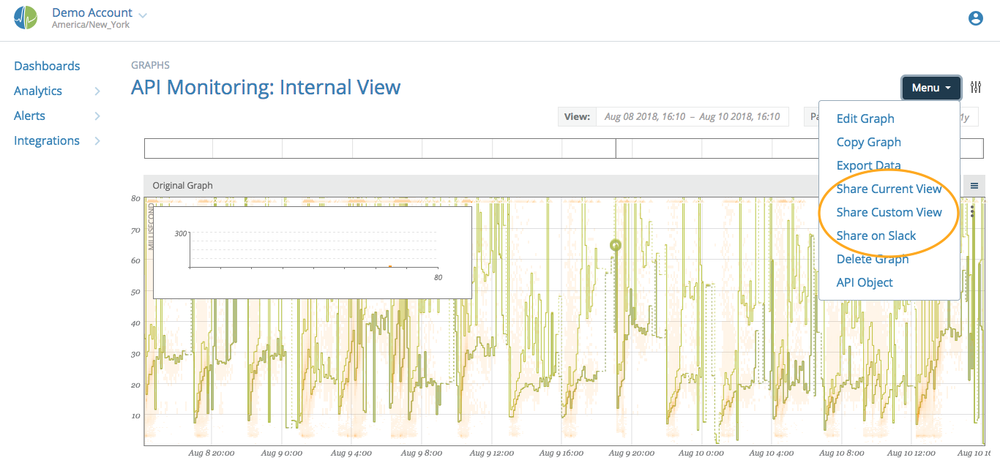
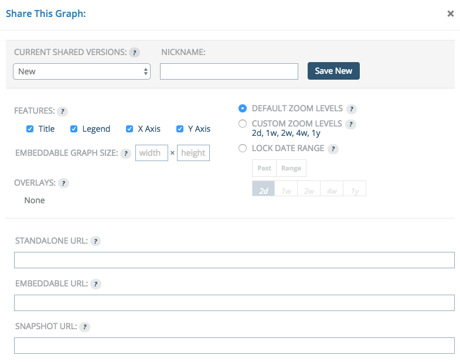
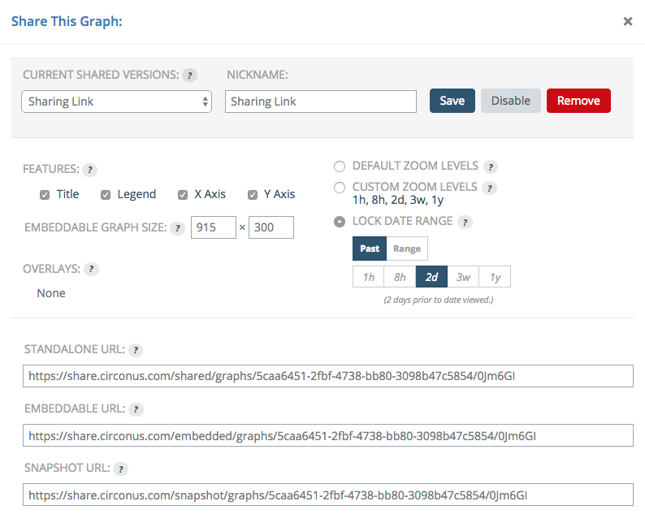

# Sharing Graphs

Graphs can be very useful to a plethora of users, and not only those that have accounts with Circonus. If you need to share data with a business unit that doesn't normally have access, or perhaps a vendor to whom you want to point out a problem, Circonus allows you to share graphs via an external link that requires no authentication.

## Sharing Graphs

To share a graph, first go to the "view" page for that graph and click on the "Menu" button.

This opens a dialog with various options for how you want your shared version to look and act. You can also manage other, existing shares from this dialog.

The "Current Shared Versions:" option lets you select previously configured shares, or you can create a new one by providing a nickname.

The "Features:" options let you turn on and off various features of the graph. You can choose to hide the title, the legend or either axis.

Locking the date range allows you to only share a portion of your data. Leaving this off will allow users to select any date or timeframe of data to view. Locking the date only gives them access to what you would like them to see. The "Past" option lets you give them a sliding window of data, going from now into the past. The "Range" option lets you specify an exact date / time range.

Once you select your options and click "Save New", you will see that the standalone and embeddable URL fields are populated. From here and when editing any share, you can disable or remove the shared link to prevent users from accessing it further.

The standalone URL is useful to hand out to users who just want to view one graph every now and then. The embeddable URL works great with internal status pages or other sites that your users might go to and want a graph on.
