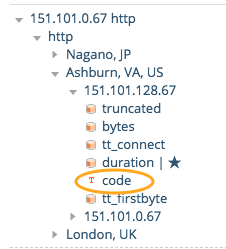
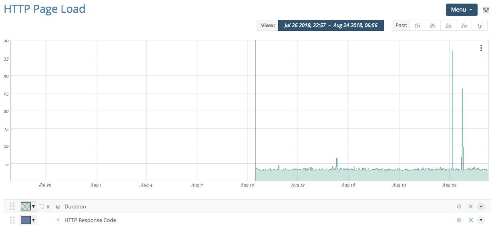

# Using Textual Data in Graphs

The metric tree indicates text metrics with a small "T" icon next to the metric name. Selecting a text metric will add it to the current graph.

Once selected, if there are any changes in value in the current display window, these changes will appear within the graph viewport as solid, full-height vertical lines.

The above image changed as a result of the check coming into existence (transitioning from having no value to having a value). The actual value of the text metric is not visible while editing a graph, only while in view mode.

Depending on your personal settings, the text metrics in a viewed graph will either show up as they do here (as a vertical bar) or as an integrated part of the timeline. More information is available in the [Viewing Graphs](/circonus/visualizations/graphs/view/) section.
