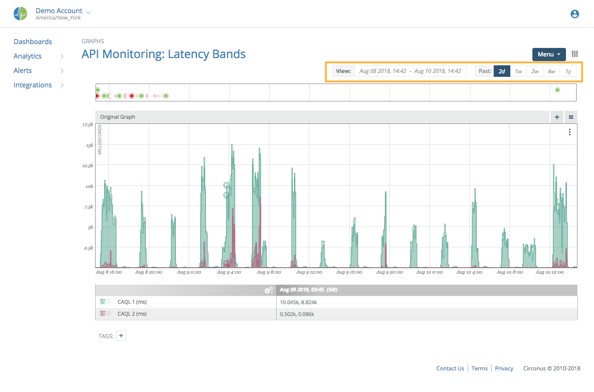
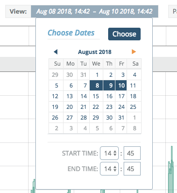
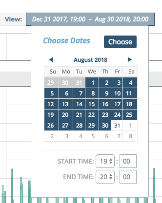
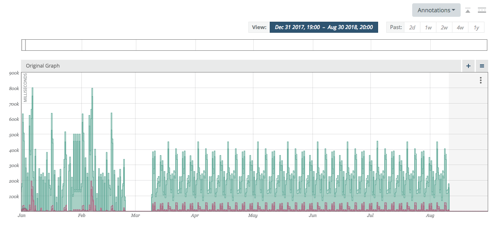
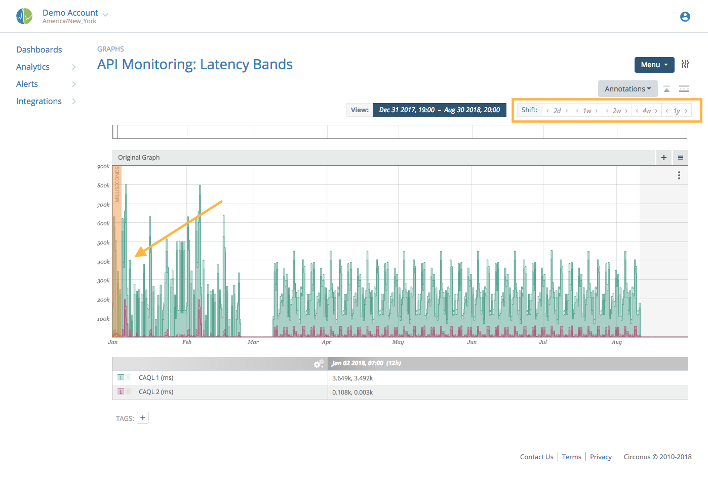
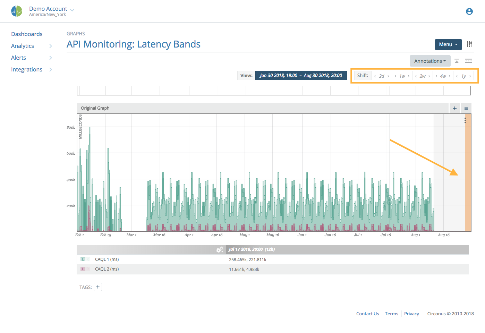
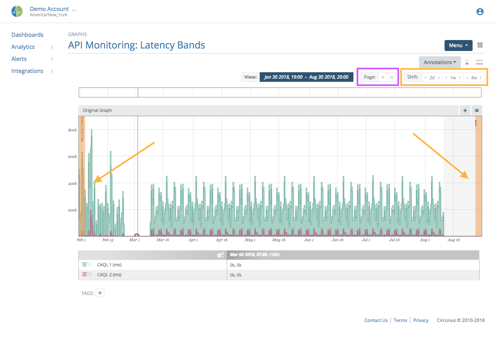

# Time Navigation

Each graph (and worksheet) has time navigation options that allow selecting either a specific date range or a window of recent history pivoting on the current time (last 2 weeks, last 2 hours, etc.)

Highlighted in the orange box above, the left side has a date range selector and the right side has quick time window buttons.

As you alter the time window of interest on a graph, this window becomes "sticky." While navigating to other graphs and other worksheets, this same window will be used until it is explicitly changed to a new range or quick time window.

## Date Range

Clicking on the currently displayed date range next to 'View:' will open a calendar to allow range selection, defaulting to the currently viewed range.

Select the start date by clicking on the calendar (Dec 31 in the example below), then navigate to the desired end date and click again (Aug 30 in the example).

Once you have clicked on the end of the date range, the calendar will highlight the region. Close the calendar and realign the viewport to the desired date range.

**Note**:

> The start date begins at midnight (beginning of the start date) and the end date is aligned to the last time period available in that date (the end of the end date). So in the above example we see all of Aug 30th included in the final view.

## Quick Time Window

By clicking on the '2d', '1w', or other time frame buttons, the graph will deselect the date range and align the graph viewport to display the current time minus the selected time interval through to the current time.

The default quick time windows can be changed to suit your personal preferences in the [Profile Preferences](/circonus/administration/user-profile#preferences) section.

| abbreviation | meaning |
| ------------ | ------- |
| h            | hours   |
| d            | days    |
| w            | weeks   |
| m            | months  |
| y            | years   |

## Advanced

There are special keyboard shortcuts for dealing with graph viewports.

### Comma (Hot-Key)

Holding down the ',' (comma) key while on a graph view page will highlight the left gutter of the viewport with an orange band and change the **Past:** quick time window buttons to **Shift:** buttons. Now, instead of clicking on '2w' to set the viewport to the last two weeks, you can click on the left and right arrows adjacent to the '2w' to move the left side of the graph backward or forward in time by 2 weeks.

The orange indicator denotes which side of the graph (start point or end point) will be moved when you click the **Shift:** buttons.

### Period (Hot-Key)

Holding down the '.' (period) key while on a graph view page will highlight the right gutter of the viewport with an orange band and change the **Past:** quick time window buttons to **Shift:** buttons. This feature works identically to the comma hot-key, but operates on the end point of the graph.

### Dual Period/Comma (Hot-Key)

In the special case where both the ',' (comma) and '.' (period) keys are depressed while on the graph view page, both gutters will be highlighted and both the start and end of the time window being viewed will be shifted forward or backwards when operating the **Shift:** buttons. For your convenience, **Page:** buttons are added which will move the window backwards or forwards in time at an interval identical to the current viewport's interval. (e.g. If you are viewing 8 hours of data, it will move backward or forward by 8 hours.) This emulates a pagination effect both forward and backward through pages of visualization of equal length.
