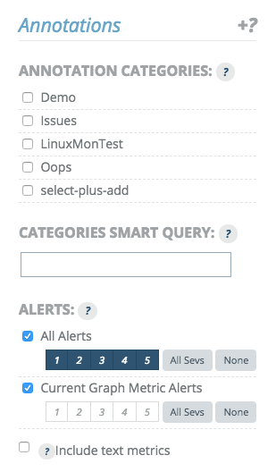

# Viewing Graphs

From the main "Analytics:Graphs" page, graphs are available in two views:

1.  worksheets
2.  standalone graphs

The main "Graphs" section acts as a paginated worksheet containing all available graphs.

## Graphs Overview

When you hover over a graph with your cursor close to a datapoint, that datapoint is highlighted. This brings that datapoint to the front, while the others fade to the back. You can also click the graph to lock that state into place. You can tell it's in a locked hover state by the lock icon in the upper right corner of the graph. Click the graph again to unlock. For graphs with many datapoints, this will help you zero in on the specific datapoint(s) you want to focus on.

Notice the the hairline grey vertical indicator showing the current time. It exists in every graph on the worksheet and will move in unison across all graphs.

We see two values appear in the legend for this graph. The blue 'p_0_3_um_b' has a value at the time indicated in the title of the legend table. Left of the metric name, we can see "L" is selected, which indicates that it is numeric data associated with the left axis (despite there being no axis labels in the worksheet view).

The second metric is also on the left axis.

## Viewing a Graph

From each graph in the worksheet view, you can directly click to 'edit' or 'view'. Clicking 'view' will take you to a full-screen, stand-alone view of the graph where all advanced viewing options are available to you.

### Annotations

Annotations are singular events, representing a point in time or a period of time where some condition existed, such as an outage. They may be displayed by clicking the Tuner icon next to the Menu button, then clicking the downward-pointing arrow next to the "Annotations" menu. The choice to display Annotations is "sticky", such that you can move to viewing other graphs and the Annotations timeline will remain visible.

When shown, between the date selection tools and the graph viewport, there is a box containing annotation timelines. Annotations can be a variety of time-based data including business events, alerts, and text data.

For more information on Annotations, refer to the section, [Annotations: Managing Events](/circonus/visualizations/graphs/annotations/)

#### Disabling Annotations

Clicking the upward-pointing arrow next to the 'Annotations' drop-down will cause the annotations window to disappear. Click again to reenable the annotations window.

#### Annotations Compression

By default, annotations are displayed in a compressed format. This means that different types of annotations are displayed using different colors and compressed vertically to consume as little space as possible. Hovering over them will show details, including the annotation type. Clicking on the double down arrows will switch between compressed view mode and full view mode.

When full view mode is enabled, each annotation category and type will split into a separate section for better understanding.

#### Annotation Hovering for More Information

Hovering over a text metric will show its current value. In the above example, we show the version of code launched. Hovering on the line leading to that point on the left will show the previous value. Hovering on the line leading from that point on the right will show the same value as on the point itself.

Hovering over an event will show details for the annotation for that event as well as highlight clearly on the graph viewport the window of the event itself.

#### Controlling Annotations

The Annotations drop down above the upper right corner of the graph viewport can be used to modify what annotations are currently displayed in the annotations window.

Individual annotation categories can be enabled or disabled.

'Alerts' covers all global alerts and can be included and filtered by alert level. The 'Current Graph Metric Alerts' limits alerts to those whose rules are evaluated against metrics that are currently being displayed in the graph itself.

Lastly, text metrics that were explicitly included in the graph view can be pulled out of the graph viewport (the vertical line inside the graph viewport) and put into the annotation timeline instead.

#### Adding Annotations

You can add annotated events from the graph view by either clicking and dragging with the **right** mouse button or holding down the 'Alt' key while left-clicking and dragging in the annotations viewport (highlighted by an orange rectangle below).

Once the time frame has been selected, an annotation entry box will open and the annotation can be created.

You can name the annotation, provide an optional description, select an existing category or create a new one, as well as adjust the start and end dates to be more precise.
