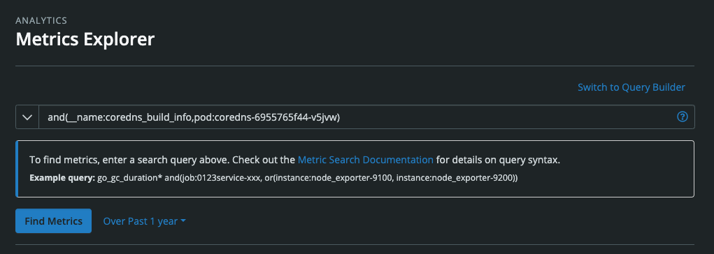

# Metrics Explorer

The Metrics Explorer provides an easy way to find and view your metrics within Circonus. To access the Metrics Explorer, navigate to Analytics in the main menu and then click Metrics Explorer.

## Query Builder

The default view for Metrics Explorer features an intuitive query builder. To build a query condition, simply enter three parts:

- **A metric attribute** (available attributes include broker, check bundle UUID, check name, check type, check UUID, metric name, and tag target)
- **An attribute value**, which autocompletes. Just focusing on the field results in a dropdown populated with suggestions; entering characters then refines the suggestions.
- **Criteria conjoining the attribute and attribute value**, i.e. “is”, “is not”, “contains”, etc. Criteria options will depend on the metric attribute you select.

To add more conditions to a search, simply click “Add condition”. A given search can be configured to fulfill all of the conditions or any of them by selecting “all” or “any” from the dropdown above the conditions.

## Advanced Search

If you prefer to enter a query using our [search syntax](/circonus/appendix/search/), click the “Switch to Advanced Search” link in the upper right. Clicking the arrow to the left of the field will enlarge the field, making it easier to enter longer expressions.

Conveniently, once a query has been created within the default query builder mode, switching to advanced mode will translate it into search syntax. Likewise, once search syntax has been entered, switching to query builder mode will translate it into a series of conditions. This feature is very helpful if you’re looking to learn or debug search syntax.

## Search Time Frame

To select the time frame for your search results, click the link to the right of the “Find Metrics” button. Here, you’ll find preset time frames such as past 2 days, past 1 week, etc. as well as the ability to select a custom date and time window.

The time frame you select will control which metrics are shown. For example, if you select “Past 2 weeks,” then only metrics which have recorded data in the last two weeks will be shown. Any older metrics which stopped recording data before the last two weeks will not be shown.

## Search Results

Once a query has been executed, a listing of the search results will appear below. For each listing, you’ll see the following information:

- **The metric name**
- **The tags** associated with the metric (For metrics with a number of tags exceeding the available space, you can click the tags icon to view the full listing.)
- **The metric type**, i.e., numeric, histogram, text
- **The check** used to retrieve the metric
- **The host** from which the metric was collected
- **The broker** used to retrieve the metric
- **A sparkline** depicting a simplified graph of the metric over the selected time frame. Sparklines can be useful for seeing trends and spikes at a glance.
- **A “View” button** to visit the page dedicated to the metric. This page features details related to the metric as well as a full-size graph depicting the metric for the selected time frame.
- **A button dropdown** with links to view metric’s check, set rules for the metric, view a quick full-size graph for the metric for the selected time frame, and view an uptime report for the metric.

Displayed to the top left of the search results will be the number of results as well as a dropdown to configure sorting the results by metric, check, or host.

Clicking the number of search results invokes a modal that summarizes the search results. Here, each attribute can be expanded to reveal the breakdown of values for the results. Deselecting values will refine the results. These refinements will also be reflected in new conditions appended to the existing search query.

