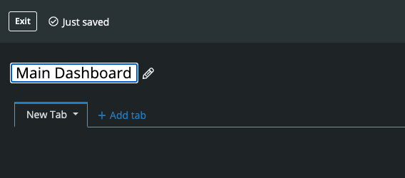
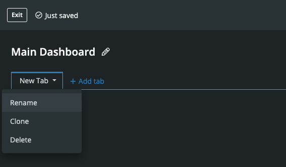
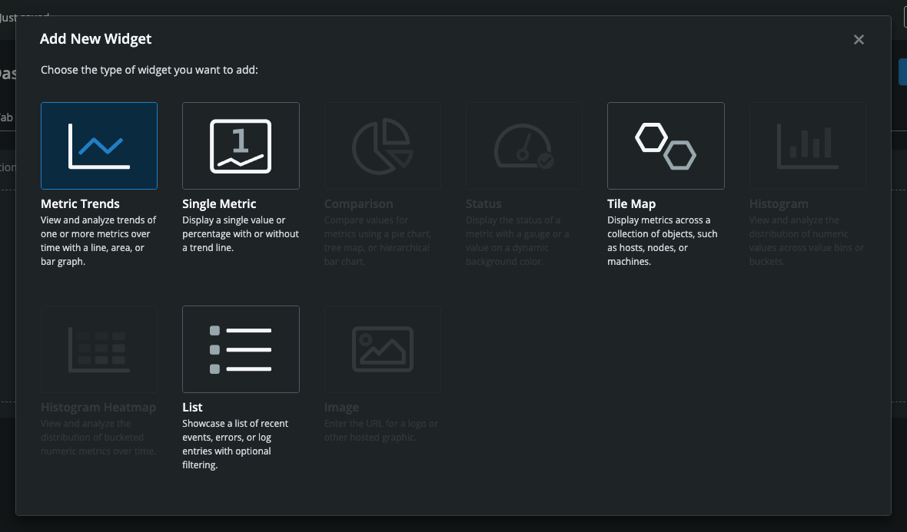
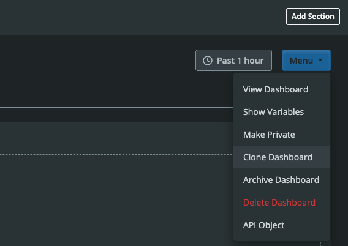

# Dashboard Builder

The Circonus Dashboard Builder lets you easily create and share customized dashboards with your team.

_Please note that Circonus users with “read-only” status will only be able to view custom dashboards. They will not be able to create, edit, or manage them._

## Create a Custom Dashboard

To start creating a dashboard with the builder, first navigate to “Dashboards” within the main navigation. Then, click the “Create” button in the upper right.

## Edit a Custom Dashboard

Directly after creating a custom dashboard, you will be within the Dashboard Builder.

The Dashboard Builder provides an immersive experience, meaning standard navigation within Circonus will be hidden. To exit the Dashboard Builder, simply click the "Exit" button in the top left.

Changes made within the builder are automatically saved as they occur. You'll occasionally see text saying "Just saved" to the right of the "Exit" button. You can safely exit at any point and your work will be saved.

Once you exit the builder, you can return to it at any later time. Just click the “Menu” button in the top right and select “Edit Dashboard” while you’re viewing it. You can also return to the builder from the dashboards overview page by locating the dashboard you’d like to edit, clicking the arrow to the right of its “View” button, and selecting “Edit Dashboard.”

### Edit a Custom Dashboard’s Name

Once within the builder, you can rename your dashboard by clicking on the dashboard name. Type your new dashboard name. Then hit the “Enter” key or click elsewhere on the page when finished.

### Manage a Custom Dashboard’s Tabs

You may also want to create your desired dashboard tabs. Click “+ Add Tab” to add another tab.

Click the arrow to the right of the tab name to rename, clone, or delete it. You can also grab a tab on the left hand side to drag and drop it within another location within the tabs.

### Manage a Custom Dashboard’s Sections

Next, you can begin populating a given tab by clicking the “Add Section” button in the upper right. Choose from a variety of section layouts, including one to six equal width columns or layouts with a right or left sidebar.

Once added, sections can be cloned or deleted using the icons in the upper right corner of the section. Sections can also be rearranged by grabbing them on the top and dragging and dropping them higher or lower on the page.

### Manage a Custom Dashboard’s Widgets

To add a widget to a section, click on each “widgetable area” or cell. From the “Add New Widget” modal that appears, you can select from various types of visualizations. Currently, these include metric trends, single metric, tilemap, and list. Other widget types, such as comparison, status, histogram, histogram heatmap, and image, will be added in the future.

Once you select a visualization type, you’ll then see a modal where you can edit the widget. Here, you can select the metrics to depict and also configure various options related to that widget.

To assist in metric selection, the modal provides a query builder identical to that of our [Metrics Explorer](/circonus/analytics/metrics-explorer/). Metrics can also be added using our advanced [search syntax](/circonus/appendix/search/) or the [Circonus Analytics Query Language (CAQL)](/caql/).

Below the query, the transform option lets you apply “average”, “counter”, or “derive” to the returned series. You can also specify units for the query and save the query for use across multiple widgets.

Once a metric query has been assigned to a widget, you can specify a data formula, which is used to transform the base data before it’s used, as well as a display formula, which is used to format the data values when they’re displayed for human readability. A label and data operation (e.g., mean, sum, mean by tag, sum by tag) can also be specified (the label is used to label the data streams if a data operation hasn’t been selected). Other widget options rely on the category of widget selected.

It should be noted that since queries can return vast amounts of data, the number of series that can be returned by a given query are capped, as are the number of series that can be aggregated. If you happen to reach either threshold, a note will be displayed so that you can better refine your metric selection. There is also a limit on the number of data points displayed by a given series. Should this limit be exceeded, the data period will be increased until the number of data points fall within the accepted range.

Once inserted, widgets can be edited and deleted using the icons in the top right corner of the widget. Widgets can also be dragged and dropped to other empty widgetable areas within the same tab.

### Manage Dashboard Variables

With variables, you can use dropdowns at the top of your dashboard to easily change values throughout visualizations across all your tabs. To begin adding variables to your dashboard while editing it, click the “Menu” button in the upper right and select “Show Variables.”

Variables will appear between the dashboard name and dashboard tabs. Next, click “Add Variable.”

In the modal that appears, you can select source metrics by using our query builder (“Add Search Query”) or by entering a [CAQL](/caql/) query. As you refine your query, sample values for it will appear to the left. These sample values will be the dropdown values.

You can also configure various options for your variable, such as its name and label. The variable name is what you will use during widget configuration. For instance, if you set your variable name to “host”, you would insert `$host` into your widget’s search or CAQL queries. If the variable name is used within a widget search query, you can also insert it into that query's label field for more precise labeling of the data stream.

Variable names can also be used within the queries of other variables. In the following example, three variables are interdependent. For instance, the values the user selects for the Container Image variable (`$image`) and Container ID variable (`$id`) affect the values available for the Container Status variable (`$status`) .

The next option to configure is the variable label. The label will prefix the variable dropdown at the top of the dashboard.

By default, the source for your query values will be metric or stream names. However, you can change this source to be tag values or for non-CAQL queries, check names, check tag values, or check brokers. If you select tag values or check tag values, you’ll then be able to specify the tag in the adjacent “Tag” field. For easy selection, clicking on the dropdown arrow for the “Tag” field will reveal a prepopulated list of all tag categories currently available in the variable’s metric streams.

The last option you can configure will be whether multiple values can be selected for the variable at once.

Once satisfied with your query and options, click outside the modal or click the modal’s “Close” button to hide it and add your variable.

You can edit or delete your variable using the icons to the right of it. To change the variable’s value, simply click the variable’s label and make a selection from the dropdown.

## Make a Custom Dashboard Available to Your Account

By default, custom dashboards created with the builder are private and only accessible to you. Once created, you can make your dashboard accessible to all team members within your account. While viewing or editing the dashboard, click the “Menu” button in the top right, then select “Make Available to Account.”

You can also adjust permissions from the dashboards overview page. Simply locate the dashboard and click the arrow to the right of its “View” button. Then select “Make Available to Account.”

## Make a Custom Dashboard Private

Once accessible to everyone in your account, custom dashboards can be made private again. While viewing or editing the dashboard, click the “Menu” button in the top right. Then select “Make Private.”

Or, from the dashboards overview page, locate the dashboard and click the arrow to the right of its “View” button. Then select “Make Private.”

## Clone a Custom Dashboard

To create a copy of a custom dashboard while viewing or editing it, click the “Menu” button in the top right. Then select “Clone Dashboard.” You can also clone a dashboard from the dashboards overview page. Simply locate the dashboard you’d like to clone and click the arrow to the right of its “View” button. Then select “Clone Dashboard.”

Once you choose to clone a dashboard, a modal will appear where you can give it a unique name. Cloning a dashboard will copy all of its tabs, sections, widgets, and options.

## Delete a Custom Dashboard

To delete a custom dashboard while viewing or editing it, click the “Menu” button in the top right. Then select “Delete Dashboard.” You can also delete a dashboard from the dashboards overview page by locating the dashboard you’d like to delete and clicking the arrow to the right of its “View” button. Then select “Delete Dashboard.”

Once you choose to delete a dashboard, a modal will appear asking you to confirm your decision. Here, you can either cancel or proceed with the deletion.

Please note that deleted dashboards cannot be recovered. If you think you may need to recover a dashboard later on, consider archiving it instead.

## Archive a Custom Dashboard

To archive a custom dashboard while viewing or editing it, click the “Menu” button in the top right. Then select “Archive Dashboard.”

You can also archive a dashboard from the dashboards overview page. Just identify the dashboard you’d like to archive and click the arrow to the right of its “View” button. Then select “Archive Dashboard.”

Once archived, dashboards will not appear by default on the dashboards overview page. However, in the future, filtering will enable you to view and recover these dashboards.

## Access a Custom Dashboard’s API Object

To access a dashboard’s API object for use in custom dashboard automation while viewing or editing it, click the “Menu” button in the top right and select “API Object.” You can also access the dashboard’s API object from the dashboards overview page. First locate the desired dashboard, then click the arrow to the right of its “View” button and select “API Object.”

Once “API Object” is clicked, a modal will appear with the code you can copy and paste.

## Change the Time Window for a Custom Dashboard

While viewing or editing a custom dashboard, visualizations will, by default, display metrics over the past hour. This time window can be adjusted by clicking the “Past 1 hour” button in the top right and selecting another preset or custom time window. Custom windows can be set to any desired days and times.

Please note that time window selections do not persist. If the dashboard is loaded again, it will default to “Past 1 hour.”

## View a Custom Dashboard “Full Window”

While viewing a custom dashboard, you can view it “Full Window”, by clicking the “expand” icon in between the time window button and menu button in the top right.

This will hide the top and left Circonus navigation, and let the dashboard fill the browser window. To return to the standard view and once again have access to the navigation, simply click the “collapse” icon in the very same location.

## Set Variables While Viewing Your Custom Dashboard

If a custom dashboard has variables, you will see an area at the top of the dashboard with the variable labels. Simply click the variable label to select the desired values. The variable will then be updated throughout the visualizations across all your tabs.

