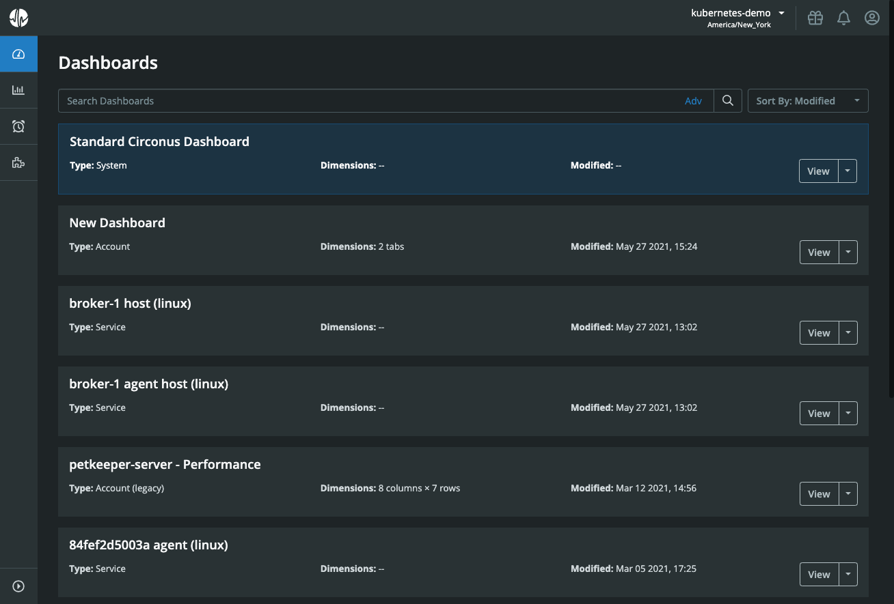
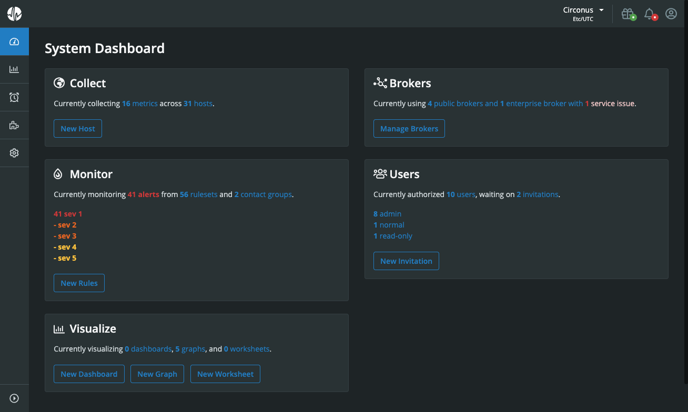
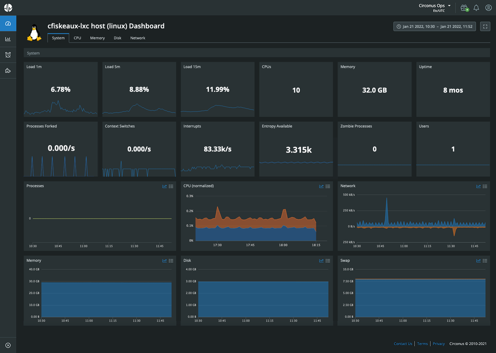

# Dashboards

To manage your dashboards, navigate to “Dashboards” within the main navigation. Here, you’ll see a listing of available dashboards.

Dashboards can be sorted by title (alphabetically), by type (alphabetically), or by the date they were last modified. You can also search dashboards by entering an expression using our [search syntax](/circonus/appendix/search/). Clicking “Adv” to the right of the search field will reveal a modal where you can enter a phrase corresponding to the dashboard title you’re trying to find.

## Dashboard Types

There are four main categories of dashboards within Circonus: system, service, custom, and legacy custom. New Circonus users will initially only see the system dashboard and various service dashboards.

### System Dashboard

There is a single system dashboard known as the “Standard Circonus Dashboard.” This dashboard enumerates various usage data from your account such as the number of metrics, hosts, alerts, dashboards, brokers, and users.

This is the only dashboard universally available to all accounts regardless of which integrations are installed. The “Standard Circonus Dashboard” cannot be cloned, edited, archived, or deleted; nor can it be made private — it will appear for all users within an account.

For most Circonus users, the system dashboard will be the default dashboard seen upon login as well as when clicking the Circonus icon in the upper left. As the default dashboard, it will also be located at the top of the dashboards list and accented in blue.

### Service Dashboards

Service dashboards are automatically created upon installation of an integration. Below is an example service dashboard for Linux which is created when the Circonus Unified Agent is installed on the Linux platform:

Circonus currently provides system dashboards for the following integrations:

- Apache
- Circonus Unified Agent (Self-Monitoring)
- Docker
- FreeBSD
- GCP Cloud VPN
- GCP Cloud Storage
- GCP Cloud APIs
- GCP Cloud Router
- GCP Cloud Armor
- GCP Network Topology
- GCP Logging
- GCP Load Balancing
- GCP Firewall Insights
- GCP BigQuery
- GCP Compute Engine
- Kubernetes
- Linux
- Memcached
- MySQL
- NGINX
- OSX
- PostgreSQL
- RabbitMQ
- Windows
- ZFS

From the dashboards overview page, you can choose to view the associated check for a service dashboard by clicking the arrow to the right of its “View” button and selecting "View Check." Service dashboards cannot be cloned, edited, archived, or deleted; nor can they be made private — they will appear for all users within an account.

### Custom Dashboards

Custom dashboards are those created with our intuitive [dashboard builder](/circonus/dashboards/dashboard-builder/). With the builder, you can create dashboards with tabs, sections, widgets, and variables completely of your choosing.

From the dashboards overview page, custom dashboards can be managed by clicking the arrow to the right of their “View” button. From the dropdown, you can choose to edit, clone, archive, or delete custom dashboards. By default, custom dashboards are “Private,” or only visible to the user who created them. However, you can make them available to all team members within your account by selecting “Make Available to Account” from the dropdown. Conversely, if they are available to all users in your account, you can make them private by selecting “Make Private” from the dropdown. The last option within the dropdown is “API Object.” Selecting this option reveals the API object for that dashboard which can be copied and pasted for use in custom dashboard automation.

To create a new custom dashboard, click the “Create” button in the upper right of the dashboards overview page.

### Legacy Custom Dashboards

[Legacy custom dashboards](/circonus/dashboards/legacy-custom-dashboards/) are those created with our legacy dashboard builder.

From the dashboards overview page, legacy custom dashboards can be managed by clicking the arrow to the right of their “View” button. From the dropdown, you can choose to clone or delete legacy custom dashboards. (To edit a legacy custom dashboard, simply click the “View” button itself. All editing options are available while viewing them.)

Unless you checked the "Private" checkbox while creating your legacy custom dashboard, it will be accessible to all users within your account. If you made the dashboard private, it will only be available to you. Private dashboards can be unrestricted later to make them accessible to all team members within your account, but once unrestricted they cannot be made private again.

Unlike service dashboards or new custom dashboards, legacy custom dashboards can be set as your default dashboard in place of the system dashboard. Just select “Make default” from the dropdown. As with newer custom dashboards, the last option with the dropdown is to access the dashboard’s “API Object” for use in custom dashboard automation.

You can create a new legacy custom dashboard by clicking the arrow to the right of the “Create” button in the upper right and selecting “Create Legacy Dashboard.”
