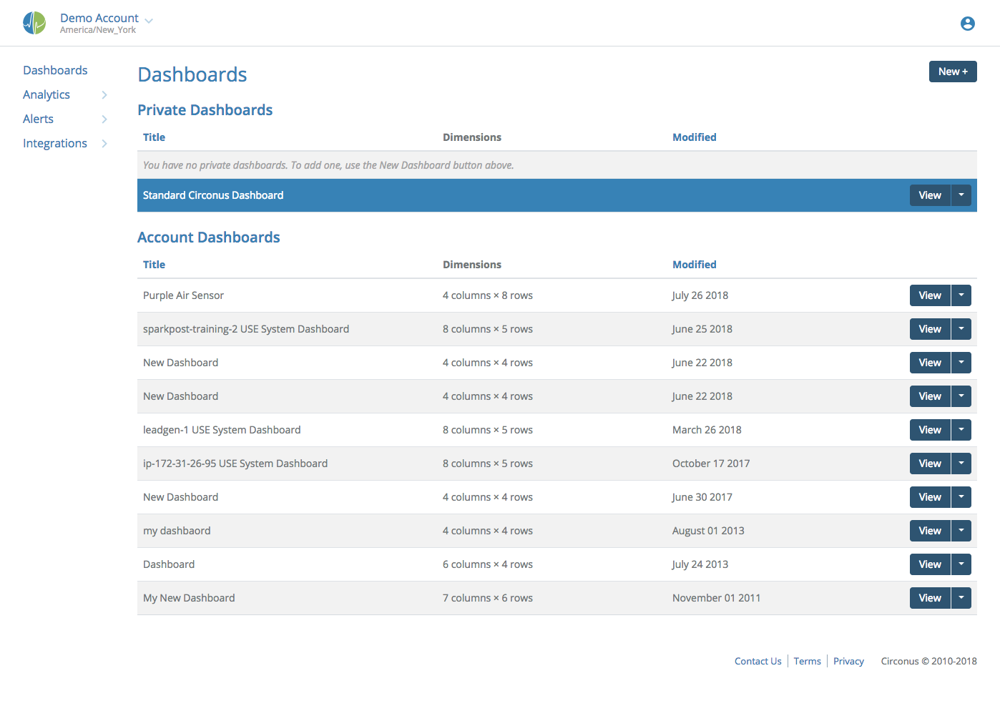
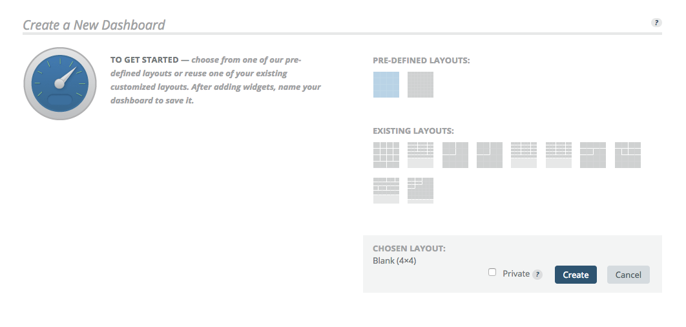
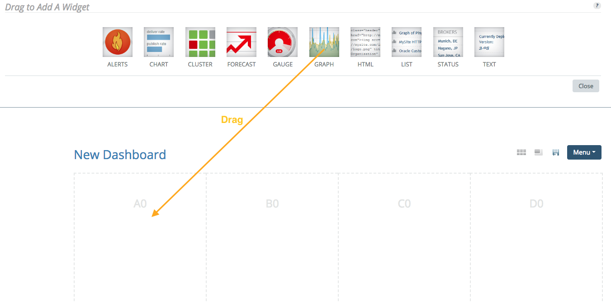
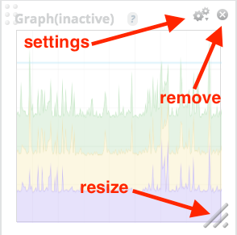

# Creating a Dashboard

Navigate to Dashboards in the main menu. From here you can see the list of dashboards you created and any dashboards that have been shared by others. To create a new dashboard, click the "New +" button.

You will be presented with a panel with various options for beginning your dashboard. You can choose between predefined layouts, such as the 4x4 or 8x8 blank grid, or if you have created other dashboards already, you can select a previous layout. Choose whichever you like and click "Create". (Note that this choice can be altered later, see [Dashboard Options](/circonus/dashboards/legacy-custom-dashboards/options#DashboardOptions).)

For this example, we will assume you started with a blank 4x4 layout. On the edit page that opens, a panel of widgets will drop down. Each widget has different uses and options from which to choose. They can be added to the dashboard by drag and drop, or by clicking an empty cell and then clicking the widget.

Each widget can be resized by clicking and dragging the lower right corner and they can be moved to new positions by dragging. There is an X in the upper right to remove them from the dashboard, or a set of gears to configure what data they will show. Each widget type has different configuration options.

