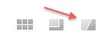
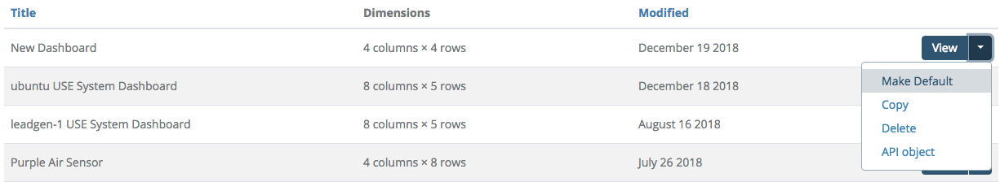

# Dashboard Options

When viewing a dashboard, you have access to a few options that let you change the display or view it in fullscreen mode.

Clicking the options icon will open a dialog that lets you change the size of your dashboard, hide the grid, scale the text size as the grid grows and shrinks, and auto hide the title when you go to fullscreen mode.

Clicking fullscreen mode instantly changes the dashboard from one contained in the normal Circonus layout to one that is fullscreen, ready to be used in conjunction with your browser's presentation mode. While in fullscreen, there is another option that appears to let you toggle a full black background (and inverts some colors) to make display on a TV or large screen easier on the eyes.

## Setting a Dashboard as Your Default

If you want to replace the standard Circonus dashboard you see when going to the Dashboard page, you can do so from your list of dashboards by selecting "Make Default" from the menu at the right end of the list item. If you want to go back to the default, simply select the standard Circonus dashboard again from this list.

