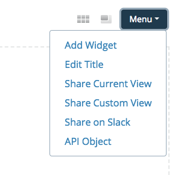
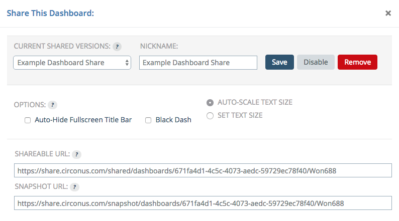
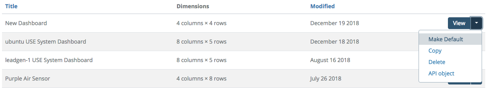

# Sharing a Dashboard

Dashboards may be shared publicly in the same way as [sharing graphs](/circonus/analytics/graphs/sharing). From the Menu at top right, you can immediately share the current dashboard view or choose a custom view.

Users viewing a shared dashboard have read-only access to it.

## Setting a Dashboard as Your Default

If you want to replace the standard Circonus dashboard you see when going to the Dashboard page, you can do so from your list of dashboards by selecting "Make Default" from the menu at the right end of the list item. If you want to go back to the default, simply select the standard Circonus dashboard again from this list.

