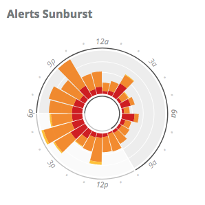
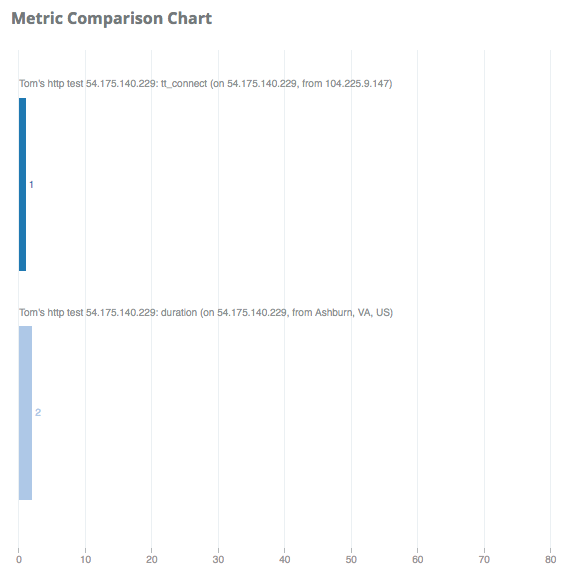
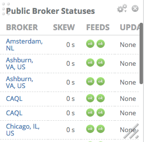
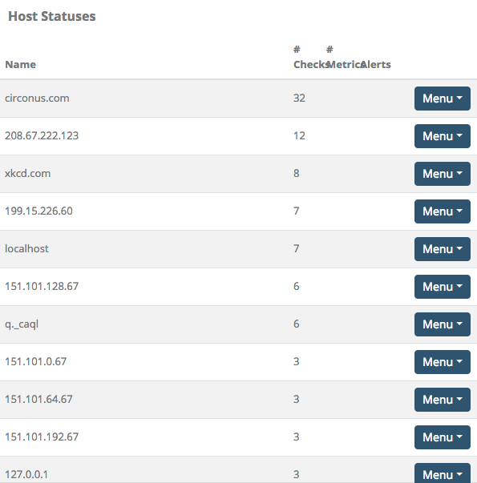

# Widgets

## Alerts

The alerts widget gives you a way to show recent alerts on your account. The options here all let you decide which alerts you want to see.

First, you can set a descriptive title for this widget. If you choose not to set a title, the filter criteria will appear as the title.

### Alerts: Display Mode

Next is Display Mode. The default is List Mode, which shows alerts in rows with columns similar to the [Active Alerts page](/circonus/alerting/alerts/#ReviewingAlerts).

There are two summary display modes as well, which provide a visual representation of alerts over time. Each one shows counts of alerts, color-coded by severity. Red represents Sev 1, orange represents Sev 2 or 3, and yellow represents Sev 4 or 5. The time period displayed is 24 hours, and each alert that is matched by the Age Range and Filter By criteria (see below) is accounted to the hour of the day in which it occurred.

Bar Chart displays time on the horizontal axis, and plots vertical bars for each hour of the day. Each bar is comprised of a stack of alert severities, providing a wealth of information about when alerts have happened during the day, and at what severity. Hovering your pointer over a color block will reveal a count of alerts and the total outage time of those alerts.

Sunburst Chart is like the Bar Chart, but wrapped into a circle. It displays the same information in a more compact format.

### Alerts: Summary Options

Summary Options appear when using either Bar Chart or Sunburst Chart summary views.

_Off Hours_ is a range of hours that will be visually different in the chart, useful to denote times when an office is not staffed, for example.

_Days_ is a list of days on which alerts happened that should be included in the view. Alerts that happen on unselected days will not be shown.

### Alerts: Age Range

Age Range enables you to select how far in the past you want to see. The default is to show alerts from the past 30 minutes.

_Newer than_ sets the maximum age of an alert to match. Alerts older than this time will be excluded.

_Older than_ sets the minimum age of an alert to match. Alerts newer than this time will be excluded.

For example, to view alerts from the past 2 weeks but not from the past hour, you would set:

- Newer than: 14 days
- Older than: 1 hour

### Alerts: Filter By

These options provide additional criteria to filter out alerts you might not want to see.

The following criteria are available:

- Severity level: Display alerts at the selected severities. The default is to show all severities.
- Acknowledged: Display alerts that are acknowledged or unacknowledged. The default is all.
- In maintenance: Display alerts from metrics that were in a maintenance period or not. The default is all.
- Cleared state: Display alerts that have cleared or are still active. The default is all.
- Has dependents: Display alerts that do or do not have dependent alerts. The default is all.
- Search: Use [Search](/circonus/appendix/search/#default-search-field-and-available-terms) syntax as you would on the Alerts page to match alerts. A bare term or glob pattern matches the check target.
- Contact Groups: Display alerts that sent notifications to one or more selected contact groups. The default is to show all alerts, regardless of contact group. To add a contact group, click "Choose Groups" and start typing the name of a contact group. Matching names will appear, then select the one you want and click "Choose Contact Group". Repeat the process for any additional groups. Click the "Choose Groups" button again when finished.

## Chart

This is the first widget that allows multiple metrics. You can select any number of numeric metrics and this widget renders them as a chart.

First, click the "Choose Metrics" button to open a new dialog where you can search for the check and metric you want to add. You can also change the label for the metric here.

Instead of manually selecting metrics one at a time, you can also add all of the metrics from a graph or a metric cluster by clicking "Use a Graph" or "Use a Cluster", respectively. Any numeric or histogram metrics on a graph or in a cluster will be selected for the chart.

Once you have added all the metrics you want, you can select whether you want the raw (gauge) value or a derivative. You can also change the visualization from a bar to a pie chart.

Auto-format values will scale the raw values to a whole number, so a value like .510 would become 510m. Turn this off if you want the raw number.

Give the chart a title and then save.

## Gauge

Gauges are like dials on your car. They let you select a single metric, give it a range of "good" values, and then will move as the value changes.

First select a metric via the "Choose A Metric" button. This will open a dialog to let you search for a check and then select a metric that check collects.

Value type lets you change between a raw value or a derivative.

Gauge type changes the visualization from a bar gauge (think thermometer) or dial.

Data range is where you enter the good range. If the value falls out of this range we will give you an arrow showing which end it fell off and turn the background of the value red to let you know it is crossing your boundary. Note that this does not impact alerting.

Thresholds allow you to set warning and critical levels within your "good" range. In our example, assume a value of 100. At 75, we will turn the gauge yellow to let you know it crossed into the next threshold, and at 87.5, we will turn it red to let you know it is nearing the max. These can be reversed via the reverse colors checkbox if the metric is one that is worse the smaller it gets.

## Graph

Select the graph name you want to show, then choose for how far in the past you want to see the data. This is a sliding window that updates automatically every 5 minutes.

The Show legend option can be enabled to activate a legend upon hover.

## HTML

HTML widgets let you embed custom HTML into the dashboard. This can be an iframe to another site, a custom widget you made internally, etc. The options are simple, give the widget a name and enter the HTML you want.

## List

List lets you pull in various lists that Circonus has. Currently, this is limited to recent graphs and recent worksheets.

You can provide a search term to refine the items in the list, and a limit to only show the first X number of items

## Status

The status widget gives you a view of the status of your brokers and hosts.

First, select which status you want to see in the content drop down. We will start with brokers.

Select the types of brokers of which you want the status: public, enterprise, or both. Then choose what data you want on the widget.

Time skew lets you know if your broker's time is out of sync.

Feed status will show you the status of the storage and fault detection feeds to the Circonus NOC.

Contact group will show you who will get alerted should this broker disconnect from Circonus.

Setup status gives you the progress through the initial setup.

Host status lets you select the layout style.

List gives you a table displaying hostname, number of checks, number of metrics used on that host, alerts and links to other pages to look at checks, metrics, rules, or alerts. The alerts show the number of rules on the host. Green indicates a rule which is not currently alerting. Yellow indicates a sev 5 alert, orange is a sev 4, 3, or 2 alert, and red is a sev 1 alert.

Grid gives you the same data, but in a grid form. The host is the title of each container and the background goes from green to red as alerts occur on the host. Inside the container, you have the number of checks, metrics, and alerts.

Compact takes the grid view and collapses it to just the host name and status. Hovering over the host will expand it to give you the details shown in the grid view.

## Text

Text widgets simply show you the current value of the metric. As you might guess, they are very useful for showing text metrics like the current deployed code revision or the version of an app.

Click "Choose Manually" and you will get a dialog similar to that of the chart. Select the metrics you want show on your widget and click "Choose Metric" to close the dialog.

Value type can be changed from gauge (raw value) to a derivative or a counter if you are displaying numeric values.

The content allows you to format the display of your metric however you like, using some HTML and macros. The macros all end in `_X` where the X is the order in which you selected the metrics starting at 0. These macros are:

- `{metric_name_X}` gets replaced with the metric name
- `{metric_value_X}` is the value
- `{value_type_X}` is gauge, derive, or counter, depending on what you selected in the drop down.
- `{value_date_X}` is when the value was collected

