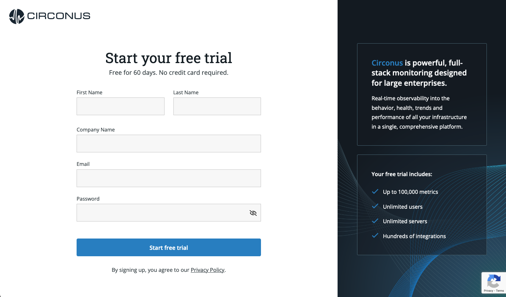

# Account Creation

If you have not already created an account, please navigate to [https://www.circonus.com/free-trial/](https://www.circonus.com/free-trial/) and create an account to get started with a 60-day free trial.

You will then receive a confirmation email to confirm your email which will direct you to your new Circonus account.

After confirming your email address, an automated guide will walk you through setting up your first Circonus Unified Agent (CUA) for host monitoring, cloud monitoring, or container monitoring.

You will choose where you would like to start gathering [metrics](/circonus/getting-started/glossary/#metric) from and the self-guided setup will show you how to deploy CUA. For the purposes of this guide, we will be setting up CUA on MacOS.

Once you get CUA installed and metrics are successfully being received by Circonus, you will be able to continue to your new account. Here, you will land on your default system dashboard which features a checklist to help you get up and running.

[**Next:** Circonus Unified Agent](/circonus/getting-started/circonus-unified-agent/ "Next Step")
