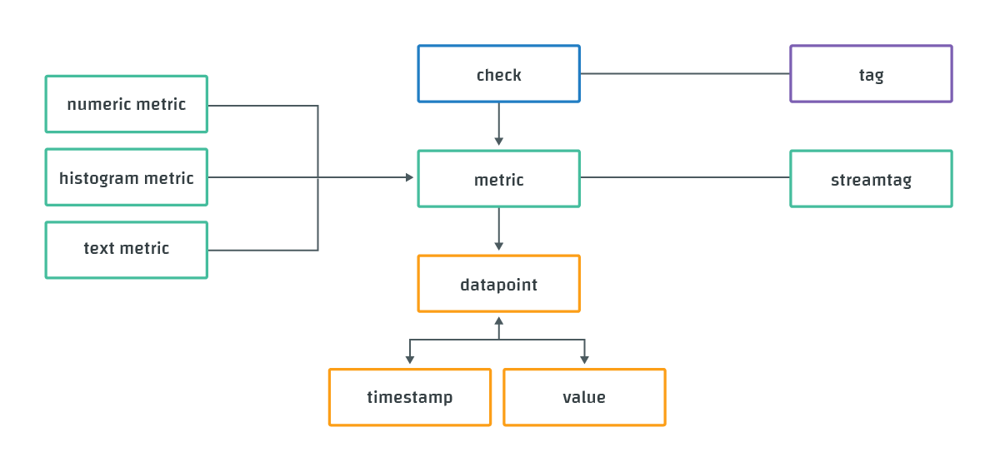

# Data Model

Circonus organizes data in terms of metrics and checks.

A metric is a stream of data points the monitoring system collects over time. A data point consists of a timestamp and a value, and is typically created when a system property is measured. Circonus supports three types of metrics: numeric metrics, histogram metrics, and text metrics, which carry values of the respective type.

A check consists of a group of metrics typically dedicated to assessing a single service. Examples:

- [HTTP checks](https://docs.circonus.com/circonus/integrations/library/http/) assess the availability of a website and contain metrics 'duration', 'code', etc.
- [Agent checks](https://docs.circonus.com/circonus/integrations/agents/) collect telemetry data from a host and have metrics 'cpu'idle', 'vm'memory'free', etc.

A complete list of checks can be found on the [supported integrations library](https://docs.circonus.com/circonus/integrations/library/) page.

A check is always executed on a broker and directed towards a host (see below).

A metric always belongs to a single check. Within a check, a metric is uniquely identified by its name. Two different metrics in different checks can have the same name. This is in contrast to other monitoring tools that use a global namespace for all metrics.

To assist with data organization, Circonus allows the association of tags with checks, and metrics may be submitted with stream tags. Tags and stream tags provide a powerful mechanism to structure a large number of checks and metrics within a Circonus account. (There are also other entities within Circonus that can be tagged, such as graphs, rule-sets, etc.) Tags are represented as key-value pairs, for example, 'os:linux' or 'dc:ec2-us1'. Tags can be added and removed freely after an entity was created, but stream tags must be submitted as part of the metric name and thus cannot change after the metric is initially submitted. Read more about tags on the [Tags page](https://docs.circonus.com/circonus/getting-started/tags/).

Numeric and histogram metrics can be optionally qualified by a unit, but this functionality is deprecated and will be removed in the future. Please use an appropriate stream tag to denote the units of a metric.

The following diagram summarizes the concepts introduced in this section, with their relationships:

## Data Types

### Numeric

Numeric data is as simple as it sounds: a number.

Typical numeric metrics include the number of visitors to a website, the volume of payments processed, or the temperature outside.

When Circonus stores numeric data, it aggregates collected data into one-minute windows. Within these windows, we track the following:

- **count** - the total number of samples
- **average/gauge** - the average of the samples
- **stddev** - the standard deviation across the samples
- **derive** - the first order derivative over the samples
- **derive_stddev** - the standard deviation over the "derive" samples
- **counter** - the first order derivative ignoring decreases in sample value
- **counter_stddev** - the standard deviation over the "counter" samples

The "counter" type is used to determine the rate of change of telemetry data you know is monotonically increasing, but due to technical details can "reset" to a lower value (often zero). If you know that a rate can never legitimately be negative (such as bandwidth or arrivals/second or transactions/second), then the "counter" aggregate is the interesting aggregate of the bunch.

### Histogram

Histograms are designed for understanding high-velocity data. A histogram type stores the counts of samples in one-minute time chunks (or "bins"). Statistical information can be calculated from the histogram with errors introduced from the binning.

Histogram data will store all samples reduced to two significant digits in base ten, in a range from (+/-)10^127 to (+/-)10^-128 and zero. For more details see [Understanding Histograms](https://www.circonus.com/2012/09/understanding-data-with-histograms/).

### Text

Text data in Circonus is a brief, terse measurement that is designed to express a system's current state. The values are limited to 512 bytes of data. The typical uses for the text data type are SSH fingerprints, SSL certificate subjects, software version numbers, and HTTP response codes.

[**Next:** Account Creation](/circonus/getting-started/account-creation/ "Next Step")
