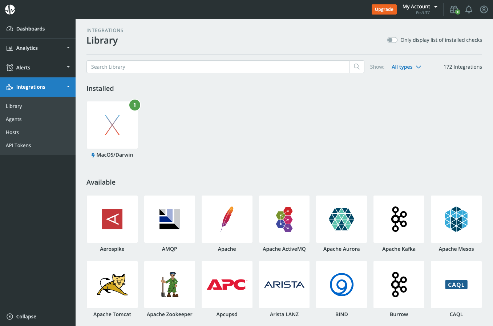
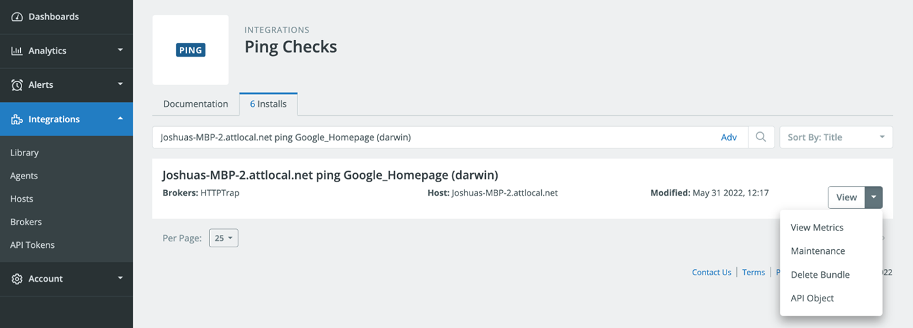
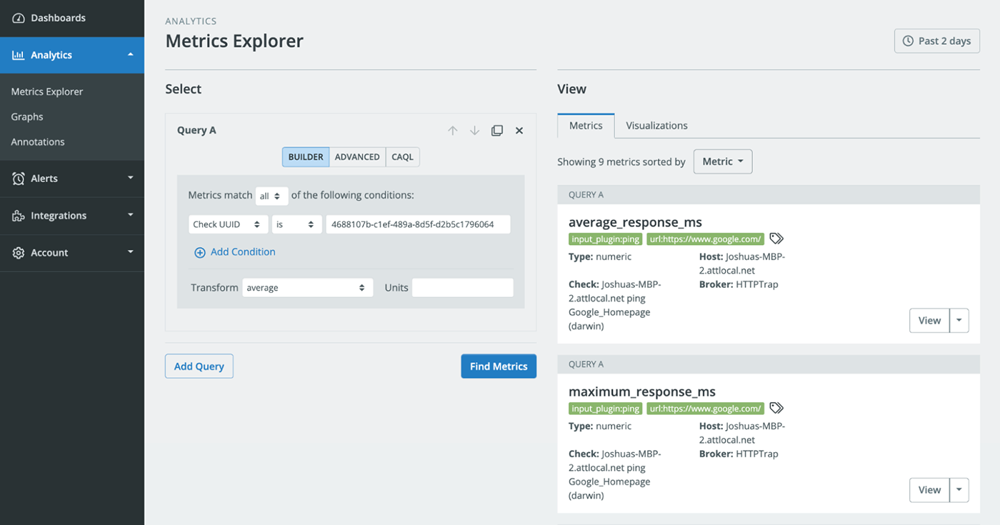

# Integrations

[Integrations](/circonus/getting-started/glossary/#integrations) allow you to collect various [metrics](/circonus/getting-started/glossary/#metric) with a poll-based collection method from either the Circonus Unified Agent (CUA) that is deployed on a [host](/circonus/getting-started/glossary/#host), or directly from your Circonus account where you can specify a [broker](/circonus/getting-started/glossary/#circonus-broker) for the integration to run remotely on. Available Integrations can be seen in your Circonus account if you click on integrations within the primary navigation and then select Library. Click on the Integrations tab and then Click on Library. A variety of integrations are available to gather metrics from the cloud, infrastructure, applications, and more.



## Example Integration Setup with CUA

The following example will demonstrate how to add the ping integration to CUA that is running on a macOS host.

### Step 1 - Install

Open the `circonus-unified-agent.conf` configuration file found in the directory `/opt/circonus/unified-agent/etc/circonus-unified-agent.conf` and search for "inputs.ping". There you will find specific parameters that will need to be both uncommented and modified. Below is an example of the inputs.ping integration that is set up to ping https://www.google.com. Keep in mind that this is a `TOML` file so the syntax is important. After you make changes to the file you will need to save and close it.

```toml
[[inputs.ping]]  # Google Homepage Test
instance_id = "Google_Homepage" ## REQUIRED

  ## Hosts to send ping packets to.
urls = ["https://www.google.com/"]

  ## Method used for sending pings, can be either "exec" or "native".  When set
  ## to "exec" the systems ping command will be executed.  When set to "native"
  ## the plugin will send pings directly.
  ##
method = "exec"

  ## Number of ping packets to send per interval.  Corresponds to the "-c"
  ## option of the ping command.
count = 2
```

### Step 2 - Restart

Restart MacOS CUA by entering the following command in the terminal:

```
sudo launchctl kickstart -k system/com.circonus.circonus-unified-agent
```

### Step 3 - Validation

If the CUA configuration file was successfully modified and the inputs.ping integration plugin was correctly configured, you will see the [metrics](/circonus/getting-started/glossary/#metric) in your Circonus account under that particular integration.



Click on View Metrics to see the metrics being collected from the integration. You will then be directed to the [Metrics Explorer](/circonus/getting-started/metrics-explorer/) found in the Analytics tab to view the associated metrics and also have the ability to visualize as you like. Learn more about [building queries](/circonus/getting-started/metrics-explorer/#query-builder).



[**Next:** Metrics Explorer](/circonus/getting-started/metrics-explorer/ "Next Step")
