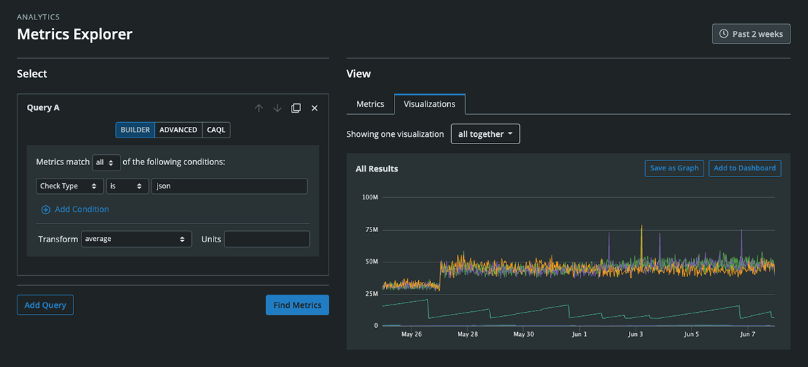
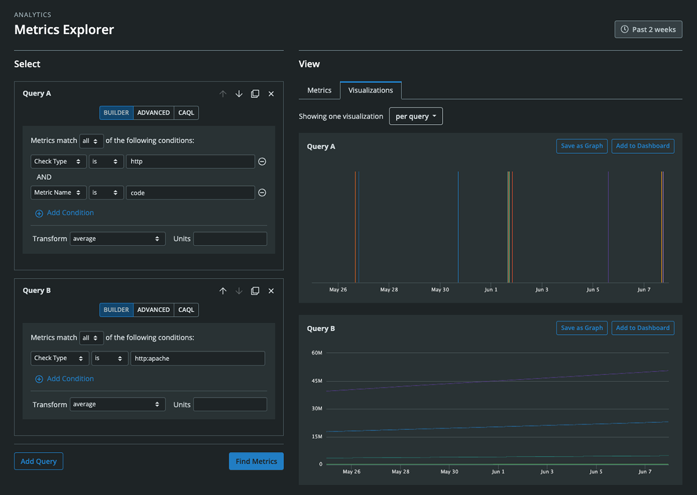

# Metrics Explorer

To explore the telemetry data you're collecting within the Circonus platform, you can leverage our Metrics Explorer. Navigate to Metrics Explorer by clicking "Analytics" within the primary navigation and then "Metrics Explorer."

Metrics Explorer comprises two sections -- "Select" and "View." On the desktop, these sections are arranged within two adjacent columns. On mobile devices, they will be stacked vertically.

## Select Metrics

In the "Select" column, you can enter one or more queries to surface desired metrics. For each query, you can use our intuitive query builder ("Builder") or compose an expression using either our advanced search syntax ("Advanced") or Circonus Analytics Query Language ("CAQL").

### Query Builder

For the builder, first select a property from the left-most dropdown. You can choose from Broker, Check Bundle ID, Check Name, Check Type, Check UUID, Metric Name, Metric Type, Tag, or Target. Once you've selected a property, specify the condition in the next dropdown (these will vary depending on the property you selected). Then, on the right, enter the desired value(s). Once you start typing, a dropdown with available suggestions will appear. For a given query constructed with the builder, you can add multiple conditions and specify whether metrics must match all or any of them. You can also apply a transform to the query data (average, derivative, counter, etc.) as well as desired units.

### Advanced Search Query

To draft an advanced search query, check out the [documentation on our search syntax](/circonus/appendix/search/).

### CAQL Query

To begin learning CAQL, visit our [CAQL documentation](/caql/getting-started/) which includes a reference manual, examples, valuable debugging tips, and more. CAQL queries are uniquely powerful as they support advanced selection and aggregation of metrics as well as complex data transformations.

### Multiple Queries

You can add additional queries by clicking the "Add Query" button. Queries can also be reordered, cloned, and removed. Queries are named alphabetically, i.e. Query A, Query B, Query C, etc. When you view the individual metrics resulting from more than one query or you view visualizations grouped by query, the associated queries will be labeled.

When you are done drafting your queries, simply click the "Find Metrics" button to execute them.

## View Metrics

Once you have clicked the "Find Metrics" button, the "View" section lets you review your results in two main ways -- a "Metrics" tab and a "Visualizations" tab.

### Metrics Tab

"Metrics" lists out each metric stream separately and labels each with its corresponding query. When possible, each metric will also display a sparkline reflecting the shape of the data. List results can be sorted alphabetically by metric name, host name, or check name.

For each metric stream listed under the "Metrics" tab, you can click its "View" button to navigate to a full-sized graph of the metric. Clicking the arrow to the right of the "View" button will reveal a menu where you can choose to view the associated check for that metric, set rules for that metric (for which you can specify alerts), view a quick graph of the metric within an on-page modal, or review the metric's uptime report.

### Visualizations Tab

For a visual representation of your search results, click on the "Visualizations" tab. Here you can view your results within one or more graphs. The dropdown at the top of the tab lets you configure how you'd like to see the visualizations. By default, one visualization will be shown for the totality of the search. However, you can also select to show one visualization per query or one visualization per given tag value. Should you select the latter, you will need to provide the desired tag category.

Each visualization will have two buttons in its upper right allowing you to either save it as a graph or add it to a dashboard.

To save a visualization as a graph, simply give it a name.

To add a visualization to a dashboard, you'll need to decide whether you'd like to place it on an existing dashboard or create a new dashboard on which to place it. For an existing dashboard, simply start typing its name and a series of suggestions will appear from which you can choose. Once you have chosen your dashboard's name, use the adjacent dropdown to select the desired dashboard tab. For a new dashboard, simply enter a dashboard name. Remember that you can always change the name of your dashboard (and any of its tabs) later on.

[**Next:** Tags](/circonus/getting-started/tags/ "Next Step")
