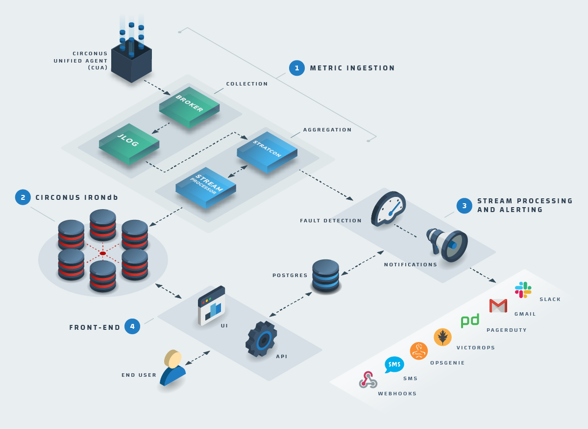

# System Overview

## Metric Ingestion

[Metrics](/circonus/getting-started/glossary/#metric) ingestion into the Circonus platform starts with the [Circonus Unified Agent (CUA)](/circonus/integrations/agents/circonus-unified-agent/introduction/) which collects metrics, either push or pull, at the edge with its 300+ [integrations](/circonus/getting-started/glossary/#integrations). CUA is open-source, enabling our customers to fork and build on it as needed and inspect it for security audits. CUA is also configurable and includes an ever-growing library of [integrations](/circonus/getting-started/glossary/#integrations) to monitor your critical services. Once CUA is set up on the customer's side, the metrics will flow to Circonus's cloud over Transport Layer Security (TLS 1.2) and land in the [Circonus Broker](/circonus/integrations/brokers/) to be distributed to the system.

When metrics reach the broker, they are aggregated and two copies are sent out -- one to [Circonus IRONdb](/irondb/) and one to our Stream Processing and Alerting System. This duplication of metrics eliminates querying [IRONdb](/irondb/) for alerting purposes and enables stream processing and alerting on metrics.

CUA communicates with distributed public brokers via TLS over port 43191 and with the Circonus API over Port 443. If an Enterprise [Circonus Broker](/circonus/getting-started/glossary/#circonus-broker) is on the customer side of the network for store and forward capability, it also communicates with Circonus over port 4319.

## Circonus IRONdb

[Circonus IRONdb](/irondb/) is a patented and clustered Time Series Database (TSDB) capable of ingesting trillions of measurements each second. It was created for both high availability (HA) and infinite scalability to meet enterprise needs. Depending on the customer's needs, IRONdb can be a stand-alone product or a part of the entire Circonus full-stack solution.

## Stream Processing and Alerting

Once the metrics have been ingested into the stream processing and fault detection system, they can trigger alerting behaviors based on user-defined criteria for each metric type. There is no limit on the number of alerts that can be created and acted upon.

An [alert](/circonus/getting-started/glossary/#alert) can fire off a notification via PagerDuty, email, Slack, SMS, VictorOps, OpsGenie, and webhooks. A webhook can also be used to auto-scale a deployment, create self-healing workflows, or any type of integration you would like to create.

## User Interface

Circonus has a rich set of features built into its user interface (UI), making it a one-stop-shop to ensure your services are operating properly and help you dig into issues as needed. As an API-first company, the features used in the UI can be implemented via Application Programming Interface (API) and we have great [API documentation](/circonus/integrations/api/) and support to help you along the way.

[**Next:** Data Model](/circonus/getting-started/data-model/ "Next Step")
