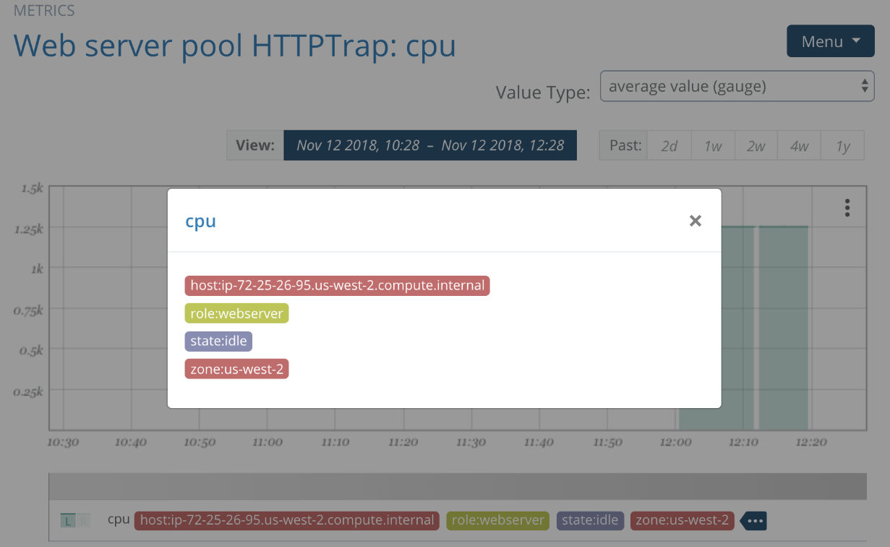

# Tags

Circonus creates [metric](/circonus/getting-started/glossary/#metric) metadata known as [stream tags](/circonus/getting-started/glossary/#stream-tag) to provide all the capabilities of the Metrics 2.0 specification; self-describing, and orthogonal tags for every decision. In addition, Stream Tags offer extra capabilities as detailed below.

**Example of tagging with a web server's CPU:**

In addition to stream tags, every integration you add will automatically create integration-specific tags to easily decipher integration-level metadata. You also have the ability to add custom tags to each integration -- both from the Circonus account and from the configuration file that CUA uses.

Learn more about Circonus' use of [Streaming Tags 2.0](https://www.circonus.com/2018/11/introducing-circonus-stream-tags/).
