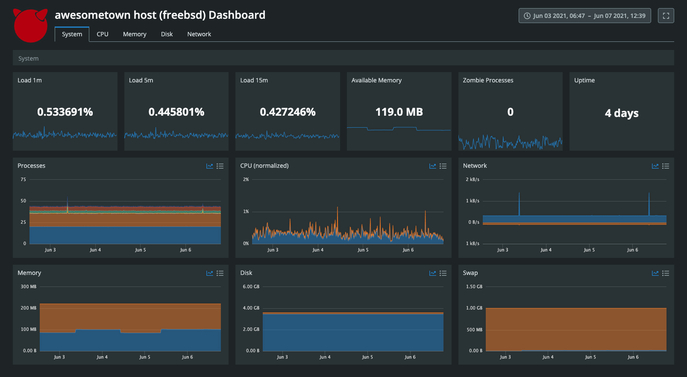

# CUA for FreeBSD

This page outlines the installation and configuration of CUA for FreeBSD.

## Installation

A one-step installer script is provided on the [CUA configuration page](https://login.circonus.com/?whereTo=%2Fagents%3Ftype%3Dhttptrap%3Acua%23documentation_panel) within Circonus.

The FreeBSD installer may be easily executed by running the following command as root:

```sh
curl -sSL "https://raw.githubusercontent.com/circonus-labs/circonus-unified-agent/master/install/install_freebsd.sh" | bash -s -- --key <circonus api key>
```

Notably, the provided API key should be set to "allow" to allow the creation of the associated check(s) when executing the above command.

Alternatively, download links for the latest releases can be found on [this page](https://github.com/circonus-labs/circonus-unified-agent/releases/latest), which can be manually placed on a given host.

## Configuration

CUA's configuration file is written using TOML and is composed of three sections: global tags, agent settings, and plugins.

By default, the CUA configuration file is expected to be placed at: `/opt/circonus/unified-agent/etc/circonus-unified-agent.conf`. All integration configuration is controlled via this single configuration file.

A sample configuration file can be found [here](https://github.com/circonus-labs/circonus-unified-agent/blob/master/etc/example-circonus-unified-agent.conf).

The only required argument is your Circonus API Key, which will be auto-populated by the one-step installer referenced above. CUA will collect various host metrics by default, along with CUA health metrics.

## Dashboard

CUA for FreeBSD includes a turnkey [service dashboard](/circonus/dashboards/introduction/#service-dashboards).


