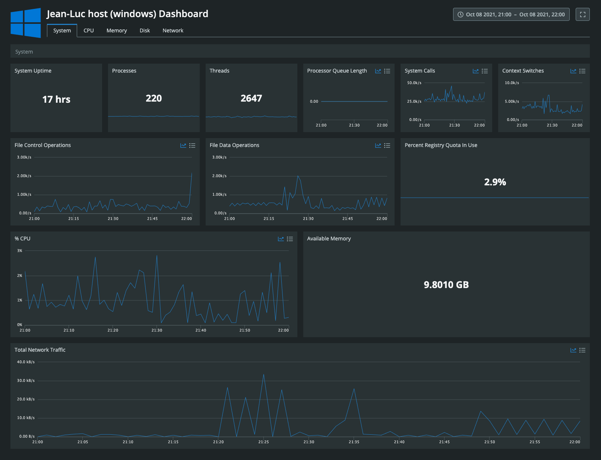

# CUA for Windows

This page outlines the installation and configuration of CUA for Windows.

## Installation

A one-step installer script is provided on the [CUA configuration page](https://login.circonus.com/?whereTo=%2Fchecks%3Ftype%3Dhttptrap%3Acua%3Ahost%3Awindows) within Circonus.

The Windows installer may be easily executed by opening Windows Powershell (version 5 or greater) as administrator and executing the following command:

```powershell
. {iwr -useb https://raw.githubusercontent.com/circonus-labs/circonus-unified-agent/master/install/install_windows.ps1 } | iex; install -key <circonus api key>
```

Notably, the provided API key should be set to "allow" to allow the creation of the associated check(s) when executing the above command.

Alternatively, download links for the latest releases can be found on [this page](https://github.com/circonus-labs/circonus-unified-agent/releases/latest), which can be manually placed on a given host.

Additional instructions for configuring CUA as a service on Windows platforms can be found [here](https://github.com/circonus-labs/circonus-unified-agent/blob/master/docs/WINDOWS_SERVICE.md)

## Configuration

CUA's configuration file is written using TOML and is composed of three sections: global tags, agent settings, and plugins.

By default, the CUA configuration file is expected to be placed at: `C:\Program Files\Circonus\Circonus-Unified-Agent\etc\circonus-unified-agent.conf`. All integration configuration is controlled via this single configuration file.

A sample configuration file can be found [here](https://github.com/circonus-labs/circonus-unified-agent/blob/master/etc/example-circonus-unified-agent_windows.conf).

The only required argument is your Circonus API Key, which will be auto-populated by the one-step installer referenced above. CUA will collect CUA health metrics default on Windows systems.

For any changes to the configuration to take effect, restart the CUA service by issuing the following command:

```powershell
Restart-Service -Name circonus-unified-agent
```

You may wish to manage your configs from a central location without hard coding secrets into the CUA configuration file. CUA can use Windows environment variables. The environment variables need to be visible by the account which runs CUA, which by default is Local System. You can use the standard GUI based approach to editing system environment variables, or use the powershell command below.

```powershell
[Environment]::SetEnvironmentVariable("CIRCONUS_API_TOKEN", "<circonus_api_token>", "Machine")
```

Then make changes(s) to your circonus-unified-agent.conf file to make use of the variables

```toml
  [agent.circonus]
    api_token = "${CIRCONUS_API_TOKEN}"
```

## Dashboard

CUA for Windows includes a turnkey [service dashboard](/circonus/dashboards/introduction/#service-dashboards).


