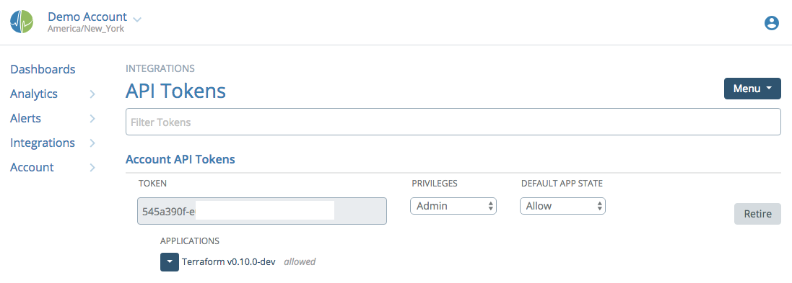
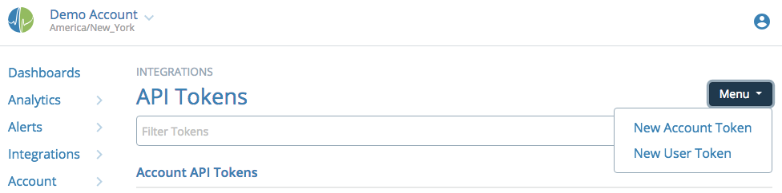
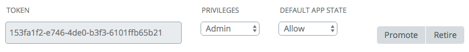
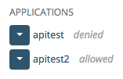

# API Tokens

Access to the Circonus API (Application Programming Interface) is controlled through auth tokens. API tokens are used to programmatically access Circonus via your own tools, third-party tools, and external products that you choose to grant access to your Circonus data.

This document will walk you through the management of the auth tokens. For full API docs, please visit the [API documentation](https://login.circonus.com/resources/api) page on our public site.

The API Tokens also exposes information about Circonus One Step Installation options, which are documented in more detail on the Circonus Labs Github pages here:

- https://github.com/circonus-labs/circonus-one-step-install
- https://github.com/circonus-labs/circonus-one-step-install/wiki

API tokens are tied to a user + account and can be managed from the Integrations: API Tokens page.

Two types of API tokens exist: Account and User tokens. They function the same way, but are owned differently and have different visibility in the Circonus UI. Account tokens may only be created by team members who have Admin privileges on the account, and are invisible to non-admins. These are best for account-wide integrations that should not be tied to an individual user (in case that user leaves your company). User tokens may be created by any normal or admin user. Normal users may only see their own tokens, not those of any other users.

## Creating an Auth Token

To create an auth token, use the Menu at top right to create a new User or Account token.

Now you will have a new token appear on the page.

After a token is created, you should change its privileges to the lowest possible for your intended use. "Read only" is appropriate for the vast majority of API token needs. "Admin" privilege is required for tokens used in [Enterprise Broker provisioning](/circonus/administration/enterprise-brokers/#provision-the-broker).

The Privileges drop-down allows you to select what permission level this token has: Admin, Normal, or Read-Only. Note that you can not grant a higher permission level than you are permitted on the account, so a user with Normal account privileges cannot set a token to Admin privilege.

The Default App State drop-down allows you to select Allow, Pending, or Deny. This setting governs whether a new application using this token needs explicit approval in order to gain access to the API. If set to "Allow", any application may use this token with no prior approval. If set to "Pending" or "Deny", the first access by a new application name will receive an error (HTTP 401 for Pending, 403 for Deny), and you can return to the API Tokens page and use the drop-down arrow next to the application name under the token to allow or deny access.

Retire allows you to completely deactivate a token, revoking its use.

If you have Admin privileges on this account, you may also see a Promote button, which will convert a User token into an Account token. You might use this if an existing application is using a User token, and the user is leaving your company. Rather than reconfiguring the application to use a different token (which may be burdensome), an account admin may choose to promote the token instead. A token that is promoted cannot later be "demoted" back to a User token.

## Authorizing an Application

After creating an auth token, if the Default App State is not "Allow", the next step is to use it to hit the API as outlined [here](https://login.circonus.com/resources/api#authentication). This will add an application name to the token that you can then allow or deny.

## Retiring a Token

Click the "Retire" button and your token will have its access to the Circonus API revoked.
