# Broker Checks

## Add a Broker Check

Our checks are the nuts-and-bolts of our service integrations; to begin collecting data you must first setup a check. If you select _Checks_ under the _Integrations_ main menu section, you'll see a grid of all the service integrations we have for data collection. If a service has an _active_ bar it means there's at least one active check in the system of that type.

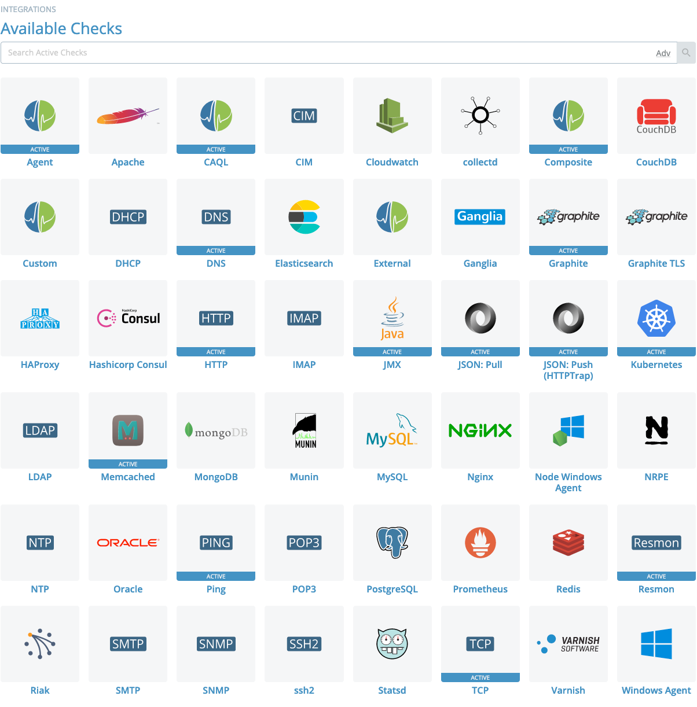

To search across all checks in your account, use the search bar above the grid on this page. Otherwise, click an integration to view checks of that type, add new ones, or view documentation for that integration type. Those are all available in the tabbed view of the check module page:

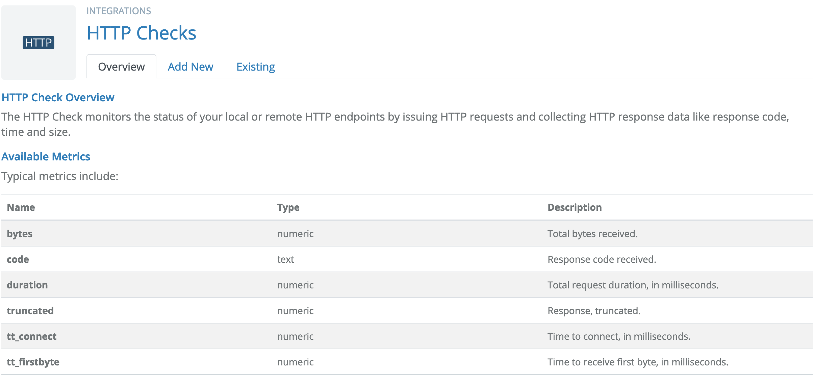

Select the _Existing_ tab to view a list of existing checks of the current type, or select the _Add New_ tab to begin adding a new check of the current type.

After you're on the check module page for the appropriate integration type, select the _Add New_ tab to begin the addition process.

### Step 1: Selecting a Broker

Circonus has a good idea if perspective matters when running a check, and handles Perspective Checks and Non-perspective Checks differently. See below.

#### Perspective Checks

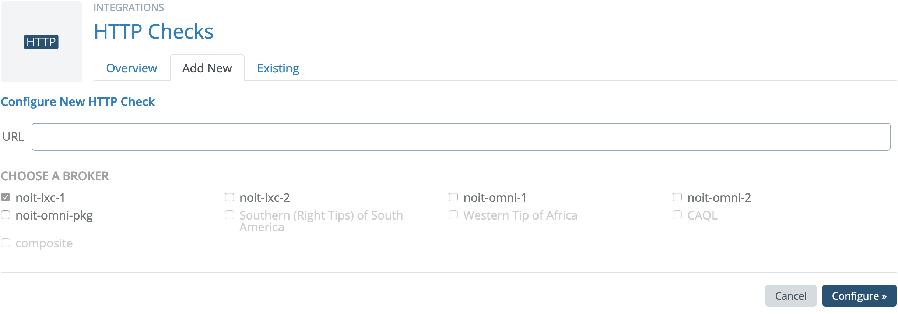

Circonus considers the check to be a perspective check if the results can vary depending on the location of the broker performing the assessment. In this case you will see checkboxes to allow you to select multiple brokers; the check will be run from each of the selected brokers. You must select at least one broker, but you are not limited to one.

#### Non-Perspective Checks

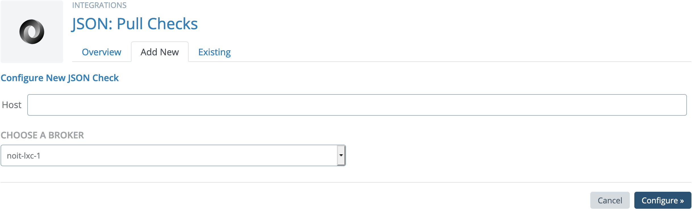

Circonus considers a check to be non-perspective if the results will not vary based on the location of the broker performing the assessment. In this case you will see a dropdown selector to select only a single broker.

### Step 2: Check-Specific Configuration

This part of the process varies widely based on the check type. For the purposes of this example, we'll be using the _HTTP_ check type to check the main "circonus.com" website. The intricacies of each check type are explored in more detail in the [Check Types](/circonus/checks/check-types/) section of this manual.

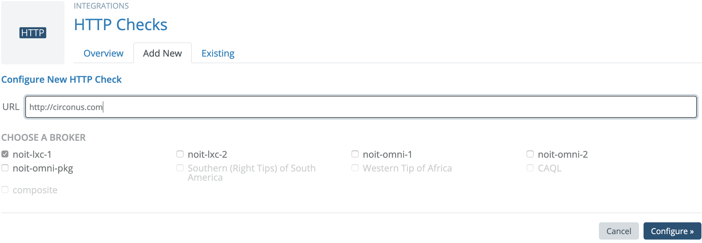

The HTTP check requires a URL and, like most checks, will resolve any FQDN and provide a choice of using the FQDN (i.e. `circonus.com`) or the resolved IP address (i.e. `199.15.226.60`). You may use a short name as a check target provided that it is resolvable in the default domain configured on the broker. If the URL doesn't resolve, you will get an error message notifying you of the issue, and you may proceed anyway if you wish (for example, this may happen if you're running the check on an Enterprise Broker using a custom DNS setup). Click _Configure_ to proceed to the next step.

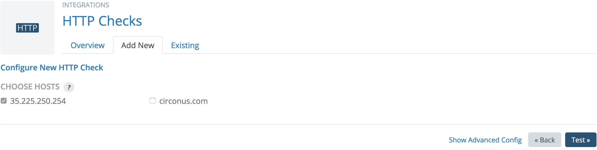

In this example, we leave the IP address selected, forgo any advanced HTTP-specific configuration, and click _Test_ to continue to the final step.

### Step 3: Metrics Selection

Once the _Test_ button is clicked, the broker which was previously selected will be asked to run the check in test mode. This may take a few seconds, but it will retrieve all the metrics and let you pick and choose which metrics to actually collect.

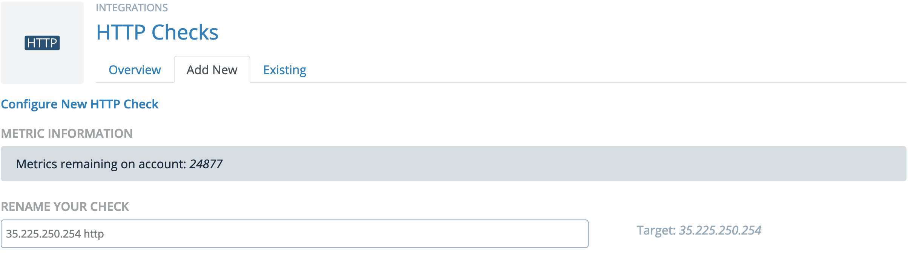

You have the option to rename your check to something more descriptive or appropriate. Note that the host, the type, and the perspective from which it is run are metadata associated with each check. Your name need not contain that information as it is redundant.

The last task is to select the metrics for which you want to enable collection. You may either select metrics individually or filter the metrics using Regular Expressions that will determine which metrics are collected.

#### Individual Metric Selection

If you choose to select individual metrics, those that are selected will be the only ones transmitted from the broker back into the rest of Circonus to be available for alerting and visualization. Those that are not selected will simply be ignored. You can come back and change these selections later, but while they are deselected no data will be collected.

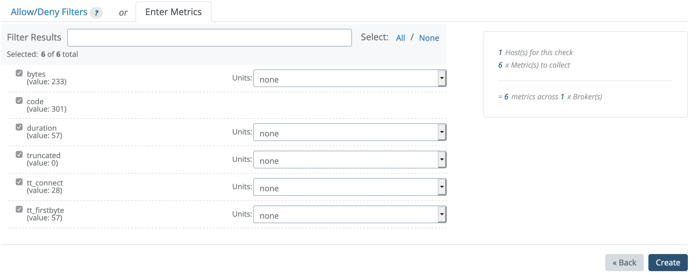

The "Filter Results" box will allow quick reduction of the list for fast select/deselection for large result sets. This can be used with "All" and "None" to quickly and painlessly work with very large lists of metrics.

#### Allow/Deny Metric Filters

If you are setting up a check type with unknown metrics or metrics which may change, you might want to use _Allow/Deny Filters_ instead of selecting individual metrics. In this case, select the _Allow/Deny Filters_ tab on the last step and add filters to the list there. Each filter consists of a Regular Expression for matching metric names, and a choice of either "allow" or "deny" which determines if each metric matched by the RegExp will be allowed or denied. The "allow all unmatched" checkbox determines what happens to metrics which aren't matched by any filters. If it's checked, all metrics will be allowed unless explicitly denied. If it's unchecked, all metrics will be denied unless explicitly allowed.

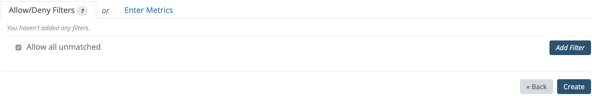

Once you're satisfied with your metric selections or filters, clicking _Create_ will add the check to the broker and make its output available to the rest of the tools in Circonus.

## View a Broker Check

If you select _Checks_ under the _Integrations_ main menu section, you'll see a grid of all the service integrations we have for data collection. If a service has an _active_ bar it means there's at least one active check in the system of that type.

To search across all checks in your account, use the search bar above the grid on this page. Otherwise, click an integration to view checks of that type.

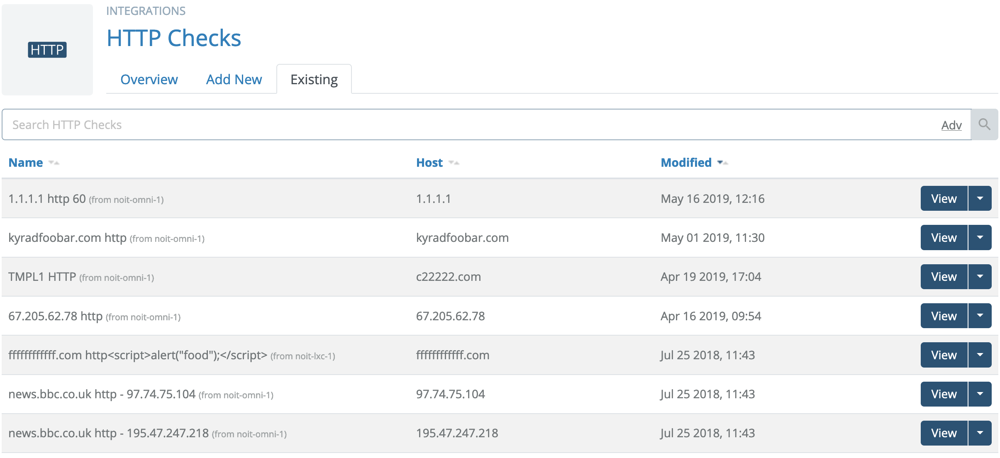

Clicking _View_ on a specific check will take you to a page of details, including links to [view and edit](/circonus/checks/edit/#Navigatingtothecheck) the configuration information for a check or [delete the check](/circonus/checks/delete/).

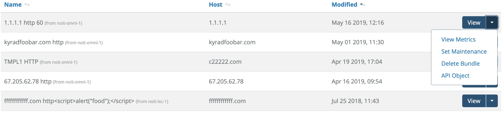

### Check Details

Clicking the "View" button will open the Check Details page.

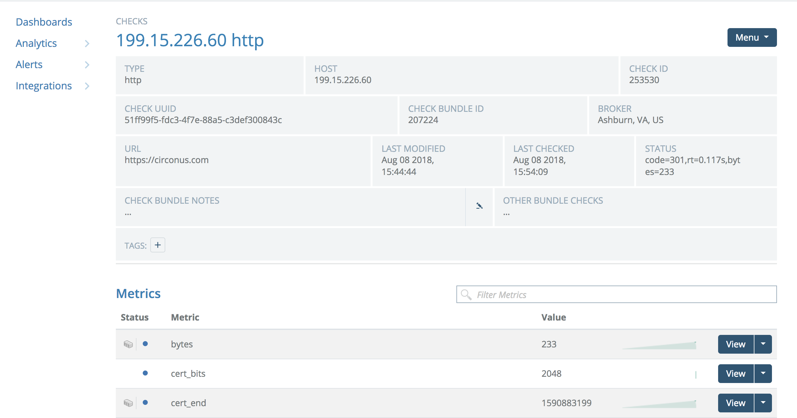

This page allows you to view more detailed information about a check, including host and broker information and the list metrics collected by this check.

Each check has the following IDs:

- Check Bundle ID
- Check ID
- Check UUID

## Edit a Broker Check

### Navigating to the Check

Throughout the interface, metric and check information will be combined into graphs, worksheets, and alerting information. Any place you see a link labeled "view check", you will be delivered to the Primary Check View for that check (see below)

The most straight forward way to navigate to the primary view for a check is to click _Checks_ from the _Integrations_ section of the main menu. That will take you to the grid of our service integrations. Use the search field at the top to search across all integrations, or click the integration type of the check you're looking for and you'll be taken to the specific Integration module page where you can find your check.

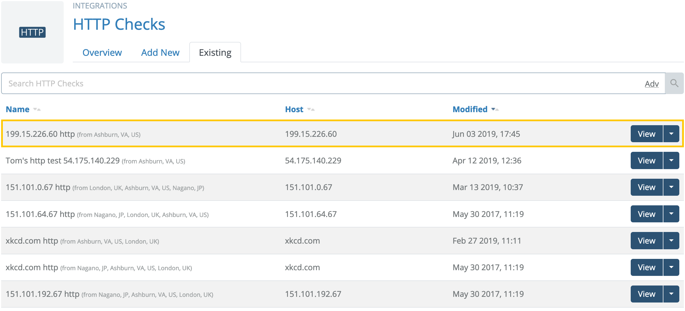

Click the "View" button on the check in the list to go to the Primary Check View.

#### Primary Check View

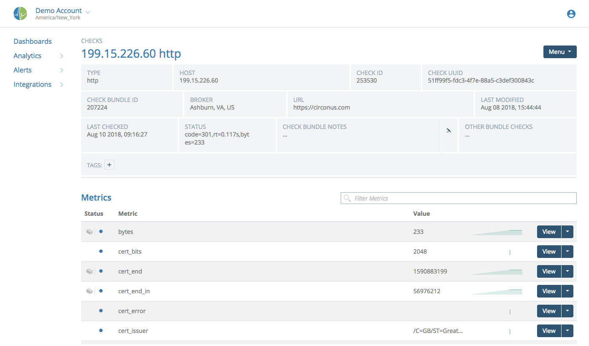

The primary view gives all the pertinent metadata about the check, including key aspects of its configuration, the broker it runs on, time of last modification, and its current status. Below this is a list of metrics being collected or available for collection.

The Status column has up to two icons for each metric, indicating the following information:

 This metric is not being collected by Circonus.  
 This metric is being collected in text or numeric form (whichever is appropriate).  
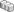 Histogram collection is available for this metric, but is not enabled.  
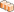 Histogram collection has been enabled for this metric.

Metrics that have no histogram icon are text metrics, so histogram collection is not applicable.

### Change Check Name

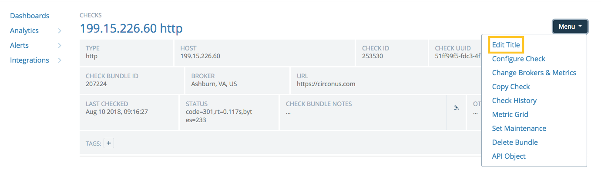

The name of the check may be changed by choosing "Edit Title" from the Menu at top right. Click "Save" to save the new name.

### Changing Configuration

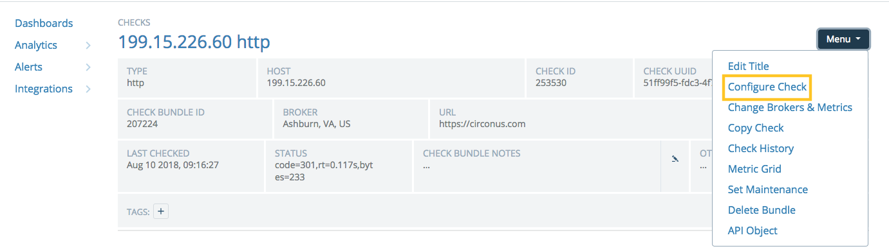

Choosing "Configure Check" from the Menu at top right will take you back through the config wizard.

### Changing Metric Collection

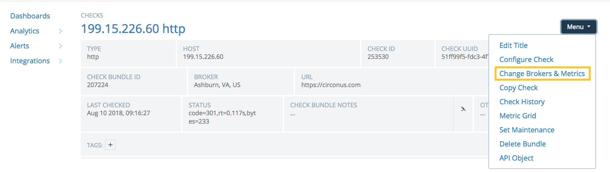

To instantiate this check on a new broker and/or change which metrics are collected, choose "Change Brokers & Metrics" from the Menu at top right. The available Metrics list is replaced with a three-column view showing the available Brokers, the selected Metrics, and a Total Usage calculation. The total number of metrics is the product of the number of brokers and the number of metrics to collect.

The net change in metrics collected will be noted in the Total Usage column.

**Note:**

> Metrics from checks are unique based on their perspective. If you move a check from one broker to another you are actually enabling a new check on a broker and disabling the old one. You will find two sets of metrics in the system (one for each broker) and they will require individual treatment with respect to visualization and alerting.

To change brokers, select or deselect brokers in the leftmost column.

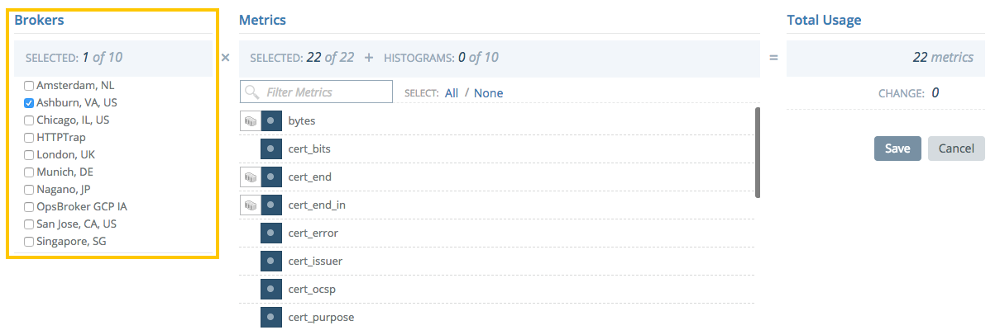

To activate or deactivate collection of one or more metrics, click one of the selection icons next to its name. Numeric metrics may be collected as a single value per measurement or as a histogram. They may not be collected as both concurrently.

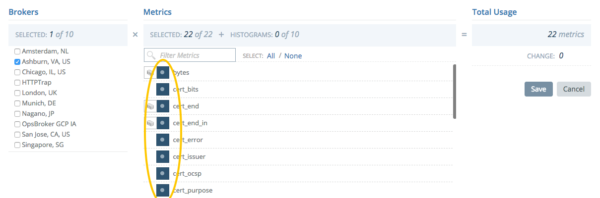

### Metric Details

Each of the metrics in the "Metrics" section has a "View" button for accessing details for the metric.

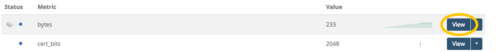

The details page includes much of the same metadata as the primary check view, as well as a graph of the metric's value over time, if it is being collected.

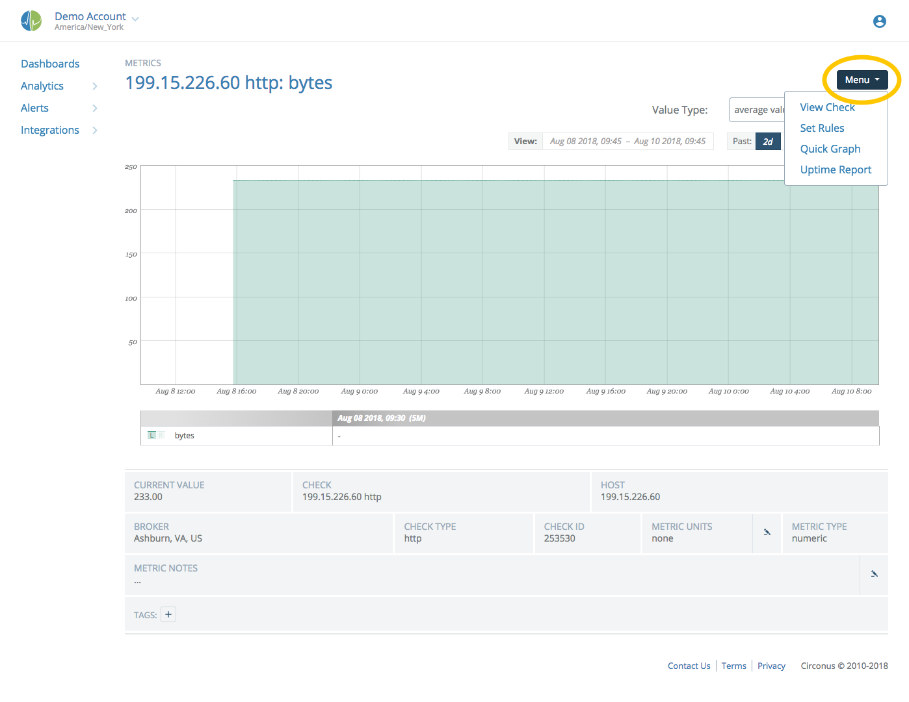

The Menu at top right contains options for working with this metric:

- "Set Rules" will allow you to configure rules for alerting on this metric.
- "Quick Graph" will create a new graph with this data point in it that can be subsequently saved and manipulated.

Select "View Check" to return to the Primary Check View.

### Tags

Tags let you group and filter your items in Circonus. Many items in the app support tagging, and support for additional items will be coming in the future. When using tags, you can choose to use categories to create logical groupings of tags, or you may use only uncategorized tags, if you prefer. In the tags dialogs, uncategorized tags appear under the category "Uncategorized," but in the interface & API they will be without a category. When you're working with tags in text form (like in the API), note that categories and tags are separated with colons (e.g. "os:windows"), and are always lowercase.

#### Adding Tags

To add tags to an item, open the "Add Tag" dialog in the Check Details page by clicking on the "Tags +" button.

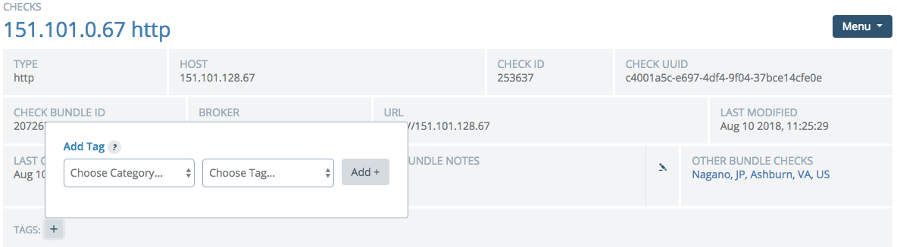

In the dialog, choose an existing category or enter a new category by choosing the "+ ADD" option in the category select dropdown. If you choose an existing category, any tags it contains will then be populated into the tag select dropdown. Choose an existing tag or enter a new tag (again by choosing the "+ ADD" option), and then click "Add Tag +" to add the tag to the item. Upon page reload, any unused categories and tags will not be shown in the dropdowns (except for a few pre-created categories which are always shown), although you may re-enter them again if you wish to use them again in the future.

When tags are displayed, it will automatically be assigned a color based on its category; we cycle through a series of colors which have been preselected to be easily distinguishable from one another.

#### Removing Tags

To remove a tag, look for the small "x" button at the right end of the tag in the tag bar. Click that button and the tag will be immediately removed.

## Copy a Broker Check

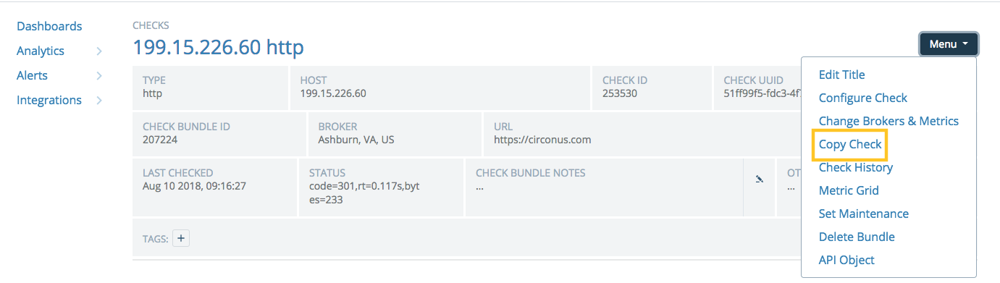

You can copy a check to a new host without recreating the check from scratch. Navigate to the primary view of the check, then choose "Copy Check" from the Menu at top right.. A dialog will appear allowing you to edit the check's name and supply a host for the new check. You will have the option to copy all rules on metrics in the current check to the new metrics on the new check. All configuration options on the new check will be identical to the original check, except for the host.

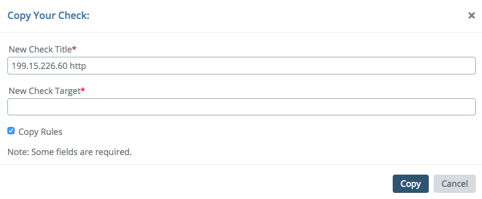

**Note:**

> Creating a new check from an existing one via the copy method can seem convenient. This is a simplified shortcut for making checks that are largely the same, in small quantities. The [Circonus API](https://login.circonus.com/resources/api) is a more robust solution for making more than a trivial number of checks with similar configuration.

## Delete a Broker Check

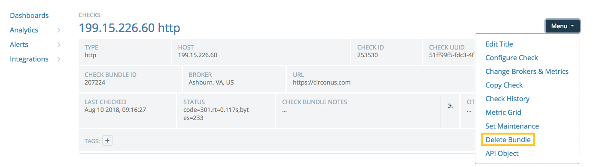

When viewing a check from the "Integrations:Checks" page, the Menu at top right has a "Delete Bundle" option. Clicking this option will delete the entire bundle of checks. This means that the check will be deleted and if the check runs on one or more brokers, then it will be deleted from all brokers.

If you would simply like to disable a check from a given broker, click "view check" to access the primary check view and uncheck a broker from the list to disable the check on that broker.

**Warning:**

> Deleting a check is permanent. All metrics and all data may be lost forever.
