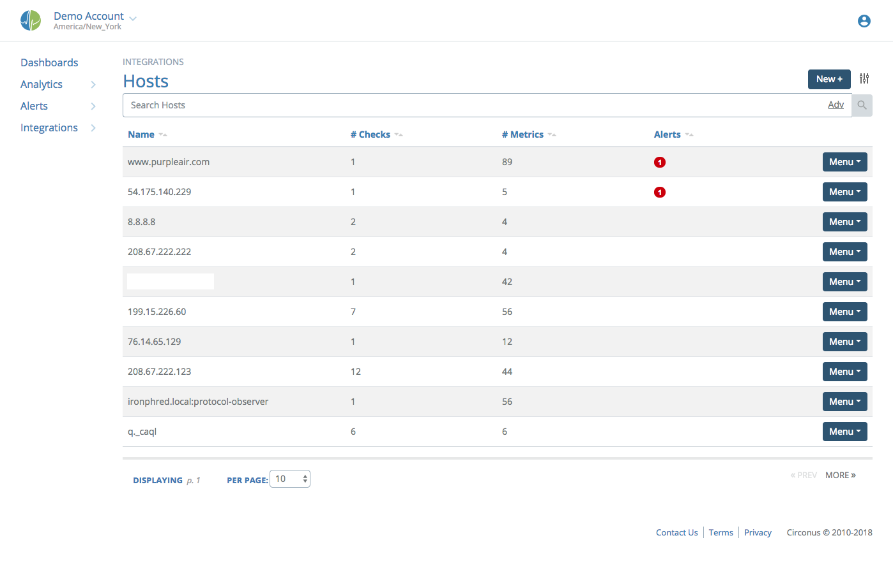
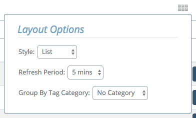
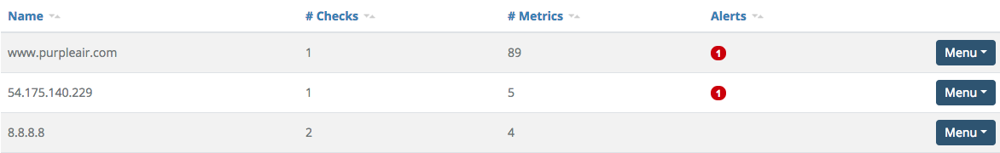
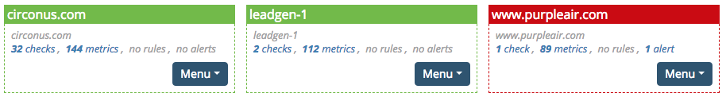
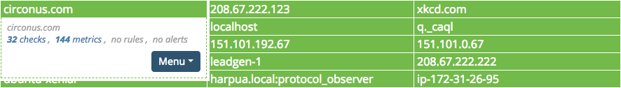

# Reviewing Hosts

The hosts view page will show all distinct hosts configured in the systems. There are quick links to review all checks, metrics, rules, and alerts related to each host.

Aliases for Host names can be created in this view by clicking on the Menu for the host and choosing "edit alias". After adding an alias, the check's actual target is appended, in parentheses.

There are three views for this page: list, grid, and compact. They are revealed by clicking the Tuner icon next to the "New+" button, then clicking the 3x2 grid icon.

## Hosts List View

In the list view, the Host name/alias and IP address are indicated on the left. Next, the number of active checks and metrics are noted. The count of each configured rule is listed categorized by alert level. Severity 1 alerts are marked in red, Severity 2 and 3 are marked in orange, Severity 4 and 5 are marked in yellow, and rules that are not currently in an alert state are marked in green. On the right, a drop-down menu contains links to review all checks, metrics, rules, and alerts associated with the host.

## Hosts Grid View

The same information is available in a grid view that delivers a more compact visualization. In this visualization, the same information is available, but only the color representing the most severe alert is adopted for the whole host.

## Hosts Compact View

The compact view is like the grid view with less inter-box spacing and the details unexpanded. It will look like a large matrix of red, orange, yellow, or green boxes. Hovering the cursor over any host title will temporarily display the same details present in the grid view.
