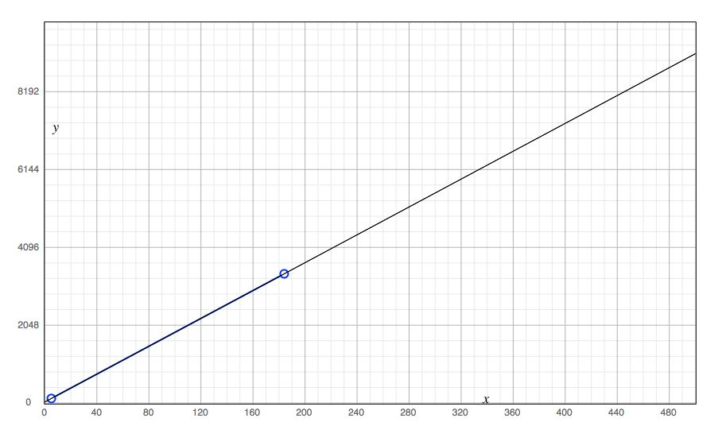

# Getting Started

## System Requirements

See [System Sizing](#system-sizing) for details on CPU, RAM, and storage requirements for each role.

### Circonus Enterprise Broker

The Circonus Enterprise Broker is supported on the following platforms (all are
amd64/x86_64 only):

- RHEL/CentOS 7 (7.4-7.9)
- Ubuntu 20.04

### All Other Components

All other core system components are supported on the following platforms:

- RHEL/CentOS 7 (7.4-7.9)

## Pre-Installation Checklist

Please ensure that the systems designated to run Circonus components have the following configuration completed before installing Circonus software:

- IP address and default route
- DNS resolution for the system
- A DNS entry, "mailhost", in the default domain or one of the configured search domains, that resolves to the IP address of an SMTP relay that will relay mail for the Circonus component systems
- System clock up to date and kept synced with NTP

## System Files Modified

The following non-Circonus system files are typically modified or overwritten by Circonus Inside. The Circonus Enterprise Broker does not modify any system files.

### CentOS/RHEL

The following CentOS/RHEL system files are modified or overwritten by Circonus Inside:

```
/etc/hosts
```

## System Sizing

There are three aspects of system sizing that this document will address:

1.  CPU requirements
1.  Memory (RAM) requirements
1.  Permanent storage requirements

These aspects vary for each component. Some components are better suited for virtualization than others; components that should be run on physical hardware will be noted as such.

Unless otherwise specified, disk storage shall be of adequate redundancy
(RAID10 or ZFS mirrors) at a minimum of 7200 RPM (for spinning media) and CPU
cores should be a minimum of 2GHz.

Refer to the [Networking Requirements](#networking-requirements) section for inter-component communications.

### API sizing

The [API](/circonus/on-premises/components/#api) component requires:

- 4 CPU cores
- 8 Gbytes of RAM
- 40 Gbytes of disk storage

### CA sizing

The [CA](/circonus/on-premises/components/#CA) component requires:

- 1 CPU core
- 2 Gbytes of RAM
- 10 Gbytes of disk storage

### Data Storage sizing

The [data storage](/circonus/on-premises/components/#DataStorage) component (IRONdb&reg;) requires
multiple machines and has the most significant storage requirements. Each node
should meet the following specifications:

- 16 CPU cores
- 256 Gbytes of RAM
- 320 Gbytes of disk storage for OS install
- _Should be run on bare metal_
- [Metric storage requirements](/irondb/getting-started/cluster-sizing)

### Enterprise Broker Sizing

The [Enterprise Broker](/circonus/on-premises/components/#enterprise-broker) component requires:

- 2 CPU cores
- 4 Gbytes of RAM
- 40 Gbytes of disk storage

### Fault Detection Sizing

The [Fault Detection](/circonus/on-premises/components/#FaultDetection) component requires:

- 4 CPU cores
- 16 Gbytes of RAM
- 20 Gbytes of disk storage

### Hooper Sizing

[Hooper](/circonus/on-premises/components/#hooper) runs on each system to manage installation and configuration tasks. It has no specific sizing requirements above and beyond the components it is installing.

### Hub Sizing

The [Hub](/circonus/on-premises/components/#Hub) component requires:

- 1 CPU core
- 2 Gbytes RAM
- 20 Gbytes of disk storage

### Long-tail Store Sizing

The [Long-tail Store](/circonus/on-premises/components/#long-tail-store) component requires:

- 2 CPU cores
- 8 Gbytes of RAM
- Disk storage requirements (see below):

Each check performed collects an arbitrary number of metrics, so the storage required varies with metric counts. For example, storing data from a broker with an average of 5 metrics per check requires approximately 120 bytes per check performed. On a broker with an average of 185 metrics per check, it requires approximately 3400 bytes per check performed. Assuming each check is performed once per minute, we can extrapolate storage requirements.



**Legend:**

```
y-axis - Shows the number of bytes required per check run
x-axis - Shows the number of metrics collected during the check run
```

Long-tail storage can be used to reconstruct Data Storage or to do out-of-band analysis on raw data. It is also the easiest source from which to backup raw telemetry data. Retention of this data is left up to the operator. This data can be deleted without any ill effect on regular system usage.

#### Long-tail Store Examples

Here are two examples of Long-tail Store sizing extrapolated:

1. If one were to perform 30 checks per minute with an average of 185 metrics collected per check, the system would store approximately 150 Mbytes of raw data per day.
1. If one were to perform 860 checks per minute with an average of 5 metrics collected per check, the system would store approximately 150 Mbytes of raw data per day.

### MQ Sizing

The [MQ](/circonus/on-premises/components/#mq) component requires:

- 2 CPU cores
- 8 Gbytes of RAM
- 20 Gbytes of disk storage

### Notification Sizing

The [Notification](/circonus/on-premises/components/#notification) component requires:

- 1 CPU core
- 4 Gbytes of RAM
- 20 Gbytes of disk storage

### Stratcon Sizing

The [Stratcon](/circonus/on-premises/components/#stratcon) component requires:

- 4 CPU cores
- 32 Gbytes of RAM
- 80 Gbytes of disk storage
- _Should be run on bare metal_

### Web DB Sizing

The [Web DB](/circonus/on-premises/components/#WebDB) component requires:

- 8 CPU cores
- 64 Gbytes of RAM
- 200 Gbytes of disk storage
- _Should be run on bare metal_

### Web Frontend Sizing

The [Web Frontend](/circonus/on-premises/components/#WebFrontend) component requires:

- 4 CPU cores
- 8 Gbytes of RAM
- 40 Gbytes of disk storage

### Web Stream Sizing

The [Web Stream](/circonus/on-premises/components/#WebStream) component requires:

- 1 CPU core
- 4 Gbytes of RAM
- 10 Gbytes of disk storage

## Networking Requirements

This section documents protocols for the various inter-component communications. The following information assumes a flat layer-2 topology (a single broadcast domain). If your planned deployment has different requirements, please contact Circonus Support (support@circonus.com).

External internet access may or may not be required for some components, depending on your setup. See below.

### Legend

Values are shown as `IP:protocol:source_port:destination_port`.

Blank leading fields are elided.

The protocol is shown as either "T" for TCP or "U" for UDP.

If `source_port` is not defined, it is an ephemeral port.

### Connection Matrix

| &darr; From To &rarr;                                                    | [API](/circonus/on-premises/components/#api) | [CA](/circonus/on-premises/components/#CA) | [CAQL Broker](/circonus/on-premises/components/#CAQLBroker) | [Data Storage](/circonus/on-premises/components/#DataStorage) | [Enterprise Broker](/circonus/on-premises/components/#enterprise-broker) | [Fault Detection](/circonus/on-premises/components/#FaultDetection) | [Hub](/circonus/on-premises/components/#Hub) | [Long-tail Store](/circonus/on-premises/components/#long-tail-store) | [MQ](/circonus/on-premises/components/#mq) | [Notification](/circonus/on-premises/components/#notification) | [Stratcon](/circonus/on-premises/components/#stratcon) | [Web DB](/circonus/on-premises/components/#WebDB) | [Web Frontend](/circonus/on-premises/components/#WebFrontend) | [Web Stream](/circonus/on-premises/components/#WebStream) | **Outside** |
| ------------------------------------------------------------------------ | -------------------------------------------- | ------------------------------------------ | ----------------------------------------------------------- | ------------------------------------------------------------- | ------------------------------------------------------------------------ | ------------------------------------------------------------------- | -------------------------------------------- | -------------------------------------------------------------------- | ------------------------------------------ | -------------------------------------------------------------- | ------------------------------------------------------ | ------------------------------------------------- | ------------------------------------------------------------- | --------------------------------------------------------- | ----------- |
| [API](/circonus/on-premises/components/#api)                             | N/A                                          |                                            |                                                             | T::8112                                                       | T::43191                                                                 |                                                                     |                                              |                                                                      |                                            |                                                                | T::43191 T::[1025-65535]\*                             | T::5432                                           | T::11211 T::80                                                |                                                           |             |
| [CA](/circonus/on-premises/components/#CA)                               |                                              | N/A                                        |                                                             |                                                               |                                                                          |                                                                     |                                              |                                                                      |                                            |                                                                |                                                        | T::5432                                           |                                                               |                                                           |             |
| [CAQL Broker](/circonus/on-premises/components/#CAQLBroker)              | T::8080                                      |                                            | N/A                                                         | T::8112                                                       |                                                                          |                                                                     |                                              |                                                                      | T::8765                                    |                                                                |                                                        |                                                   |                                                               |                                                           |             |
| [Data Storage](/circonus/on-premises/components/#DataStorage)            |                                              |                                            |                                                             | T::8112 U:8112:8112                                           |                                                                          |                                                                     |                                              |                                                                      |                                            |                                                                |                                                        |                                                   |                                                               |                                                           |             |
| [Enterprise Broker](/circonus/on-premises/components/#enterprise-broker) |                                              |                                            |                                                             |                                                               | N/A                                                                      |                                                                     |                                              |                                                                      |                                            |                                                                |                                                        |                                                   | T::80                                                         |                                                           | \*:\*:\*:\* |
| [Fault Detection](/circonus/on-premises/components/#FaultDetection)      | T::8080                                      |                                            |                                                             | T::8112                                                       |                                                                          | T::43192                                                            |                                              |                                                                      | T::5672 T::8765                            |                                                                |                                                        |                                                   |                                                               |                                                           |             |
| [Hub](/circonus/on-premises/components/#Hub)                             |                                              |                                            |                                                             | T::8112                                                       | T::43191                                                                 |                                                                     | N/A                                          |                                                                      | T::5672                                    |                                                                | T::43191 T::[1025-65535]\*                             | T::5432                                           | T::80                                                         |                                                           |             |
| [Long-tail Storage](/circonus/on-premises/components/#long-tail-store)   |                                              |                                            |                                                             |                                                               |                                                                          |                                                                     |                                              | N/A                                                                  |                                            |                                                                |                                                        |                                                   |                                                               |                                                           |             |
| [MQ](/circonus/on-premises/components/#mq)                               |                                              |                                            |                                                             |                                                               |                                                                          |                                                                     |                                              |                                                                      | T::4369                                    |                                                                |                                                        |                                                   |                                                               |                                                           |             |
| [Notification](/circonus/on-premises/components/#notification)           |                                              |                                            |                                                             |                                                               |                                                                          |                                                                     |                                              |                                                                      | T::5672                                    | N/A                                                            |                                                        | T::5432                                           | T::80                                                         |                                                           |             |
| [Stratcon](/circonus/on-premises/components/#stratcon)                   |                                              |                                            |                                                             | T::8112                                                       | T::43191                                                                 |                                                                     |                                              | T::873                                                               | T::8765                                    |                                                                | N/A                                                    |                                                   | T::80                                                         |                                                           |             |
| [Web DB](/circonus/on-premises/components/#WebDB)                        |                                              |                                            |                                                             |                                                               |                                                                          |                                                                     |                                              |                                                                      | T::5672                                    |                                                                |                                                        | T::5432                                           |                                                               |                                                           |             |
| [Web Frontend](/circonus/on-premises/components/#WebFrontend)            |                                              |                                            |                                                             | T::8112                                                       | T::43191                                                                 | T::43191                                                            |                                              |                                                                      |                                            |                                                                | T::43191 T::[1025-65535]\*                             | T::5432                                           | T::11211                                                      |                                                           |             |
| [Web Stream](/circonus/on-premises/components/#WebStream)                |                                              |                                            |                                                             |                                                               |                                                                          |                                                                     |                                              |                                                                      | T::8765                                    |                                                                | T::43191 T::[1025-65535]\*                             | T::5432                                           |                                                               | N/A                                                       |             |
| Outside                                                                  | T::8080 T::443                               |                                            |                                                             |                                                               | U::25826 U::8125 U::67 U::68 T::43191 T::2443 T::2003 T::443 T::80       |                                                                     |                                              |                                                                      |                                            |                                                                |                                                        |                                                   | T::80 T::443                                                  | T::80 T::9443                                             | N/A         |
| Management UIs\*\*                                                       |                                              |                                            | T::8081                                                     | T::8112                                                       |                                                                          | T::9127                                                             |                                              |                                                                      | T::55672                                   | T::8084                                                        |                                                        |                                                   |                                                               |                                                           |             |

\*Stratcon listens on ephemeral, unprivileged TCP ports for tunneling to reverse-mode brokers. These ports are opened as needed, one per reverse-mode broker.

\*\*Operators may require access to management interfaces to perform
troubleshooting or introspection for certain components.

### External Internet Access

External internet access may or may not be required for some components, depending on your setup.

The Web Frontend component requires external internet access if you intend to
setup any SSO/OAuth at all for external providers, such as Slack or Google. It
is also necessary if you intend to use AWS Cloudwatch checks.

The Notification component requires external internet access if you intend to use SMS or Slack alerts.

Web frontend:

- slack.com - Slack OAuth setup
  - github.com / api.github.com - GitHub OAuth setup
- monitoring.\*.amazonaws.com - Cloudwatch check configuration

Hub:

- trap.noit.circonus.net - Inside monitoring script that reports data to Circonus SaaS for external monitoring of alerting system

Notification:

- slack.com - Slack alerts
- alert.victorops.com - VictorOps alerts
- events.pagerduty.com - PagerDuty alerts
- api.twilio.com - SMS Alerts
- www.smsmatrix.com / usa.bulksms.com:5567 - International SMS alerts

All hosts:

- circonus.sp.backtrace.io:6098 - Backtrace crash reporting for Circonus engineering
- updates.circonus.net - Circonus package repositories

## Role Distribution

The optimal layout of service roles will vary for a given number of machines.
More machines will improve performance and resilience. The ideal layout is one
role per machine or VM instance, though limitations of hardware and/or
management resources may require overlap. Contact Circonus Support for
assistance in determining the best layout for your needs.

## Conflicts

Hooper enforces a rule preventing a host from assuming multiple roles in some
cases that would create conflicts.

The following are conflicts among service roles that will cause Hooper to show
errors:

- API and Web Frontend: both listen on port 8080.
- Fault Detection, CAQL Broker, and Stratcon roles: all listen on port 43191.

## Typical Setups

These setup examples represent the distribution of roles, exclusive of
[Enterprise Brokers](/circonus/administration/enterprise-brokers/)
and IRONdb (`data_storage`), which has its own [clustering
requirements](/irondb/getting-started/cluster-sizing).

### Small

Hosts: 3

This layout represents the minimum number of hosts for a functional
installation. It has no redundancy, and so is most appropriate for evaluation,
development, or other similarly time- or resource-limited deployments.

| Host | Roles                                         |
| :--: | --------------------------------------------- |
|  1   | ca, fault_detection, mq, web_db, web_frontend |
|  2   | api, caql_broker, notification                |
|  3   | stratcon, hub, web_stream                     |

### Medium

Hosts: 7

A medium-sized install has modest scale, some redundancy, and is appropriate
for small to mid-size enterprises, or a single group within a large enterprise.
Depending on hardware capability, this layout can handle up to 1MM active
metrics per minute.

| Host | Roles                                         |
| :--: | --------------------------------------------- |
|  1   | ca, mq, web_db (primary)                      |
|  2   | caql_broker, web_frontend (1), web_stream (1) |
|  3   | hub, stratcon                                 |
|  4   | api (1), fault_detection                      |
|  5   | web_db (replica)                              |
|  6   | api(2), notification                          |
|  7   | web_frontend (2), web_stream (2)              |

### Large

Hosts: 20

Large installs separate all roles to dedicated hosts, have maximum redundancy
and can scale to meet the needs of large enterprises. Redundant roles are
typically split across failure domains such as availability zones, equipment
racks/cages, or datacenters. Additionally, the IRONdb cluster is configured
across the same failure domain using a [sided
configuration](/irondb/getting-started/manual-installation#sided-clusters).

| Host | Roles                          |
| :--: | ------------------------------ |
|  1   | web_db (primary)               |
|  2   | ca (primary)                   |
|  3   | mq (1)                         |
|  4   | web_frontend (1)               |
|  5   | api (1)                        |
|  6   | stratcon (1)                   |
|  7   | notification (primary)         |
|  8   | fault_detection (primary)      |
|  9   | web_stream (1)                 |
|  10  | caql_broker                    |
|  11  | hub                            |
|  12  | web_db (replica)               |
|  13  | ca (cold standby)              |
|  14  | mq (2)                         |
|  15  | web_frontend (2)               |
|  16  | api (2)                        |
|  17  | stratcon (2)                   |
|  18  | notification (cold standby)    |
|  19  | fault_detection (warm standby) |
|  20  | web_stream (2)                 |

## Concepts

The installation of system components (other than the broker) is driven by a system called "Hooper" which is built atop Opscode's Chef product. Circonus Inside uses chef-solo, so there is no need to have an external chef server and integration with external chef facilities is not supported. The install and configuration system is self-contained and should be treated as a black box with no user-serviceable parts.

The installation of Hooper delivers Chef and all the necessary Chef cookbooks, LWRPs, and recipes required to install Circonus Inside. If you don't know what these Chef pieces are, that's okay. It is intended to be operated as an appliance.

The running of Hooper happens in two phases:

1.  Self identification
1.  Self configuration

All of the configuration aspects of Circonus inside are driven from a single, JSON formatted, master configuration file called `site.json`. If you are familiar with Chef, you will recognize this as a `data_bag`. It contains a master list of all the machines in your target installation topology, a list of all of the Circonus Inside components and their required or desired configuration parameters, and a mapping of the component roles to your systems.

Hooper processes `site.json` in the context of a particular server, installing and configuring all of the services for which that server is responsible.

### File Locations

In general, application code will be deployed to `/opt/circonus`. Notable exceptions are `/www` for Web hosts and `/wdb` for the Metadata Database.

Every host will have a `/var/log/circonus` directory. Aside from databases, everything will log here.

### No DNS Required

Hooper will use the hosts listed in `machinfo` and `additional_hosts` stanzas
to build an `/etc/hosts` file containing all the active hosts and their IPs
(except for the host on which it's currently running, which it maps to
`127.0.0.1`) This eliminates the potential for breakage due to a
mis-configured DNS in the infrastructure where Circonus Inside is deployed.
Inter-component communication within the Circonus Inside deployment will use
the short hostnames specified in the hosts file.

However, clients accessing the API, Web UI, and Web Stream services will need
to connect to the appropriate hostnames for those services. If you are not
running any kind of DNS resolution in your infrastructure, clients will need
their own local hosts-file entries in order to reach Circonus services.
Connecting to services by IP address is not supported.

### Public Key Infrastructure (PKI)

Circonus Inside relies heavily on PKI to enable secure communication between components. One of the components that ships with Circonus is a private Certificate Authority (CA) that manages the signing of requests for and distribution of certificates to the various components in the system. Each system component must trust the others.

While an internal Circonus Inside controlled CA makes sense for system components that must communicate with each other, this may not work for components that must communicate with end-user devices. As such, the various certificate requirements within Circonus Inside fall into two categories:

- **private** - PKI that is managed by Circonus Inside
- **public** - PKI that is the responsibility of the operator to provision and control

Public PKI certificates are used for services that are directly accessed by end-user browsers. We recommend using a globally trusted Certificate Authority such as Verisign or Geotrust. Some organizations have existing PKI infrastructure that is already trusted by the systems (and browsers) used by employees. While this will work fine, Circonus may have less insight into problems arising from mis-configuration or misuse of these services.
