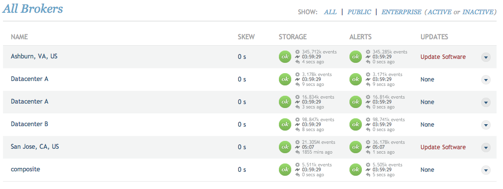

# Broker

The broker is implemented as the "noitd" service.

## noitd

The noitd service is a C application which starts a parent and child process.

The child process performs the checks, pulling or receiving the metrics and writing them to the journal.

The parent process acts as a watchdog; if the child process does not heartbeat on time, the parent process kills it and starts a new process to prevent the broker from locking up in an abnormal state.

The noitd service listens on port 43191 over SSL. This port receives connections from remote systems like [stratcon](/circonus/on-premises/roles-services/stratcon), web servers, [API](/circonus/on-premises/roles-services/api), and [streaming](/circonus/on-premises/roles-services/web-stream). Port 32322 is open for local connections over telnet to access the noitd console.

Logs reside in the `/opt/noit/prod/log/` directory and consist of the following:

- `access.log` - Logs access over the SSL port
- `noitd.log` - Logs for debugging

Should problems arise with the noitd service or with a check, look for any errors in the `noitd.log`.

### Interactive Console

Additionally, you may log into the broker's interactive console to look at local check configurations or the current state of the system. Documentation on this console can be in the Reconnoiter Manual found [here](https://github.com/circonus-labs/reconnoiter).

**Note:**

> Modifying items via the console is not supported by Circonus and may lead to a state where the systems do not agree on the configuration. Unless otherwise told by Support, the console should be used for information gathering only.

### Instability

If you find that the noitd service is in a state where it is constantly restarting, verify that the system is not under load. The noitd service can be sensitive to CPU and IO problems, which prevent the child process from heartbeating on time.

Should the problem persist, contact Support (support@circonus.com) about the issue, and try to get a core file of the child process. Note that because the parent process kills off the child, core files may become corrupt if they are stopped in the middle of writing. As a debugging step, you can run the noitd service in the foreground to prevent the parent from intervening. To do this, run the following (as root):

```
/opt/noit/prod/sbin/noitd -D -d -M
```

If the broker is running into an internal problem, this process should eventually crash just as it did while running as the normal service. If it does not, this usually means that the parent was not receiving the child's heartbeats, which could mean the child was busy in between pulses. Double check your IO or other system load and contact Circonus Support (support@circonus.com).

### noitd PKI Files

- `/opt/napp/etc/ssl/ca.crt`
- `/opt/napp/etc/ssl/appliance.crt`
- `/opt/napp/etc/ssl/appliance.key`

## Jezebel

Jezebel is a Java process that runs alongside noitd and provides a mechanism for running various checks like database queries, JMX, and LDAP. It listens on port 8083 for messages from noitd, which consist of check configurations. Then, noitd listens for a reply from jezebel with the check status, metrics, etc.

By default, jezebel does not log to any file. Logging can be temporarily enabled by modifying the `/opt/noit/prod/bin/jezebel` script and changing the logfile line from:

```
LOGFILE=/dev/null
```

to

```
LOGFILE=/path/to/desired/file
```

where "/path/to/desired/file" is the filepath of the file to which jezebel will log.

Note that this file will not rotate, so it is up to the user to manage it. Exceptions will be logged to this file, and some will describe a problem in enough detail to determine whether it is a user error or a system error. If a resolution cannot be found based on the error, please contact Circonus Support (support@circonus.com) about the problem.

## Enterprise Broker Updates

Package updates from Circonus are periodically available for Enterprise Brokers.

When an Enterprise Broker receives an "Update Software" message, use one of the following commands to install the update, depending on the Broker's operating system:

- Linux:

```
yum update circonus-field-broker
```

If your brokers are clustered, it is recommended that you do a rolling update.

## Broker Statuses

The screenshots below are samples from the [broker](/circonus/on-premises/roles-services/broker) status shown on the "Account: Brokers" page. These statuses are pulled from the [stratcon](/circonus/on-premises/roles-services/stratcon) application, which acts as an aggregator of the brokers and is how data flows into the Circonus infrastructure.

**Healthy Brokers**



The above screenshot shows the normal state of Circonus. Brokers are all connected, have been for some time, and are processing data normally. The time stamps listed next to the "OK" icons show how long each broker has been connected and how recent is the data coming from it.

**Recent or Unstable Connection**


The screenshot above shows a broker that was either recently restarted or that had a connection issue. The exclamation point (!) status icon will be displayed for 2 minutes, after which we consider the connection stable. If the connection time to the broker continuously resets, then we are still having connection issues and the user should verify that the [noitd](/circonus/on-premises/roles-services/broker#noitd) process on the broker is not crashing and that the connection between the broker and stratcon is good.

**Broker Down**


This screenshot shows a "fire" icon, similar to the "!" icon in the previous image. The "fire" icon denotes that the connection to the broker could not be established. Troubleshooting this issue is similar to an unstable connection described above; ensure the noitd process on the broker is running and that the connection between the broker and the stratcon service is good.

**Stratcon Down**


In this screenshot, the statuses show that we don't actually have information on the connection. If this was for a single broker, that typically means that the broker has not been associated with stratcon yet (it is likely new and the cronjobs that make the association have not yet run on the [hub](/circonus/on-premises/roles-services/hub#wwwbinnoitstratcon_syncpl) role). If we see this status for all the brokers, it is likely that the stratcon process is either down or can not be contacted from the web server.

Users should log into the stratcon machine and check the service to ensure it is running. If it is running, ensure that the web roles can talk to it. Refer to the [stratcon](/circonus/on-premises/roles-services/stratcon) role section for more information and possibly the [PKI Connectivity Troubleshooting](/circonus/on-premises/troubleshooting/#pki-connectivity-troubleshooting) section, as well.

## Broker Troubleshooting

### noitd Troubleshooting

If noitd fails to start after building a new broker, this could be the result of the call failing when attempting to look up the broker group or user.

There is a simple workaround for this issue.

Add this file to this directory:

```
/opt/noit/prod/etc/noit.local.env
```

The contents of the file should look like this:

```
USER=<uid>
GROUP=<gid>
```

In normal situations both of these values (the uid and gid) should be 43191.

This is a work around for a known issue that rarely occurs on a few machines and has yet to be reproduced in a test environment.

### Broker - Stratcon Connectivity Troubleshooting

For instructions for troubleshooting Broker - Stratcon Connectivity issues, refer to the [stratcon](/circonus/on-premises/roles-services/stratcon#broker---stratcon-connectivity-troubleshooting) section.
