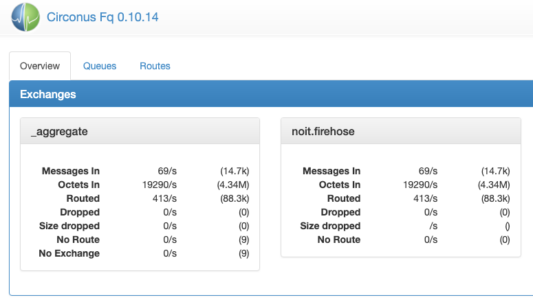
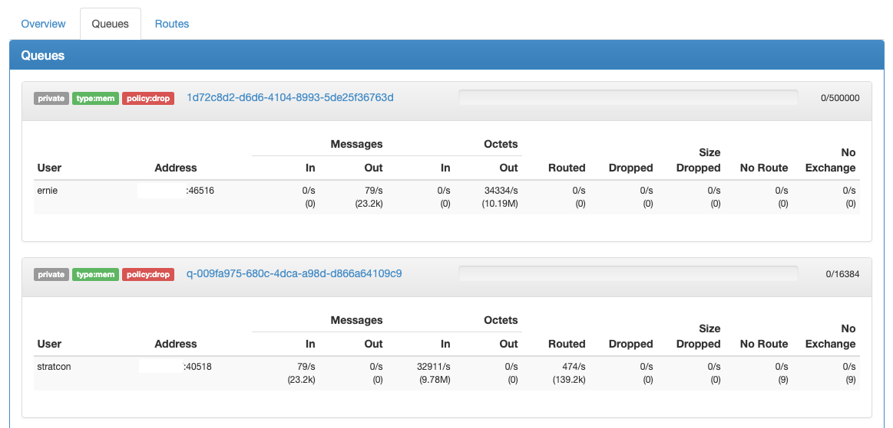
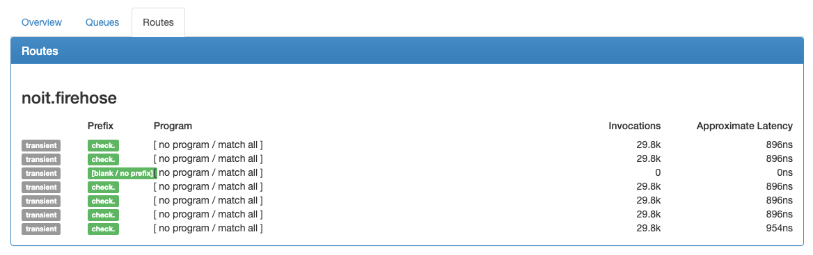

# MQ

The Circonus Message Queue (MQ) role is the center for most message passing
among systems such as
[stratcon](/circonus/on-premises/roles-services/stratcon),
[fault detection](/circonus/on-premises/roles-services/fault-detection),
[notification](/circonus/on-premises/roles-services/notifications), and others.

The MQ role consists of two different daemons, forming two "planes" or aspects
of handling messages:

- [FQ](/circonus/on-premises/roles-services/mq#fq) is the _data plane_, which
  consists of the actual metric data flowing through the system.
- [RabbitMQ](/circonus/on-premises/roles-services/mq#rabbitmq) is the _control
  plane_, consisting of signaling messages between components, such as Fault
  Detection signaling to Notification that a new alert has fired.

## FQ

Services:

- `circonus-fq`

FQ is a brokered message queue from Circonus Labs using a publish-subscribe
model. FQ is fast and performance-oriented. Messages come in, FQ determines
where to send them, and the messages go out.

Additional documentation about FQ can be found on the Circonus Labs
[Github Repository](https://github.com/circonus-labs/fq).

### FQ User Interface

The FQ User Interface can be accessed by visiting the node on port 8765 in your
browser.

The auto-updating console has 3 tabs, Overview, Queues, and Routes.

#### Overview



The Overview tab lists the active
[exchanges](https://github.com/circonus-labs/fq#exchanges) as well as aggregate
statistics of all exchanges. In each panel, the first column of statistics is a
live snapshot of the rate of various events in the system, and the second is
the total seen since the FQ node booted.

> The only exchange used in Circonus Inside is `noit.firehose`.

#### Queues



The Queues tab lists the [queues](https://github.com/circonus-labs/fq#queues)
that have been established, one panel per queue. Each panel lists information
about the queue at the top, including an indicator bar of in-flight messages.
To the right of the indicator bar is a count of in-flight messages and the
total size of the queue.

**Warning:**

> If the bar fills up and changes from green to orange, this indicates that the
> queue is full and messages are being lost.

#### Routes



The Routes tab lists the known
[routes](https://github.com/circonus-labs/fq#routes-and-programs) that senders
have established.

### JSON Metric Outputs

The same information in the UI is also available in JSON form from
`/stats.json`.

Example FQ JSON stats output:

```
{
 "version": "0.10.14",
 "exchanges": {
   "noit.firehose": {
     "messages": 79935499,
     "octets": 37989734444,
     "no_route": 57518,
     "routed": 80546043,
     "dropped": 80465039,
     "routes": {
       "24": {
         "route_id": 24,
         "prefix": "check.",
         "queue": "655dd8dc-78f1-4921-80c4-83f6b9f3bcc1",
         "permanent": false,
         "invocations": 2543822,
         "avg_ns": 298,
         "program": "prefix:\"check.\""
       },
       "25": {
         "route_id": 25,
         "prefix": "",
         "queue": "655dd8dc-78f1-4921-80c4-83f6b9f3bcc1",
         "permanent": false,
         "invocations": 1381540,
         "avg_ns": 189,
         "program": "prefix:\"\""
       }
     }
   },
   "_aggregate": {
     "no_exchange": 18,
     "messages": 79935517,
     "octets": 37989747476,
     "no_route": 57536,
     "routed": 80546043,
     "dropped": 80465039
   }
  },
  "queues": {
    "655dd8dc-78f1-4921-80c4-83f6b9f3bcc1": {
     "private": true,
     "type": "mem",
     "policy": "drop",
     "backlog_limit": 16384,
     "backlog": 16384,
     "refcnt": 9,
     "clients": [ {
        "user": "ernie"
        "remote_addr": "10.8.20.52"
        "remote_port": "46335"
        "mode": "peer"
        "no_exchange": "0"
        "no_route": "0"
        "routed": "0"
        "dropped": "0"
        "msgs_in": "0"
        "msgs_out": "477"
        "octets_in": "0"
        "octets_out": "325879"
      } ]
    }
  }
}
```

The "exchanges" section will have entries for all of the defined exchanges.
The "\_aggregate" entry is additive of all the listed exchanges.

### Snooping the FQ

The FQ package contains a utility, `fq-receiver`, that can be used to monitor
the message queue and optionally extract specific metric records for viewing.
This is useful to determine that a particular metric is included in the
ingestion pipeline.

The utility is written in Lua, so ensure that the
`circonus-platform-runtime-luajit` package is installed, and that
`/opt/circonus/bin` is in your shell's `PATH`.

The simplest invocation, which produces the largest amount of output, is to
show every message transiting the exchange:

```
/opt/circonus/bin/fq-receiver --host localhost --exchange noit.firehose
```

Use `Ctrl-C` to exit the program.

Each metric record appears on one line, with tab-delimited fields. The first
field indicates the record type:

- `M` records include a single numeric measurement for exactly one metric
  stream.
- `B2` records bundle multiple `M` records, stored as a base64-encoded payload.
- `H1` records include a single, base64-encoded histogram for exactly one
  metric stream.
- `S` records are status records and generally not of interest while
  troubleshooting.

To narrow the output based on a known account and/or check ID, use the
`--program` option to specify a filter. For example, to see all metrics for
account 2061:

```
/opt/circonus/bin/fq-receiver \
    --host localhost \
    --exchange noit.firehose \
    --program 'prefix:check.1.2061'
```

To further restrict to a specific check ID, the program would be
`prefix:check.1.2061.75940` for check ID 75940.

## RabbitMQ

Services:

- `circonus-epmd` (Erlang port-mapper)
- `circonus-rabbitmq` (RabbitMQ itself)

Logs are in `/var/log/circonus/rabbitmq`.

Additionally, RabbitMQ has a management interface running on port 55672,
accessible in your browser with the username/password: guest/guest. RabbitMQ
also has a management tool locally on the box:
`/opt/rabbitmq/sbin/rabbitmqctl`.

The management UI in the browser is the recommended method for data gathering.
From this tool, you can see the state of the cluster, connected clients,
exchanges, queues and message rates, etc.

### Restarting RabbitMQ

If a node in the cluster is offline, the preferred method of restarting it is
to first ensure that both the `circonus-rabbitmq` and `circonus-epmd` service
have both been stopped.

Start `circonus-epmd` first, then start `circonus-rabbitmq`. Once both have
been started, then via the management interface you should see a process
running on the local box and see the node reconnect to the cluster.

Further RabbitMQ documentation can be found on their site: http://www.rabbitmq.com/documentation.html
