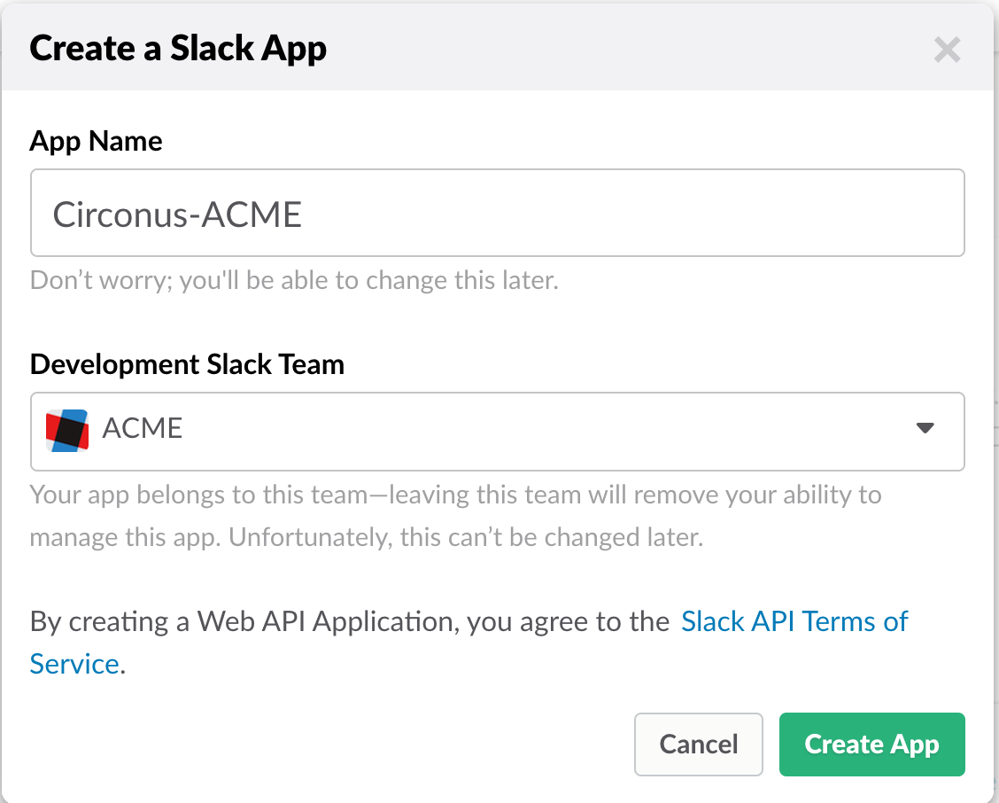
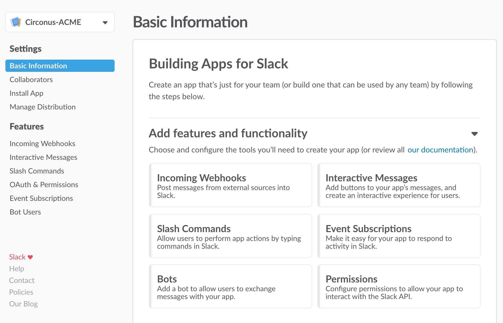
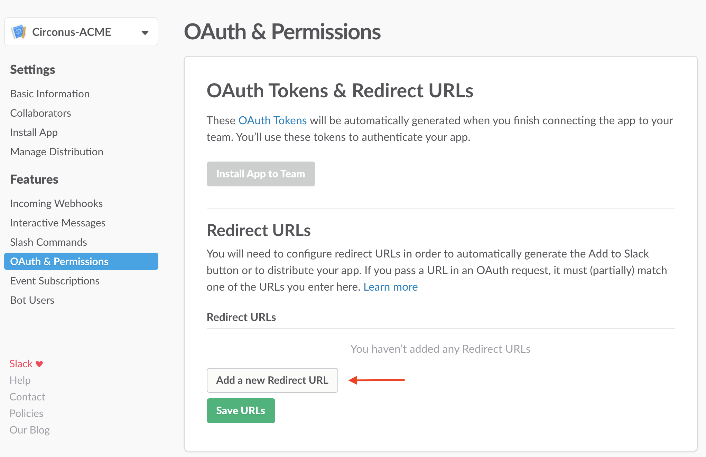
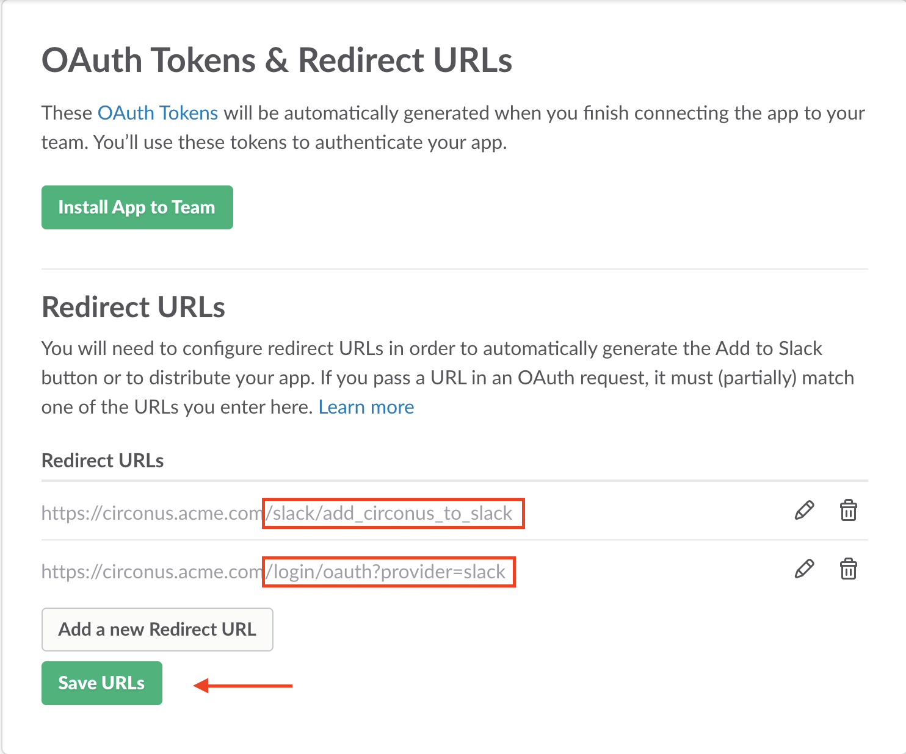
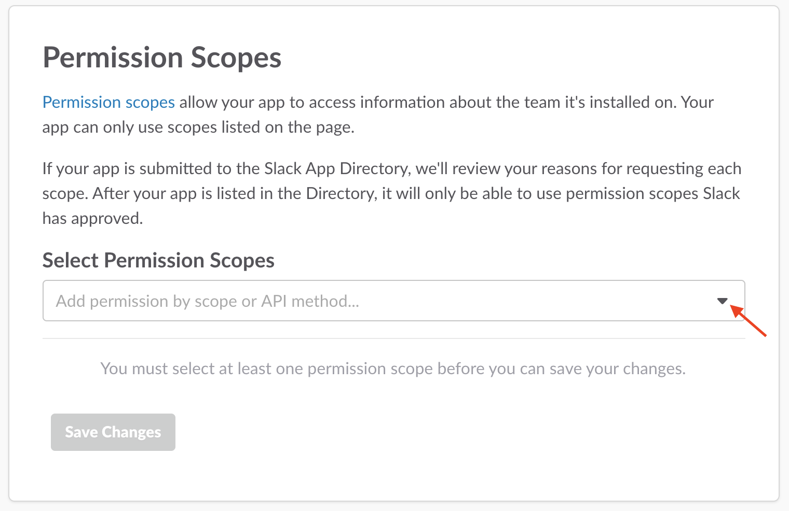
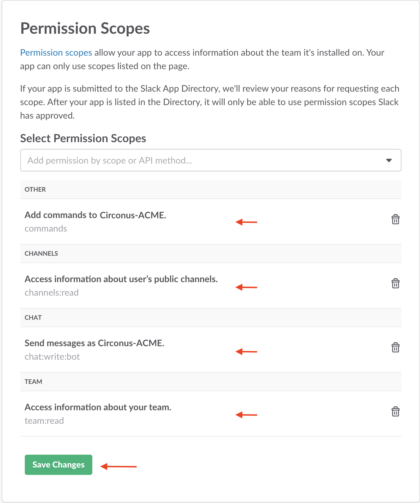
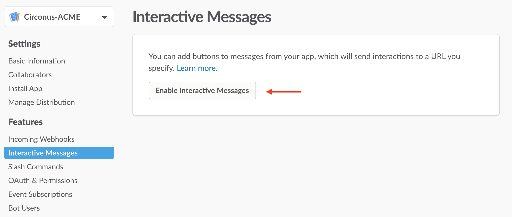
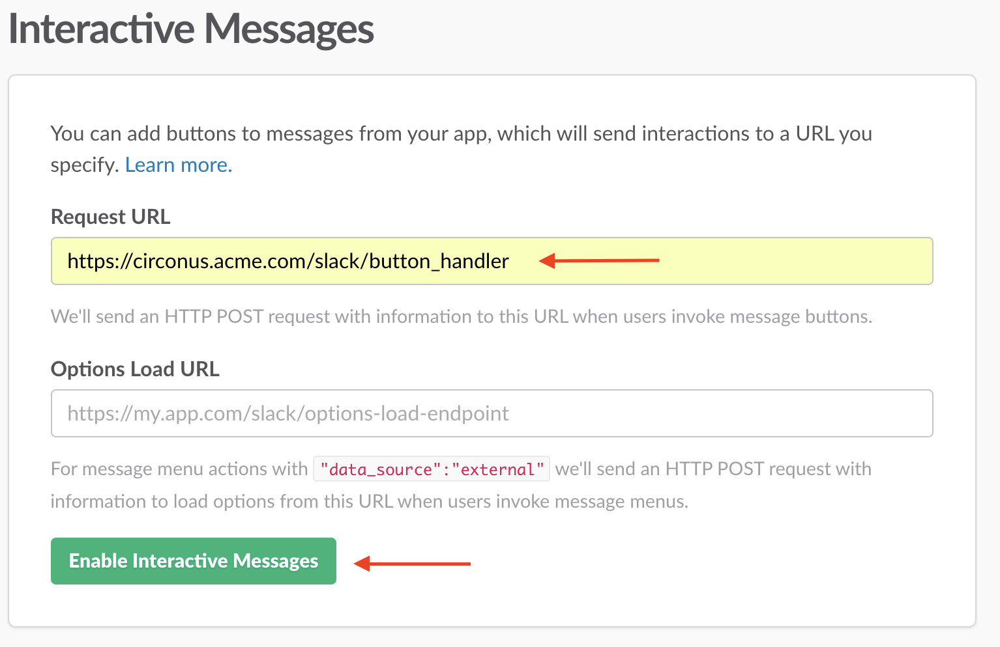
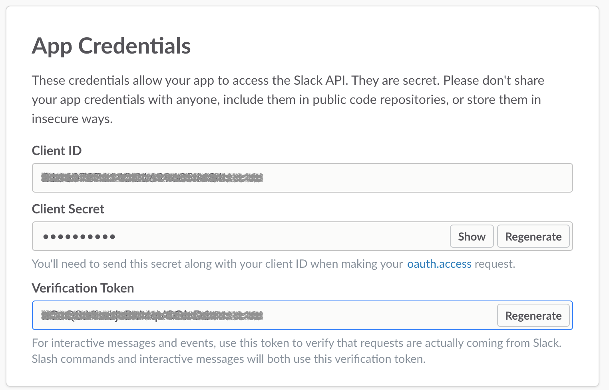

# Notifications

The notification role runs the services that creates alerts based on output from [fault detection](/circonus/on-premises/roles-services/fault-detection), and notifies the appropriate contact groups via their configured contact methods.

The main service is `circonus-bert`, which is a Java process. This service receives messages from the fault detection service over the [MQ](/circonus/on-premises/roles-services/mq) and determines what to do with them.

`circonus-bert` has an internal metrics API exposed on port 8084. To view these stats, use a web browser to visit http://hostname:8084/resmon. The sections of exposed metrics are:

- main - Boot time / uptime
- cases - Counts of alerts that are active / that have been created
- timers - Counts of the number of various timers that have been started
- contact - Number of times each contact method has been used
- noit_maintenance - Lists any broker that has been in maintenance since boot. If the time is anything other than 0, that is the epoch since which it has been in maintenance.
- mq - Counts of messages sent / received on the MQ

`circonus-bert` also maintains very detailed logs, located in `/var/log/circonus/bert.log`

These logs are rotated by size every 50MB, and the 25 most recent files are kept. If you find you need more history, contact Circonus Support (support@circonus.com).

## Troubleshooting Alerts

When trying to diagnose issues with the alerting system, it is best to start with the notification logs, as they are the most detailed of the relevant logs.

First, you should look for the messages from the [fault detection](/circonus/on-premises/roles-services/fault-detection) system about the metric in question. To do this, you must grep the logs for either the `check_uuid` or the JSON encoded metric name. Each message received over the [MQ](/circonus/on-premises/roles-services/mq) is logged in its JSON format on a single line.

After you have found the message, you will see output about what was decided about that message because the notification system's main loop is single threaded. This output all relates to the previous MQ message. When you reach another message line in the log, this marks the point where the system would no longer have been processing the previous message.

While there is detailed output about the decision making, this output is not always descriptive for non-Circonus engineers. If you have questions about the output, contact Circonus Support (support@circonus.com) and send snippets of the output in question.

## Interactive Debugger

If you wish to know the current state of an object in the notification system, there is an interactive console debugger available on any of the [web frontend](/circonus/on-premises/roles-services/web-frontend) nodes.

To start the debugger, run:

```
/www/bin/bert/debug_bert
```

Tab completion is supported. Hitting tab will give you a list of options depending on the current input. The main debuggable objects and their options are:

- account
- `<id>|<url>` - Lists any active alerts for the account
- `groups <id>|<url>` - Lists all contact groups and details for the account

- case
- `<id>` - Shows details about the alert

- check
- `<id>` - Shows details about any active alerts for this check

- contact
- `custom <id>` - Shows contact method and contact info for a custom contact
- This ID can be found by listing the details of a contact group.
- `group <id>` - Shows details about the contact group
- `user <id>` - Shows available contact methods and info for a user

- maintenance
- `<id>` - Shows details about an active maintenance window

- noit
- `<id>` - Shows details about an active broker
- The ID of the broker can be found in the admin interface "brokers" section.

- ruleset_group
- `<id>` - Shows details about a ruleset group including member rulesets, thresholds / equations and cases that are a part of that group
- The ID can be found in the UI by viewing the API object for the group and taking the numeric bits from the \_cid

- user
- `<id>` - Shows contact information for a user
- This ID can be found in the admin interface "users" section.

## Exceptions and Restarting

The notification system keeps a current running state in the [Web DB](/circonus/on-premises/roles-services/web-db), so it can be restarted as needed. If an exception is logged, and it has caused an alert to not be created or notified on, restart the notification system, then restart fault detection as well to receive the complete state of alerts.

If exceptions persist, contact Support (support@circonus.com).

## Notification Daemons

The various notification methods are handled by individual daemons or "bert bots" that run on the same node as `circonus-bert`. These services are named after the method they support, and their logs are all located in the directory: `/var/log/circonus/bots`.

The bots log and send out each message they receive, and log any issues they encounter. The list of bots is as follows:

- `circonus-bert-email-bot`
- `circonus-bert-http-bot`
- `circonus-bert-pagerduty-bot`
- `circonus-bert-sms-bot`

## Slack Alerting

Circonus Inside customers can enable Slack Alerting by creating a Slack Contact Group and assigning it to one or more Rulesets. The alerts can be configured with action buttons allowing users to acknowledge alerts or set maintenance windows from directly within Slack.

To enable this feature, you will need to visit Slack.com, create a Slack App, and configure it as shown in the steps below.

### Create Slack App

To start, visit [https://api.slack.com/apps](https://api.slack.com/apps) and click the "Create New App" button. In the form that is presented, give your app a name and select which of your Slack teams will own and manage the app.



Then click the "Create App" button.

You will be directed to a screen to enter Basic Information about your app.



You can navigate to the various components of your app using the menu to the left.

### OAuth Permissions

On the navigation menu under Features, click OAuth & Permissions and then click Add a new Redirect URL:



You will need to add the following two redirect URLs, one for adding the Slack App to your Circonus installation, and one for your users to sign in via Slack, both of which are required for configuring a Slack Contact Group in Circonus. Substitute your domain name (refer to the URL you use to access the Circonus UI, for example circonus.acme.com):



Then click Save URLs.

### Permission Scopes

On the same page, scroll down to Permission Scopes and click the dropdown menu to display the list of scopes.



Add the following scopes. Note that you can type the scope name to quickly find the scope in the dropdown:

- `channels:read` - to populate the Slack Contact Group channels selector
- `team:read` - to display your team name on the Slack Contact Group
- `chat:write:bot` - to send alerts to your Slack channel
- `commands` - to enable Circonus slash commands

When finished, your screen should look like this:



Then click Save Changes.

### Interactive Messages

Note: You may skip this step if you do not wish to use action buttons on Slack alert notifications. Action buttons allow users to acknowledge alerts or set maintenance windows from directly within Slack.

If you configure this feature, Slack.com must be able to reach the Circonus web service on your premises via a URL you specify.

On the navigation menu under Features, click Interactive Messages, and then click Enable Interactive Messages:



Enter the Request URL for the `/slack/button_handler` endpoint.

Note: the Request URL must be an `https://` endpoint for action buttons to work.

The Options Load URL can be left blank.



Then click Enable Interactive Messages.

### App Credentials

On the navigation menu under Settings, click Basic Information and scroll down to App Credentials.



The values there will need to be added to your site configuration. Please get assistance from Circonus for this.

You may scroll further and configure the Display Information for your app or delete the app if you wish to start over.

### Configure Slack Contact Group

You are now ready to create a Slack Contact Group in Circonus which you can add to a Ruleset for receiving alerts in your Slack channel.

See the [Slack Contact Group](/circonus/alerting/contact-groups/#slack) documentation to proceed.
