# Circonus Dashboards

Circonus dashboards provide a unified visualization framework for your cloud services, infrastructure, and applications and make it easy for you to explore your metric, log, or trace data within the platform.

From real-time infrastructure monitoring (IM) to application performance monitoring (APM), distributed tracing, outage response and data exploration, Circonus dashboards give you the visualizations needed to graphically represent trends, outliers, and patterns in your data.

Circonus dashboards also provide exceptional versatility. The image below depicts a dashboard in fullscreen mode with web traffic logs filtered to show US customers using either OSX or iOS devices.

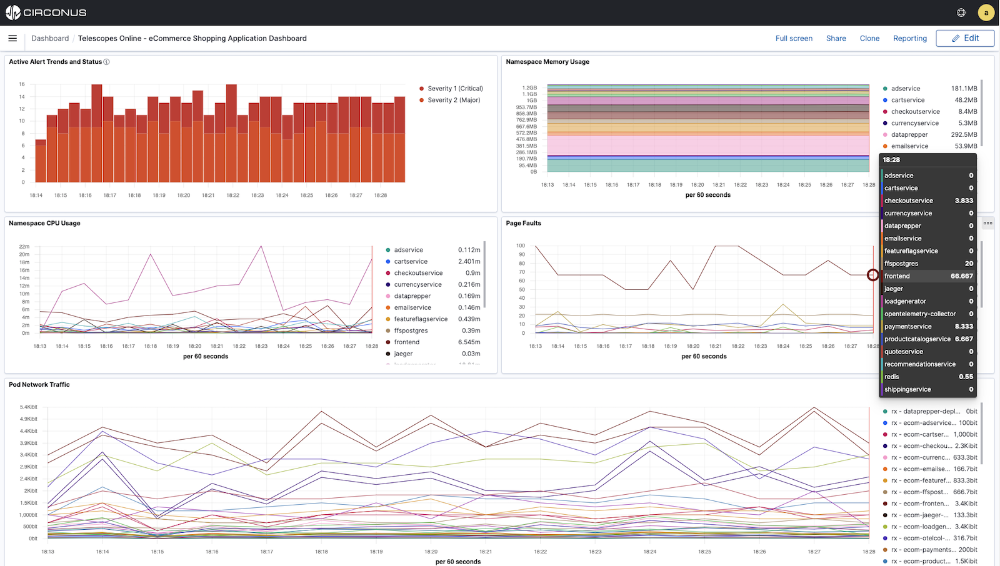

## Dashboard Structure

With the main menu undocked, a dashboard will consume the entire width of the browser window. Otherwise, it will automatically resize to accommodate the width of the main menu.

To dock or undock the main menu on the left-hand side of the screen, select **Dock navigation** or **Undock navigation** at the bottom of the menu below **Recently viewed**.

Every dashboard consists of four different sections:

1. [Command bar](#dashboard-command-bar)
2. [Search query bar](#search-query-bar)
3. [Time and data filters](#data-filters)
4. [Visualization panels](/circonus3/visualizations/introduction/#working-with-visualization-panels)

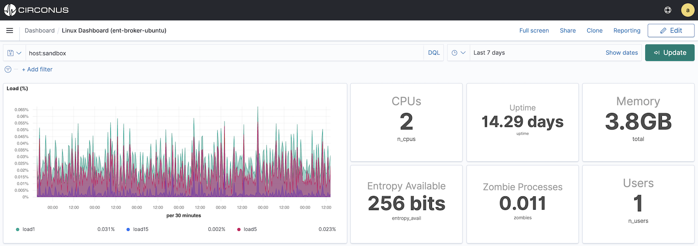

### Dashboard Command Bar

The dashboard **command bar**, which is located in the upper right corner of the dashboard, allows you to place the dashboard into full-screen mode, share the dashboard, clone the dashboard, access reports for the dashboard, or choose to edit the dashboard.

- **Full screen** is designed for the large screens often used in Operations centers. It places the browser into full-screen mode and hides the title bar to maximize screen real estate. You can exit full-screen mode by clicking on the **Exit full-screen** button in the bottom left-hand corner of the dashboard or by simply hitting the `esc` key.

- **Share** is designed to make it easy to share the dashboard as a permalink or embed the dashboard as an iFrame.

  If you choose to embed the dashboard in an existing application using an iframe or intranet site, you can control which elements are exposed such as the **Top menu** and **Query bar**. The permalink does not give you this display control.

  Both the permalink and embed sharing options allow you to choose between a `Snapshot` (which is fixed to the current time, filters, etc.) or a `Saved object` (which links to a live dashboard). You can toggle the use of a `Short URL` for both options.

- **Clone** allows you to clone an existing dashboard and modify or edit it as required.

- **Reporting** allows you to download the dashboard as a PDF or PNG, and/or create a report definition from the dashboard that can be scheduled.

- The **Edit** button (far top right corner) allows you to edit the current dashboard if you have permission to edit or modify the dashboard displayed.

### Search Query Bar

Within the **Search query bar**, you can filter the data displayed on a dashboard by applying a saved query or by entering search criteria.

Saved queries include both the search criteria and filters. To apply a saved query, click the disk icon on the left of the **Search query bar**. Then, click the query name to apply it to the dashboard. While a saved query is applied, click the disk icon to manage the query. Saved queries can be modified (**Save Changes**), duplicated (**Save as new**) or deleted (by hovering over its name and clicking the trash can icon). To stop applying a saved query, click the disk icon again and then the **Clear** link. If a saved query is not already applied, you can save the existing search criteria and filters as a new query by clicking the disk icon and then the **Save current query** button.

Search criteria can be expressed in [DQL (Dashboards Query Language)](/circonus3/additional-resources/query-languages/dql/) or [Lucene](/circonus3/additional-resources/query-languages/lucene-support/) by clicking on **DQL** on the right of the **Search query bar** and toggling the option for DQL. Please note that Lucene is recommended for advanced users only.

### Date and Time Filters

Date and time filters can be applied in a couple of different ways.

Clicking on the calendar icon on the left side of the date/time field reveals several options. At the top, you can quickly configure a new time frame, such as the last 20 minutes. If you use this **Quick Select** option, don't forget to click the **Apply** button to the right of the dropdowns. You can also choose from **Commonly used** or **Recently used** time frames. Lastly, you can select the refresh rate within the **Refresh every** section, or stop the dashboard from refreshing by using the **Stop** button within this section.

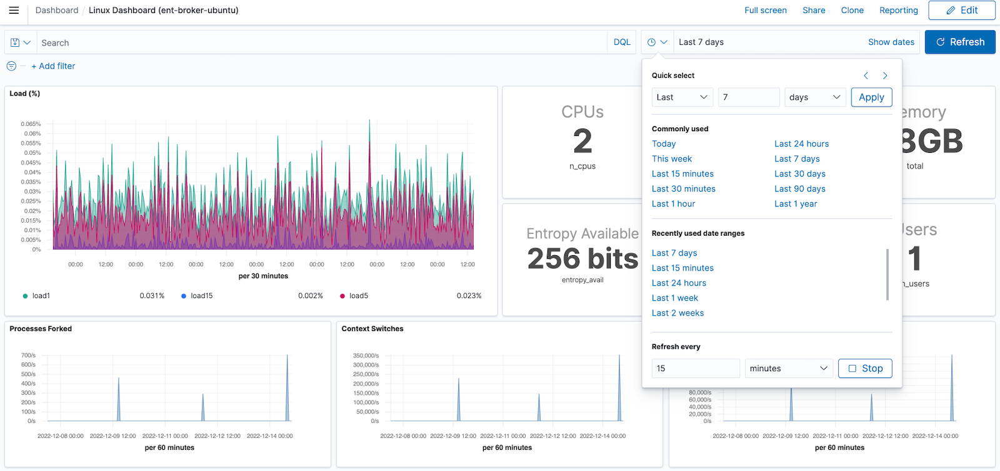

Clicking the **Show dates** link on the right side of the date/time field enables you to specify each date or time within the range as **Absolute**, **Relative**, or **Now**.

### Data Filters

Data filters let you refine a dashboard by using fields or tags supported by the metric, log, or trace data displayed within the dashboard.

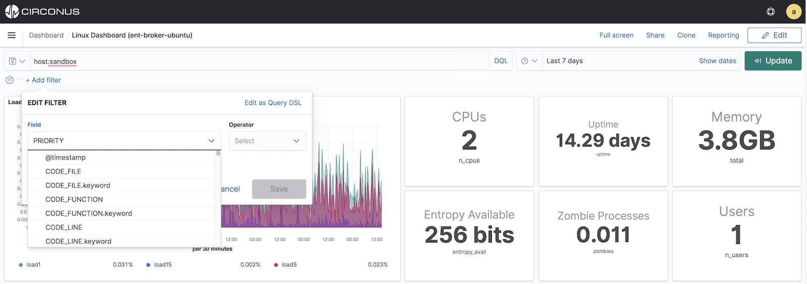

A filter is a single field, operator (condition), and value. If multiple filters are defined, they will be combined into a single logical filter using **"and"**. For example, if you specified three filters, they would be joined together as Filter1 **and** Filter2 **and** Filter3.

To create a filter, click the **+Add filter** link and select a **Field**, **Operator** (e.g., is, is not, is one of, is not one of, exists, does not exist) and **Value** (if applicable given the **Operator**). The operators available will be dependent on the type of field selected.

You can create multiple filters by clicking again on the **Add Filter** link. Repeat the steps above for the number of filters required.

You do have the option to express and edit the filter in [OpenSearch Query DSL](https://opensearch.net/docs/1.3/opensearch/query-dsl/index/) via the **Edit as Query DSL** link. However, this is only recommended for advanced users with a detailed understanding of Query DSL syntax.

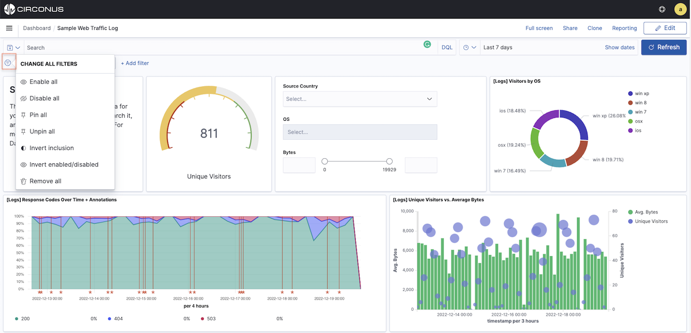

You can manage how all filters are applied by clicking the filter icon to the left of your filters. From here, you can:

- **Enable/Disable all** filters
- **Pin/Unpin all** filters
- **Invert inclusion** (applies a `NOT` to all the filters)
- **Invert enabled/disabled** (has the same effect as Enable/Disable all)
- **Remove all** filters

To manage any specific filter, simply click on its name. This will display a menu where you can take the following actions for the filter:

- **Pin across all apps**
- **Edit filter** which lets you edit the field name, list operation, and value (if applicable)
- **Exclude results** (applies a `NOT` to the filter)
- **Temporarily disable** or **Re-enable** the filter
- **Delete** the filter

## Managing Dashboards

### Creating Dashboards

Dashboards can be created by cloning existing dashboards or by creating new dashboards from scratch.

To create a new dashboard, first, choose **Dashboards\*\*** from the main menu. Then select the **+ Create dashboard** button in the right corner above the **Dashboard** list.

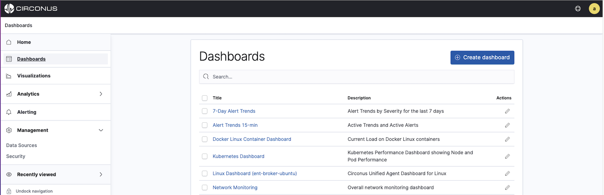

This will create a blank dashboard to which you can begin adding visualization panels (objects).

### Editing Dashboards

You can edit a dashboard by first viewing it and selecting **Edit** from its **Command bar**. You can also choose to edit a dashboard by clicking the pencil icon within the **Actions** column for the desired dashboard within the dashboard list.

Once in edit mode, you have the same tools available as you would during the creation of a new dashboard.

### Adding Visualizations

You can create new visualizations for your dashboard or select from existing ones. Please note that you must first be editing a dashboard to add new or existing visualizations to it.

To create a new visualization panel while editing a dashboard, click on the **+ Create new** button within the **Command bar**. If the dashboard is empty, you can also click this button within the placeholder panel on the left-hand side of the dashboard.

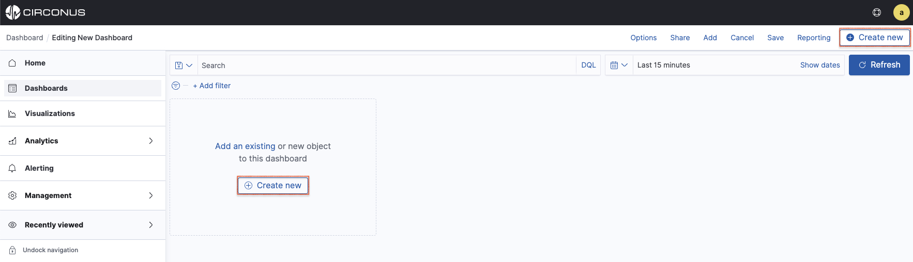

The **New Visualization** dialog allows you to select from several different charts and visualizations.

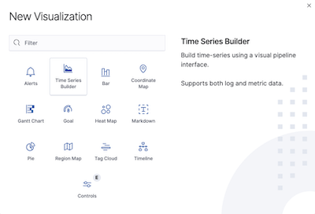

To add an existing visualization to a dashboard you're editing, click **Add** in the [dashboard command bar](/circonus3/dashboards/dashboard-overview/#dashboard-command-bar) (highlighted below). A list of available visualizations will display on the right side of the screen. You can browse the list of visualizations or sort and filter the list as needed.

To finish adding an existing visualization, simply click its name. Note that visualizations may be added behind the panel and thus, may not be immediately visible. When you're done adding visualizations, click the "x" for the **Add panels** dialog or click the underlying dashboard.

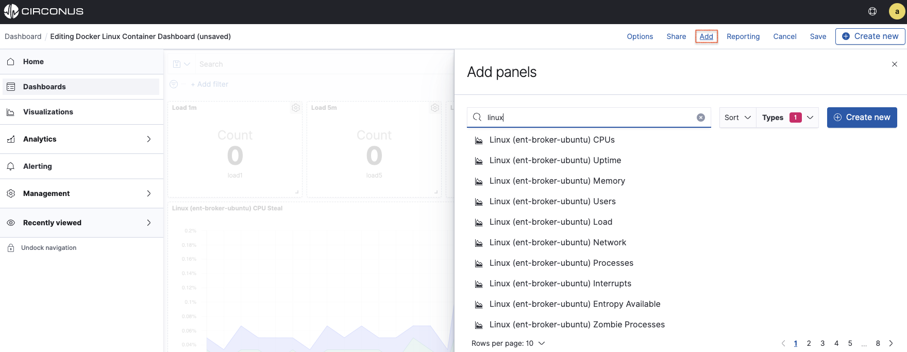

For more information on the available visualizations and their configurations see the [**Working with Visualizations**](/circonus3/visualizations/visualizations-management/).

### Moving or Resizing Visualizations

To resize a visualization panel, you must be in **Edit mode**. You can tell if you're in **Edit mode** when each visualization panel displays a dotted outline as well as a cog icon in the top right corner.

Resize a visualization panel by clicking on the bottom right corner of the panel and dragging. The panel can be resized however needed; there are no row or column restrictions. When resizing has been initiated, the corner will highlight as shown below.

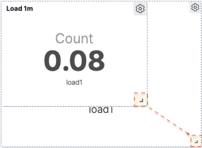

To move a visualization panel, simply click on the title. Once the title is highlighted, you can simply drag the panel to the desired position on the dashboard.

### Deleting Visualizations

To delete a visualization panel from a dashboard, select the cog in the top right of the panel. Click `...More >` and then **Delete from dashboard**. If you accidentally delete a panel, choose **Cancel** from the **Command bar** to abort any changes you've made.

As a precaution, you might want to consider cloning the original dashboard before making destructive changes.

### Inspecting Visualizations on a Dashboard

Once a visualization has been added to a dashboard, you may be able to inspect the data behind it. Hover over the visualization panel and click the "..." icon which appears in the top right corner. If **Inspect** is listed, simply click on it to see a table of the visualization's data.

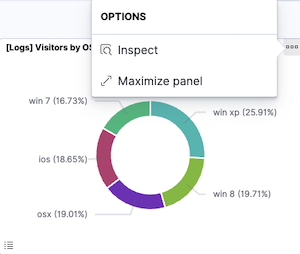

You can download a visualization's data as a comma-separated values (CSV) file in Formatted or Raw format. Formatted downloads the data in table format. Raw downloads the data as provided — dates are timestamps, numbers don’t have a thousand separators, and so on.

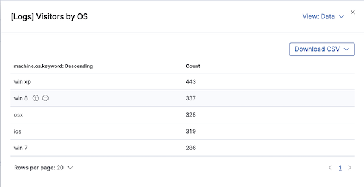

To view the requests that collected the data, select **Requests** from the **View** menu in the upper right. The available views will depend on the type of visualization you have chosen to inspect.

### Deleting Dashboards

If you wish to delete a dashboard, first navigate to the dashboard list by selecting **Dashboards** within the main menu. Click the checkbox in front of the title of the dashboard you'd like to delete. Repeat this action for all dashboards you'd like to delete. A red **Delete** button will appear indicating the number of dashboards selected for deletion.

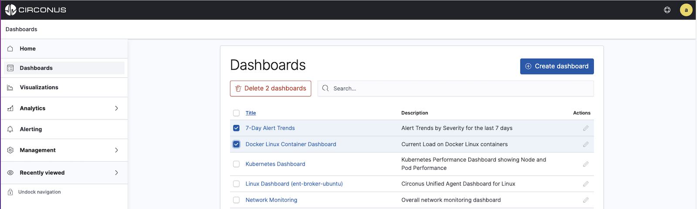

If you select the checkbox next to the **Title** column heading, it will select ALL dashboards for deletion.

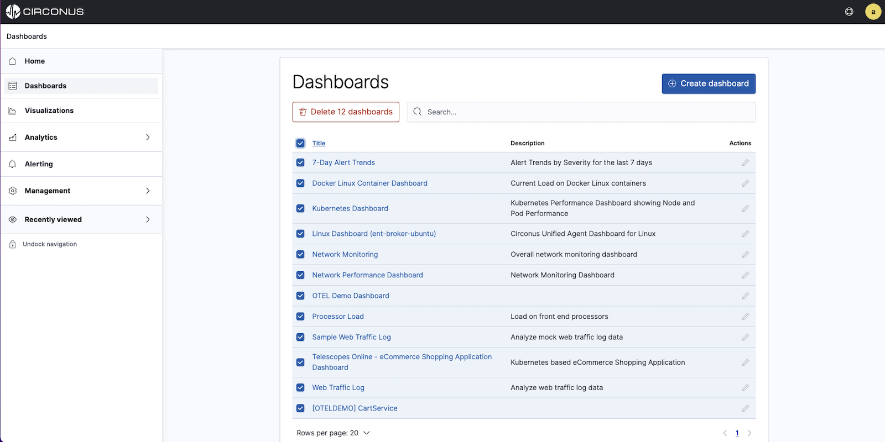

You will be prompted to confirm deletion for the selected dashboards as this is an unrecoverable action.
