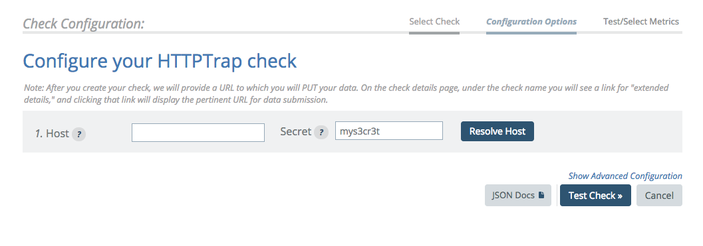
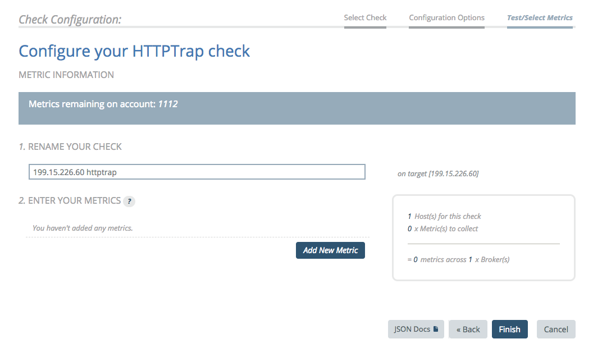
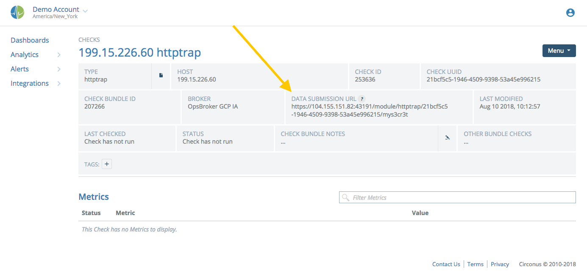
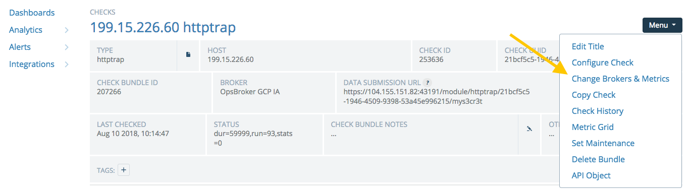
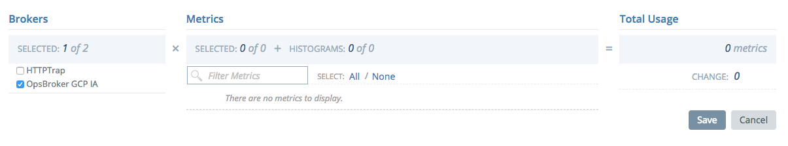

# JSON:Push (HTTPTrap)

## Overview

The JSON:Push (HTTPTrap) is a little different than the rest of the Circonus checks; instead of pulling information on a regular interval, it accepts JSON payloads sent via HTTP PUT requests. This data is not polled regularly from the Circonus Broker, but is pushed to the Broker from the monitored target. This is the easiest way to get arbitrary data into Circonus.

The JSON: Push Check receives metrics formatted as JSON (JavaScript Object Notation), a lightweight format for storing and transporting data. JSON is often used when data is sent from a server to a web page, and is a convenient way to format metrics for Circonus.

## Configuration

During the configuration process you will be asked for 2 items: the target host for this check and a "secret". The host for push style checks should be the IP or the resolvable server name from where the packets originate. The "secret" will be used as part of your submission URL for added security. The secret is a string containing letters, numbers, or underscores.



The "JSON Docs" button describes how the JSON you PUT will be parsed into metrics. See [below](/circonus/integrations/library/json-push-httptrap/#httptrap-json-format) for more details.

Clicking "Test Check" will navigate to the final confirmation screen as normal. Since Circonus can't pull the data, you will be asked to enter your metric names on this screen. It's alright if you don't know the metrics at this point; just click "Finish" and the check will be created with no metrics.



After you create your check, we will provide a URL to which you will PUT your data. At this point, navigate to the details page for your newly created HTTPTrap check. Note the "Data Submission URL" link in the middle row.



After submitting data for the first time, you will want to specify which metrics you collect. Use the Menu at top right and click "Change Brokers & Metrics" to switch the metrics list into an edit mode.



This will allow you to select and deselect metrics you want to collect. Click the "Save" button to finalize your choices.



### HTTPTrap JSON Format

This subsection describes how the JSON you PUT will be parsed into metrics.

This is an example of JSON format:

```json
{
  "number": 1.23,
  "bignum_as_string": "281474976710656",
  "test": "a text string",
  "container": { "key1": 1234 },
  "array": [1234, "string", { "crazy": "like a fox" }]
}
```

There is no particular data structure required by Circonus; format your data however you wish and Circonus will parse it accordingly. Circonus would parse the above example into the following metrics (services tells how many metrics resulted from parsing):

| Name             | Type    | Value             |
| ---------------- | ------- | ----------------- |
| array`0          | numeric | 1234              |
| array`1          | text    | "string"          |
| array\`2\`crazy  | text    | "like a fox"      |
| bignum_as_string | text    | "281474976710656" |
| container`key1   | numeric | 1234              |
| number           | numeric | 1.23000000        |
| test             | text    | "a text string"   |
| services         | numeric | 7                 |

In addition to strings and numeric values, values can also be described using
`{ "_type": <type>, "_value": <value> }` syntax. The available types are the
same used in the
[circonus-agent](https://github.com/circonus-labs/circonus-agent/tree/master/plugins#metric-types)
(`s, l, L, i, I,` and `n`). Values can be strings or numbers, but are
interpreted pursuant to the type specified. For example,

- `{ "_type": "s", "_value": 812345 }` becomes the string `812345`.
- `{ "_type": "L", "_value": "2187345234234" }` becomes the unsigned, 64-bit
  integer `2187345234234`.

For example, to pass multiple values for histogram data using httptrap as an array, you could use the following example format:

```json
{
  "histogram": {
    "_type": "h",
    "_value": [1, 2, 3, 4, 5]
  }
}
```

#### Histograms

Histogram submission must use the `{ "_type": <type>, "_value": <value> }`
format. The type is `h`.

Numeric values for histograms can be provided in two ways:

- As a list. For example `[123,123,234,345,234,1]`.
- As a prebucketed histogram. For example `["H[0.1]=3", "H[11]=7"]`, would mean that in the bin 0.1 (which is 0.10 to 0.11) there are 3 samples and in the bin 11 (which is 11 to 12) there are 7 samples.

An example of the list form:

```json
{
  "foo": {
    "_type": "h",
    "_value": [123, 123, 234, 345, 234, 1]
  }
}
```

An example of the prebucketed form:

```json
{
  "foo": {
    "_type": "h",
    "_value": ["H[0.1]=3", "H[11]=7"]
  }
}
```

#### Stream Tags

The HTTPTrap JSON format also permits the inclusion of [metric stream
tags](https://www.circonus.com/2018/11/introducing-circonus-stream-tags/). Tags
take the following form:

```
foo|ST[env:prod,app:web]
```

In this case, `foo` is the metric name, and `ST[]` encompasses a
comma-separated list of `category:value` pairs. The tag section is separated
from the metric name with a `|` (vertical bar). Here we have specified two
tags, `env:prod` and `app:web`.

Category strings may contain upper- and lowercase letters (`A-Z` and `a-z`),
numerals (`0-9`), and the following characters:

```
`+!@#$%^&"'/?._-
```

Values may contain all of the above, plus colon (`:`) and equals (`=`).

Any tag characters that do not fall into the above set can still be submitted
if they are base64-encoded and passed in a special wrapper format. For example,
a metric like this:

```
foo|ST[~(bar):<quux>]
```

has tilde (`~`), parentheses `()`, and greater/less-then (`<>`) which are all
outside the allowed character set. In this case, base64-encode the category and
tag separately, and enclose each in `b""`, separating category from value with
a colon as usual:

```
foo|ST[b"fihiYXIp":b"PHF1dXg+"]
```

The full `category:value` string, including the colon, may not exceed 256
characters. This applies regardless of whether the base64-encoded form is used
or not.

Each unique combination of metric name and tags counts as one "metric stream"
in Circonus. For example:

```
foo|ST[env:prod,app:web]
foo|ST[env:qa,app:web]
foo|ST[env:prod,app:database]
foo|ST[env:qa,app:database]
```

represent 4 separate streams. **Use caution when applying tags for dimensions
with high cardinality, such as user-id, container-id, UUIDs, or other unbounded
sets of values.**

Submitting tagged data works the same way as untagged data. The full name with
tags becomes the key (note that the quotes around base64-encoded tags must be
escaped):

```json
{
  "foo|ST[env:prod,app:web]": { "_type": "n", "_value": 12 },
  "foo|ST[env:qa,app:web]": { "_type": "n", "_value": 0 },
  "foo|ST[b\"fihiYXIp\":b\"PHF1dXg+\"]": { "_type": "n", "_value": 3 }
}
```

Both tagged and untagged metrics may be submitted together.

### Timestamped Submission

If HTTPtrap submissions contain an additional value with `_ts`, the individual
measurement will be timestamped with the provided value instead of the default
"now." The value of `_ts` should be specified in milliseconds since UNIX epoch
1970-01-01 00:00:00-0000. `_ts` is a peer to the `_type` and `_value` keys
specified above.

Timestamped submissions are not subject to the period-based accumulations noted
in [Advanced Configuration](#advanced-configuration) above. They are stored
with millisecond granularity. If multiple measurements for a metric are
timestamped in the same millisecond, the largest by absolute value will
ultimately be stored.

Histograms used in conjunction with `_ts` values, do not support the array formats,
and must be sent as a full base64 encoded histogram record. This record format is
provided as part of the `libcircllhist` library. For example in Python:

```python
from circllhist import Circllhist

h = Circllhist()
h.insert(0.1,3)
h.insert(0.2,3)
print(h.to_b64())
```

A base64 example JSON document would be:

```json
{
  "foo": {
    "_type": "h",
    "_value": "AAwAAAGeAVD2AX8BFPcAkzL4AawBMvkBWQEU+gARMvsAO0b8AXUBWv0ADQr+ALJa/wCfFAAAgA==",
    "_ts": 1604936367789
  }
}
```

### Batched Timestamped Submission

When sending multiple measurements in a single payload, these may be batched into a single JSON document:

```json
{
  "foo": { "_type": "n", "_value": 1, "_ts": 1604936367789 },
  "foo": { "_type": "n", "_value": 2, "_ts": 1604936552774 },
  "foo": { "_type": "n", "_value": 3, "_ts": 1604936616422 }
}
```

Alternatively, multiple complete JSON payloads, each with one measurement per
metric, may be streamed in succession. This may be necessary if your JSON
implementation does not permit the same name/key to be repeated in one document
(which is allowed per the JSON specification, but not always implemented as
such.)

```json
{ "foo": { "_type": "n", "_value": 1, "_ts": 1604936367789 } }
{ "foo": { "_type": "n", "_value": 2, "_ts": 1604936552774 } }
{ "foo": { "_type": "n", "_value": 3, "_ts": 1604936616422 } }
```

It is important to note that both JSON objects, and multiple serial objects, are both
processed as a stream, rather than after the entire object has been loaded. For example,
if a JSON object had 10,000 datapoints in it, and the last one had a parse error, the previous
9,999 datapoints would still be ingested even though the object as a whole was invalid JSON.

#### Period

In the absence of [explicit timestamps](#timestamped-submission), multiple
measurements received in one check "Period" are handled according to the value of
the Asynchronous collection setting in the check configuration
(`asynch_metrics` in the API object):

- With Asynchronous enabled, the largest of the simultaneous values seen (with
  millisecond granularity) will be stored immediately.
- With Asynchronous disabled, each arriving measurement updates the last value seen
  for the metric. When the period expires, the last value seen is stored.

"Timeout" is not relevant for HTTPTrap checks.

### Examples

Here is a complete example of how to submit data to a HTTP JSON Trap:

```
curl -X PUT 'https://api.circonus.com/module/httptrap/a9856a6a-3b46-e18b-d890-acafaa955348/mys3cr3t' --data '{
    "number": 1.23,
    "bignum_as_string": "281474976710656",
    "test": "a text string",
    "container": { "key1": 1234 },
    "array": [  1234,
                "string",
                { "crazy": "like a fox" }
             ]
  }'
```

An example of streaming multiple JSON documents:

```
curl -X PUT 'https://api.circonus.com/module/httptrap/a9856a6a-3b46-e18b-d890-acafaa955348/mys3cr3t' --data '
    { "foo": { "_type": "n", "_value": 1, "_ts": 1605033941001 } }
    { "foo": { "_type": "n", "_value": 2, "_ts": 1605033941002 } }
    { "foo": { "_type": "n", "_value": 3, "_ts": 1605033941003 } }'
```
