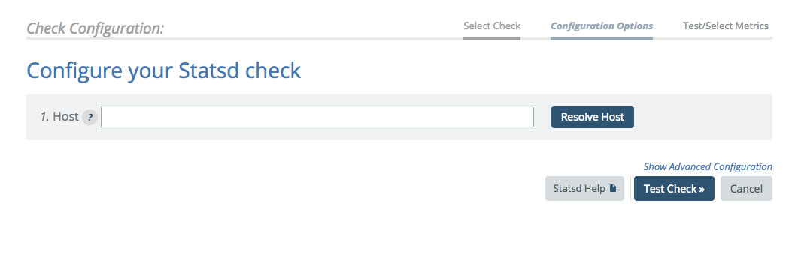
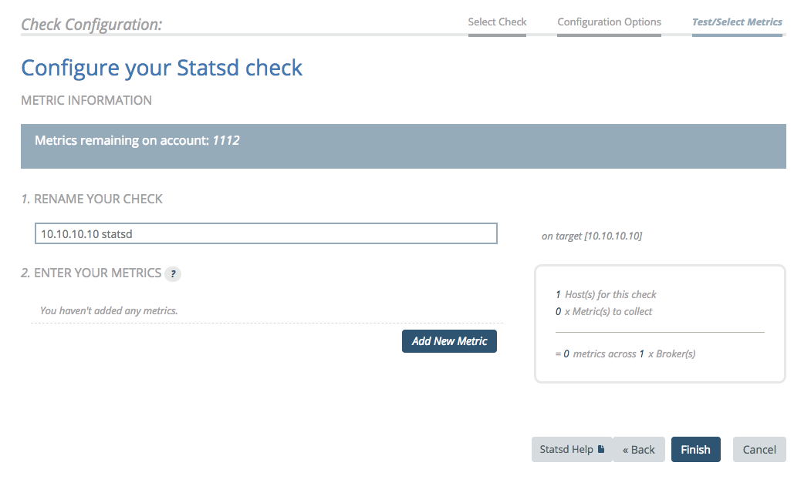
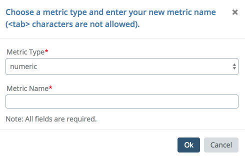

# StatsD

## Overview

Push count and timer metrics to your Circonus Enterprise Broker using Statsd over UDP (the standard way) or over TCP. This check does not pull data; you must push the data to the broker.

## Configuration

Creating a statsd check requires choosing the statsd check and selecting a target host.



> The target host must be an IP address and the packets that arrive at the broker must have that IP address as the source address.

The next step is optional. If you know the metrics you expect to see via statsd, you may enter them by clicking "add new metric".



Enter the name of the metric and its check type. You may repeat this process for multiple metrics.



> You may elect to collect no metrics at this time. Under normal operating conditions where data is being collected, you can view the check and see what metrics are arriving and available for collection (this could take a few minutes). Using the "Update Metrics" feature on the "view check" page, you can enable any metric you see. This is the preferred method if you have more than a few metrics to collect.

When submitting data, send to port 8125/8126 of the system you are using to collect data (port 8125 via UDP or port 8126 via TCP).

## Metrics

Metrics are reported from Circonus in the following format:

```
<Metric Name>`<Metric Type>
```

Counting metric types:
|Metric Type|Description|
|-----------|-----------|
|count|The number of events received for the metric.|
|counter|The most recent counter value.|
|rate|The sampling rate, if enabled.|

Timing metric types:
|Metric Type|Description|
|-----------|-----------|
|count|The number of events received for the metric.|
|timing|The most recent timing value.|

Gauge metric types:
|Metric Type|Description|
|-----------|-----------|
|count|The number of events received for the metric.|
|gauge|The most recent gauge value.|

So, for example, if you have a counting metric named blah and wanted to pull both the count and counter types, you would look for the following metrics:

blah\`count

blah\`counter

### Stream Tags

To submit stream tagged StatsD metrics into Circonus, you must pass in the StatsD metric name and append the tags to the series name. The format for a tagged StatsD metric is as follows:

metric_name:value|type|@sample_rate|#tag1:value,tag2,#tag3:value

### Treatment of Counters

Statsd counters in Circonus are converted into a histogram. They are implemented as a count of samples in the 0-bucket. CAQL provides a way to count these samples using `histogram:count()`. The 0-bucket here was chosen so that attempting to `histogram:sum()` the counter will result in a clearly incorrect `0` value. It is important to remember that histogram buckets are a range of values, so attempting to use the bucket that contains `1` would cause `histogram:sum()` to return a close, but incorrect value (within the guaranteed 5% error margin). The 0 bucket was chosen to return the most obviously incorrect value to minimize chances of this occurring.
