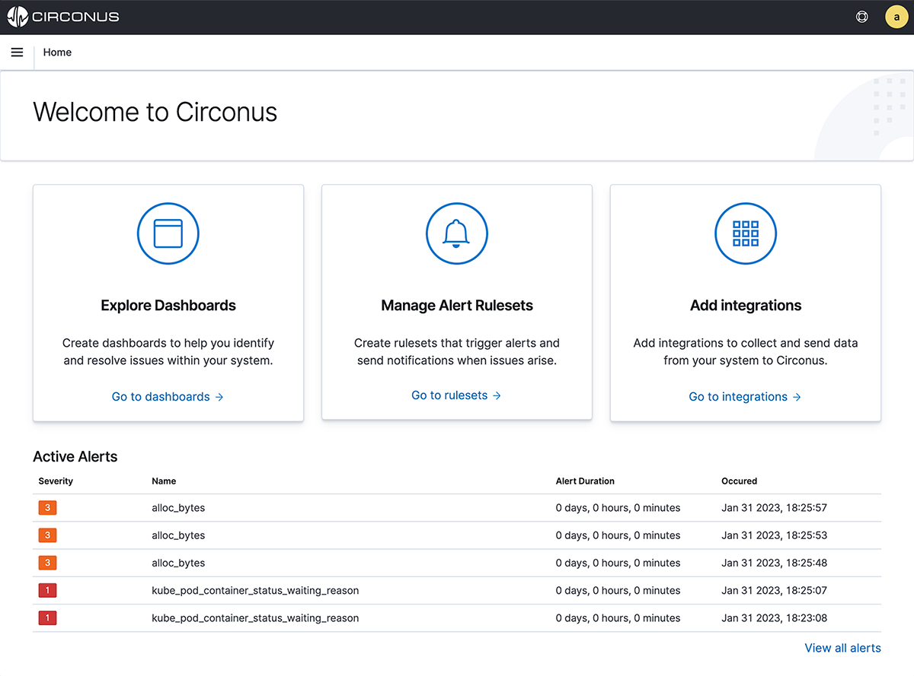
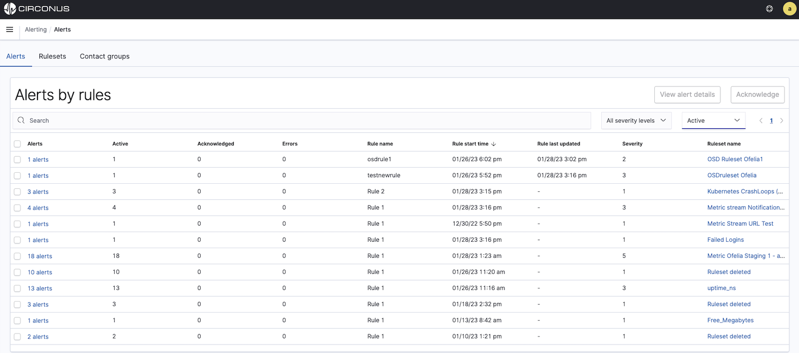
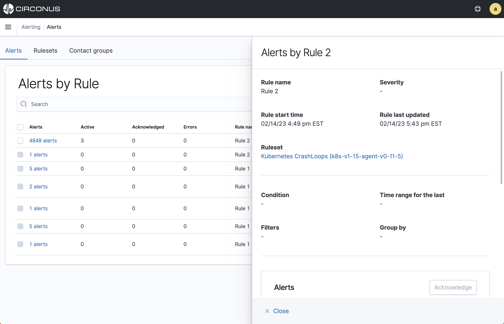

# Alerts

The most recent active alerts within your account will be automatically displayed at the bottom of the default Circonus home page.

To view all your alerts, click **View all** at the bottom of this list. You can also select **Alerting** within the main menu. Either action will navigate you to the **Alerts** tab within the **Alerting** section. Here, you will see a list of all historical and active alerts for your account, grouped by rule.

To view all your alerts, click **View all** at the bottom of this list or select **Alerting** within the main menu. Either action will navigate you to the **Alerts** tab within the **Alerting** section.

Here, you will see a list of all historical and active alerts for your account, grouped by rule.

Click on any grouped alerts (i.e. the "X Alerts" link within the **Alerts** column of the table) to view a panel with additional details about the associated rule and individual alerts.

## Acknowledging Alerts

Acknowledging an alert lets others know you are working on the issue causing the alert. Acknowledgments also prevent any reminders or escalations from triggering. You may only acknowledge active alerts, i.e. those in an alarmed state.

From the **Alerts** tab within the **Alerting** section, you can acknowledge all alerts for a rule by clicking the checkbox to the left of the grouped alerts and then clicking the **Acknowledge** button above the table. You can also click on the grouped alerts (the "X alerts" link within the **Alerts** column of the table) to reveal a panel.

Here, scroll down to the **Alerts** section to see a table of the individual alerts. For any active alerts, you can select the checkbox to the left of their **Alert start time** and click the **Acknowledge** button above the table. Clicking the topmost checkbox within the table header will enable you to select all active alerts and choose to acknowledge all of them.

You can also acknowledge alerts for a given ruleset. Learn more about this process within the [Rulesets](/circonus3/alerting/rulesets/#acknowledging-a-rulesets-alerts) section.
