# Contact Groups

Contact groups define a collection of members who will be contacted for a given notification. Contact group members can be either email addresses or webhook URLs.

To manage your contact groups, select **Alerting** within the main menu and then click the **Contact groups** tab.

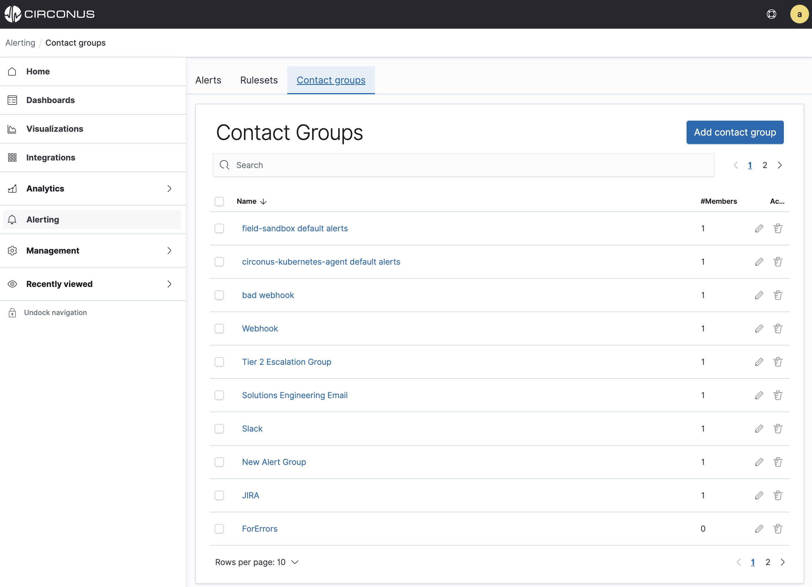

## Add a New Contact Group

To create a new contact group, click the **Add contact group** button in the upper right corner of the main **Contact groups** page.

In the modal that appears, enter the desired name of your contact group and click the **Create** button.

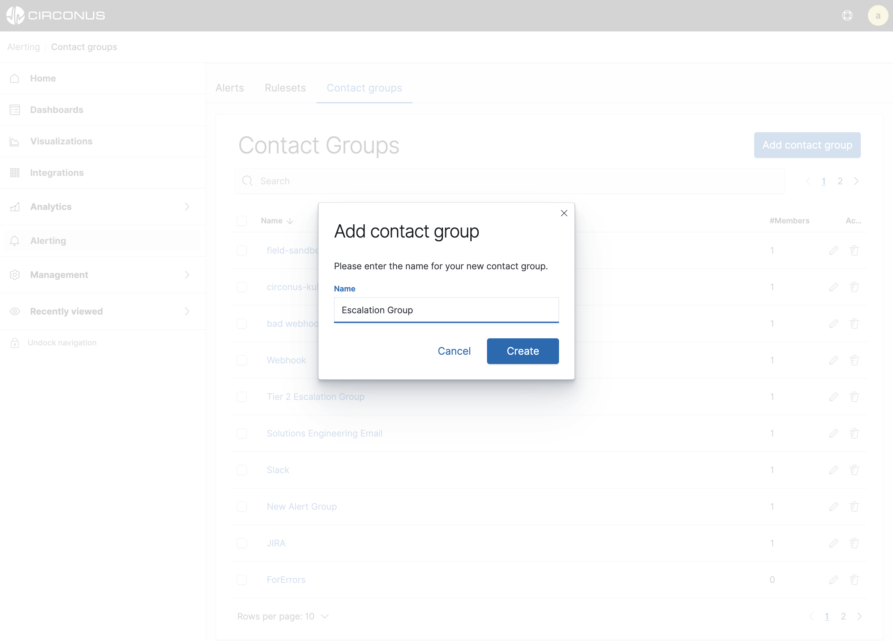

You have now created a new contact group to which you can add one or more members.

alerting-contact-groups-new-contact-group.png

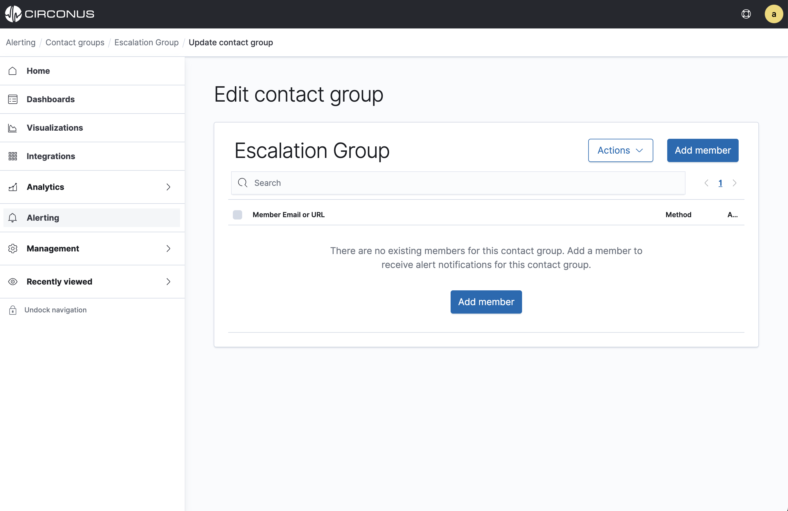

### Add a Contact Group Member

To add a contact group member, click the **Add member** button on the **Edit contact group** page.

In the modal that appears, enter the email address or webhook URL for the new member.

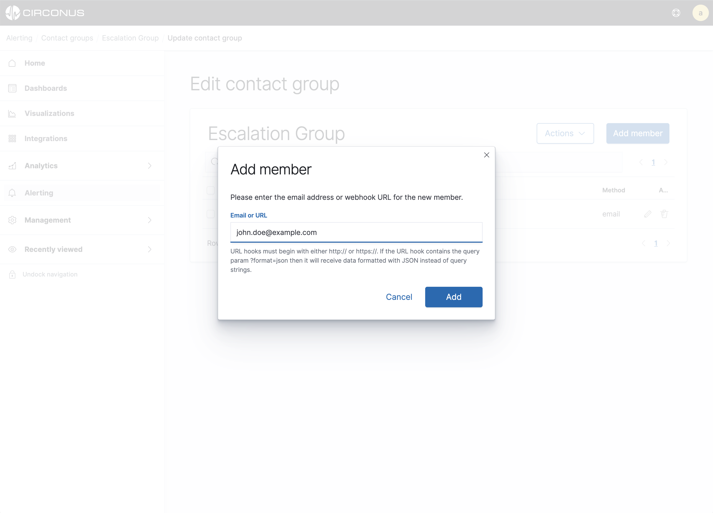

**Please note** that webhook URLs must begin with either `http://` or `https://`. Also, if the URL hook contains the query param `?format=json`, then it will receive data formatted with JSON instead of query strings.

When you're finished entering the new member, click the modal's **Add** button.

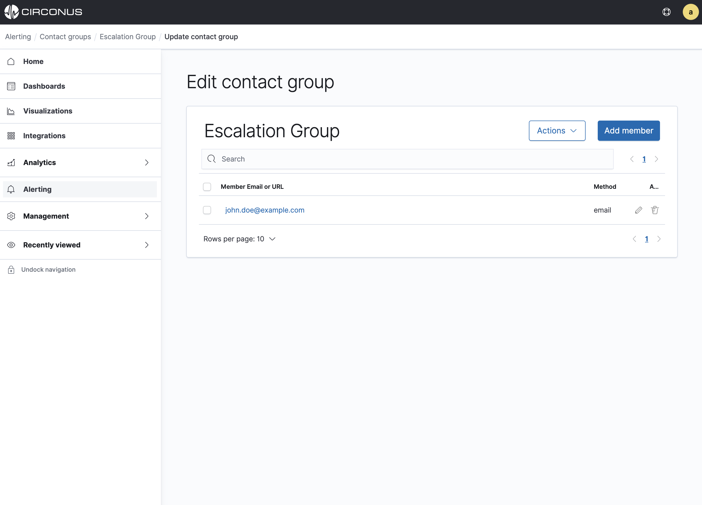

## Contact Group Member Actions

Once a member has been added to a contact group, you can edit or delete the member as needed.

### Edit a Contact Group Member

To edit an existing group member simply click on the pencil icon to the left of the group member name or URL.

In the modal that appears, make the necesssary edits and then click the **Update** button.

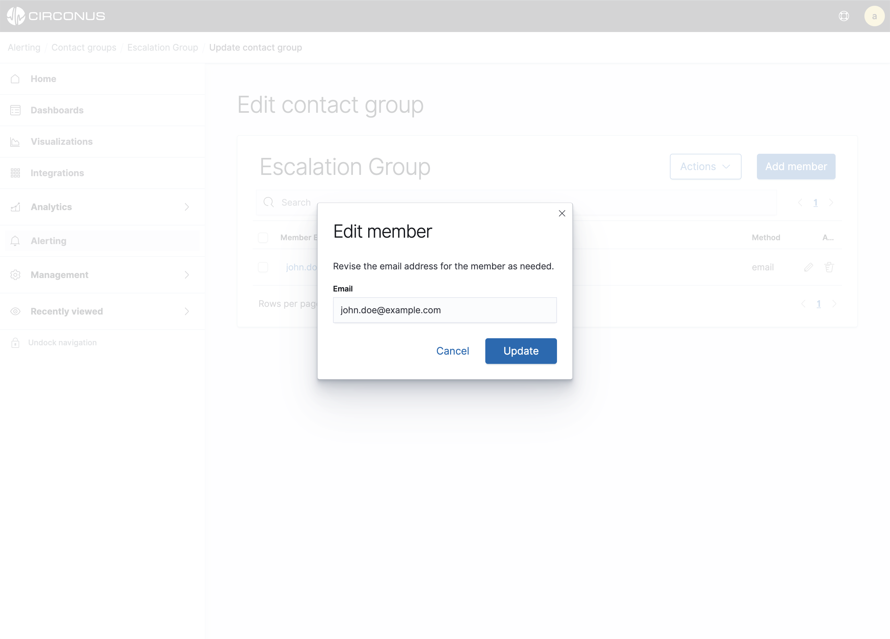

### Delete a Contact Group Member

Contact group members can be deleted from the **Edit contact group** page using a couple different methods.

To delete individual contact group members, click the trash can icon within the **Actions** column for the desired member. A modal will appear confirming that you'd like to delete the member since the action cannot be undone.

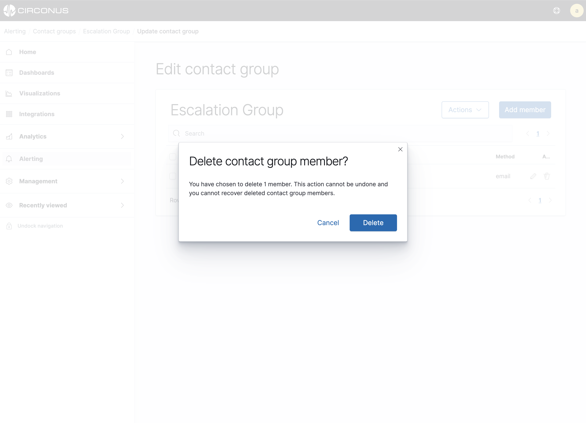

You can also use the check boxes on the left side of the table to select multiple members or all members at once. A button will then appear above the check boxes indicating how many members you have selected for deletion.

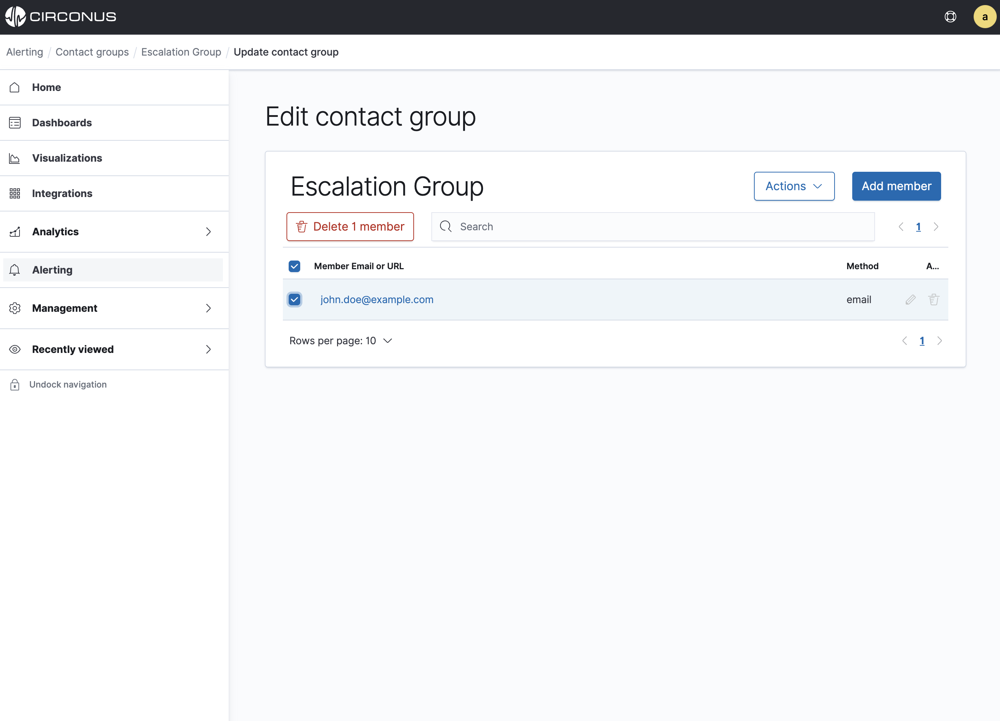

Click this button to proceed with deleting the members. A modal will appear confirming that you'd like to delete the members since the action cannot be undone.

## Contact Group Actions

In addition to managing members within a contact group, you can also rename, duplicate and delete a contact group.

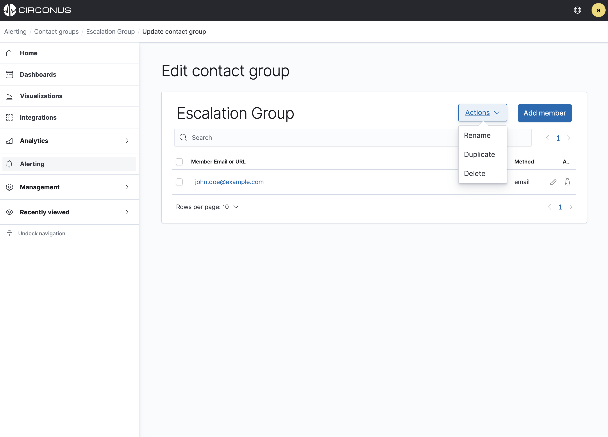

### Rename a Contact Group

To rename a contact group, first click the name of the desired contact group from the main **Contact groups** list page. You can also click the pencil icon within the **Actions** column for the desired contact group.

Once on the **Edit contact group** page, click the **Actions** button and select **Rename**. Enter the new name within the modal that appears and then click **Update**.

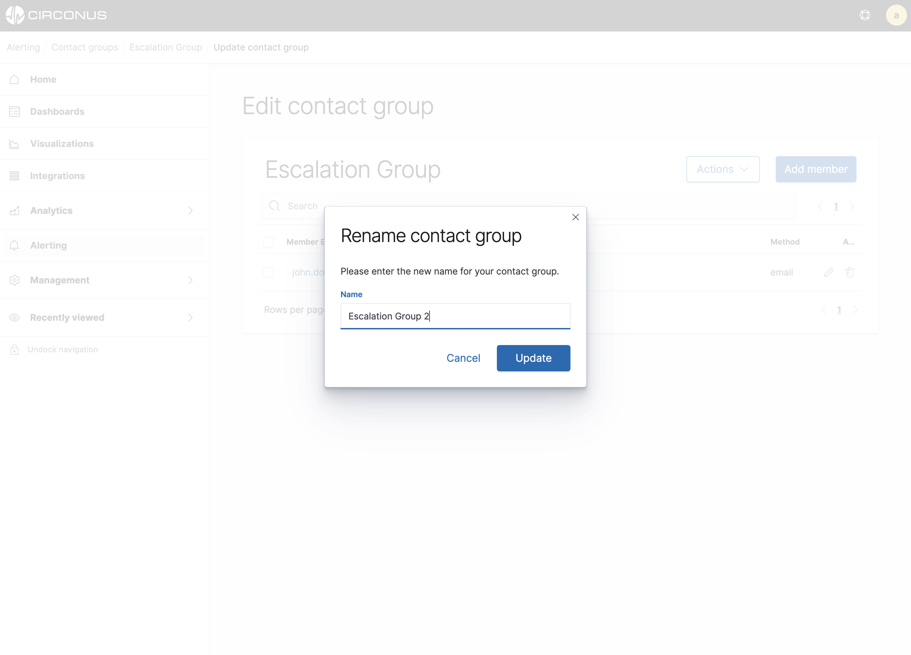

### Duplicate a Contact Group

To duplicate a contact group, first click the name of the desired contact group from the main **Contact groups** list page. You can also click the pencil icon within the **Actions** column for the desired contact group.

Once on the **Edit contact group** page, click the **Actions** button and select **Duplicate**. A modal will appear confirming your desire to duplicate the contact group.

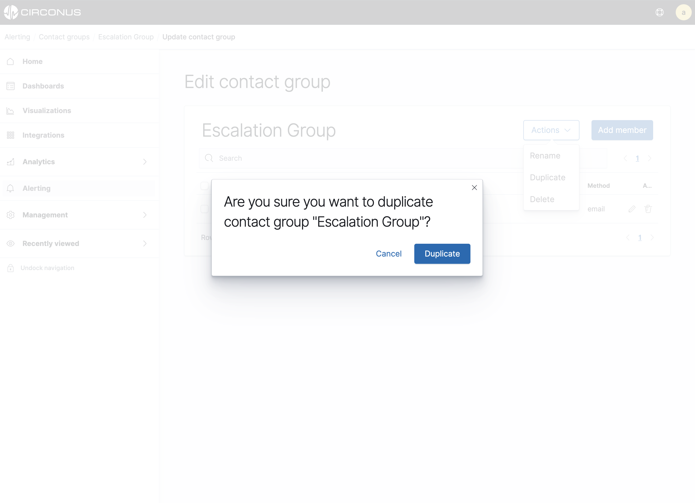

Click **Duplicate** to proceed with the action. Duplicated contact groups will retain all of the original group's members. Additionally, they will automatically receive a suffixed name of the original contact group.

### Delete a Contact Group

Contact groups can be deleted in one of two ways.

To delete a contact group from the **Contact groups** list page, click the trash can icon within the **Actions** column for the desired contact group.

You can also delete a contact group from the **Edit contact group** page by clicking **Actions** and then selecting **Delete**.

For either option, a modal will appear to confirm that you'd like to delete the contact group since this action cannot be undone.

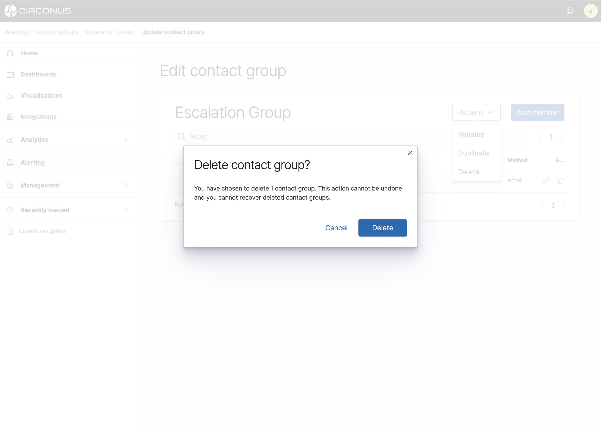
